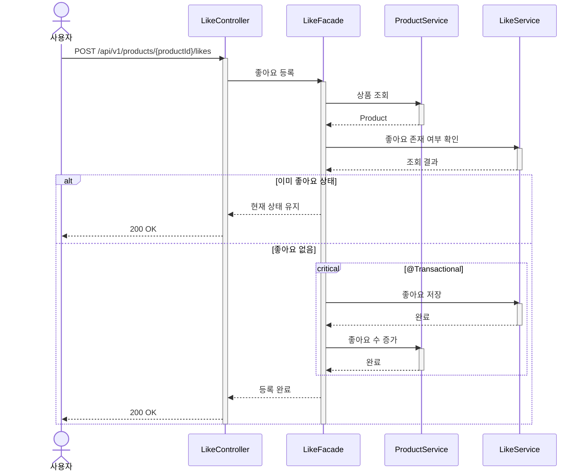

# 상품 좋아요 등록 시퀀스다이어그램

## 개요
사용자가 상품에 좋아요를 등록하면 좋아요 데이터를 저장하고 상품의 좋아요 수를 동기 증가시키는 흐름을 정의한다.

## 시퀀스

## 핵심 포인트

- 멱등성: 이미 좋아요 상태이면 저장/증가 없이 200 응답한다
- 좋아요 저장과 likeCount 증가는 같은 트랜잭션에서 처리한다
- 상품 존재 여부를 먼저 검증하여 삭제된 상품에 좋아요를 방지한다
