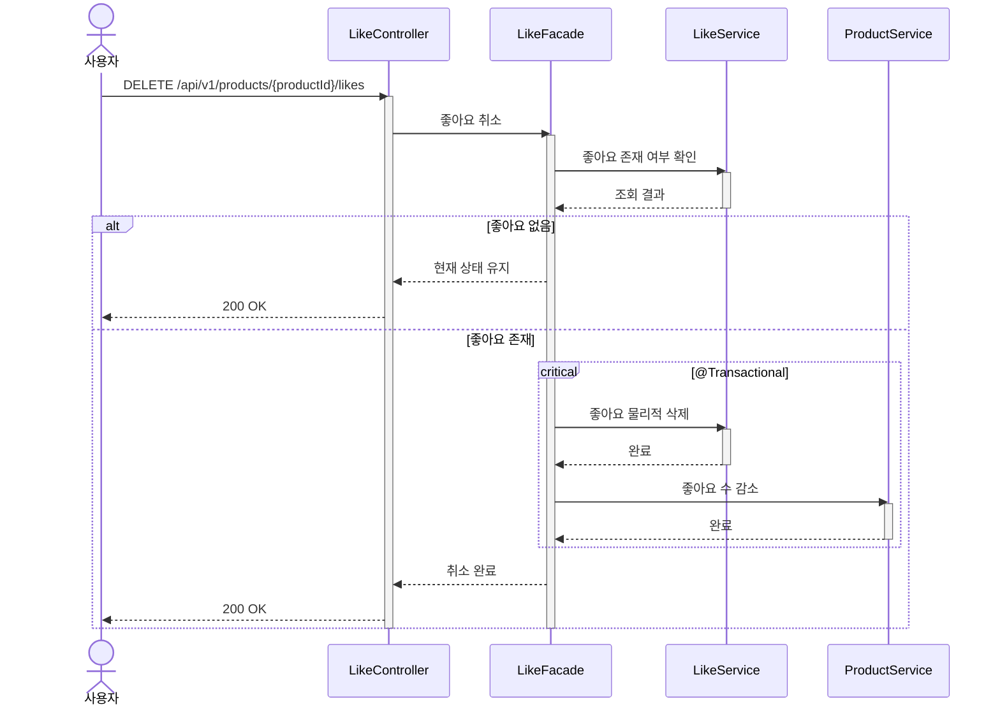

# 상품 좋아요 취소 시퀀스다이어그램

## 개요
사용자가 상품의 좋아요를 취소하면 좋아요 데이터를 물리적으로 삭제하고 상품의 좋아요 수를 동기 감소시키는 흐름을 정의한다.

## 시퀀스

## 핵심 포인트

- 멱등성: 좋아요가 없으면 삭제/감소 없이 200 응답한다
- 좋아요 데이터는 물리적으로 삭제한다 (Soft Delete 아님)
- 좋아요 삭제와 likeCount 감소는 같은 트랜잭션에서 처리한다
- 상품 존재 여부를 검증하지 않는다 (멱등성 우선)
