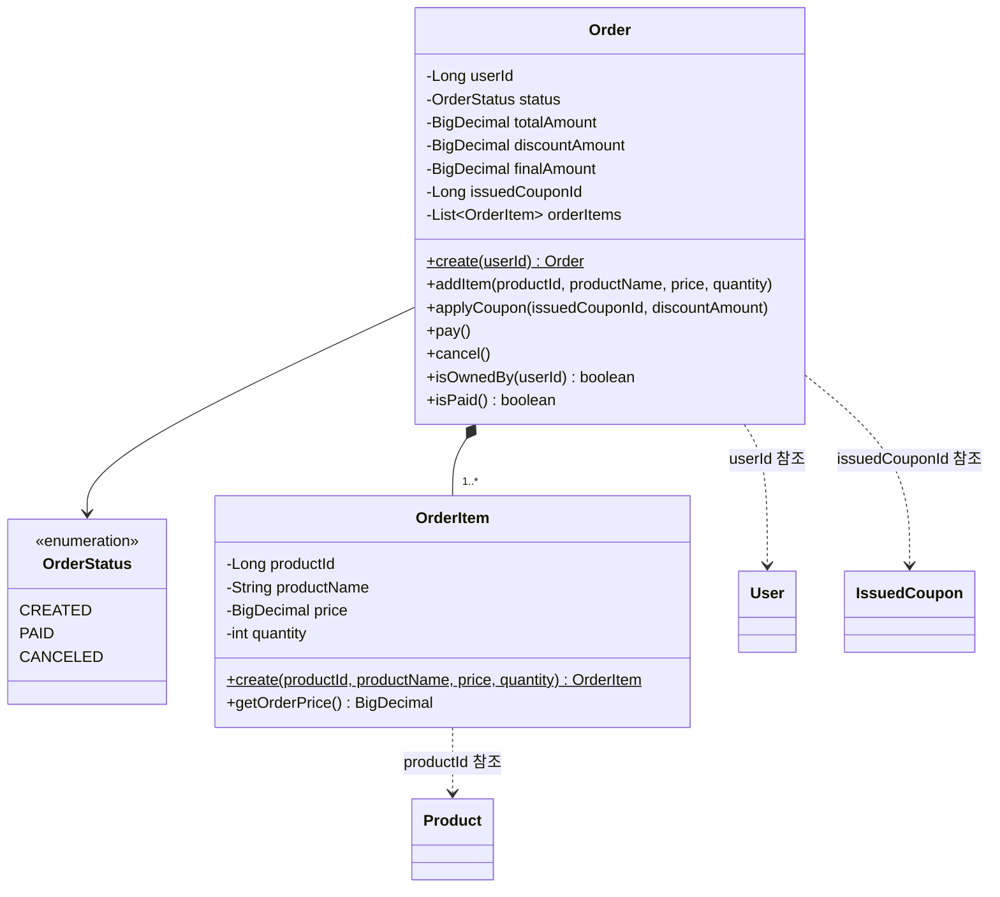

# Order 클래스다이어그램

## 개요
주문 생성, 쿠폰 할인 적용, 주문 시점 상품 스냅샷 보존을 담당하는 객체 구조를 정의한다.

## 클래스다이어그램

## 설계 결정

- Order는 BaseEntity를 상속한다 (createdAt, updatedAt 필요 — 상태 전이 추적)
- OrderStatus: CREATED(주문 생성) → PAID(결제 확정) → CANCELED(취소)
- `pay()`: CREATED → PAID 전이 (불변식: CREATED 상태에서만 가능)
- `cancel()`: PAID 또는 CREATED → CANCELED 전이
- `isPaid()`: PAID 상태 여부 반환 (사실 제공)
- OrderItem은 주문 시점 스냅샷이므로 원본 상품이 변경되어도 영향받지 않는다
- totalAmount는 OrderItem의 orderPrice 합계로 Order 생성 시 계산한다
- orderPrice는 price x quantity로 OrderItem이 계산한다
- `applyCoupon()`: 쿠폰 할인 적용 — discountAmount 설정 후 finalAmount 재계산
- 쿠폰 미적용 시 discountAmount=0, finalAmount=totalAmount
- issuedCouponId는 nullable — 쿠폰 미적용 주문 허용
