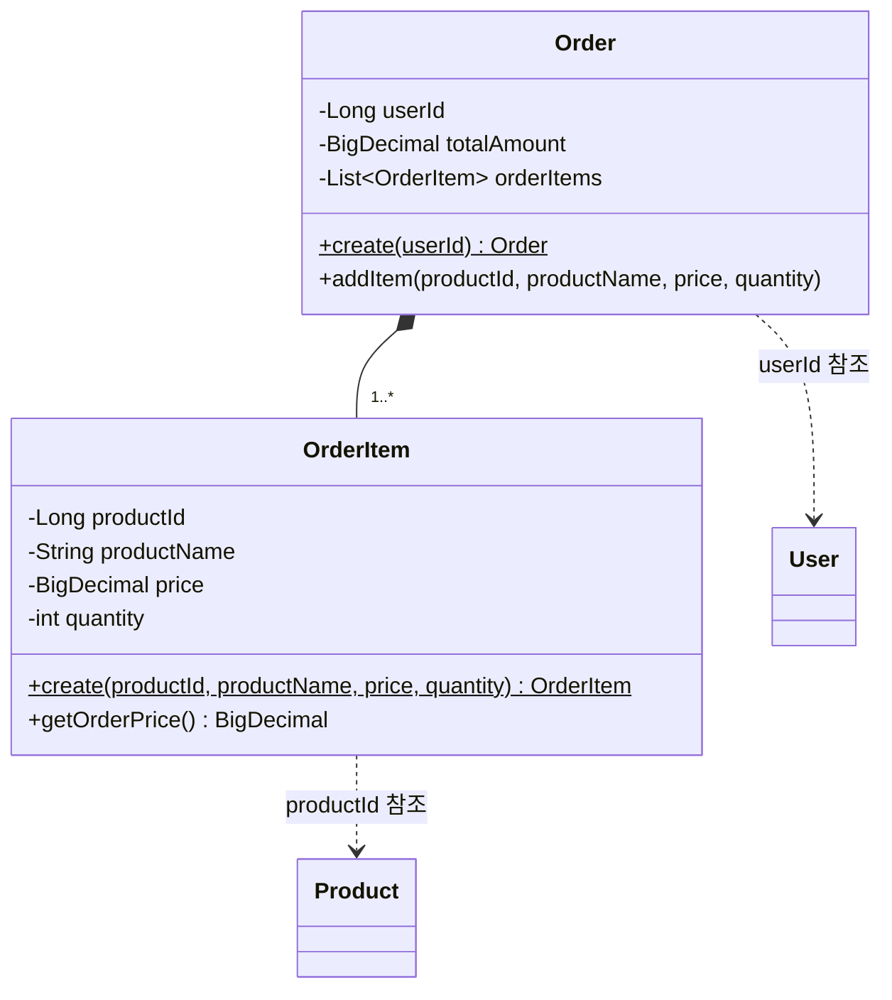

# Order 클래스다이어그램

## 개요
주문 생성과 주문 시점 상품 스냅샷 보존을 담당하는 객체 구조를 정의한다.

## 클래스다이어그램

## 설계 결정

- Order는 삭제 불가이므로 createdAt만 포함한다 (BaseEntity 미사용)
- OrderItem은 주문 시점 스냅샷이므로 원본 상품이 변경되어도 영향받지 않는다
- totalAmount는 OrderItem의 orderPrice 합계로 Order 생성 시 계산한다
- orderPrice는 price * quantity로 OrderItem이 계산한다
