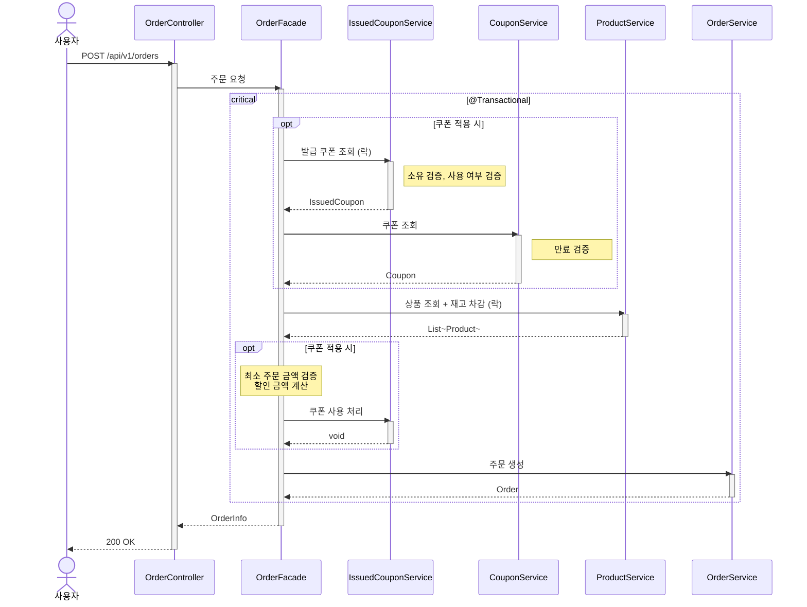

# 주문 요청 시퀀스다이어그램

## 개요
사용자가 상품을 주문할 때 재고 차감, 쿠폰 적용, 주문 생성을 트랜잭션으로 처리하는 흐름을 정의한다.

## 시퀀스

## 핵심 포인트
- 재고 차감, 쿠폰 사용 처리, 주문 생성은 하나의 트랜잭션에서 원자적으로 처리한다
- 쿠폰은 선택 사항 — couponId가 없으면 쿠폰 관련 단계를 건너뛴다
- 발급 쿠폰은 비관적 락으로 조회하여 동시 주문 시 이중 사용을 방지한다
- 상품 재고 차감은 비관적 락 + ID 정렬로 데드락을 방지한다
- 최소 주문 금액 검증은 상품 조회 후 totalAmount가 확정된 시점에 수행한다
- 할인 계산은 Coupon 엔티티의 `calculateDiscount(totalAmount)`에 위임한다
