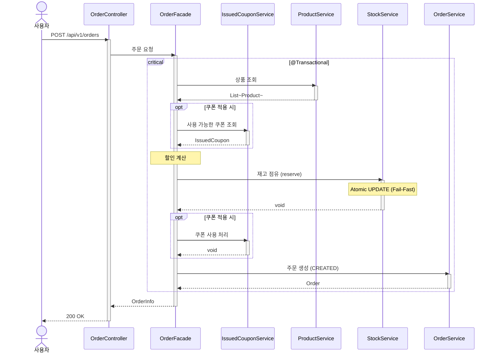

# 주문 요청 시퀀스다이어그램

## 개요
사용자가 상품을 주문할 때 재고 점유, 쿠폰 적용, 주문 생성을 트랜잭션으로 처리하는 흐름을 정의한다.

## 시퀀스

## 핵심 포인트
- 기존 ProductService.decreaseStocks()가 StockService.reserve()로 대체된다
- 재고 점유, 쿠폰 사용 처리, 주문 생성은 하나의 트랜잭션에서 원자적으로 처리한다
- 주문은 CREATED 상태로 생성된다 (기존에는 상태 관리 없었음)
- 재고 점유 시 Atomic UPDATE + Fail-Fast 패턴으로 동시성을 제어한다 (락 대기 없음)
- IssuedCoupon이 발급 시점의 Coupon 데이터를 스냅샷하므로, 주문 시 CouponService 조회가 불필요하다
