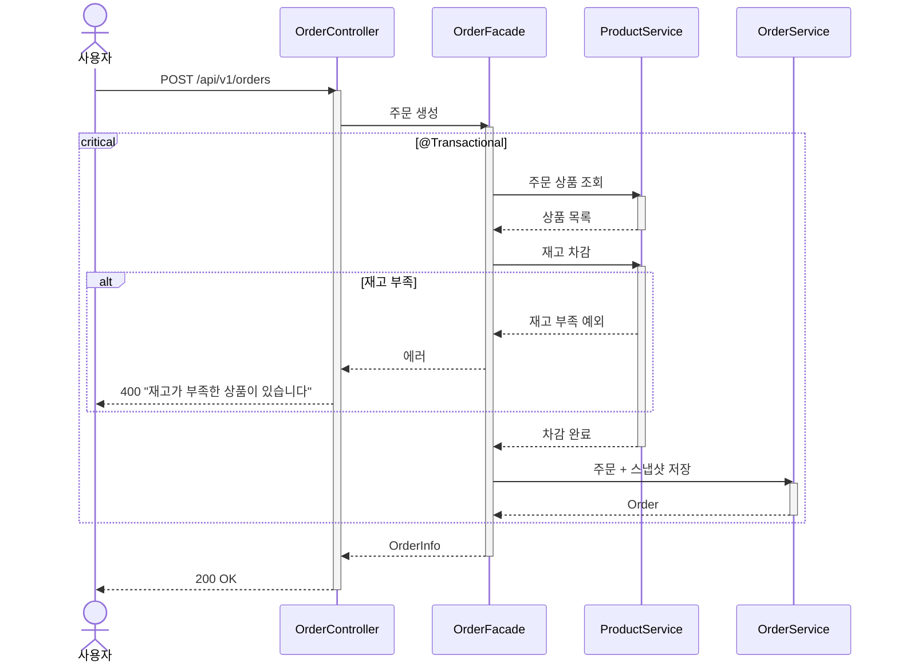

# 주문 생성 시퀀스다이어그램

## 개요
사용자가 여러 상품을 주문하면 재고를 차감하고 주문 시점 상품 정보를 스냅샷으로 저장하는 흐름을 정의한다.

## 시퀀스

## 핵심 포인트

- 재고 차감과 주문 생성은 같은 트랜잭션에서 처리한다
- 주문 상품 중 하나라도 재고가 부족하면 전체 주문이 실패한다 (부분 성공 없음)
- 주문 시점의 상품명, 가격, 브랜드명을 OrderItem에 스냅샷으로 저장한다
- Facade가 ProductService와 OrderService를 오케스트레이션한다
