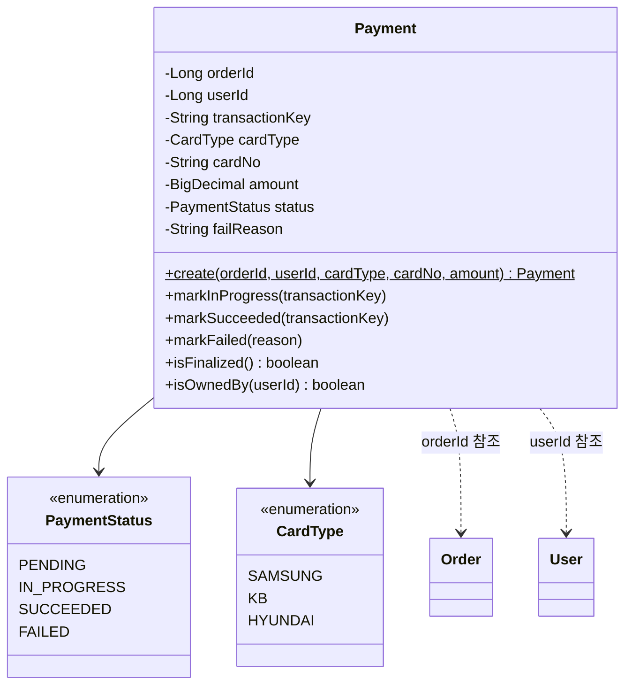

# Payment 클래스다이어그램

## 개요
PG 연동 비동기 결제의 상태 관리와 외부 시스템 호출을 담당하는 객체 구조를 정의한다.

## 클래스다이어그램

## 설계 결정

- Payment는 BaseEntity를 상속한다 (createdAt, updatedAt 필요 — 상태 변경 추적)
- transactionKey는 nullable — PG 요청 전(REQUESTED)에는 아직 없음
- failReason은 nullable — 성공 시에는 없음
- `markInProgress()`: PENDING → IN_PROGRESS (PG 접수 성공)
- `markSucceeded()`: PENDING/IN_PROGRESS → SUCCEEDED (PG 콜백 또는 수동 확인)
- `markFailed()`: PENDING/IN_PROGRESS → FAILED (PG 실패 또는 요청 실패)
- `isFinalized()`: SUCCEEDED 또는 FAILED 여부 반환 (사실 제공, 멱등성 판단용)
- `isOwnedBy()`: 소유권 확인 (사실 제공, Facade가 접근 제어 판단)
- 1주문 1결제: 비즈니스 규칙으로 Facade에서 검증 (DB UNIQUE 제약 아님 — 실패 후 재결제 허용)
