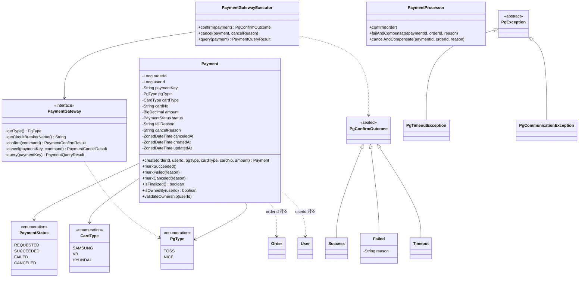

# Payment 클래스다이어그램

## 개요
멀티 PG 연동 결제의 상태 관리, 장애 격리, 보상 처리를 담당하는 객체 구조를 정의한다.

## 클래스다이어그램

## 설계 결정

- Payment는 `@PrePersist`/`@PreUpdate`로 createdAt/updatedAt을 직접 관리한다
- paymentKey는 생성 시 UUID로 결정된다 — PG 요청 전에도 항상 존재
- failReason은 nullable — 성공 시에는 없음
- cancelReason, canceledAt은 nullable — 취소 시에만 존재
- `markSucceeded()`: REQUESTED → SUCCEEDED (PG 승인 성공 또는 수동 확인/보정 스케줄러)
- `markFailed(reason)`: REQUESTED → FAILED (PG 실패 또는 요청 실패)
- `markCanceled(reason)`: SUCCEEDED → CANCELED (주문 취소 시 PG 취소 성공 후)
- `isFinalized()`: SUCCEEDED, FAILED 또는 CANCELED 여부 반환 (사실 제공, 멱등성 판단용)
- `isOwnedBy()`: 소유권 확인 (사실 제공, Facade가 접근 제어 판단)
- `validateOwnership()`: 소유권 불변식 강제 — 위반 시 NOT_FOUND 예외 (존재 여부 노출 방지)
- 1주문 1결제: 비즈니스 규칙으로 Facade에서 검증 (DB UNIQUE 제약 아님 — 실패 후 재결제 허용)
- **PaymentGatewayExecutor**: PG 호출을 중개하고, 도메인 예외(PgTimeoutException 등)를 PgConfirmOutcome으로 변환
- **PaymentProcessor**: confirm/failAndCompensate/cancelAndCompensate 비즈니스 오케스트레이션 전담
- **PgException 계열**: Gateway 구현체에서 인프라 예외(ResourceAccessException 등)를 도메인 예외로 래핑. Resilience4j retryExceptions에 사용
- **Bulkhead(pg-payment)**: PaymentFacade의 requestPayment, verifyPayment에 적용 (동시 PG 호출 20건 제한)
