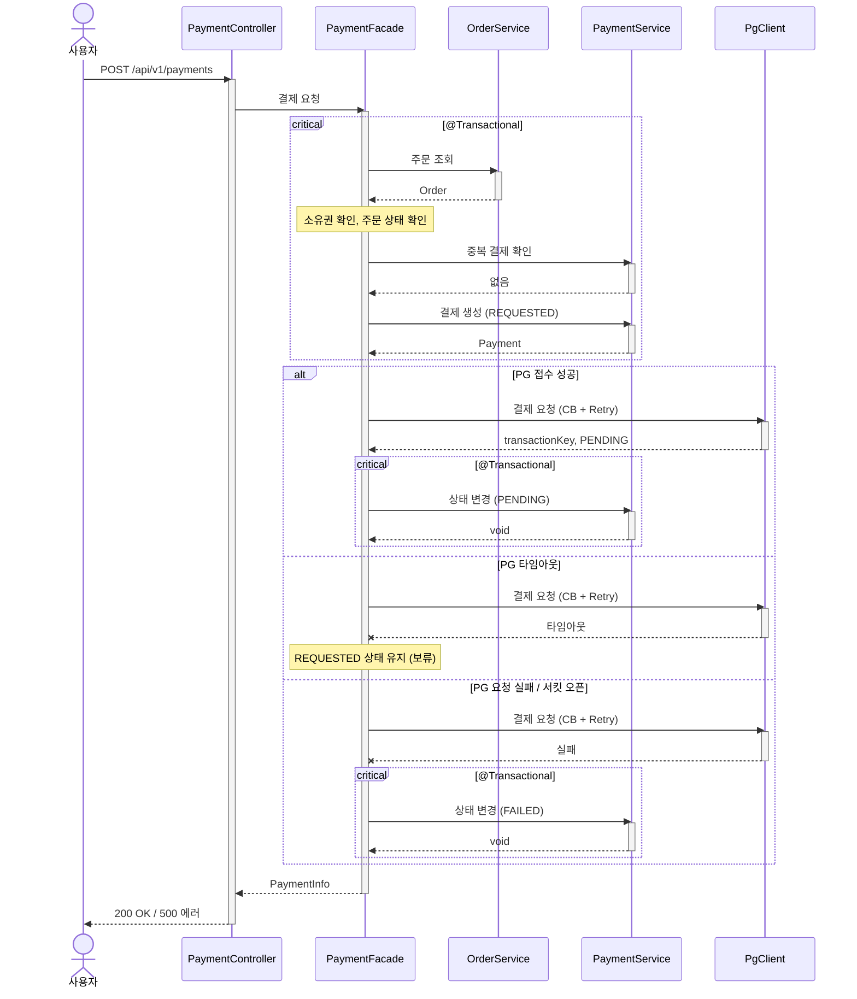

# 결제 요청 시퀀스다이어그램

## 개요
사용자가 주문에 대해 결제를 요청할 때, Payment를 생성하고 PG에 결제를 요청하는 흐름을 정의한다. PG 호출은 트랜잭션 밖에서 수행하며, 서킷 브레이커와 재시도를 적용한다.

## 시퀀스

## 핵심 포인트
- Payment 생성(REQUESTED)은 트랜잭션 안에서, PG 호출은 트랜잭션 밖에서 처리한다 (DB 커넥션 점유 방지)
- PG 호출에는 서킷 브레이커(pg-request)와 재시도(pg-request)를 적용한다
- CB(outer) → Retry(inner) 구조로 메서드를 분리한다
- 타임아웃 시 REQUESTED 상태를 유지한다 — PG에서 처리되었을 수 있으므로 즉시 실패 처리하지 않는다
- PG 요청 실패 시에만 즉시 FAILED 처리하고 사용자에게 에러를 반환한다
- Facade의 결제 요청 메서드 자체에는 @Transactional을 선언하지 않는다 (내부 서비스 호출이 각자 트랜잭션 관리)
