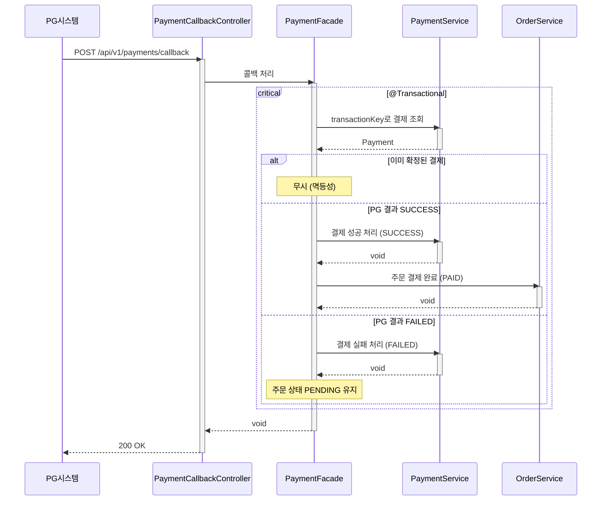

# 결제 콜백 수신 시퀀스다이어그램

## 개요
PG 시스템이 결제 처리 완료 후 콜백을 전송하면, 결제 상태를 확정하고 성공 시 주문을 PAID로 전이하는 흐름을 정의한다.

## 시퀀스

## 핵심 포인트
- 콜백 처리와 주문 상태 전이는 같은 트랜잭션에서 원자적으로 처리한다
- 이미 확정(SUCCESS/FAILED)된 결제에 대한 중복 콜백은 무시한다 (멱등성)
- 결제 성공 시 Order.pay()로 PENDING → PAID 전이한다
- 결제 실패 시 주문은 PENDING을 유지한다 (재결제 가능)
- 인증 없이 호출 가능하다 (PG 시스템이 호출하는 내부 API)
