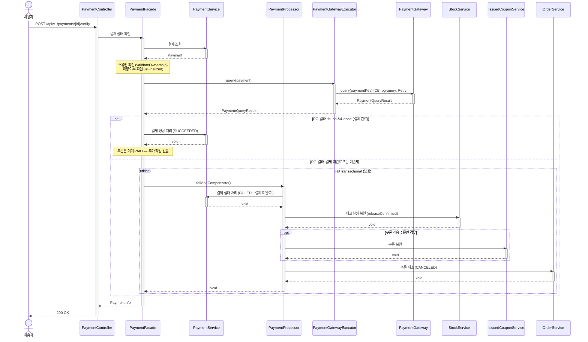

# 결제 상태 수동 확인 시퀀스다이어그램

## 개요
콜백이 수신되지 않은 결제에 대해 사용자가 수동으로 PG에 상태를 확인하여 결제를 확정하고, 실패 시 보상 트랜잭션을 수행하는 흐름을 정의한다.

## 시퀀스

## 핵심 포인트
- REQUESTED 상태(미확정)의 결제만 확인 가능하다 — 확정(SUCCEEDED/FAILED/CANCELED) 상태는 거부
- PG에 조회하여 결제 완료 여부를 확인한 후 최종 결정한다
- PG 조회에는 별도 서킷 브레이커(pg-query) + Retry를 적용한다
- PG 결과 결제 미완료 또는 미존재이면 보상 트랜잭션을 수행한다
- 보상 로직은 PaymentProcessor.failAndCompensate()에 위임한다
- 결제 성공 확정 시 주문은 이미 PAID이므로 추가 작업 불필요
- Bulkhead(pg-payment)가 적용되어 동시 PG 호출을 제한한다
