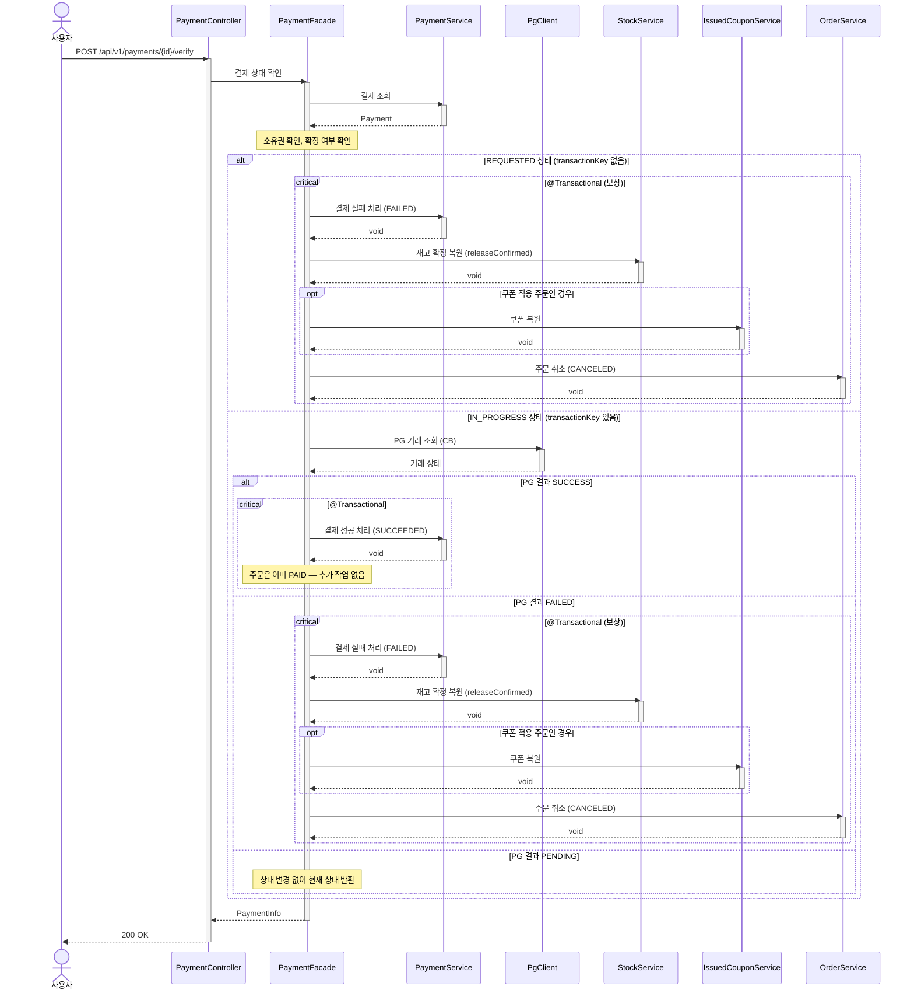

# 결제 상태 수동 확인 시퀀스다이어그램

## 개요
콜백이 수신되지 않은 결제에 대해 사용자가 수동으로 PG에 상태를 확인하여 결제를 확정하고, 실패 시 보상 트랜잭션을 수행하는 흐름을 정의한다.

## 시퀀스

## 핵심 포인트
- REQUESTED 상태(transactionKey 없음)는 PG에 요청 자체가 도달하지 않은 것이므로 조회 없이 FAILED + 보상 처리한다
- PG 조회 API에는 별도 서킷 브레이커(pg-query)를 적용한다
- PG 결과가 아직 PENDING이면 상태를 변경하지 않고 현재 상태를 그대로 반환한다
- 결제 실패 확정 시 보상 트랜잭션: 재고 확정 복원 + 쿠폰 복원 + 주문 CANCELED
- 결제 성공 확정 시 주문은 이미 PAID이므로 추가 작업 불필요
