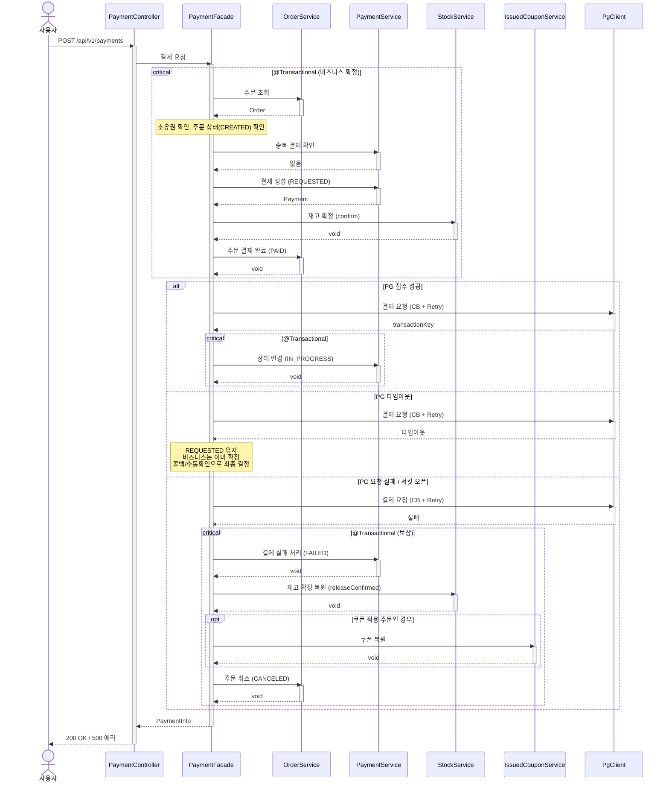

# 결제 흐름 재설계 시퀀스다이어그램

## 개요
결제 요청 시 비즈니스를 먼저 확정(재고 확정 + 주문 PAID)한 후 PG를 호출하고, 실패 시 보상 트랜잭션으로 되돌리는 흐름을 정의한다.

## 시퀀스

## 핵심 포인트
- **비즈니스 먼저 확정**: 결제 생성 + 재고 확정 + 주문 PAID를 하나의 트랜잭션으로 PG 호출 전에 수행
- **PG 호출은 트랜잭션 밖**: DB 커넥션 점유 방지
- **PG 실패 시 보상**: 별도 트랜잭션으로 재고 확정 복원 + 쿠폰 복원 + 주문 CANCELED
- **PG 타임아웃 시 즉시 보상하지 않음**: PG에서 처리되었을 수 있으므로 콜백/수동확인으로 최종 결정
- Facade의 결제 요청 메서드 자체에는 @Transactional을 선언하지 않는다 (내부 서비스 호출이 각자 트랜잭션 관리)
- 기존 001-payment-request 시퀀스를 대체한다
