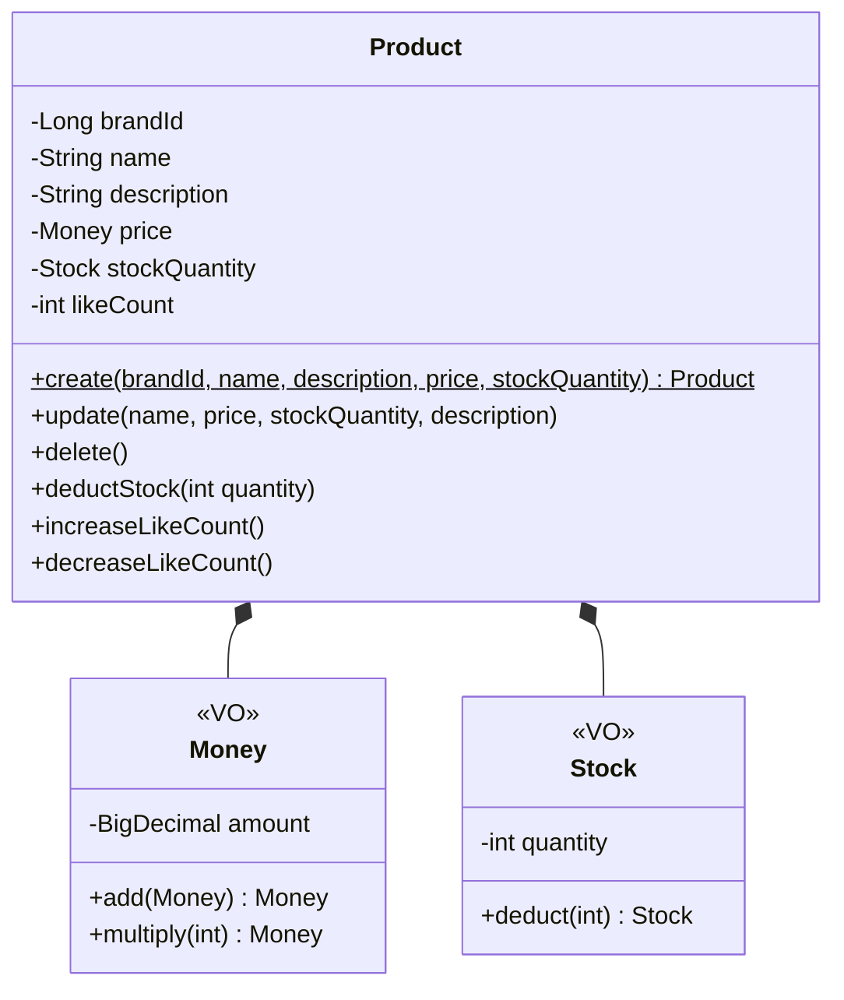

# Product 클래스다이어그램

## 개요
상품의 등록, 수정, 삭제, 재고 관리를 담당하는 객체 구조를 정의한다.

## 클래스다이어그램

## 설계 결정

- **Money VO**: 가격 0 이상 검증, 주문 총액 계산(add, multiply) 연산을 캡슐화한다
- **Stock VO**: 재고 0 이상 검증, 차감 시 부족 여부 검증을 캡슐화한다
- likeCount는 Like 도메인에서 동기적으로 증감한다 (비정규화 필드)
- brandId만 참조하며, Brand 엔티티를 직접 참조하지 않는다
- deductStock, increaseLikeCount, decreaseLikeCount는 향후 Feature에서 구현 예정
