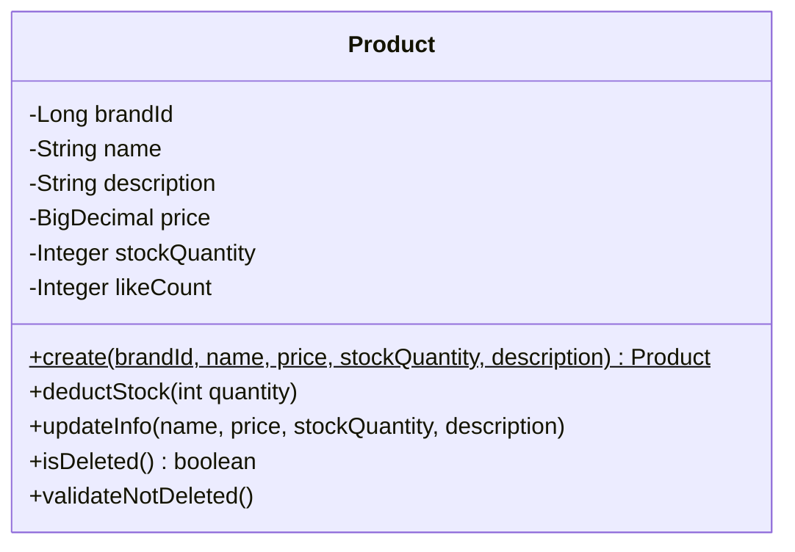

# Product 클래스다이어그램

## 개요
상품의 등록, 수정, 삭제, 재고 관리를 담당하는 객체 구조를 정의한다.

## 클래스다이어그램

## 설계 결정

- **price**: BigDecimal로 관리하며, Entity 내부에서 0 이상·상한 검증을 수행한다 (Money VO는 Order 도메인 구현 시 필요에 따라 도입)
- **stockQuantity**: Integer로 관리하며, Entity 내부에서 0 이상·상한 검증 및 차감 로직을 수행한다 (Stock VO는 Order 도메인 구현 시 필요에 따라 도입)
- likeCount는 Integer 타입이며 Like 도메인에서 동기적으로 증감한다 (비정규화 필드, ProductService의 atomic UPDATE로 처리)
- brandId만 참조하며, Brand 엔티티를 직접 참조하지 않는다
- deductStock은 Entity 메서드로, 재고 차감은 ProductService의 decreaseStocks에서 atomic UPDATE로도 처리 가능
