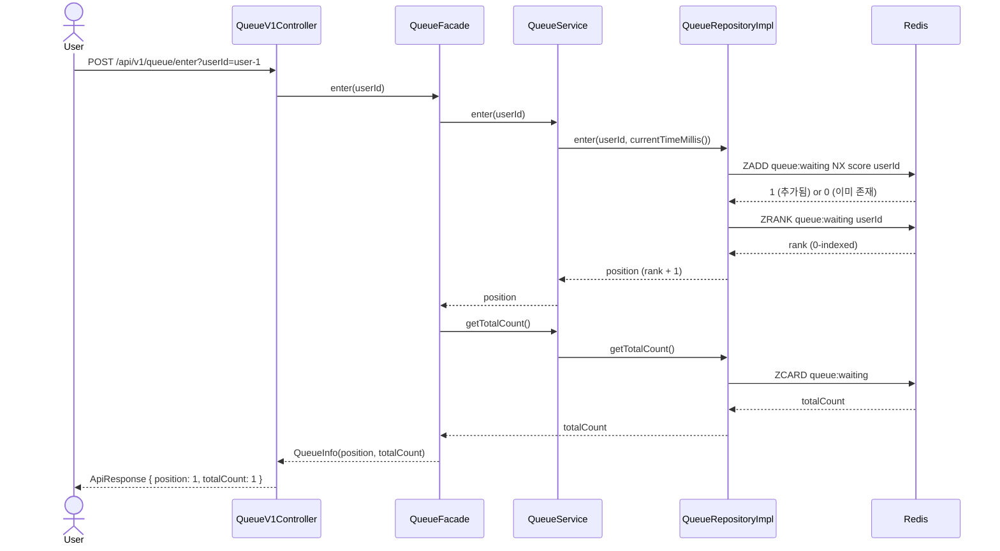
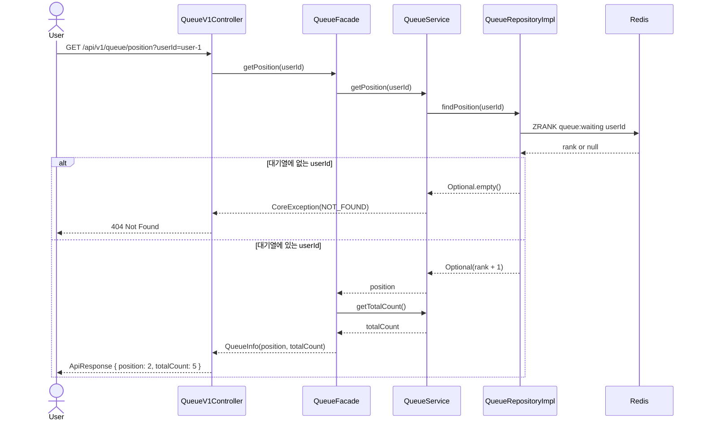

# Step 1 — 대기열 설계

## 개요

Redis Sorted Set 기반 대기열입니다.
사용자가 진입하면 번호표(순번)를 발급하고, 스케줄러가 처리 가능한 수만큼만 다음 단계로 넘깁니다.

## 핵심 설계 결정

| 항목 | 결정 | 이유 |
|------|------|------|
| score 기준 | `System.currentTimeMillis()` | 밀리초 충돌은 극히 드물고 비즈니스상 무의미 |
| 중복 방지 | `ZADD NX` | 단일 명령어로 원자적 처리, TOCTOU 방지 |
| 순번 표현 | 1-indexed | 사용자에게 보여줄 때 0번째는 어색함 |

## API

| Method | URL | 설명 |
|--------|-----|------|
| POST | `/api/v1/queue/enter?userId=` | 대기열 진입. 중복 진입 시 기존 순번 반환 |
| GET | `/api/v1/queue/position?userId=` | 현재 순번 + 전체 대기 인원 조회 |

## 시퀀스 다이어그램

### POST /queue/enter — 대기열 진입



### GET /queue/position — 순번 조회



## 클래스 구조

```
domain/queue/
  QueueRepository       인터페이스 (enter, findPosition, getTotalCount)
  QueueService          enter(userId), getPosition(userId), getTotalCount()

infrastructure/queue/
  QueueRepositoryImpl   Redis Sorted Set 구현

application/queue/
  QueueFacade           enter, getPosition → QueueInfo 반환
  QueueInfo             record(position, totalCount)

interfaces/api/queue/
  QueueV1Controller     POST /enter, GET /position
  QueueV1ApiSpec        OpenAPI 스펙
  QueueV1Dto            EnterResponse, PositionResponse
```

## Redis 키

| 키 | 타입 | 설명 |
|----|------|------|
| `queue:waiting` | Sorted Set | 대기열. member=userId, score=진입시각(ms) |