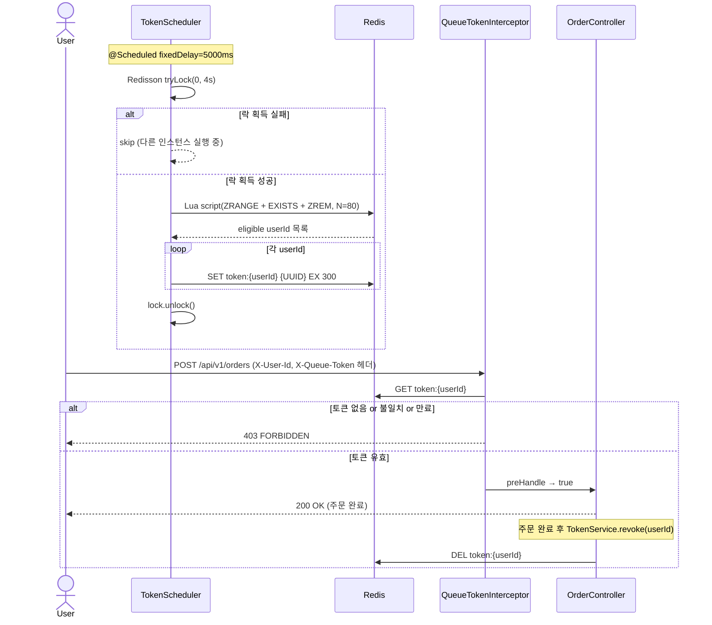
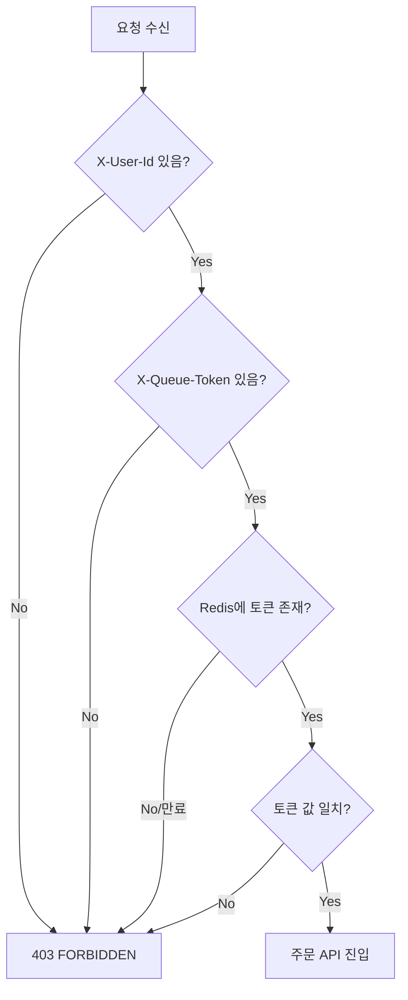

# Step 2 — 입장 토큰 & 스케줄러 설계

## 개요

대기열에서 순번이 된 사용자에게 **입장 토큰을 발급**하고, 토큰을 가진 사용자만 주문 API에 접근할 수 있도록 합니다.
스케줄러가 주기적으로 배치 단위로 토큰을 발급하며, 인터셉터가 모든 주문 요청에서 토큰을 검증합니다.

## 핵심 설계 결정

| 항목 | 결정 | 이유 |
|------|------|------|
| 토큰 저장소 | Redis String (TTL 포함) | 주문 API 매 요청마다 조회 → DB 커넥션 소모 없음, TTL 자동 만료 |
| 토큰 값 | UUID | userId만 알아도 위조 불가. "존재 여부"가 아닌 "값 일치"로 검증 |
| 토큰 TTL | 300초 (5분) | P95 주문 완료 시간 + 여유. 짧으면 결제 중 만료, 길면 자리 점유 |
| 토큰 검증 위치 | Interceptor | Spring Bean 주입 가능 + URL 패턴(`/api/v1/orders/**`) + ControllerAdvice 연동 |
| 스케줄러 배치 크기 N | 80 | 커넥션 10 × (주기 5s / 처리 500ms) × 버퍼 80% |
| 스케줄러 중복 실행 방지 | Redisson 분산 락 | 멀티 인스턴스 환경. 락 획득 실패 시 스킵 |
| 스케줄러 원자성 | Lua 스크립트 | ZRANGE + EXISTS + ZREM을 단일 Redis 스크립트로 묶어 중간 실패 방지 |

## API

| Method | URL | 설명 |
|--------|-----|------|
| GET | `/api/v1/queue/position?userId=` | 토큰 발급 여부 포함한 순번 응답 (Step 3과 통합) |

> 토큰 발급은 **스케줄러**가 담당. 별도 API 없음.
> 클라이언트는 `/queue/position` Polling 중 응답의 `token` 필드가 채워지면 입장 가능 상태로 판단.

## 전체 흐름



## 스케줄러 상세 — Lua 스크립트

```lua
-- KEYS[1] = "queue:waiting"
-- ARGV[1] = N-1 (ZRANGE end index, 0-indexed)
local members = redis.call('ZRANGE', KEYS[1], 0, ARGV[1])
local eligible = {}
for i, member in ipairs(members) do
    -- 이미 토큰이 있는 유저는 스킵 (중복 발급 방지)
    if redis.call('EXISTS', 'token:' .. member) == 0 then
        redis.call('ZREM', KEYS[1], member)  -- 대기열에서 제거
        table.insert(eligible, member)
    end
end
return eligible
```

**왜 Lua 스크립트인가?**
- ZRANGE → (조건 체크) → ZREM 이 3단계로 분리되면 중간 실패 시 대기열에서 제거됐지만 토큰 없는 유령 상태 발생
- Redis는 Lua 스크립트를 단일 명령어로 실행 → 원자적 처리 보장

## 토큰 검증 인터셉터

```
요청 헤더: X-User-Id, X-Queue-Token
검증 로직:
  1. X-User-Id 또는 X-Queue-Token 헤더 없음 → 403
  2. Redis GET token:{userId} → null → 403 (없거나 만료)
  3. 저장된 토큰 != 요청 토큰 → 403
  4. 모두 통과 → true (주문 API 진입)
```



## 엣지케이스 정리

| 케이스 | 처리 방법 |
|--------|-----------|
| 토큰 보유 중 대기열 재진입 시도 | `ZADD NX`로 등록은 되나, Lua 스크립트에서 `EXISTS token:{userId} == 1`이면 스킵 → 기존 토큰 유지, 대기열에서 즉시 제거 안 됨 |
| 대기열 비어있을 때 스케줄러 실행 | Lua 반환 `eligible = {}` → eligible null or empty check → 정상 종료 |
| 대기 인원 < N | ZRANGE로 있는 만큼만 반환, 그만큼만 발급 |
| 스케줄러 실행 시간 > 주기 | Redisson 분산 락이 중복 실행도 방지 (이전 실행이 락 보유 중) |
| UUID 토큰 헤더 누락 | 빈 문자열 체크 → 403 |
| 만료된 UUID로 재시도 | Redis TTL 만료 → key 자동 삭제 → GET null → 403 |

## 클래스 구조

```
domain/queue/
  TokenRepository       인터페이스 (save, findToken, delete)
  TokenService          issue(userId), isValid(userId, token), findToken(userId), revoke(userId)
  TokenScheduler        @Scheduled issueTokens() — Redisson 락 + Lua 스크립트
  QueueConstants        공유 상수 (QUEUE_KEY, TOKEN_KEY_PREFIX, BATCH_SIZE, SCHEDULER_INTERVAL_SECONDS)

infrastructure/queue/
  TokenRepositoryImpl   Redis String 구현

interfaces/api/queue/
  QueueTokenInterceptor HandlerInterceptor — X-User-Id + X-Queue-Token 검증

config/
  WebMvcConfig          /api/v1/orders/** 에 QueueTokenInterceptor 등록
```

## Redis 키

| 키 패턴 | 타입 | TTL | 설명 |
|---------|------|-----|------|
| `queue:waiting` | Sorted Set | 없음 | 대기열. member=userId, score=진입시각(ms) |
| `token:{userId}` | String | 300s | 입장 토큰. value=UUID |
| `lock:token-scheduler` | String (Redisson) | 4s | 스케줄러 분산 락 |