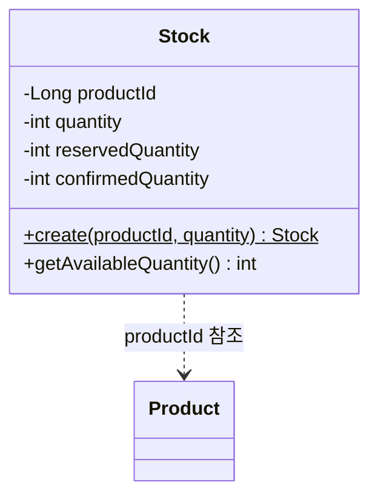

# Stock 클래스다이어그램

## 개요
상품별 재고를 점유/확정/해제 생명주기로 관리하는 객체 구조를 정의한다.

## 클래스다이어그램

## 설계 결정

- Stock은 Product와 별도 엔티티로 분리한다 (도메인 독립)
- Stock은 BaseEntity를 상속한다 (createdAt, updatedAt 필요 — 수량 변경 추적)
- `quantity`: 총 재고 수량 (변하지 않음, 입고/감모 등 별도 관리 시 변경)
- `reservedQuantity`: 현재 점유 중인 수량
- `confirmedQuantity`: 확정된 차감 수량
- `getAvailableQuantity()`: quantity - reservedQuantity - confirmedQuantity
- 재고 점유/확정/해제는 JPQL Atomic UPDATE(Fail-Fast 패턴)로 처리한다 — Entity 메서드 대신 DB 레벨에서 원자적 연산
- 동시성 제어: Atomic UPDATE의 WHERE 조건으로 Fail-Fast 처리 (비관적 락 불필요)
