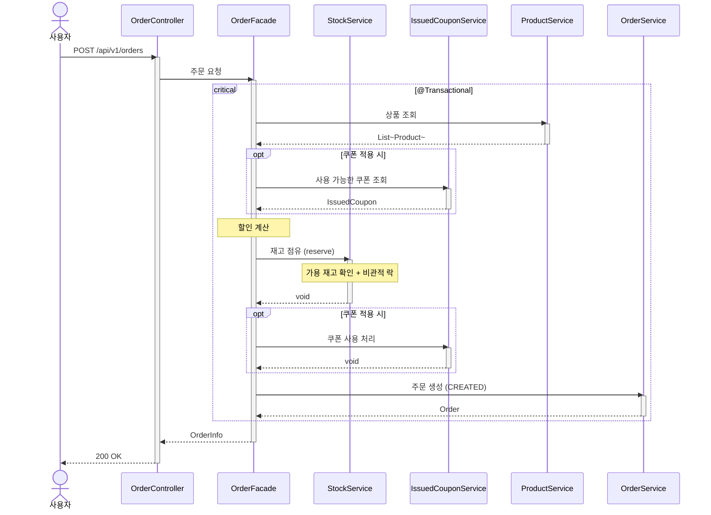

# 재고 점유/확정 시퀀스다이어그램

## 개요
주문 생성 시 재고를 점유하고, 결제 요청 시 비즈니스 먼저 확정(재고 확정 + 주문 PAID)하는 흐름을 정의한다.

## 시퀀스

## 핵심 포인트
- 기존 ProductService.decreaseStocks()가 StockService.reserve()로 대체된다
- 재고 점유, 쿠폰 사용 처리, 주문 생성은 하나의 트랜잭션에서 원자적으로 처리한다
- 주문은 CREATED 상태로 생성된다 (기존 PENDING에서 변경)
- 재고 점유 시 비관적 락(SELECT FOR UPDATE)으로 동시성을 제어한다
- 재고 확정은 결제 요청 시퀀스(payment/006)에서 처리한다
