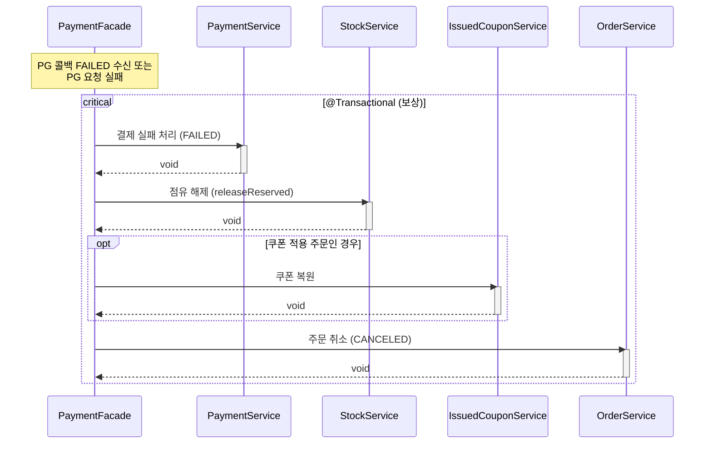
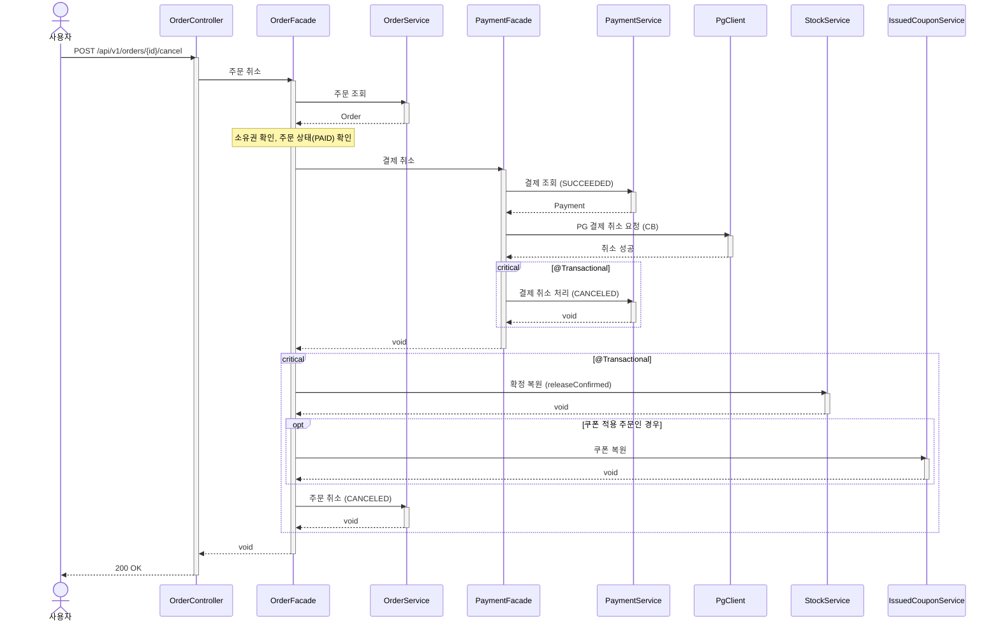

# 재고 해제 시퀀스다이어그램

## 개요
결제 실패 시 점유 해제, 주문 취소 시 확정 복원을 수행하는 보상 트랜잭션 흐름을 정의한다.

## 시퀀스 (결제 실패 — 점유 해제)

## 시퀀스 (주문 취소 — 확정 복원)

## 핵심 포인트
- 결제 실패 보상: 점유 해제(releaseReserved) — 아직 확정 전이므로 reservedQuantity만 감소
- 주문 취소 보상: 확정 복원(releaseConfirmed) — 이미 확정되었으므로 confirmedQuantity를 감소
- 쿠폰 복원은 쿠폰이 적용된 주문에서만 수행 (issuedCouponId != null)
- 보상 트랜잭션은 인프로세스로 즉시 실행하며, 실패 시 보정 스케줄러(ST-04)가 후속 처리
- 주문 취소 시 PG 취소는 트랜잭션 밖에서, 재고/쿠폰/주문 복원은 트랜잭션 안에서 처리
