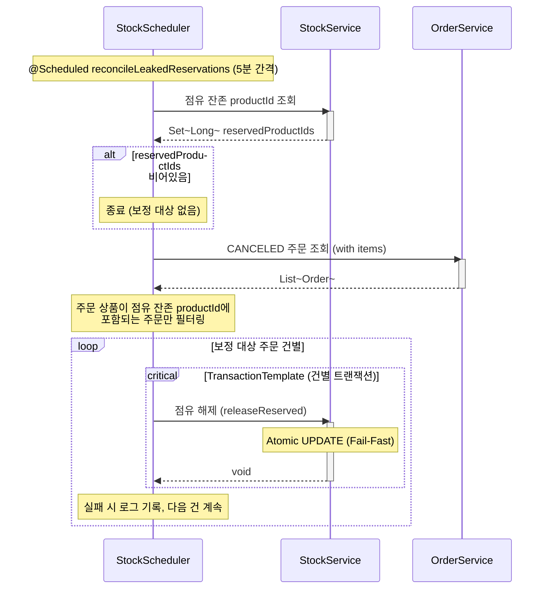
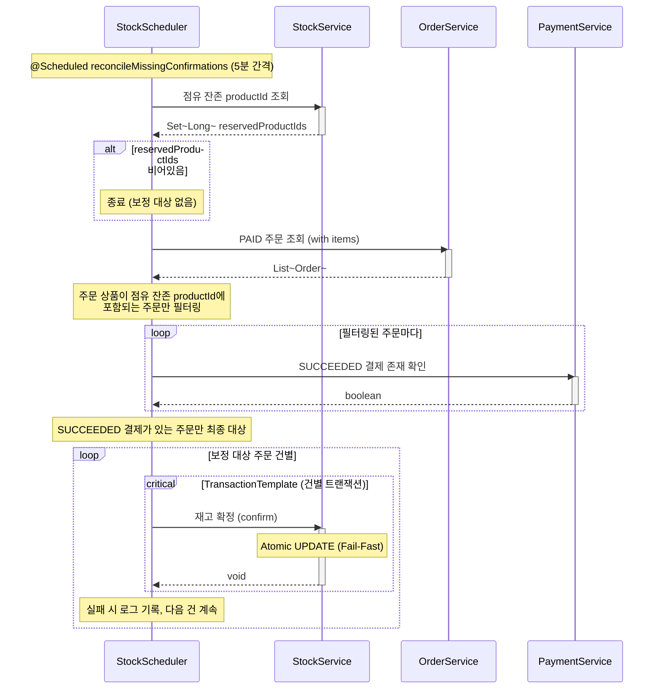

# 재고 보정 스케줄러 시퀀스다이어그램

## 개요
인프로세스 보상 트랜잭션 실패 또는 시스템 장애 시 발생하는 재고 상태 불일치를 주기적으로 탐지/보정한다.
점유 누수 보정과 확정 누락 보정은 각각 독립된 `@Scheduled` 메서드로 분리하여, 한쪽 실패가 다른 쪽에 영향을 주지 않는다.

## 시퀀스 (점유 누수 보정)

CANCELED 주문인데 해당 상품의 Stock에 점유가 남아있는 건을 탐지하여 해제한다.

## 시퀀스 (확정 누락 보정)

PAID 주문 + SUCCEEDED 결제인데 해당 상품의 Stock이 아직 점유 상태인 건을 탐지하여 확정한다.

## 핵심 포인트
- 탐지 전략: Stock에서 `reservedQuantity > 0`인 productId를 먼저 조회 후, 주문/결제 상태와 애플리케이션 레벨에서 조합 (DB 조인 없음)
- 스케줄 독립성: 두 보정 로직은 각각 독립된 @Scheduled 메서드로, 한쪽 실패가 다른 쪽 실행에 영향을 주지 않음
- 건별 트랜잭션: TransactionTemplate으로 각 주문을 개별 트랜잭션으로 처리하여 한 건 실패가 전체에 영향을 주지 않음
- 점유 누수: CANCELED 주문의 reservedQuantity 감소 (releaseReserved)
- 확정 누락: PAID + SUCCEEDED 주문의 reservedQuantity → confirmedQuantity 이동 (confirm)
- 002-stock-release의 보상 트랜잭션이 실패한 경우를 후속 처리하는 안전망 역할
