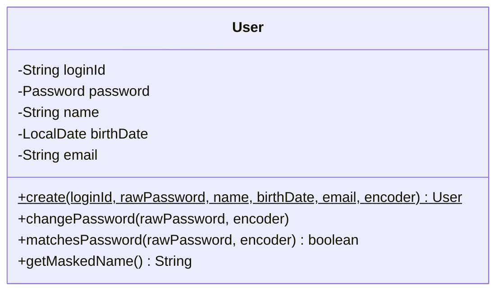

# User 클래스다이어그램

## 개요
사용자 계정의 생성, 인증, 정보 관리를 담당하는 객체 구조를 정의한다.

## 클래스다이어그램

## 설계 결정

- PasswordEncoder는 도메인 패키지에 정의한 인터페이스이며, 구현체는 infrastructure에 배치한다
- create()와 changePassword()에서 PasswordEncoder를 파라미터로 주입받아 Entity 내부에서 암호화한다
- 생년월일 포함 여부 검증은 Entity가 자기 데이터(birthDate)를 알고 있으므로 Entity 메서드로 구현한다
- 이름 마스킹은 Entity의 자기 데이터 가공이므로 Entity 메서드로 구현한다
