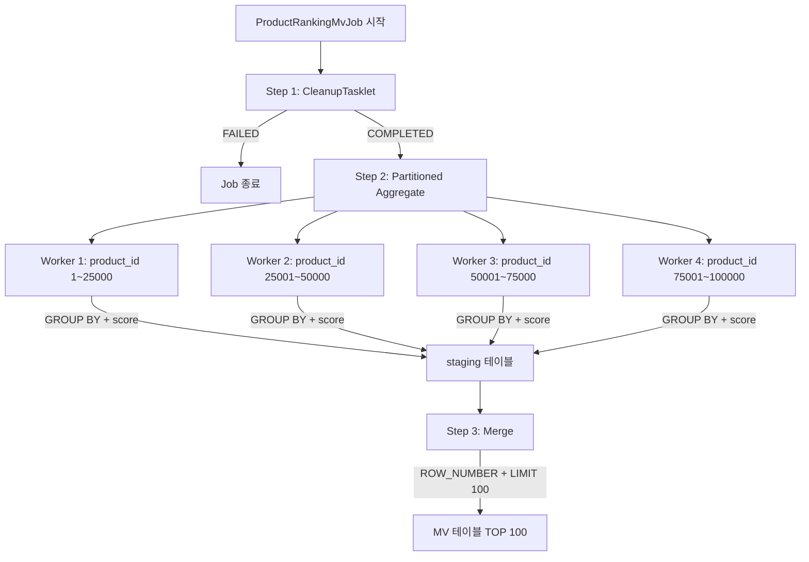
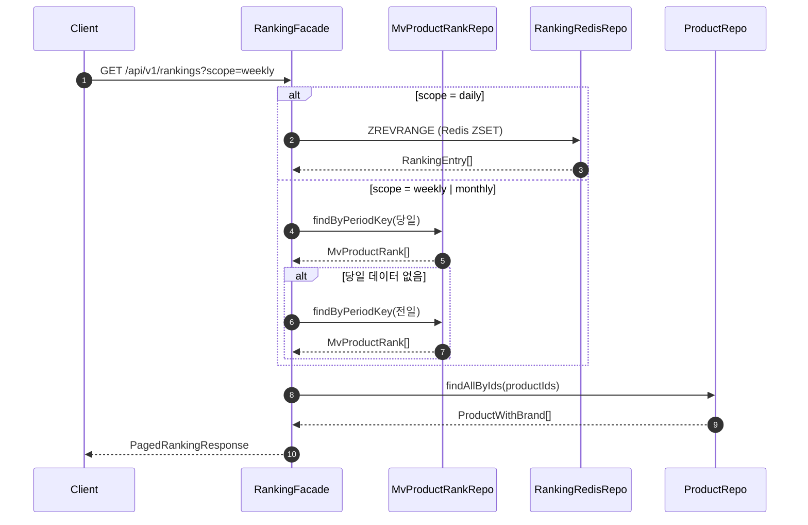

# MV 기반 주간/월간 랭킹 배치 시스템 구축

## 📌 Summary

- **배경**: 기존 주간/월간 랭킹은 Redis carry-over(지수 감쇠) 기반의 근사치였다. DB 원장 기준의 정확한 기간 집계 랭킹이 필요했다.
- **목표**: Spring Batch로 `product_metrics`(일간 메트릭)를 주간/월간 단위로 합산하여 MV 테이블에 TOP 100 랭킹을 적재하고, API에서 조회할 수 있도록 한다.
- **결과**: Partitioning + Chunk-Oriented 3-Step 배치 구현, API 확장(MV 단일 소스 + 전일 fallback), E2E 테스트 8/8 통과, 10만 상품 × 300만 행 기준 약 2.5초에 집계 완료.

---

## 🧭 Context & Decision

### 문제 정의

- **현재 동작**: 주간/월간 랭킹은 Redis ZUNIONSTORE(주간: 일별 score 합산)와 carry-over(월간: 지수 감쇠 `×0.97`)로 생성된다. 이것은 빠르지만 근사치이며, log₁₀ 비선형성으로 인해 동일 총 활동량의 상품이 다른 순위를 받을 수 있다.
- **문제**: "이번 달 가장 많이 팔린 상품"이라는 공개 랭킹 보드의 비즈니스 의미에 부합하는 정확한 기간 집계가 없다. 또한 Redis 장애 시 주간/월간 랭킹 조회가 불가하다.
- **성공 기준**: DB 원장(`product_metrics`) 기반으로 주간(7일)/월간(30일) 메트릭을 균등 합산하여 TOP 100 랭킹을 MV 테이블에 적재하고, API에서 조회할 수 있다.

### 선택지와 결정

#### 1. Score 계산 방식

- **A. 균등 합산** (채택): 기간 내 메트릭을 SUM한 뒤 score 공식 1회 적용. "기간 총 실적" 관점
- **B. 지수 감쇠**: Redis와 동일하게 `daily × 0.97^i` 적용. "최근 트렌드" 관점
- **결정**: MV가 Redis와 같은 결과를 내면 MV를 만든 이유가 없다. "이번 달 베스트셀러 = 총 판매량 기준"이라는 이커머스 업계 표준에 부합하는 균등 합산을 채택
- **트레이드오프**: Redis 랭킹과 MV 랭킹의 순위가 다를 수 있음 → 이것은 버그가 아니라 설계 의도 (다른 관점의 랭킹 제공)

#### 2. Reader 선택 + 병렬 처리

- **A. JdbcPagingItemReader**: 멀티스레드 안전하지만, GROUP BY 집계 쿼리를 페이지마다 재실행
- **B. JdbcCursorItemReader + Partitioning** (채택): GROUP BY 1회 실행 + product_id 범위 분할로 병렬 처리
- **결정**: GROUP BY 집계에서 Paging은 페이지마다 집계를 반복하므로 규모가 커질수록 치명적. CursorReader의 멀티스레드 한계(ResultSet 공유 상태)를 Partitioning으로 극복
- **참고**: [Spring Batch Scalability — Partitioning](https://docs.spring.io/spring-batch/reference/scalability.html)

#### 3. Redis fallback vs 전일 MV fallback

- **A. Redis fallback**: MV 장애 시 Redis에서 조회
- **B. 전일 MV fallback** (채택): 당일 MV가 없으면 전일 MV 반환
- **결정**: Redis(지수 감쇠)와 MV(균등 합산)는 다른 공식이므로, 소스 전환 시 순위가 바뀌는 데이터 불일치 발생. 전일 MV는 같은 공식 + 1일 stale로 순위 불일치 없음

#### 4. 전체 재계산 vs 증분 계산

- **A. 전체 재계산** (채택): 매일 원장에서 기간 전체를 GROUP BY
- **B. 증분 계산**: 어제 결과 - 가장 오래된 날 + 오늘 (93% 데이터 절감)
- **결정**: 이커머스에서 주문 취소/환불은 원주문과 다른 날에 발생(Late-Arriving Fact). 증분 계산은 "과거 데이터가 불변"이라는 전제가 필요하지만, `cancel_by_order_date`가 과거 행을 사후 갱신하므로 이 전제가 깨진다. 성능 차이(~10초 vs ~3초)는 1일 1회 배치에서 운영 영향 없음

#### 5. Chunk vs Tasklet

- **A. Tasklet**: `INSERT INTO...SELECT + RANK() OVER + LIMIT 100`으로 SQL 한 방 처리. 네트워크 왕복 0
- **B. Chunk-Oriented** (채택): Reader/Writer 분리 + faultTolerant + retry
- **결정**: 이 작업은 Tasklet으로도 가능하지만, Chunk를 선택하면 Spring Batch의 운영 기능(`faultTolerant + retry + ExponentialBackOffPolicy`, `StepExecution` 자동 기록, `StepMonitorListener`)을 활용할 수 있다. 100건에 대한 네트워크 왕복 비용(< 1ms)보다 이 운영 기능의 가치가 크다

---

## 🏗️ Design Overview

### 변경 범위

- **영향 받는 모듈**: `commerce-batch`, `commerce-api`
- **신규 추가**:
    - `ProductRankingMvJobConfig.java` — Job + 3 Step + Partitioner + Reader + Writer
    - `CleanupTasklet.java` — DELETE + 데이터 보존 정책
    - `MvProductRank.java` / `MvProductRankWeekly.java` / `MvProductRankMonthly.java` — MV 엔티티
    - `MvProductRankRepository.java` + JPA 구현체 — MV 조회
    - `mv_product_rank_weekly` / `mv_product_rank_monthly` / `mv_product_rank_staging` — DDL
- **수정**: `RankingFacade.java` — weekly/monthly 조회 경로를 Redis → MV로 변경

### 주요 컴포넌트 책임

- `ProductRankingMvJobConfig`: 3-Step Job 오케스트레이션. Partitioner로 product_id 범위 분할, Worker Step에서 Chunk-Oriented 집계, mergeStep에서 Global TOP 100 추출
- `CleanupTasklet`: 당일 period_key의 MV/staging DELETE + 3일 이전 데이터 퍼지. 멱등성 보장의 핵심
- `RankingFacade`: scope별 데이터 소스 분기. daily → Redis, weekly/monthly → MV(당일 → 전일 fallback)

---

## 🔁 Flow Diagram

### 배치 Job 흐름

### API 조회 흐름

---

## 테스트 결과

### E2E 테스트

8개 시나리오 모두 통과:

| 시나리오 | 검증 포인트 |
|---------|-----------|
| scope=weekly (150개 상품) | 3-Step 파이프라인 동작, TOP 100 적재, 1위 정확성 |
| scope=weekly (30개 상품) | 서비스 초기 등 상품이 부족해도 Job 정상 완료 |
| scope=monthly (30일) | 30일 윈도우 집계, monthly 테이블에 적재 |
| 멱등성 (2회 실행) | 중복 없이 동일 결과 |
| 데이터 없음 | Job COMPLETED, 빈 MV |
| 부분 데이터 (3일) | 있는 만큼만 집계 |
| 취소된 주문 반영 | 순매출 기준 순위 결정 |
| 대규모 (10만 × 30일) | 300만 행 4 Partition 병렬 집계, 파티션 균등 분배, 일간/주간/월간 TOP 20 순위 차이 확인 |

### 성능

| 규모 | 상품 수 | 메트릭 행 수 | weekly | monthly |
|------|--------|------------|--------|---------|
| 기능 테스트 | 150 | 1,050 | ~90ms | — |
| **대규모 테스트** | **100,000** | **3,000,000** | **2,205ms** | **2,564ms** |

---

## 리뷰 포인트

### 1. Partitioning + CursorReader 조합시에 적절한 gridSize, 스테이징 테이블을 두는 효용 산정 방식

요구사항에 "대량의 데이터를 읽고 처리할 수 있도록 구성"이 명시되어 있어, 활성 상품 수가 수십만~수백만 규모로 성장하더라도 배치 윈도우 내에 처리 가능한 구조를 고려했습니다.

GROUP BY 집계에서 PagingReader는 페이지마다 집계를 재실행하고, CursorReader는 멀티스레드에서 사용이 어려워서, Partitioning으로 product_id 범위를 분할하여 각 Worker가 독립 CursorReader를 갖도록 했습니다.

질문:
- **gridSize를 4로 설정**했는데, 커넥션 풀 크기나 CPU 코어 수에 연동하거나 동적으로 조정해야 할 것 같습니다. 실무에서는 gridSize를 어떻게 설정하시나요?
- **스테이징 테이블에 전체 상품 집계 결과를 적재**한 후 mergeStep에서 TOP 100만 추출하는 구조인데, 상품 수가 많아지면 스테이징 적재 비용이 커집니다. 이 중간 저장 비용 대비 Partitioning의 병렬 처리 이점이 충분한지는 처리 속도만 고려해서 판단해도 될까요?

### 2. Score 계산을 SQL에 넣은 것에 대하여

Score 공식(`LOG10 + 가중치`)을 Reader SQL에 넣어서 DB가 집계 + score + 정렬 + TOP 100을 한 번에 처리합니다. Java의 RankingCorrectionJob에도 동일한 공식이 있어 이중 관리가 됩니다.

두 Job은 입력이 다르고(일간 메트릭 vs 기간 합산 메트릭), 가중치는 `application.yml`에서 관리하므로 합리적 중복이라고 판단했습니다. 공식 일원화가 필요한지 의견을 구합니다.
