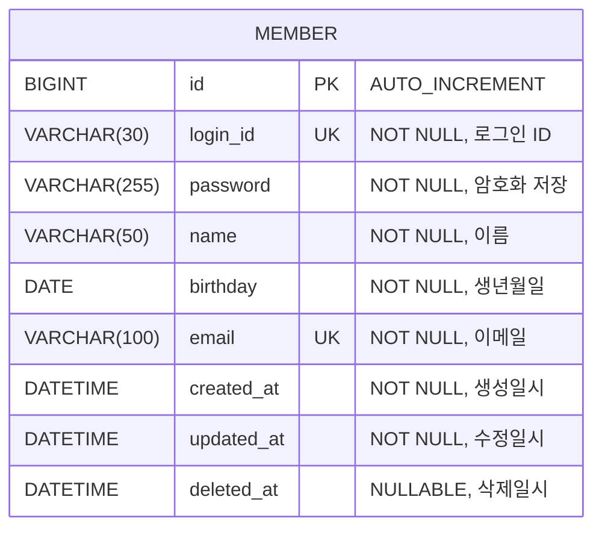

# Member ERD

## 회원 테이블 설계

## 제약조건

| 제약조건 | 대상 컬럼 | 설명 |
|----------|-----------|------|
| PRIMARY KEY | `id` | AUTO_INCREMENT |
| UNIQUE | `login_id` | 로그인 ID 중복 방지 |
| UNIQUE | `email` | 이메일 중복 방지 |
| NOT NULL | `login_id`, `password`, `name`, `birthday`, `email` | 필수 입력 |

## 비고

- `password`는 BCrypt 등으로 암호화하여 저장 (VARCHAR 255)
- `birthday`는 `LocalDate` 매핑 (시분초 불필요)
- `created_at`, `updated_at`, `deleted_at`은 `BaseEntity`에서 자동 관리
- `deleted_at`을 통한 소프트 삭제 지원
