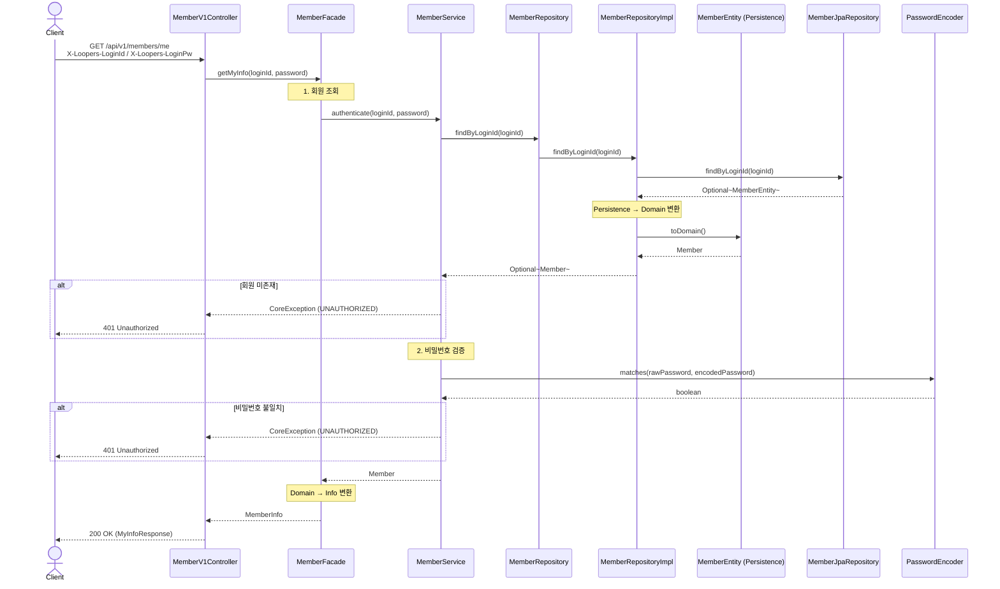
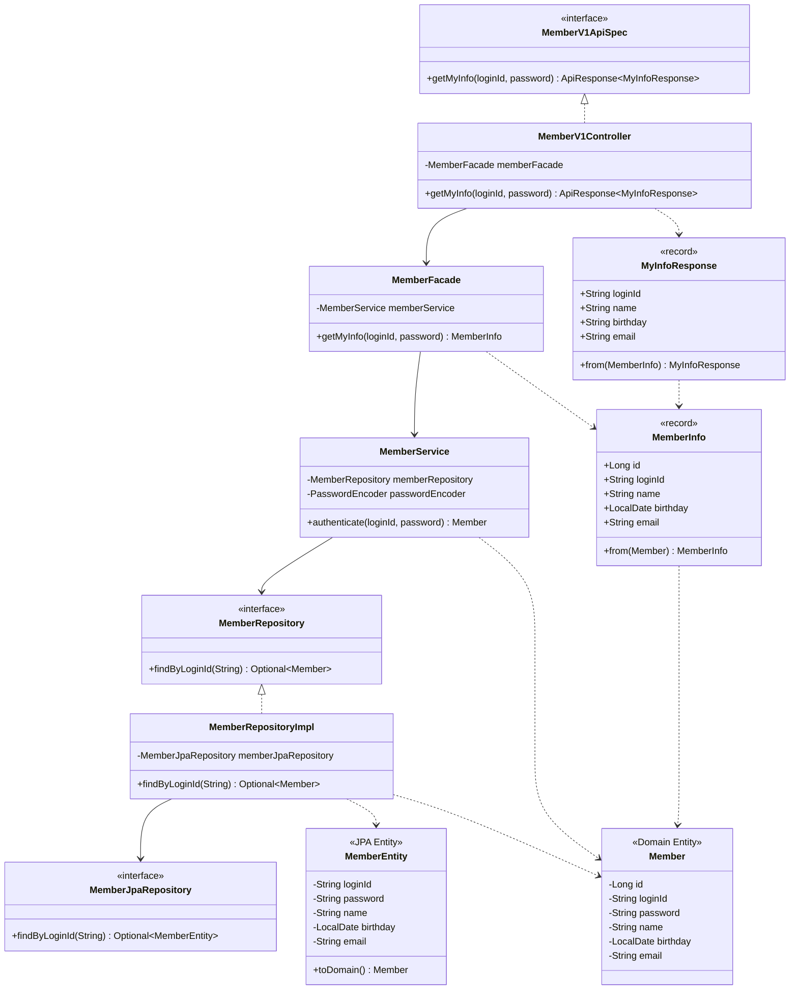

# 내 정보 조회 기능 설계

## 요청/응답 스펙

| 항목 | 값 |
|------|---|
| Method | GET |
| URL | `/api/v1/members/me` |
| 인증 | `X-Loopers-LoginId`, `X-Loopers-LoginPw` 헤더 |
| 응답 코드 (성공) | 200 OK |
| 응답 코드 (인증 실패) | 401 Unauthorized |

### 응답 필드

| 필드 | 타입 | 설명 |
|------|------|------|
| loginId | String | 로그인 ID |
| name | String | 이름 |
| birthday | String | 생년월일 (yyyy-MM-dd) |
| email | String | 이메일 |

## 시퀀스 다이어그램

## 클래스 다이어그램

