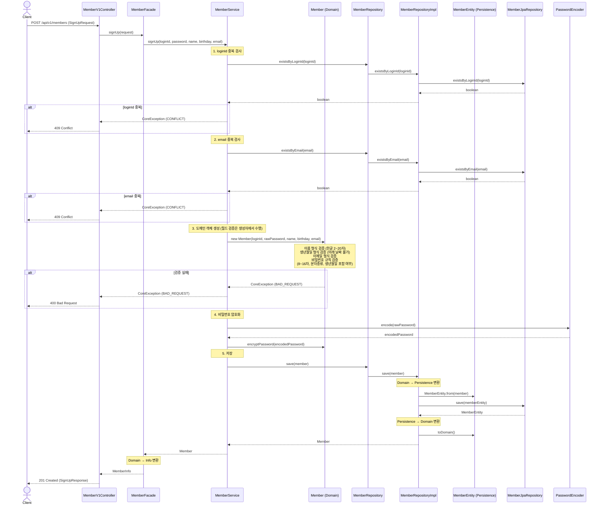
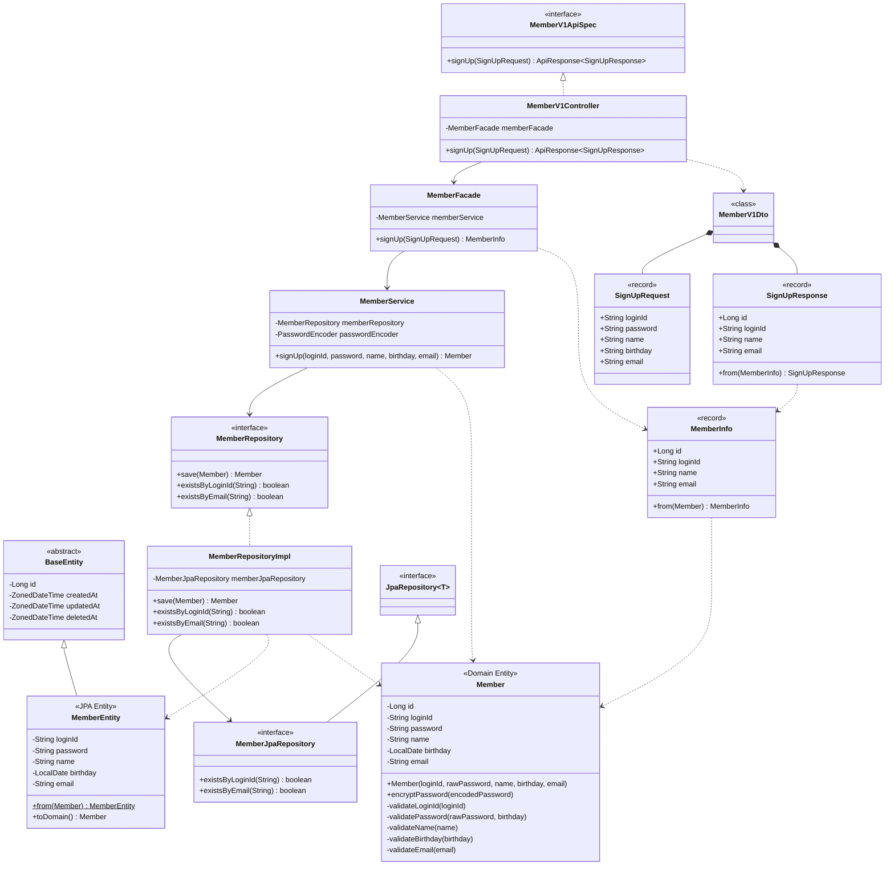

# 회원가입 기능 설계

## 검증 규칙

| 필드 | 규칙 |
|------|------|
| loginId | NOT NULL, NOT BLANK |
| password | 8~16자, 영문 대소문자 + 숫자 + 특수문자만 허용, 생년월일(yyyyMMdd) 포함 불가 |
| name | NOT NULL, NOT BLANK, 한글 2~20자 |
| birthday | NOT NULL, `yyyy-MM-dd` 형식, 미래 날짜 불가 |
| email | NOT NULL, 이메일 형식 (RFC 5322) |

## 시퀀스 다이어그램



## 클래스 다이어그램



## 패키지 구조

```
com.loopers
├── interfaces/api/member/
│   ├── MemberV1Controller        ← REST 엔드포인트
│   ├── MemberV1Dto               ← SignUpRequest, SignUpResponse (record)
│   └── MemberV1ApiSpec           ← Swagger 스펙 인터페이스
├── application/member/
│   ├── MemberFacade              ← 유즈케이스 오케스트레이션
│   └── MemberInfo                ← 응답 변환용 record
├── domain/member/
│   ├── Member                    ← 도메인 엔티티 (순수 Java 객체, 검증 로직 포함)
│   ├── MemberRepository          ← 도메인 레포지토리 인터페이스
│   └── MemberService             ← 비즈니스 로직 (중복 검사, 암호화 위임)
└── infrastructure/member/
    ├── MemberEntity              ← JPA 영속성 엔티티 (BaseEntity 상속)
    ├── MemberRepositoryImpl      ← 레포지토리 구현체 (Domain ↔ Entity 변환)
    └── MemberJpaRepository       ← Spring Data JPA 인터페이스
```

## Domain Entity vs Persistence Entity 분리

| 구분 | Member (Domain) | MemberEntity (Persistence) |
|------|-----------------|---------------------------|
| 위치 | `domain/member/` | `infrastructure/member/` |
| 역할 | 비즈니스 검증 로직 | DB 영속화 |
| 상속 | 없음 (순수 Java 객체) | `BaseEntity` 상속 |
| JPA 어노테이션 | 없음 | `@Entity`, `@Table`, `@Column` |
| 변환 | - | `from(Member)`, `toDomain()` |
