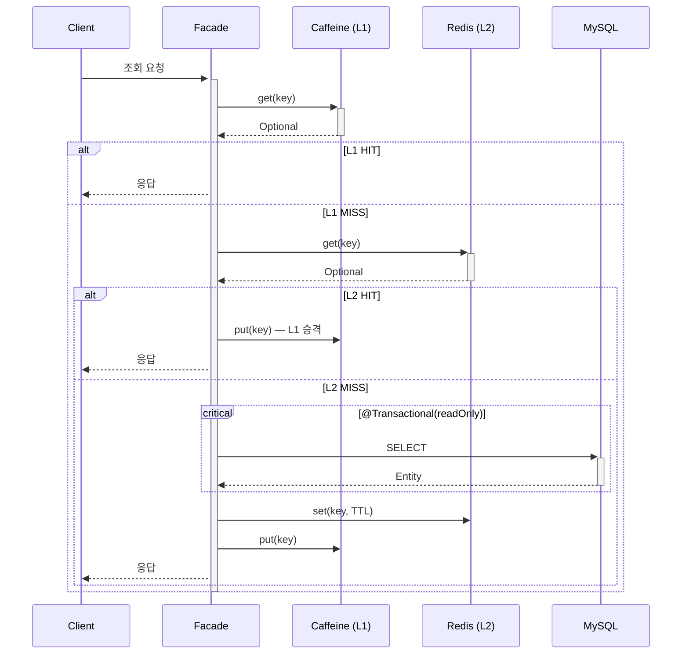
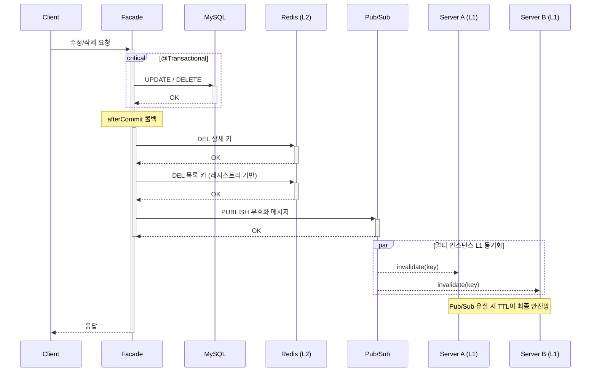
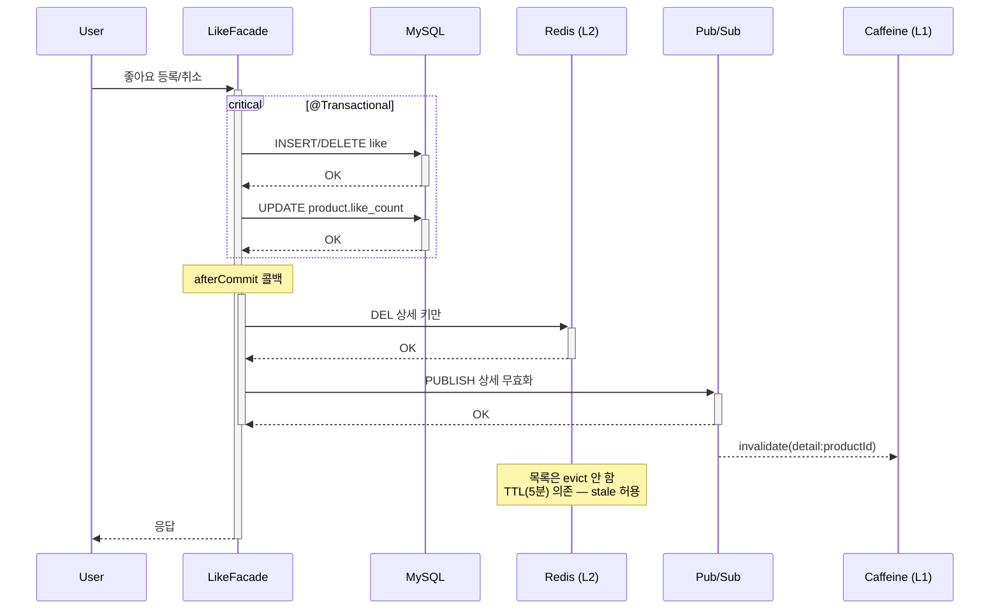

# 상품 조회 캐시 전략 — 의사결정 보고서

## TL;DR

상품 조회 성능을 DB only → Redis → Caffeine+Redis 3단계로 최적화했다.
각 단계의 효과를 독립 측정할 수 있도록 v1/v2/v3 실험 구조를 설계했으며,
RedisTemplate 직접 사용, Read-Through 패턴, Redis Pub/Sub 기반 L1 무효화를 적용했다.
상품 상세는 PK 조회(type=const, rows=1)로 쿼리 자체는 최적이나, **인기 상품의 반복 조회 부하를 줄이기 위해 캐시를 적용**한다.
afterCommit 적용과 SET 레지스트리 전환으로 정합성·블로킹 문제를 해결했으며,
남은 제약(좋아요 시 목록 stale, Cache Stampede 등)과 프로덕션 보강 방향을 함께 정리한다.

목록 조회에서 v1(DB) avg 963ms → v3(L1+L2) avg 8ms로 **Cursor 기준 88배 개선**.
캐시 히트율은 L2 목록 **98.4%**, L1 목록 **94.0%**으로 우수 수준.

---

## 1. 캐시 적용 여부 판단

| 대상 | 캐시 적용 | 이유 |
|------|----------|------|
| 상품 상세 | ✅ | 모든 유저가 같은 데이터, 변경 빈도 낮음, 인기 상품에 트래픽 집중 |
| 상품 목록 (브랜드 없음) | ✅ | 모든 유저가 동일 결과, 인덱스로 해결 못 하는 패턴의 캐시 미스 대비 |
| 상품 목록 (브랜드 있음) | ✅ | 정렬×브랜드 조합이 유한, 반복 조회 발생 |
| 주문 목록 | ❌ | 개인 데이터, 유저마다 결과 다름, 캐시 히트율 구조적으로 낮음 |
| 주문 상세 | ❌ | 개인 데이터, 반복 조회 빈도 낮음 |
| 브랜드 목록 | ❌ | 데이터 적음(20건), DB 조회도 충분히 빠름 |

**판단 기준**: "같은 요청이 반복되는가?" + "결과가 유저 무관한가?" — 둘 다 YES면 캐시 효과 높음.
주문은 둘 다 NO이므로 인덱스가 유일한 방어선이다.

---

## 2. 3단계 실험 설계 — 왜 v1/v2/v3로 나눴는가

| 버전 | 구조 | 위치 | 목적 |
|------|------|------|------|
| v1 | DB only | ProductExperimentFacade | 캐시 없는 기준선 (baseline) |
| v2 | Redis (L2) → DB | ProductExperimentFacade | 네트워크 캐시의 효과 측정 |
| v3 | Caffeine (L1) → Redis (L2) → DB | ProductExperimentFacade | 로컬 캐시 추가 효과 측정 |
| 프로덕션 | Redis (L2) → DB | ProductFacade | 현재 배포 중인 코드 |

### 왜 한 번에 v3로 안 갔는가?

각 계층의 **독립적 기여도**를 측정하기 위해서다.
v3만 있으면 "Redis가 빠른 건지, Caffeine이 빠른 건지" 분리할 수 없다.
v1 → v2에서 Redis의 효과를, v2 → v3에서 Caffeine의 추가 효과를 각각 확인할 수 있다.

### 프로덕션은 왜 L2만 적용했는가?

L1(Caffeine)은 실험 코드에서 효과를 검증한 후 프로덕션에 반영하려는 단계적 접근이다.
L1을 프로덕션에 적용하면 Pub/Sub 무효화가 필수인데, 이 경로의 안정성을 충분히 테스트한 후 반영하는 것이 안전하다.

---

## 3. 선택 1: @Cacheable vs RedisTemplate

| 대안 | 장점 | 단점 |
|------|------|------|
| A. @Cacheable 어노테이션 | 코드 간결, Spring 추상화 | 캐시 흐름이 AOP 뒤에 숨겨짐, 키/TTL 세밀 제어 어려움 |
| **B. RedisTemplate 직접 사용 (채택)** | 캐시 흐름 가시적, 키/TTL 세밀 제어, 에러 핸들링 자유 | 보일러플레이트 증가 |

### 왜 B를 선택했는가

Read-Through 패턴의 흐름(조회 → 미스 → DB → 저장)을 **코드로 직접 보면서 제어**하는 것이 목적이었다.
상세 캐시(TTL 10분)와 목록 캐시(TTL 5분)의 TTL을 키 레벨에서 다르게 설정해야 했고,
v2/v3 실험 코드에서 hit/miss 분기를 명시적으로 작성해야 비교 측정이 가능했다.

```java
// v2 실험 코드 — hit/miss 분기가 명시적
Optional<ProductInfo> cached = productCacheManager.getDetail(productId);
if (cached.isPresent()) {
    return cached.get();                    // HIT → DB 스킵
} else {
    info = ProductInfo.from(product, ...);  // MISS → DB 조회
    productCacheManager.putDetail(productId, info);  // Redis에 저장
}
```

---

## 4. 캐시 계층별 TTL 설계

| 계층 | 대상 | TTL | 근거 |
|------|------|-----|------|
| L2 (Redis) | 상품 상세 | 10분 | 관리자만 수정, 하루 수 회 이하. 변경 빈도 낮음 |
| L2 (Redis) | 상품 목록 (offset/cursor) | 5분 | 좋아요 변경으로 정렬 변동 가능. 상세보다 짧게 |
| L1 (Caffeine) | 상품 상세 | 1분 | Pub/Sub 유실 대비 안전망. maxSize=200개 |
| L1 (Caffeine) | 상품 목록 | 30초 | 변동 빈도 높은 데이터, 가장 짧게. maxSize=500개 |

### TTL 계층 구조의 원칙

```
Caffeine(30초~1분) < Redis(5분~10분) < DB(원본)
```

**가까운 캐시일수록 TTL이 짧다.**
이유는 가까운 캐시일수록 무효화가 어렵기 때문이다.
Redis는 중앙화되어 있어 DELETE 한 번이면 되지만,
Caffeine은 서버마다 따로 있어서 Pub/Sub에 의존해야 한다.
Pub/Sub이 유실되면 TTL이 최종 안전망이 되므로, 짧게 잡는 것이 안전하다.

---

## 5. 캐시 키 설계

| 키 패턴 | TTL | 용도 | 무효화 시점 |
|---------|-----|------|------------|
| `product:detail:{productId}` | 10분 | 상품 상세 | 수정/삭제/좋아요 변경 |
| `product:list:{brandId\|all}:{sort}:{page}:{size}` | 5분 | 목록 (offset) | 등록/수정/삭제 |
| `product:list:{brandId\|all}:cursor:...:{size}` | 5분 | 목록 (cursor) | 등록/수정/삭제 |
| Caffeine `detail:{productId}` | 1분 | L1 상세 | Pub/Sub 수신 시 |
| Caffeine 목록 키 | 30초 | L1 목록 | Pub/Sub `list:all` 수신 시 |

---

## 6. 선택 2: 무효화 전략 — 전체 evict vs 선택적 evict vs TTL 의존

| 대안 | 장점 | 단점 |
|------|------|------|
| A. TTL만 의존 (evict 안 함) | 구현 단순, 캐시 적중률 최고 | 변경이 최대 5분간 미반영 |
| **B. 상세 + 목록 전체 evict (채택)** | 정합성 보장, 구현 단순 | 좋아요 빈번 시 캐시 적중률 급락 |
| C. 정렬 타입별 선택적 evict | 불필요한 캐시 삭제 방지 | 구현 복잡, 어떤 정렬이 영향받는지 판단 필요 |

### 왜 B를 선택했는가

현재 서비스 규모에서는 정합성을 우선시했다.
좋아요 변경 시 정렬 순서가 바뀔 수 있으므로 목록 캐시를 전체 무효화하는 것이 안전하다.

단, **좋아요는 예외**로 목록 evict를 하지 않는다.
좋아요는 빈도가 높아 매번 전체 목록을 evict하면 캐시 의미가 없어진다.
목록의 like_count는 TTL(5분) 만료까지 stale할 수 있으나, 커머스 상품 목록에서 이 수준은 허용 가능하다.

### 이벤트별 무효화 매핑

| 이벤트 | 상세(L2) | 목록(L2) | L1 | 호출 위치 |
|--------|---------|---------|-----|----------|
| 상품 등록 | - | evictAllLists() | Pub/Sub | ProductFacade.register() |
| 상품 수정 | evictDetail(id) | evictAllLists() | Pub/Sub | ProductFacade.updateInfo() |
| 상품 삭제 | evictDetail(id) | evictAllLists() | Pub/Sub | ProductFacade.delete() |
| 좋아요 등록 | evictDetail(id) | TTL 의존 | Pub/Sub | LikeFacade.like() |
| 좋아요 취소 | evictDetail(id) | TTL 의존 | Pub/Sub | LikeFacade.unlike() |

---

## 7. 선택 3: L1 무효화 — 왜 Redis Pub/Sub인가

| 대안 | 장점 | 단점 |
|------|------|------|
| A. TTL만 의존 | 구현 최단순 | 최대 1분간 서버 간 불일치 |
| **B. Redis Pub/Sub (채택)** | 거의 실시간 무효화, Redis 인프라 이미 있음 | Pub/Sub 유실 가능성 |
| C. Kafka 이벤트 | 메시지 유실 없음 (영속) | 과도한 인프라, 캐시 무효화에 오버킬 |

### 무효화 흐름

```
상품 수정 → ProductCacheManager.evictDetail(id)
  → redisTemplate.delete(key)                           // L2 삭제
  → redisTemplate.convertAndSend("cache:product:invalidate", "detail:{id}")
      → ProductCacheInvalidationSubscriber.handleMessage()
          → localCacheManager.evictDetail(id)            // 모든 서버의 L1 삭제
```

메시지 타입 3종: `detail:{id}`, `list:all`, `all`

Pub/Sub이 유실되더라도 Caffeine TTL(상세 1분, 목록 30초)이 최종 안전망이다.

---

## 8. 캐시 무효화의 구조적 한계와 발전 경로

### afterCommit DELETE로도 막을 수 없는 레이스 컨디션

afterCommit으로 커밋 후 무효화를 보장해도, 다음 시나리오에서 stale data가 캐시에 남을 수 있다.

```
Thread A: DB UPDATE (10,000→15,000)
Thread B:                              캐시 MISS → DB 읽음 (10,000, 아직 커밋 전)
Thread A: COMMIT → afterCommit DELETE
Thread B:                              Redis SET (10,000) ← DELETE 뒤에 SET!
결과: 캐시에 옛날 값(10,000원)이 TTL까지 남음
```

Thread B가 DB를 읽은 시점에는 Thread A가 아직 커밋 전이라 옛날 값을 읽는다.
그 사이에 Thread A가 커밋하고 DELETE까지 끝냈는데, Thread B는 뒤늦게 SET을 실행한다.
**읽기 스레드가 쓰기 스레드의 존재 자체를 모르기 때문에 생기는 구조적 문제**다.

이 레이스가 발생하려면 세 조건이 동시에 충족되어야 한다.
1. 캐시가 정확히 이 시점에 miss (TTL 만료 or 직전에 삭제됨)
2. 읽기 스레드가 DB를 읽는 시점이 쓰기 커밋 직전
3. 읽기 스레드의 SET이 쓰기 스레드의 DELETE보다 늦게 도착

윈도우가 수백ms 이내로 매우 좁아 확률은 낮지만, 트래픽이 올라가면 언젠가 발생한다.

### 규모별 발전 경로

이 레이스 컨디션에 대한 대응 수준은 서비스 규모에 따라 달라진다.

| 단계 | 전략 | stale 최대 시간 | 적합 규모 | 대표 사례 |
|------|------|---------------|----------|----------|
| 1단계 | **afterCommit DELETE + TTL (현재)** | TTL 전체 (5~10분) | 소규모 커머스 | 일반 서비스 |
| 2단계 | Delayed Double Delete | ~500ms | 중규모 커머스 | 트래픽 증가 시 전환 |
| 3단계 | Version 기반 충돌 해결 | 0초 (원천 해결) | 대규모 | Meta TAO |
| 4단계 | CDC(binlog) + 비동기 무효화 | near-realtime | 초대규모 | Uber Flux |

**현재 1단계를 선택한 이유:**

- 레이스 윈도우가 수백ms 이내로 매우 좁아 발생 확률이 극히 낮다.
- 발생하더라도 TTL(상세 10분, 목록 5분) 만료 시 자연 해소된다.
- 상품 가격이 잠깐 틀려도 **결제 시점에서 DB 가격을 재검증**하면 실제 손해는 없다.
- 2단계(DDD)는 코드 복잡도가 증가하고, 유효 캐시 오삭제 위험이 있다.

**2단계 전환 시점:**
트래픽이 늘어 레이스 발생 빈도가 체감될 때, 또는 가격 정합성에 대한 비즈니스 요구가 강화될 때. afterCommit 구조 위에 500ms 지연 2차 DELETE만 추가하면 되므로 전환 비용이 낮다.

**3단계는 현재 과도한 이유:**
각 데이터에 version 필드를 붙이고 SET 시 버전 비교를 해야 하므로, 매 읽기마다 Redis 2회 호출(GET version + GET data)이 필요하다. 또한 전역 버전 사용 시 상품 1개 수정에 전체 캐시가 무효화되는 스탬피드 위험이 있다. Meta TAO처럼 하루 1경건 요청을 처리하는 규모가 아니면 비용 대비 이득이 없다.

---

## 9. 장애 시나리오 대비 현황

| 시나리오 | 대비 상태 | 현재 구현 |
|---------|----------|----------|
| Redis 다운 | ✅ 대비 | try-catch + Optional.empty → DB fallback |
| Caffeine 메모리 초과 | ✅ 대비 | maxSize(상세 200, 목록 500) + LRU eviction |
| Pub/Sub 유실 | ✅ 대비 | TTL이 안전망 (최대 1분 stale) |
| 캐시-DB 정합성 | ✅ 대비 | TransactionHelper.afterCommit()으로 커밋 후 무효화 |
| KEYS * 블로킹 | ✅ 대비 | 키 레지스트리(Set) 기반으로 KEYS 패턴 제거 |
| afterCommit 레이스 | ⚠️ TTL 의존 | 구조적 한계. 발전 경로 인지 (섹션 8) |
| Cache Stampede | ⚠️ 미대비 | 분산 락 미적용. TTL 만료 시 동시 DB 폭주 가능 |

---

## 10. 알려진 제약 사항과 개선 방향

### ~~제약 1: afterCommit 미사용~~ → 해결 완료

**현재 상태**: `TransactionHelper.afterCommit()`을 통해 트랜잭션 커밋 후 캐시 무효화가 실행된다.

```java
@Transactional
public ProductInfo updateInfo(Long productId, ...) {
    Product product = productService.updateInfo(productId, command);
    TransactionHelper.afterCommit(() -> {
        productCacheManager.evictDetail(productId);
        productCacheManager.evictAllLists();
    });
    return info;
}
```

커밋이 확정된 후에만 캐시를 무효화하므로, 롤백 시 불필요한 cache miss와 커밋 전 stale 재적재 문제가 모두 해결되었다.
단, afterCommit은 동시 쓰기 시 레이스 컨디션을 완전히 제거하지는 않는다 (섹션 8 참조). TTL이 최종 안전망이며, 이는 캐시 무효화의 구조적 한계다.

### ~~제약 2: KEYS 패턴~~ → 해결 완료

**현재 상태**: 키 레지스트리(Redis Set) 기반으로 KEYS 패턴을 제거했다.

```java
// 저장 시 — 레지스트리에 키 추적
public void putList(...) {
    String key = listKey(brandId, sort, page, size);
    redisTemplate.opsForValue().set(key, json, LIST_TTL);
    redisTemplate.opsForSet().add(LIST_KEYS_REGISTRY, key);  // 추적
}

// 삭제 시 — 레지스트리에서 키 목록 조회 후 삭제
public void evictAllLists() {
    Set<String> keys = redisTemplate.opsForSet().members(LIST_KEYS_REGISTRY);
    if (keys != null && !keys.isEmpty()) {
        redisTemplate.delete(keys);
    }
    redisTemplate.delete(LIST_KEYS_REGISTRY);
    publishInvalidation("list:all");
}
```

KEYS 명령 없이 **추적된 키만 정확히 삭제**하므로 Redis 블로킹 위험이 없다.

### 제약 3: 좋아요 변경 시 목록 stale

좋아요 등록/취소 시 상세 캐시만 무효화, 목록은 TTL(5분) 의존.
좋아요는 빈도가 높아 매번 전체 목록 evict하면 캐시 적중률이 급락한다.

**개선 방향**: 트래픽 커지면 `@TransactionalEventListener`로 커밋 후 좋아요순 목록만 선택적 evict.

### 제약 4: Cache Stampede 미대비

TTL 만료 시 동시에 같은 키를 조회하면 모든 요청이 DB를 직접 친다.

**개선 방향**: Redis 분산 락(`setIfAbsent` + TTL)으로 한 요청만 DB 조회하고 나머지는 대기. 또는 TTL 만료 전에 미리 갱신하는 Refresh-Ahead 패턴.

### 제약 5: Write-Through 미적용

무효화(DELETE) 후 다음 조회에서 캐시 미스가 1회 발생한다.

| 대상 | 현재 전략 | 전환 가능 전략 | 전환 조건 |
|------|---------|-------------|---------|
| 상품 상세 | DELETE (무효화) | Write-Through (SET) | 동시 쓰기 거의 없음 |
| 좋아요 | DELETE (무효화) | 유지 | 동시 쓰기 빈번 |
| 목록 | DELETE + TTL | 유지 | 조합 다양, SET 대상 특정 어려움 |

---

## 11. 전체 흐름 요약

### 조회 흐름 (v3: L1 → L2 → DB)



### 수정/삭제 시 캐시 무효화



### 좋아요 시 캐시 무효화



---

## 12. k6 부하 테스트 결과 (20 VUs, 순차 실행)

### 상품 상세 조회

| 지표 | v1 (DB) | v2 (Redis) | v3 (L1+L2) |
|------|---------|-----------|-----------|
| avg | 13.51ms | 16.66ms | 15.82ms |
| p50 | 10.83ms | 12.29ms | 13.33ms |
| p95 | 27.29ms | 38.90ms | 31.95ms |
| p99 | 52.17ms | 80.45ms | 54.12ms |
| max | 442.62ms | 1,189.89ms | 338.05ms |

**분석: 캐시가 DB보다 느리다 — 이것도 학습 포인트다.**

상세 조회는 PK 기반(type=const, rows=1)이라 DB 쿼리 자체가 ~10ms로 이미 최적이다.
Redis 캐시를 거치면 네트워크 홉 + JSON 역직렬화 오버헤드가 추가되어 오히려 느려진다.
이는 **"캐시는 DB 쿼리가 비싼 곳에서만 효과가 있다"**는 것을 실측으로 보여준다.

그럼에도 상세에 캐시를 유지하는 이유는 **DB 보호** 때문이다.
20 VU에서는 DB가 버티지만, 200 VU가 되면 커넥션 풀이 포화된다.
캐시 히트 시 DB 커넥션을 아예 안 잡으므로, 트래픽 폭주 시 DB를 보호하는 역할을 한다.

### 상품 목록 조회 — Offset Pagination

| 지표 | v1 (DB) | v2 (Redis) | v3 (L1+L2) | 개선율 (v1→v3) |
|------|---------|-----------|-----------|--------------|
| avg | 963.71ms | 18.29ms | **22.31ms** | **43배** |
| p50 | 947.26ms | 11.73ms | **16.14ms** | **59배** |
| p95 | 1,489.65ms | 43.36ms | **52.63ms** | **28배** |
| p99 | 1,854.94ms | 96.16ms | **142.60ms** | **13배** |
| max | 2,201.39ms | 1,349.06ms | **726.59ms** | 3배 |

Offset에서 v3가 v2보다 약간 느린 이유: Offset은 키 조합이 다양해서(brandId × sort × page × size) L1 히트율이 Cursor만큼 높지 않다.

### 상품 목록 조회 — Cursor Pagination

| 지표 | v1 (DB) | v2 (Redis) | v3 (L1+L2) | 개선율 (v1→v3) |
|------|---------|-----------|-----------|--------------|
| avg | 740.83ms | 17.76ms | **8.42ms** | **88배** |
| p50 | 576.97ms | 11.25ms | **6.78ms** | **85배** |
| p95 | 2,059.54ms | 36.90ms | **17.85ms** | **115배** |
| p99 | 2,551.50ms | 171.34ms | **31.92ms** | **80배** |
| max | 3,084.75ms | 579.93ms | 372.09ms | 8배 |

### 캐시 히트율 (k6 실행 후 측정)

| 계층 | 대상 | hit | miss | 히트율 | 판정 |
|------|------|-----|------|--------|------|
| L2 (Redis) | 상세 | 35,426 | 7,857 | **81.8%** | 건강 (80%↑) |
| L2 (Redis) | 목록 | 68,658 | 1,114 | **98.4%** | 우수 (90%↑) |
| L1 (Caffeine) | 상세 | 30,084 | 7,514 | **80.1%** | 건강 |
| L1 (Caffeine) | 목록 | 93,854 | 3,520 | **94.0%** | 우수 |

목록의 히트율이 상세보다 높은 이유: 목록은 브랜드×정렬 조합이 유한(20×3=60개)하여 같은 키가 반복 히트된다.
상세는 파레토 분포로 인기 상품(상위 1%)에 80% 트래픽이 집중되지만, 나머지 20% 트래픽이 10,000개 상품에 분산되어 miss가 상대적으로 많다.

### 종합 분석

**1. 목록 조회에서 캐시 효과가 극적이다.**
상세는 PK 조회라 DB 자체가 이미 빠르지만, 목록은 v1이 963ms로 느리기 때문에 캐시 적용 시 88배 개선(Cursor 기준).

**2. Cursor가 Offset보다 v1(DB only)에서 1.3배 빠르다.**
Offset v1 avg=963ms, Cursor v1 avg=740ms. v3에서는 차이가 더 벌어진다(22ms vs 8ms).
캐시 미스 시에도 Cursor가 유리하고, 캐시 히트 시에도 L1 히트율이 더 높아 v3 효과가 극대화된다.

**3. L1(Caffeine) 효과는 Cursor 목록에서 가장 뚜렷하다.**
v2 → v3: Cursor p99 171ms → 31ms(**82% 개선**).
L1이 Redis 네트워크 지연의 간헐적 스파이크를 흡수하는 안전망 역할을 한다.

**4. "캐시가 항상 빠른 건 아니다" — 상세 조회의 교훈.**
PK 조회처럼 이미 충분히 빠른 쿼리에는 캐시 오버헤드가 오히려 손해다.
캐시의 진짜 가치는 속도가 아니라 **DB 커넥션 풀 보호**에 있다.

**5. 테스트 조건**
- VU: 20 (순차 실행, v1→v2→v3)
- 각 시나리오 30초, warm-up 50회
- 상세: 파레토 분포 (상위 1% 상품에 80% 트래픽)
- 목록: 페이지 깊이 분포 (70% 얕은 / 25% 중간 / 5% 깊은)

---

## 13. 핵심 학습 포인트

1. **캐시는 계층이다**: 가까울수록 빠르고, 가까울수록 무효화가 어렵다. TTL을 계층별로 차등 설정하는 것이 핵심.
2. **독립 측정이 가능한 실험 설계**: v1/v2/v3로 각 계층의 기여도를 분리 측정할 수 있어야 "왜 이 계층이 필요한가"를 증명할 수 있다.
3. **캐시가 항상 빠른 건 아니다**: PK 조회처럼 DB 자체가 빠르면 캐시 오버헤드가 오히려 손해. 캐시의 진짜 가치는 속도가 아니라 DB 보호.
4. **인덱스와 캐시의 역할 분담**: 조건 조합이 다양한 패턴은 인덱스, 결과가 동일한 패턴은 캐시. 방어 인덱스로 캐시 미스 시에도 DB가 견디는 이중 안전망.
5. **완벽한 무효화는 없다**: afterCommit → DDD → Version 기반 → CDC로 정합성을 높일 수 있지만, 각 단계마다 복잡도가 올라간다. 현재 규모에 맞는 수준을 선택하고, 발전 경로를 인지하는 것이 실무적 판단.
6. **한계를 아는 것이 설계의 일부다**: afterCommit 레이스, Pub/Sub 유실, Cache Stampede, 좋아요 목록 stale — 이런 제약을 인식하고 감수한 이유를 설명할 수 있어야 한다.