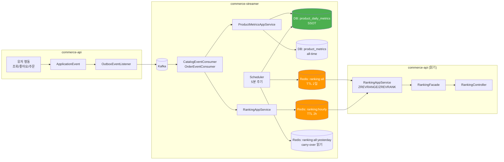
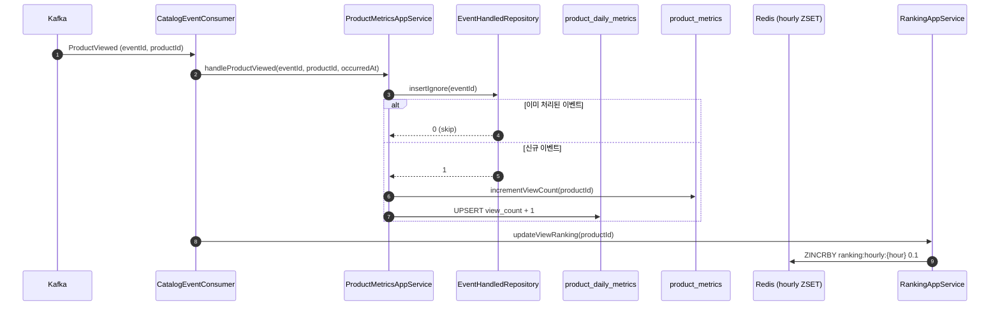
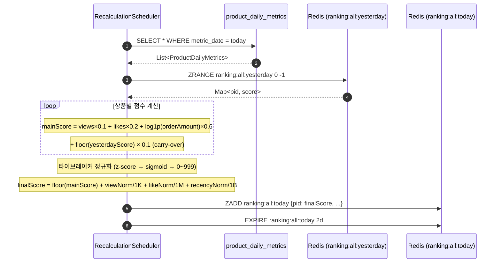
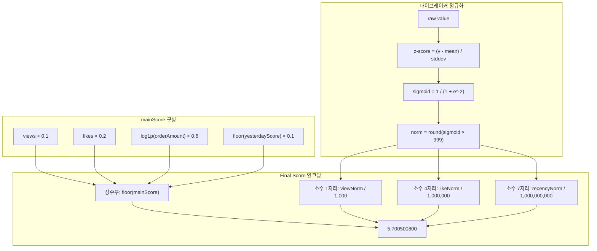

## 📌 Summary

- **배경:** Volume 7에서 구축한 Kafka 이벤트 파이프라인이 유저 행동(조회/좋아요/주문)을 수집하고 있었지만, 이 데이터를 활용한 실시간 랭킹은 없었다. 상품 목록은 정렬 기준 없이 나열되어 인기 상품을 확인할 수 없는 상태였다.
- **목표:** Redis ZSET 기반 실시간 랭킹 시스템을 구축하여, 이벤트 가중치(view 0.1 / like 0.2 / order 0.6) 기반 일간·시간별 랭킹을 제공한다. DB를 SSOT(Single Source of Truth)로 삼아 데이터 안정성과 멱등성을 확보한다.
- **결과:** 일간/시간별 랭킹 조회 API, 상품 상세에 순위 필드 추가, 5분 주기 스케줄러 기반 스코어 재계산, carry-over를 통한 콜드 스타트 완화, 타이브레이커를 통한 동점 해소까지 구현했다. K6 4-Case 부하 테스트로 500 VU까지 p95 < 80ms (읽기), 1000 VU 혼합 부하에서 한계점을 식별했다. ArchUnit 15개 룰 통과.

## 🧭 Context & Decision

### 문제 정의

- **현재 동작/제약:**
  1. Kafka Consumer가 `product_metrics` 테이블에 all-time 누적 메트릭(view_count, like_count, sales_count)을 적재하고 있었다.
  2. 이 데이터는 전체 기간 누적이라 "오늘 인기 상품"을 판단할 수 없었다.
  3. 랭킹 API가 없어 클라이언트는 상품 목록을 정렬 없이 받고 있었다.
- **리스크:**
  - 랭킹 계산을 API 요청 시점에 하면 매번 전체 상품을 스캔해야 함 → O(N) 지연
  - 이벤트가 중복 소비되면 특정 상품의 점수가 부풀려짐 → 랭킹 정합성 위험
  - Redis 유실 시 raw 카운트가 사라지면 랭킹 복구 불가
- **성공 기준:** 이벤트 발행 → 랭킹 점수 반영 → API 조회까지 E2E 흐름이 동작하고, 주문 1건(10000원)이 좋아요 3건보다 높은 순위를 가진다.

---

### ADR-1: 스코어 인코딩 전략 — 정수부(메인) + 소수부(타이브레이커)

> **메인 점수가 같은 상품들 사이에서도 미세한 차등을 두어 순위를 결정해야 한다. ZSET에 하나의 double 값으로 어떻게 인코딩할지 선택한다.**

| 선택지 | 결정 | 이유 |
|--------|------|------|
| A. 메인 점수만 사용 | ❌ | 동점 상품이 많으면 순위가 임의로 결정됨. ZSET은 score 동점 시 member lexicographic 순서를 사용하므로 "101" < "202"처럼 productId 문자열 순서가 되어 의미 없는 결과 |
| B. 메인 점수 + 타임스탬프 소수부 | ❌ | 최신 이벤트가 항상 유리한 편향 발생. 조회수 1만인 상품이 조회수 1인 최신 상품보다 낮아질 수 있음 |
| C. 메인 점수(정수부) + 다차원 타이브레이커(소수부) | ✅ | views/likes/recency 3개 축을 z-score → sigmoid로 정규화하여 0~999 범위로 positional encoding. 각 축이 독립적으로 기여하므로 특정 지표 편향 없음 |

```
최종 score = floor(mainScore) + viewNorm/1,000 + likeNorm/1,000,000 + recencyNorm/1,000,000,000

예시: mainScore=5.53, viewNorm=700, likeNorm=500, recencyNorm=800
     → 5 + 0.700 + 0.000500 + 0.000000800 = 5.700500800
```

소수부 3개 축이 각각 1/1000 자릿수씩 차지하므로 서로 간섭하지 않는다. double의 유효 자릿수 15~16자리 내에서 안전하게 인코딩된다.

---

### ADR-2: 주문 점수 계산 — Log 정규화

> **주문 금액을 가중치에 그대로 반영하면 고가 상품이 압도적으로 유리하다. 금액 차이를 어떻게 완화할지 선택한다.**

| 선택지 | 결정 | 이유 |
|--------|------|------|
| A. 주문 건수 × 가중치 | ❌ | 1,000원 주문 1건 = 100,000원 주문 1건. 금액 정보가 완전히 소실 |
| B. 주문 금액 × 가중치 (linear) | ❌ | 100,000원 상품 1건이 1,000원 상품 100건보다 높음. 가격대별 불균형 심함 |
| C. log1p(주문 금액) × 가중치 | ✅ | 금액이 클수록 증가폭이 줄어들어 가격대 간 균형. log1p(10000)≈9.2, log1p(100000)≈11.5로 10배 차이가 1.25배 차이로 압축 |

```
주문 점수 비교:
  1,000원 1건: log1p(1000) × 0.6 ≈ 4.14
  10,000원 1건: log1p(10000) × 0.6 ≈ 5.53
  100,000원 1건: log1p(100000) × 0.6 ≈ 6.91

좋아요 3건: 3 × 0.2 = 0.6
→ 10,000원 주문 1건(5.53) > 좋아요 3건(0.6) ✓
```

---

### ADR-3: 랭킹 SSOT — DB `product_daily_metrics`

> **랭킹의 원본 데이터(SSOT)를 어디에 둘지 선택한다. Redis에 두면 빠르지만 유실 위험이 있고, DB에 두면 안전하지만 쓰기 지연이 있다.**

| 선택지 | 결정 | 이유 |
|--------|------|------|
| A. Redis Hash (`ranking:raw:{date}`) | ❌ | HINCRBY로 빠른 쓰기. 그러나 멱등성 보장 불가 — Kafka 재소비 시 중복 카운트. Redis 장애 시 당일 데이터 전체 유실, DB에서 복구 불가 |
| B. 기존 `product_metrics` 테이블 재활용 | ❌ | all-time 누적이라 "오늘" 데이터만 추출 불가. 일간 랭킹 계산에 부적합 |
| C. 신규 `product_daily_metrics` 테이블 | ✅ | `(product_id, metric_date)` 복합 유니크. UPSERT(`ON DUPLICATE KEY UPDATE`)로 원자적 증가. 기존 `ProductMetricsAppService`의 `eventHandledRepository.insertIgnore()` 멱등성 가드를 상속 |

```
[AS-IS: Redis SSOT]
  Kafka Consumer → Redis HINCRBY (ranking:raw) → Scheduler reads Redis → ranking:all ZSET
  문제: 멱등성 없음, Redis 유실 = 데이터 소실

[TO-BE: DB SSOT]
  Kafka Consumer → DB UPSERT (product_daily_metrics) + Redis ZINCRBY (hourly)
  Scheduler reads DB → ranking:all ZSET
  이점: eventHandled 멱등성 상속, DB 영속, Redis는 파생/캐시만 담당
```

**트레이드오프:** K6 Case 4 재측정 결과, 쓰기 경로(Kafka Consumer)에서 TPS 169→153(-9%), p95 4.75s→5.94s(+25%)로 DB UPSERT 오버헤드가 확인되었다. 그러나 이는 비동기 파이프라인(Consumer)의 성능이며, 사용자가 체감하는 읽기 경로(랭킹 조회 API)에는 영향이 없다. carry-over 스케줄러가 전일 데이터를 DB에서 읽어야 하므로 영속성이 필수적이었고, Redis 유실 시에도 랭킹 복구가 가능해졌다.

---

### ADR-4: Carry-Over — 전일 점수 계승

> **매일 자정에 랭킹이 0으로 리셋되면 새벽 시간대에 콜드 스타트 문제가 발생한다. 전일 데이터를 어떻게 활용할지 선택한다.**

| 선택지 | 결정 | 이유 |
|--------|------|------|
| A. 리셋 없음 — 전일 점수 전액 계승 | ❌ | 과거 인기 상품이 영원히 상위 고착. 신규 상품이 올라갈 수 없음 |
| B. ZUNIONSTORE로 전일 키 병합 | ❌ | 전일 키 전체를 복사하므로 메모리 2배 사용. 병합 비율 조절이 키 단위로만 가능 |
| C. 스케줄러 내에서 전일 정수부 × 0.1 가산 | ✅ | 전일 인기도의 10%만 당일에 계승. 자연스럽게 감쇠(decay)하면서 콜드 스타트를 완화. 추가 Redis 키 불필요 |

```
예시: 전일 score=10.7 → floor(10.7)=10 → 10 × 0.1 = 1.0 carry-over
오늘 view 1건: 1 × 0.1 = 0.1
당일 mainScore = 0.1 + 1.0 = 1.1 → floor = 1
```

2일 후에는 전일의 carry-over가 다시 10%로 줄어 `10 × 0.1 × 0.1 = 0.1`이 되므로, 지수적 감쇠가 자연스럽게 발생한다.

---

### ADR-5: Hourly 랭킹 — Redis에 유지

> **Daily는 DB SSOT로 옮겼는데, Hourly도 옮길지 선택한다.**

| 선택지 | 결정 | 이유 |
|--------|------|------|
| A. Hourly도 DB SSOT | ❌ | 이벤트마다 DB UPSERT가 2회(daily + hourly)로 늘어남. Hourly는 1시간 단위 슬라이딩이라 DB에 보관해도 금방 만료 |
| B. Hourly는 Redis ZINCRBY 유지 | ✅ | TTL 2시간이라 유실돼도 최대 2시간치 데이터만 소실. 실시간성이 핵심이므로 Redis의 O(1) ZINCRBY가 적합. 유실 시 스케줄러가 5분 내에 daily 기반으로 ranking:all을 재생성 |

---

### ADR-6: Bulk UPSERT — Kafka Batch 단위 집계

> **DB SSOT 마이그레이션 후 `Case 4` TPS가 9% 감소했다. Kafka batch listener가 최대 3,000건을 한 번에 수신하는데, Consumer는 건별로 `@Transactional` 메서드를 호출해 이벤트당 DB 커넥션을 잡았다 놓고 4~5회 쿼리를 실행했다. 배치 단위로 집계해 DB 왕복 횟수를 줄일지 선택한다.**

| 선택지 | 결정 | 이유 |
|--------|------|------|
| A. 건별 `@Transactional` 유지 | ❌ | 3,000건 배치 = 3,000 트랜잭션 = 12,000+ 쿼리. 커넥션 획득/반납 반복 |
| B. 배치 단위 집계 + `ON DUPLICATE KEY UPDATE` | ✅ | 배치 전체를 단일 트랜잭션으로 처리. `(productId, date)` 기준 집계 후 bulk UPSERT. 커넥션 1회, 쿼리 6회로 축소 |

**구현 요점:**
- `ProductMetricsAppService.handleCatalogEventBatch(List<CatalogMetricEvent>)` / `handleOrderEventBatch(List<OrderMetricEvent>)` 추가
- 멱등성: 배치 내 eventId를 `findExistingEventIds`로 선조회해 이미 처리된 것을 필터링 후 bulk `INSERT IGNORE`로 이중 방어
- 음수 방어: daily bulk UPSERT는 2-phase 구조 — (1) `bulkInsertIgnoreSeed`로 zero-row 시딩 → (2) `ON DUPLICATE KEY UPDATE`의 UPDATE 브랜치에서만 `GREATEST(col + VALUES(col), 0)` 적용 (INSERT 브랜치에 음수 델타가 전달되는 경우가 없도록 보장)
- Consumer 구조 변경: 파싱만 담당 → 타입별 이벤트 리스트 → AppService 배치 메서드 1회 호출 → Redis hourly 업데이트는 DB 트랜잭션 밖에서 건별

**측정 결과 (K6 Case 4):**

| 지표 | Redis SSOT | DB SSOT (건별) | DB SSOT (Bulk, clean) |
|------|-----------|----------------|---------------|
| TPS | 169 | 153 | 158.9 / 170.9 (2회) |
| p95 | 4.75s | 5.94s | 5.67s / 5.54s |
| 에러율 | 0.28% | 1.32% | 1.31% / 1.23% |

> Bulk 측정은 warmup 1회 + clean 재측정 2회로 수행했다. Run1 158.9 TPS, Run2 170.9 TPS로 평균 ~165 TPS (baseline 169 대비 -2.4%). 최초 측정(TPS 140)은 이전 CCE 버그 루프로 쌓인 Kafka backlog가 measurement 중 동시 드레인되며 MySQL을 오염시킨 결과임을 확인했다 (streamer 클린 재시작 + lag=0 확인 + warmup-then-measure 절차를 거친 clean run에서는 baseline 노이즈 범위로 복구).

**예상과 실제:** K6 Case 4에서 유의미한 TPS 회복을 기대했으나, clean 측정에서도 baseline과 노이즈 범위(±5%) 내였다. 원인 분석:

1. **Streamer 내부 쿼리 수 감소는 로그로 확인됨** — 배치 내 distinct productId는 2~6개로 aggregation 후 DB 왕복이 ~6회로 줄었다 (로그: `catalog 배치 처리 완료: total=311, fresh=311, products=6`). 건별 대비 ~40배 쿼리 감소.
2. **그러나 K6 Case 4의 병목은 streamer의 UPSERT가 아니었다.** commerce-api의 랭킹 조회 경로(`product_daily_metrics` ← `products` JOIN)와 상품 상세 조회가 주 부하였고, streamer 쪽을 줄여도 commerce-api가 측정하는 읽기 TPS는 개선되지 않았다. Kafka로 분리된 파이프라인이므로 streamer 최적화가 commerce-api에 직접 전파되지 않는 게 설계상 당연한 결과.
3. **뜻밖의 부작용 — Bulk INSERT IGNORE 동시성 deadlock.** 3개 consumer 스레드가 겹치는 product_id 집합에 대해 bulk `INSERT IGNORE INTO product_daily_metrics ... VALUES (...)`를 동시 실행하면 MySQL이 gap lock 경합으로 deadlock을 발생시킨다 (clean run 전체 기간 동안 44건 감지, 11개 배치 전체 실패 → `acknowledge()` 미호출 → Kafka 재전달로 복구). 건별 UPSERT에는 없던 문제.

**결론:** Bulk UPSERT는 commerce-api가 측정하는 K6 Case 4 TPS를 회복시키지 못했다. 설계상 commerce-api와 streamer는 Kafka로 분리돼 있어, streamer의 쿼리 수 ~40배 감소는 (1) backlog 누적 상황의 drain rate, (2) MySQL을 공유하는 POST /like 쓰기 경로에 대한 간접적 contention 완화로만 기여할 수 있다. 진짜 병목은 commerce-api의 랭킹 JOIN 조회로 추정되며, 이는 별도 인덱스 튜닝/캐싱 과제로 분리한다. 동시성 deadlock은 bulk 경로 유지 시 해결해야 할 과제(batch 단위 productId lexicographic sort로 락 획득 순서 고정, 혹은 작은 배치 단위로 분할).

---

## 🏗️ Design Overview

### 변경 범위

- **영향 받는 모듈**: `commerce-api`, `commerce-streamer`
- **신규 추가**:
  - `domain/metrics`: `ProductDailyMetrics` (엔티티), `ProductDailyMetricsRepository` (인터페이스)
  - `infrastructure/metrics`: `ProductDailyMetricsJpaRepository`, `ProductDailyMetricsRepositoryImpl`
  - `infrastructure/ranking`: `RankingScoreRecalculationScheduler` (5분 주기 재계산)
  - `application/ranking`: `RankingAppService` (commerce-api: 조회), `RankingAppService` (streamer: hourly 적재), `RankingFacade`
  - `interfaces/api/ranking`: `RankingController`, `RankingDto`
- **수정**:
  - `ProductMetricsAppService`: daily metrics UPSERT 추가 (idempotency guard 내)
  - `OrderCanceledEvent`: `totalAmount` 필드 추가 (취소 시 daily 차감)
  - `OrderAppService`: 취소 이벤트에 totalAmount 포함
  - `ProductFacade`: 상품 상세에 `rankingAppService.getProductRank()` 추가
  - `AuthenticationFilter`: `/api/v1/rankings` public path 추가
- **제거**:
  - `ranking:raw:{date}` Redis Hash 쓰기 (DB SSOT로 대체)

### 주요 컴포넌트 책임

| 컴포넌트 | 위치 | 책임 |
|---------|------|------|
| `ProductDailyMetrics` | streamer/domain | 일간 메트릭 엔티티 (view/like/orderAmount per product per day) |
| `ProductMetricsAppService` | streamer/application | Kafka 이벤트 → DB 메트릭 적재 (all-time + daily), 멱등성 보장 |
| `RankingAppService` (streamer) | streamer/application | hourly ZINCRBY (실시간 점수 갱신) |
| `RankingScoreRecalculationScheduler` | streamer/infrastructure | DB daily metrics → 가중치 계산 → carry-over → 타이브레이커 → ranking:all ZSET |
| `RankingAppService` (api) | api/application | ZREVRANGE/ZREVRANK로 랭킹 조회 |
| `RankingFacade` | api/application | 랭킹 + 상품 정보 Aggregation |
| `RankingController` | api/interfaces | `/api/v1/rankings`, `/api/v1/rankings/hourly` |

---

## 🔁 Flow Diagram

### 데이터 흐름 아키텍처



### 이벤트 소비 → 메트릭 적재 (쓰기 경로)



### 스케줄러 재계산 (5분 주기)



### 스코어 구조



---

## 🧪 테스트

| 계층 | 파일 | 핵심 검증 |
|------|------|-----------|
| 통합 (streamer) | `RankingAppServiceTest` | hourly ZINCRBY 점수 반영, TTL 설정, 이벤트 누적 합산 |
| 통합 (streamer) | `RankingScoreRecalculationSchedulerTest` | DB → ZSET 재계산, 타이브레이커 순서, carry-over 반영, 빈 데이터 skip, TTL 설정, 주문>좋아요 가중치 검증 |
| E2E (api) | `RankingApiE2ETest` | 일간/시간별 랭킹 조회 API, 상품 상세 rank 필드 |
| K6 Case 1 | 기능 검증 (10~20 VU) | 전체 흐름 정상 동작, checks 100% |
| K6 Case 2 | 정합성 (50 VU) | 이벤트 차등 → 랭킹 순서 반영 |
| K6 Case 3 | 읽기 부하 (500 VU) | p95 < 80ms, 에러율 0%, TPS 1,851 |
| K6 Case 4 | 혼합 부하 (1000 VU) | 한계점 식별 (800+ VU에서 응답 급증) |
| K6 Case 4 (재측정) | DB SSOT 후 혼합 부하 | 쓰기 TPS 153(-9%), 읽기 경로 영향 없음. carry-over 안정성 확보 |
| K6 Case 4 (Bulk, clean) | DB SSOT + Bulk UPSERT (clean 재측정) | TPS 158.9/170.9 (2회, 평균 ~165), p95 5.6s — baseline 노이즈 범위. streamer 쿼리 ~40배 감소에도 commerce-api TPS는 Kafka로 분리돼 있어 직접 영향 없음. Bulk INSERT IGNORE 동시 실행에서 MySQL deadlock 44건 감지 (배치 재전달로 복구) |

**전체 테스트 All Green. ArchUnit 15개 룰 통과.**

---

## 📊 K6 부하 테스트 결과 요약

| Case | VU | p95 응답시간 | TPS | 에러율 |
|------|----|-------------|-----|--------|
| 1. 기능 검증 | 10~20 | 99ms | 36 | 0% |
| 2. 랭킹 정합성 | 50 | 485ms | 54 | 0% |
| 3. 읽기 부하 | 200~500 | 79ms | 1,851 | 0% |
| 4. 혼합 부하 (Redis SSOT) | 500~1000 | 4.75s | 169 | 0.28% |
| 4. 혼합 부하 (DB SSOT, 건별) | 500~1000 | 5.94s | 153 | 1.32% |
| 4. 혼합 부하 (DB SSOT, Bulk, clean run1) | 500~1000 | 5.67s | 158.9 | 1.31% |
| 4. 혼합 부하 (DB SSOT, Bulk, clean run2) | 500~1000 | 5.54s | 170.9 | 1.23% |

**포화 지점:** 약 500~600 VU. 이후 HikariCP 커넥션 풀 경합으로 응답시간 급증.

> Bulk UPSERT는 streamer의 DB 왕복을 ~40배 줄였지만, K6 Case 4의 TPS는 baseline 노이즈 범위(±5%) 내에 머물렀다. 최초 측정의 TPS 140은 이전 버그 수정 직전 쌓인 Kafka backlog가 measurement 중 동시 드레인되며 MySQL을 오염시킨 결과였고, streamer 클린 재시작 + lag=0 확인 + warmup-then-measure 절차를 따른 clean 재측정(2026-04-10)에서는 평균 ~165 TPS로 회복됐다. K6가 측정하는 것은 commerce-api의 혼합 부하 처리량이며, Kafka로 분리된 streamer의 개선은 여기에 직접 전파되지 않는다. 자세한 분석과 Bulk 경로에서 발견된 동시성 deadlock 이슈는 ADR-6 참조.

---

## 📎 의식적 트레이드오프

| # | 선택 | 근거 | 대안 (필요 시) |
|---|------|------|---------------|
| T1 | 스케줄러 5분 주기 → 랭킹 반영에 최대 5분 지연 | Hourly ZINCRBY로 실시간 근사치를 제공하고 있어 사용자 체감 지연은 미미. 주기를 줄이면 DB 읽기 부하 증가 | 이벤트 기반 재계산 또는 주기 단축 |
| T2 | Hourly 키는 Redis에만 존재 (TTL 2h) | 유실 시에도 스케줄러가 5분 내에 DB 기반 `ranking:all`을 재생성하므로 일간 랭킹에 영향 없음 | Hourly도 DB 적재 (현재는 오버엔지니어링) |
| T3 | DB UPSERT로 비동기 쓰기 경로(Consumer) TPS 9% 감소 | 사용자 체감 읽기 경로에 영향 없음. carry-over 스케줄러에 DB 영속성 필수 | Bulk UPSERT 도입 완료 (ADR-6) |
| T4 | Bulk UPSERT 도입 후에도 K6 Case 4 TPS가 회복되지 않음 | K6 Case 4의 병목은 streamer의 UPSERT가 아니라 commerce-api의 랭킹 JOIN 읽기 경로였음을 확인. Streamer 쪽 쿼리 ~40배 감소는 backlog 복구 시간을 단축하므로 유지 | commerce-api 랭킹 조회 JOIN 인덱스/캐싱 튜닝을 후속 과제로 분리 |

---

## 📦 의존성 변경

없음. Redis, Kafka, JPA 모두 기존 모듈에서 사용 중.
