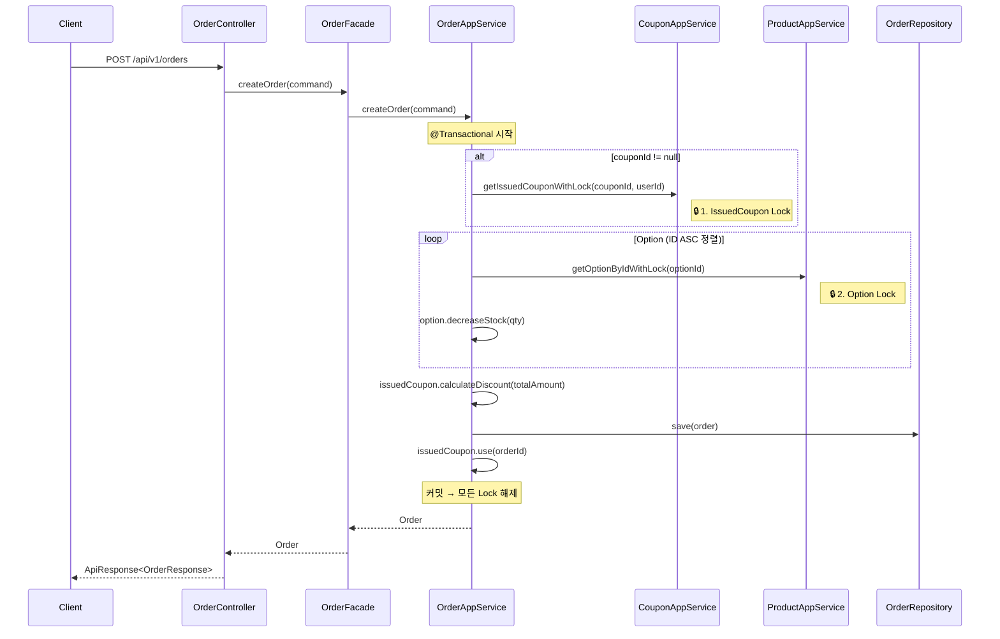
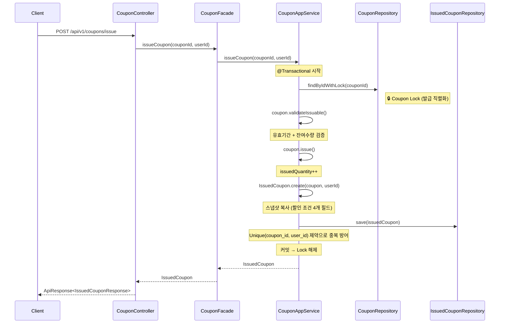

## 📌 Summary
### 배경
Volume-3까지 구축된 도메인은 "단일 사용자가 순차적으로 요청한다"는 암묵적 가정 위에서만 정합성이 보장되었습니다. 재고 차감, 좋아요 카운트처럼 **경합(Contention)이 발생하는 지점**에서 Lost Update가 언제든 발생할 수 있는 상태였고, 쿠폰 도메인 자체가 부재했습니다.

### 목표
1. 쿠폰 도메인(Coupon · IssuedCoupon) 설계 및 주문 플로우 통합
2. 쓰기 경합 지점별 최적의 동시성 제어 전략 적용 (비관적 락 / 원자적 쿼리)
3. 불필요한 쿼리·save() 호출 제거 등 성능 최적화
4. Facade → AppService 계층 책임 재분배로 아키텍처 정합성 확보
5. 동시성 시나리오 6건을 포함한 전체 374 tests All Green

### 결과
- 비관적 락 4개 리소스, `@Modifying` 원자적 쿼리 1개 리소스 적용
- 데드락 방지를 위한 **고정 잠금 순서(Lock Ordering)** 확립
- IssuedCoupon **스냅샷 아키텍처**로 쿠폰-주문 간 느슨한 결합 달성
- Facade는 순수 오케스트레이션만 담당, 트랜잭션·Repository 호출은 AppService로 일원화

---

## 🧭 Context & Decision

### 의사결정 1 — 주문·재고·쿠폰: 왜 비관적 락인가?

**후보군 비교**

| 전략 | 장점 | 단점 | 판단 |
|------|------|------|------|
| Optimistic Lock (`@Version`) | 락 대기 없이 높은 처리량 | 충돌 시 재시도 로직 필요, 충돌률 높으면 재시도 폭발 | ❌ |
| **Pessimistic Write Lock** | 충돌 시점에 즉시 직렬화, 재시도 불필요 | 락 대기로 인한 처리량 감소 | ✅ 채택 |
| Distributed Lock (Redis) | DB 독립적, 높은 확장성 | 인프라 복잡도 증가, 단일 DB 환경에서 과잉 설계 | ❌ |

**채택 근거**: 현재 단일 MySQL 인스턴스 환경에서, 재고 차감·쿠폰 사용은 모두 **DB 행 단위 경합**입니다. `SELECT ... FOR UPDATE`는 InnoDB의 Row-Level Lock을 직접 활용하므로 추가 인프라 없이 가장 확실한 정합성을 보장합니다.
주문 생성 시 IssuedCoupon → Option(N건)을 하나의 트랜잭션에서 잠가야 하므로, 낙관적 락의 "실패 후 전체 재시도" 비용이 비관적 락의 대기 비용보다 훨씬 큽니다.

**데드락 방지 — Lock Ordering Protocol**

모든 트랜잭션에서 아래 순서를 **절대 불변 규칙**으로 적용합니다:

```
1. Order         (cancelOrder 진입 시에만)
2. IssuedCoupon  (쿠폰 사용/복원, 있는 경우만)
3. Option        (재고 차감/복원, ID 오름차순 정렬)
```

N개의 Option을 잠글 때 **ID 오름차순(ASC) 정렬** 후 순차 획득하여, 서로 다른 트랜잭션이 역순으로 잠금을 시도하는 교차 대기(Circular Wait)를 원천 차단합니다.

**비관적 락 적용 리소스**

| 대상 | 사유 | JpaRepository 메서드 |
|------|------|---------------------|
| Option 재고 | 동시 주문 Lost Update 방지 | `findByIdWithLock()` |
| Coupon 발급 수량 | 동시 발급 초과 방지 | `findByIdWithLock()` |
| IssuedCoupon 상태 | 동일 쿠폰 이중 사용 방지 | `findByCouponIdAndUserIdWithLock()` |
| Order 상태 | 동시 취소 방지 | `findByIdWithLock()` |

### 의사결정 2 — 좋아요 카운트: 왜 비관적 락 대신 @Modifying 원자적 쿼리인가?

좋아요는 위의 주문·재고와 성격이 다릅니다:

| 비교 항목 | 주문·재고 | 좋아요 |
|-----------|----------|--------|
| 경합 강도 | 중간 (특정 상품에 집중) | **높음** (인기 상품에 수백 건 동시) |
| 연쇄 작업 | 쿠폰 사용 → 재고 차감 | **단일 연산** (카운트 ±1) |
| 실패 시 영향 | 주문 전체 롤백 | 단순 카운트 오차 |
| 트랜잭션 범위 | 넓음 (여러 엔티티 잠금) | 좁음 (Product 1건) |

좋아요는 "엔티티를 로드한 뒤 변경 → flush"하는 비관적 락 패턴이 과합니다. `UPDATE Product SET likeCount = likeCount + 1 WHERE id = ?` 형태의 **원자적 SQL 한 줄**이면 DB 레벨에서 동시성이 보장되며, 엔티티 로딩 비용도 없고, 락 대기 시간도 행 수준 쓰기 락의 최소 구간으로 제한됩니다.

```java
// ProductJpaRepository — 원자적 UPDATE
@Modifying(clearAutomatically = true, flushAutomatically = true)
@Query("UPDATE Product p SET p.likeCount = p.likeCount + 1 WHERE p.id = :id AND p.deleted = false")
int increaseLikeCount(@Param("id") Long id);

@Modifying(clearAutomatically = true, flushAutomatically = true)
@Query("UPDATE Product p SET p.likeCount = CASE WHEN p.likeCount > 0 THEN p.likeCount - 1 ELSE 0 END WHERE p.id = :id AND p.deleted = false")
int decreaseLikeCount(@Param("id") Long id);
```

`decreaseLikeCount`는 `CASE WHEN`으로 음수 방지를 SQL 레벨에서 처리합니다.

### 의사결정 3 — IssuedCoupon 스냅샷 아키텍처

**문제**: Coupon(쿠폰 템플릿)의 할인율·최소주문금액은 관리자가 언제든 수정할 수 있습니다. 주문 시점에 Coupon을 직접 참조하면, **발급 당시와 사용 당시의 할인 조건이 달라지는** 정합성 문제가 발생합니다.

**해결**: `IssuedCoupon.create(Coupon, userId)` 시점에 4개 필드를 스냅샷합니다:

```java
discountType       // FIXED | RATE
discountValue      // 할인 금액 또는 할인율
minOrderAmount     // 최소 주문 금액
maxDiscountAmount  // 최대 할인 금액 (RATE 전용)
```

이로써 IssuedCoupon은 발급 이후 Coupon 테이블을 참조하지 않고도 자체적으로 `calculateDiscount()`, `validateUsable()`을 수행할 수 있습니다. 주문 시점의 할인 계산은 항상 **발급 당시 조건**을 기준으로 동작하며, Coupon ↔ IssuedCoupon 간 결합도가 최소화됩니다.

### 의사결정 4 — Facade → AppService 계층 책임 재분배

**문제**: OrderFacade·CouponFacade가 Repository를 직접 호출하고 `@Transactional`을 보유하여, AppService와 Facade의 역할 경계가 모호했습니다.

**해결**: 비즈니스 로직(트랜잭션 경계, Repository 호출, 도메인 메서드 실행)을 AppService로 일원화하고, Facade는 여러 AppService를 조합하는 순수 오케스트레이션 레이어로 정리했습니다.

| 계층 | Before | After |
|------|--------|-------|
| Facade | `@Transactional` + Repository 직접 호출 | AppService에 단순 위임 |
| AppService | `save()` 등 단순 호출만 | 트랜잭션 경계 + Repository 호출 + 비즈니스 로직 |

---

## 🏗️ Design Overview

### 변경 범위

| 분류 | 신규 | 수정 |
|------|------|------|
| Domain (Entity, VO, Repository) | 6 | 5 |
| Application (AppService, Facade) | 4 | 5 |
| Infrastructure (JpaRepository, Impl) | 4 | 6 |
| Interface (Controller, Dto) | 4 | 2 |
| Test | 5 | 7 |
| HTTP 테스트 | 2 | 0 |
| **합계** | **25** | **25** |

### 신규 도메인

**Coupon (쿠폰 템플릿)** — 핵심 자산, `extends BaseEntity`
- `create()`, `issue()`, `calculateDiscount()`, `validateUsable()`, `validateIssuable()`
- FIXED(정액) / RATE(정률) 분기 할인 계산, `maxDiscountAmount` 상한 적용

**IssuedCoupon (발급된 쿠폰)** — 임시·매핑, 직접 `@Id`
- `create(Coupon, userId)` → 스냅샷 생성
- `use(orderId)` → AVAILABLE → USED 상태 전이
- `restore()` → USED → AVAILABLE (주문 취소 시)
- Unique 제약: `(coupon_id, user_id)` — 인당 1장 발급 제한

### 주요 최적화

| 항목 | Before | After |
|------|--------|-------|
| 좋아요 카운트 | `LEFT JOIN` + `COUNT` 쿼리 | `@Modifying UPDATE SET likeCount ± 1` 원자적 쿼리 |
| 영속 엔티티 저장 | `repository.save()` 명시 호출 | dirty checking 활용, 불필요한 `save()` 제거 |
| 주문 목록 조회 | `@EntityGraph` → 카테시안 곱 위험 | EntityGraph 제거 + `default_batch_fetch_size: 100` |
| 주문 상태 전이 | 락 없이 상태 변경 | `findByIdWithLock()` 비관적 락 적용 |
| 계층 책임 | Facade가 Repository 직접 호출 | AppService로 일원화, Facade는 순수 위임 |

---

## 🔁 Flow Diagram

### 주문 생성 플로우 (쿠폰 적용)



### 쿠폰 발급 플로우



---

## 🧪 테스트 현황

**전체 374 tests — All Green**

| 분류 | 주요 내용 |
|------|----------|
| 단위 (Domain) | Entity/VO 비즈니스 규칙, 상태 전이, 예외 케이스 |
| 통합 (Application) | AppService + Facade 트랜잭션, DB 연동 검증 |
| E2E (Interface) | 실제 HTTP 요청/응답, ApiResponse 본문 검증 |
| **동시성** | **6개 시나리오**, startLatch 패턴 + 30초 타임아웃 |

### 동시성 테스트 시나리오 (`ConcurrencyTest.java`)

| # | 시나리오 | 설정 | 검증 |
|---|---------|------|------|
| 1 | 동일 상품 재고 동시 차감 | 재고 10, 10스레드 × 1개 | 10건 성공, 재고 0 |
| 2 | 쿠폰 동시 발급 | 수량 5, 20스레드 | 5건 성공, 15건 실패 |
| 3 | 동일 쿠폰 동시 사용 | 1장, 10스레드 | 1건만 성공 |
| 4 | 동일 상품 동시 좋아요 | 10유저, 10스레드 | likeCount 정확히 10 |
| 5 | 동일 주문 동시 취소 | 2스레드 | 1건만 성공, 재고 복원 |
| 6 | 부분 재고 동시 차감 | 재고 5, 10스레드 | 5건 성공, 5건 실패 |
