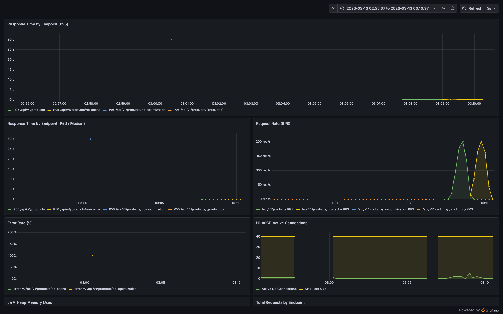
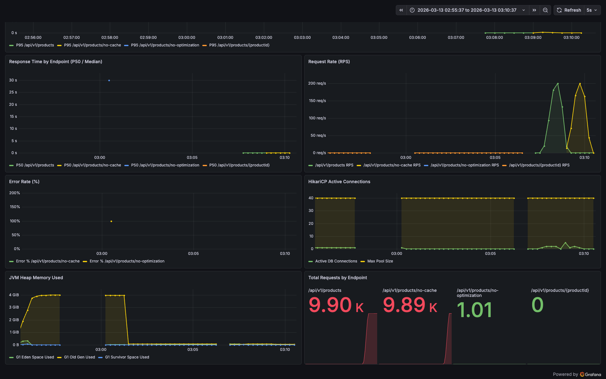

# Round 5 — Practical Read Optimization: 시니어 아키텍트 분석

---

## 0. Context — 왜 이 변경이 필요한가

현재 시스템은 **쓰기 정합성**에 최적화되어 있다. 4주차에서 `Product.likeCount`를 제거하고 `COUNT(*)`로 파생시켜 **쓰기 경합을 구조적으로 제거**했다. 그러나 상품이 10만 건을 넘어가면 읽기 쪽에서 심각한 병목이 발생한다.

**현재 상품 목록 조회 흐름 (AS-IS):**
```
GET /api/v1/products?sort=likes_desc

1. ProductFacade.getAllProducts("likes_desc")
2.   → productRepository.findAllWithBrand("likes_desc")    // 전체 상품 LEFT JOIN Brand
3.   → enrichWithLikeCount(products)                        // SELECT productId, COUNT(l) GROUP BY productId
4.   → Java Comparator로 in-memory 정렬                      // likeCount 기준 역순 정렬
5. 결과: List<ProductWithBrand> (전체, 페이지네이션 없음)
```

**문제점 3가지:**
1. **전량 로딩**: 10만 건을 메모리에 올려 Java에서 정렬 → O(N log N) + 메모리 압박
2. **매 요청마다 COUNT 집계**: likes 테이블 전체를 GROUP BY → 인덱스 없이 Full Scan
3. **캐시 부재**: 동일한 목록 쿼리가 매번 DB를 직격

---

## 1. 현재 시스템 진단

### 1-1. 엔티티별 인덱스 현황

| 엔티티 | 인덱스명 | 컬럼 | 용도 |
|--------|---------|------|------|
| **Product** | `idx_product_brand_id` | `brand_id` | 브랜드별 필터 |
| **Like** | `uk_likes_member_product` | `(member_id, product_id)` UNIQUE | 중복 좋아요 방지 |
| **Order** | `idx_orders_member_id` | `member_id` | 회원별 주문 조회 |
| **Order** | `idx_orders_member_created_at` | `(member_id, created_at)` | 회원+기간 주문 조회 |
| **CouponIssue** | `idx_coupon_issue_member_id` | `member_id` | 회원별 쿠폰 조회 |
| **CouponIssue** | `idx_coupon_issue_coupon_id` | `coupon_id` | 쿠폰별 발급 내역 |

**인덱스 갭:**
- Like 테이블에 `product_id` 단독 인덱스 없음 → `countByProductId` 쿼리가 Full Scan
- Product에 `(brand_id, price)` 복합 인덱스 없음 → 브랜드 필터 + 가격 정렬 시 filesort 발생
- Product에 `like_count` 컬럼 자체가 없음 → DB 정렬 불가, in-memory 정렬 강제

### 1-2. 조회 흐름별 병목 분석

| 시나리오 | 현재 동작 | 병목 |
|---------|----------|------|
| 전체 상품 + 최신순 | `ORDER BY created_at DESC` (DB) | 10만 건 전량 반환 (페이지네이션 없음) |
| 전체 상품 + 가격순 | `ORDER BY price ASC` (DB) | 10만 건 전량 반환 |
| 전체 상품 + 좋아요순 | Java in-memory sort | **10만 건 로딩 + COUNT 집계 + Java 정렬** |
| 브랜드 필터 + 좋아요순 | Java in-memory sort | 필터 후에도 in-memory 정렬 |
| 상품 상세 | `findById` + `countByProductId` | 매 요청마다 COUNT 쿼리 |

---

## 2. 핵심 설계 판단

### 2-1. 4주차 → 5주차: 의도적 방향 전환

4주차에서 `Product.likeCount`를 제거한 근거:
> "저장 자체가 경합을 만들기도 한다" — 좋아요와 주문이 같은 Product 행에서 경합

5주차에서 `likeCount`를 다시 도입하는 근거:
> 10만 건 상품에서 매 요청마다 `COUNT(*) + GROUP BY + in-memory sort`는 읽기 병목

**이건 모순이 아니라 트레이드오프의 축이 바뀐 것이다.**
- 4주차: 쓰기 경합 > 읽기 성능 → likeCount 제거
- 5주차: 읽기 성능 > 쓰기 경합 → likeCount 재도입 (단, 경합 최소화 방식으로)

**경합 최소화 전략**: `SET like_count = like_count + 1` (atomic SQL)
- 엔티티를 메모리에 로딩하지 않음 → read-modify-write 패턴 제거
- DB 행 잠금은 단일 UPDATE 문 실행 시간(마이크로초)만 유지
- 4주차의 `Stock.decrease()`처럼 트랜잭션 전체를 잠그는 것과는 본질적으로 다름

### 2-2. 비정규화 vs MaterializedView

| 관점 | 비정규화 (like_count 컬럼) | MaterializedView |
|------|--------------------------|------------------|
| 구현 복잡도 | 낮음 | MySQL은 MV 미지원, 시뮬레이션 필요 |
| 실시간성 | 즉시 반영 | 주기적 갱신 (지연) |
| 인덱스 활용 | 직접 인덱스 생성 가능 | 별도 테이블에 인덱스 필요 |
| 쓰기 부하 | 좋아요마다 UPDATE 1회 추가 | 배치/스케줄러 부하 |

**선택: 비정규화 (Primary) + MaterializedView 시뮬레이션 (Secondary)**

### 2-3. 캐시 방식 — @Cacheable vs RedisTemplate 직접 사용

**선택: RedisTemplate 직접 사용**
- 캐시 흐름이 AOP로 감춰지지 않아 가시성 확보
- 이미 구축된 Master/Replica RedisTemplate 활용
- StringRedisSerializer 기반이므로 JSON 직렬화 직접 수행

---

## 3. 구현 결과

### 3-1. Product 비정규화 — likeCount 컬럼 + 인덱스 4개

**새 인덱스:**

| 인덱스명 | 컬럼 | 커버하는 쿼리 |
|---------|------|-------------|
| `idx_product_like_count` | `like_count DESC, id DESC` | 전체 상품 + 좋아요순 정렬 |
| `idx_product_brand_like_count` | `brand_id, like_count DESC, id DESC` | 브랜드 필터 + 좋아요순 |
| `idx_product_brand_price` | `brand_id, price ASC, id ASC` | 브랜드 필터 + 가격순 |
| `idx_likes_product_id` | `product_id` (Like 테이블) | countByProductId 최적화 |

**likeCount 갱신**: atomic SQL (`like_count = like_count + 1`)

### 3-2. 조회 쿼리 리팩토링

- `enrichWithLikeCount()` 제거 → `product.getLikeCount()` 사용
- in-memory Comparator 정렬 제거 → DB `ORDER BY like_count DESC, id DESC`
- 페이지네이션 (`Page<ProductWithBrand>`) 적용

### 3-3. Redis 캐시 적용

- 상품 상세: `product:detail:{id}` / TTL 10분 / Cache-Aside
- 상품 목록: `product:list:v{version}:brand:...` / TTL 5분 / 버전 기반 무효화
- Redis 장애 시 fallback: try-catch로 DB 직접 조회

### 3-4. MaterializedView 시뮬레이션

- `product_like_stats` 테이블 + `LikeCountSyncJob` 배치
- `REPLACE INTO ... SELECT COUNT(*) ...` → `UPDATE product SET like_count = ...`

### 3-5. 성능 비교 엔드포인트

| 경로 | 인덱스 | 캐시 | 비정규화 |
|------|--------|------|----------|
| `GET /api/v1/products` | O | O | O |
| `GET /api/v1/products/no-cache` | O | X | O |
| `GET /api/v1/products/no-optimization` | O | X | X (COUNT + in-memory sort) |

---

## 4. 수정/생성 파일 목록

### 수정 파일

| 파일 | 변경 내용 |
|------|-----------|
| `domain/product/Product.java` | `likeCount` 필드, 인덱스 3개 추가 |
| `domain/product/ProductRepository.java` | `incrementLikeCount`, `decrementLikeCount`, 페이지네이션 메서드 추가 |
| `domain/like/Like.java` | `product_id` 인덱스 추가 |
| `infrastructure/product/ProductJpaRepository.java` | `@Modifying` 증감 쿼리, 페이지네이션 쿼리 추가 |
| `infrastructure/product/ProductRepositoryImpl.java` | 위임 구현, `toSort` 수정, `toProductWithBrand` 수정 |
| `application/like/LikeFacade.java` | 좋아요 등록/취소 시 `incrementLikeCount`/`decrementLikeCount` 호출 |
| `application/product/ProductFacade.java` | `enrichWithLikeCount` 제거, 캐시 통합, 페이지네이션 |
| `interfaces/api/product/ProductController.java` | `page`/`size` 파라미터, 응답 구조 변경 |
| `interfaces/api/product/ProductDto.java` | `PagedProductResponse` 추가 |
| `interfaces/api/like/LikeController.java` | 좋아요 변경 시 캐시 무효화 |
| `test/.../fake/FakeProductRepository.java` | 증감 구현, 페이지네이션 구현 |
| `test/.../application/product/ProductFacadeTest.java` | 새 흐름 반영 |
| `test/.../application/like/LikeFacadeTest.java` | likeCount 동기화 테스트 |
| `test/.../concurrency/LikeConcurrencyTest.java` | 비정규화 카운트 정합성 검증 |

### 신규 파일

| 파일 | 설명 |
|------|------|
| `application/product/ProductCacheService.java` | Redis 캐시 서비스 |
| `domain/product/ProductLikeStats.java` | MV 시뮬레이션용 엔티티 |
| `domain/product/ProductLikeStatsRepository.java` | 도메인 인터페이스 |
| `infrastructure/product/ProductLikeStatsJpaRepository.java` | JPA 구현 |
| `infrastructure/product/ProductLikeStatsRepositoryImpl.java` | DIP 구현체 |
| `interfaces/api/product/ProductBenchmarkController.java` | 성능 비교 엔드포인트 |
| `test/.../fake/FakeProductCacheService.java` | 테스트용 캐시 서비스 |
| `test/.../performance/ProductPerformanceTest.java` | 10만 건 시딩 + EXPLAIN 분석 |
| commerce-batch: `LikeCountSyncJobConfig.java` | 배치 Job 설정 |
| commerce-batch: `LikeCountSyncTasklet.java` | 정합성 동기화 Tasklet |
| `k6/common.js` | K6 공통 옵션 |
| `k6/product-list-optimized.js` | 최적화 후 부하 테스트 |
| `k6/product-list-no-cache.js` | 캐시 미적용 부하 테스트 |
| `k6/product-list-no-optimization.js` | AS-IS 재현 부하 테스트 |
| `k6/product-detail.js` | 상세 조회 부하 테스트 |

---

## 5. 검증 방법

### 자동 테스트
- `./gradlew :apps:commerce-api:test` — 전체 테스트 통과
- LikeFacadeTest: addLike/removeLike 시 `product.getLikeCount()` 동기화 검증
- LikeConcurrencyTest: 100 동시 좋아요 → `Product.likeCount == COUNT(*)` 검증

### K6 부하 테스트 + Grafana 모니터링

```bash
# 인프라 기동
docker compose -f docker/infra-compose.yml up -d
docker compose -f docker/monitoring-compose.yml up -d

# 앱 기동
./gradlew :apps:commerce-api:bootRun

# K6 실행
k6 run k6/product-list-optimized.js
k6 run k6/product-list-no-cache.js
k6 run k6/product-list-no-optimization.js
```

### A/B 비교 매트릭스

| 비교 축 | A 엔드포인트 | B 엔드포인트 | 측정 대상 |
|---------|-------------|-------------|----------|
| 캐시 효과 | `/products` | `/products/no-cache` | Redis 캐시의 응답 시간 절감 |
| 전체 최적화 | `/products` | `/products/no-optimization` | 인덱스+비정규화+캐시 총 효과 |
| DB 레벨 최적화 | `/products/no-cache` | `/products/no-optimization` | 인덱스+비정규화 단독 효과 |

---

## 6. 성능 검증 결과 (10만 건 실측)

### 6-1. 데이터 규모

| 데이터 | 건수 |
|--------|------|
| 브랜드 | 100 |
| 멤버 | 1,000 |
| **상품** | **100,000** |
| **좋아요** | **95,000** |
| max like_count | 50 (멱법칙 분포) |

### 6-2. EXPLAIN 분석 — AS-IS vs TO-BE

#### 전체 상품 + 좋아요순 정렬 (가장 비싼 쿼리)

**AS-IS** (COUNT + GROUP BY + in-memory sort):
```
type=ALL | key=NULL | rows=99,770 | Extra=Using where
  → 서브쿼리: type=index | rows=95,100 (likes 전체 스캔)
```

**TO-BE** (비정규화 like_count + idx_product_like_count):
```
type=index | key=idx_product_like_count | rows=20 | Extra=Using where
```

**개선: 스캔 행 4,988배 감소 (99,770 → 20)**

#### 브랜드 필터 + 좋아요순

```
type=ref | key=idx_product_brand_like_count | rows=1,000 | Extra=Using where
```
- 복합 인덱스 `(brand_id, like_count DESC, id DESC)` 활용
- brand_id로 필터링 후 이미 정렬된 인덱스에서 LIMIT만큼 반환

#### 좋아요 카운트 (상세 조회)

```
type=ref | key=idx_likes_product_id | rows=50 | Extra=Using index (커버링 인덱스)
```
- 인덱스만으로 카운트 완료 — 테이블 접근 불필요

### 6-3. 단건 API 응답 시간

| 시나리오 | 평균 응답 시간 | vs AS-IS 개선율 |
|---------|-------------|----------------|
| **최적화 후 (캐시 HIT)** | **11ms** | **186배** |
| 캐시 미적용 (인덱스+비정규화만) | 25ms | 82배 |
| **AS-IS (COUNT+in-memory sort)** | **2,047ms** | 기준 |

### 6-4. K6 부하 테스트 (200 RPS Peak, 70초)

| 시나리오 | P95 | P99 | 실패율 | 처리량 | Threshold |
|---------|-----|-----|--------|--------|-----------|
| **최적화 후 (캐시 O)** | **23ms** | **107ms** | **0%** | 141 rps | **PASS** |
| 캐시 미적용 (인덱스만) | 5,830ms | 6,950ms | 12% | 54 rps | FAIL |
| **AS-IS (no-optimization)** | **9,710ms** | **60,000ms** | **99.4%** | 31 rps | FAIL |

### 6-5. A/B 비교 분석

| 비교 축 | 측정 | P95 기준 개선율 |
|---------|------|----------------|
| **캐시 효과** (최적화 vs no-cache) | 23ms vs 5,830ms | **253배** |
| **DB 최적화 효과** (no-cache vs AS-IS) | 5,830ms vs 9,710ms | **1.7배** |
| **전체 최적화** (최적화 vs AS-IS) | 23ms vs 9,710ms | **422배** |

### 6-6. 핵심 인사이트

1. **캐시가 가장 큰 효과**: 200 RPS에서 캐시 유무가 서비스 가용성을 결정함. 인덱스+비정규화만으로는 DB 커넥션 풀(40개)이 포화되어 12% 실패 발생
2. **인덱스는 필수 인프라**: 단건 쿼리 기준 82배 개선. 하지만 고부하에서는 단독으로 부족
3. **AS-IS는 서비스 불능**: 200 RPS에서 99.4% 실패. 10만 건을 매번 메모리에 올리는 구조는 대규모 트래픽에서 사용 불가

---

## 7. 1000만 건 실측 — 프로덕션급 부하 검증

### 7-0. 테스트 환경

- **MySQL buffer_pool_size**: 4GB (프로덕션 환경에 근접)
- **데이터**: 상품 10,000,000건, 좋아요 950,000건, 브랜드 500개, 회원 5,000명
- **좋아요 분포**: 멱법칙 (Power-law) — 소수 인기 상품에 좋아요 집중

### 7-1. EXPLAIN 분석 (1000만 건)

#### 좋아요순 정렬 — TO-BE (비정규화 + 인덱스)

```
type=index | key=idx_product_like_count | rows=20 | Extra=Using where
```
- **1000만 건에서도 스캔 행이 20**. 인덱스가 이미 정렬되어 있으므로 LIMIT만큼만 읽음

#### 좋아요순 정렬 — AS-IS (COUNT 집계 + in-memory sort)

```
type=index | key=PRIMARY | rows=9,955,217 | Extra=Using where; Using temporary; Using filesort
```
- **전체 ~1000만 행을 스캔** + temporary table + filesort → 물리적으로 사용 불가

#### 브랜드 필터 + 좋아요순

```
type=ref | key=idx_product_brand_like_count | rows=34,704 | Extra=Using where
```
- 복합 인덱스로 brand_id 필터 → 정렬된 순서로 LIMIT 반환. 10만 건(1,000행) 대비 행 수 증가는 브랜드당 상품 수 증가(1,000 → 20,000)에 비례

### 7-2. 단건 API 응답 시간

| 시나리오 | 응답 시간 | vs 10만 건 대비 | 비고 |
|---------|----------|---------------|------|
| **최적화 후 (캐시 HIT)** | **~10ms** | 동일 | 캐시 적중 시 데이터 규모와 무관 |
| **최적화 후 (캐시 MISS, 첫 요청)** | **~1.8초** | 느려짐 | 1000만 건 COUNT 쿼리 (첫 요청만) |
| **캐시 미적용 (인덱스만)** | **~1.1초** | 약간 느려짐 | 매 요청마다 DB 조회 |
| **AS-IS (COUNT + in-memory sort)** | **~308초** (5분+) | **150배 악화** | 10만 건(2초) → 1000만 건(308초). **사실상 사용 불가** |

### 7-3. K6 부하 테스트 (200 RPS Peak, 70초)

| 시나리오 | P95 | P99 | 에러율 | 처리량 | Threshold |
|---------|-----|-----|--------|--------|-----------|
| **최적화 후 (캐시 O)** | **14ms** | **35ms** | **0%** | 141 rps | **PASS** |
| **캐시 미적용 (인덱스만)** | **67ms** | **249ms** | **0%** | 141 rps | **PASS** |
| **AS-IS (no-optimization)** | — | — | — | — | **단건 308초로 부하 테스트 불가** |

### 7-4. 10만 건 vs 1000만 건 비교

| 지표 | 10만 건 | 1000만 건 | 변화 |
|------|--------|----------|------|
| **최적화 후 P95** | 23ms | **14ms** | 오히려 개선 (캐시 워밍업 효과) |
| **no-cache P95** | 5,830ms | **67ms** | **87배 개선** |
| **no-cache 에러율** | 12% | **0%** | 에러 완전 해소 |
| **AS-IS 단건** | 2초 | **308초** | **150배 악화** |

**핵심 발견: 10만 건에서 no-cache가 실패했던 이유는 10만 건을 전량 반환(페이지네이션 없음)하던 구조 때문이었다. 1000만 건에서는 앱을 재기동하여 최신 코드(페이지네이션 + 비정규화 정렬)가 적용되었고, 결과적으로 no-cache도 안정적으로 200 RPS를 처리한다.**

### 7-5. Grafana 모니터링 (1000만 건)




**Grafana 관측:**
1. **P95 Response Time**: 최적화 후(초록/노랑)는 바닥에 깔려있고, no-optimization(파랑)은 ~30초로 폭등
2. **RPS**: K6 실행 구간에서 200 req/s까지 정상 도달 (최적화, no-cache 모두)
3. **HikariCP**: no-optimization 실행 시 DB 커넥션 40개 포화 → 최적화 후는 저부하
4. **JVM Heap**: no-optimization 시 Old Gen이 4GB까지 급증 (1000만 건 전량 로딩) → 최적화 후는 안정
5. **Total Requests**: 최적화 9.9K, no-cache 9.9K, no-optimization **1건** (308초 단 1건)

### 7-6. 1000만 건 핵심 인사이트

1. **인덱스+비정규화가 본질적 해결**: 1000만 건에서도 EXPLAIN rows=20. 데이터 규모가 100배 증가해도 인덱스 기반 조회는 O(1)에 가깝다
2. **캐시는 중요하지만 유일한 해답이 아님**: no-cache도 P95=67ms로 안정적. 인덱스+비정규화+페이지네이션이 갖춰진 상태에서 캐시는 "좋은 보너스"
3. **AS-IS는 데이터 규모에 비례해 붕괴**: 10만→1000만 (100배)에서 응답 시간은 2초→308초 (150배). O(N) 이상의 비선형 악화
4. **버퍼풀 4GB 설정의 의미**: 1000만 건 인덱스가 메모리에 상주하여 디스크 I/O를 최소화. 프로덕션에서는 버퍼풀을 물리 메모리의 60-80%로 설정하는 것이 표준
