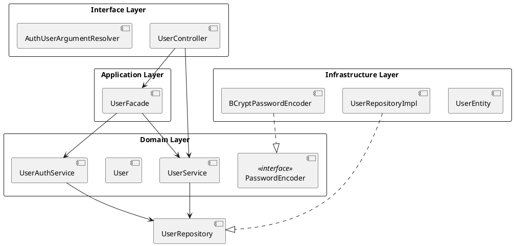
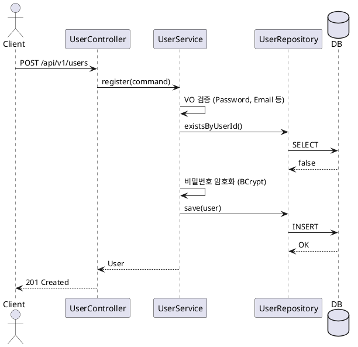
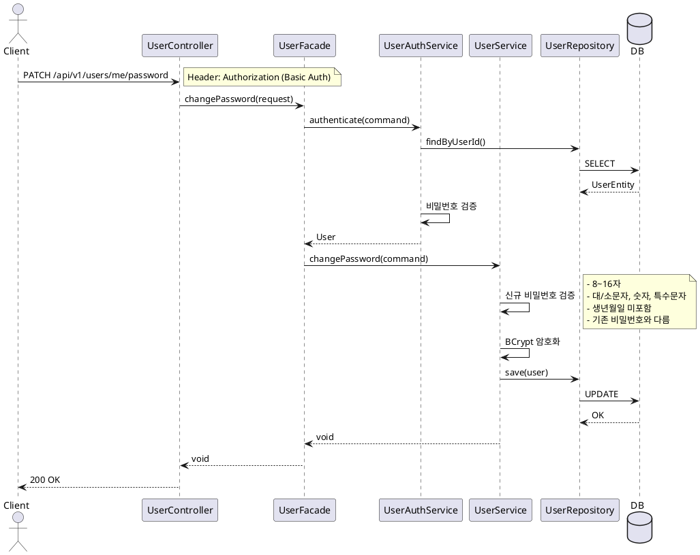
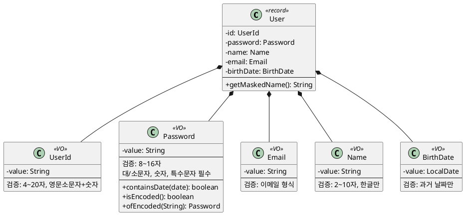
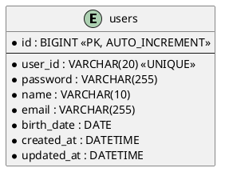

# User 도메인 구현 문서

## 개요

사용자 회원가입, 인증, 비밀번호 변경 기능을 구현했습니다.
Layered Architecture + DDD 기반으로 설계했습니다.

---

## API 명세

| Method | Endpoint | 설명 |
|--------|----------|------|
| POST | /api/v1/users | 회원가입 |
| GET | /api/v1/users/me | 내 정보 조회 |
| PATCH | /api/v1/users/me/password | 비밀번호 변경 |

---

## 아키텍처



---

## 시퀀스 다이어그램

### 1. 회원가입



### 2. 비밀번호 변경



---

## 도메인 모델



---

## ERD



---

## 비밀번호 정책

| 규칙 | 조건 |
|------|------|
| 길이 | 8~16자 |
| 대문자 | 1개 이상 필수 |
| 소문자 | 1개 이상 필수 |
| 숫자 | 1개 이상 필수 |
| 특수문자 | 1개 이상 필수 |
| 생년월일 | 포함 불가 (yyMMdd, MMdd, ddMM) |
| 변경 시 | 기존 비밀번호와 동일 불가 |

---

## 패키지 구조

```
com.loopers
├── application/user
│   ├── UserFacade.java
│   ├── UserFacadeDto.java
│   └── command/
│       ├── AuthenticateCommand.java
│       ├── ChangePasswordCommand.java
│       └── RegisterCommand.java
├── domain/user
│   ├── User.java
│   ├── UserService.java
│   ├── UserAuthService.java
│   ├── UserRepository.java
│   ├── PasswordEncoder.java
│   ├── vo/
│   │   ├── UserId.java
│   │   ├── Password.java
│   │   ├── Email.java
│   │   ├── Name.java
│   │   └── BirthDate.java
│   └── exception/
│       └── UserValidationException.java
├── infrastructure/user
│   ├── UserEntity.java
│   ├── UserJpaRepository.java
│   └── UserRepositoryImpl.java
└── interfaces/api/user
    ├── UserController.java
    ├── UserApiSpec.java
    └── UserDto.java
```

---

## 설계 포인트

1. **Value Object 분리**: Password, Email 등 검증 로직을 VO에 캡슐화
2. **도메인 서비스 분리**: UserService(CUD), UserAuthService(인증) 책임 분리
3. **Facade 패턴**: 비밀번호 변경 시 인증 + 변경을 조합
4. **Infrastructure 분리**: JPA Entity와 Domain 모델 분리 (toDomain/from 변환)
