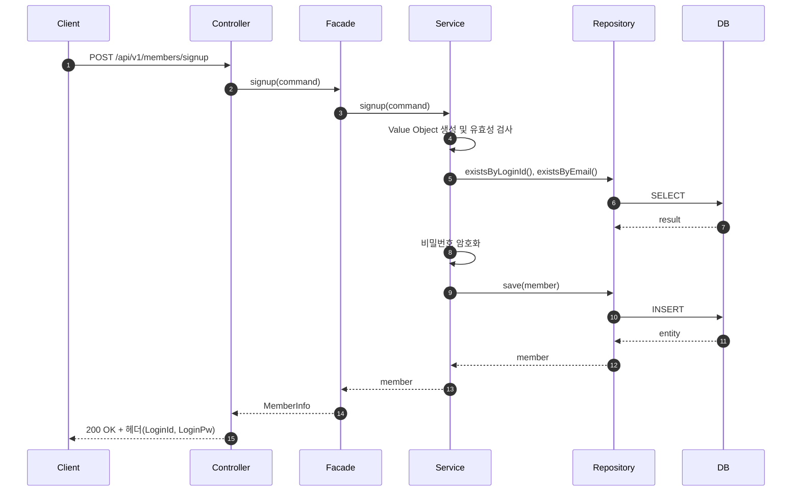
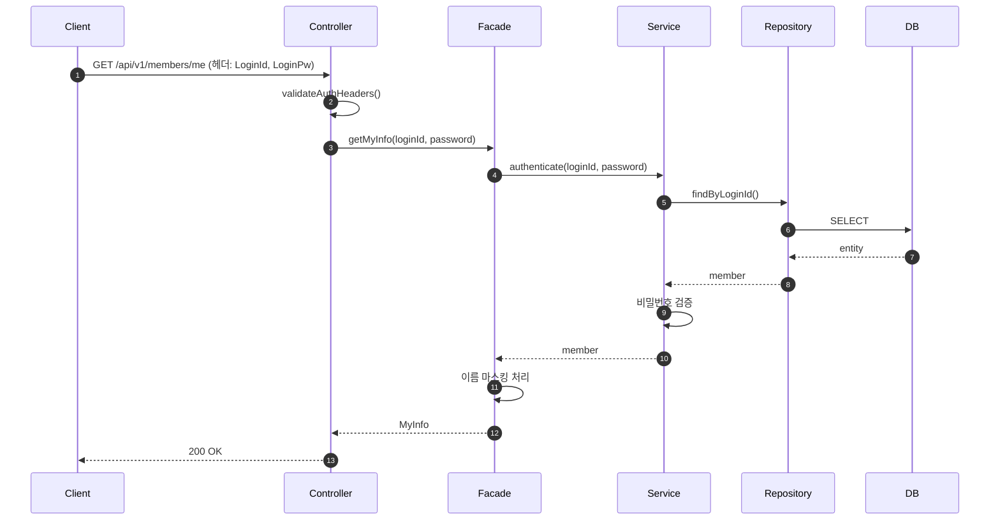
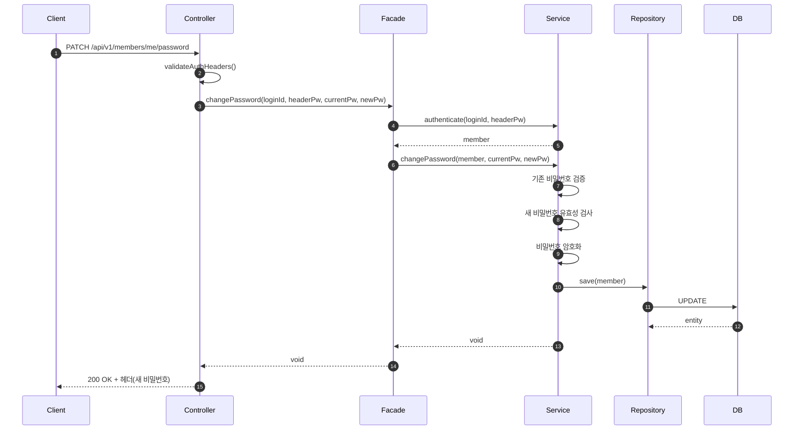

# 1주차 요구사항
- 1.회원가입
- 2.가입된 정보 조회
- 3.비밀번호 변경

#### 프로젝트의 기본 설계와 규칙은 CLAUDE.md를 참고.
#### 모든 요구사항은 단위 테스트 / 통합 테스트 / E2E 테스트를 거쳐야 함.

---

### 1.회원가입 API (POST /api/v1/members/signup)
#### - 필요한 데이터 : 로그인 아이디,비밀번호,이름,생년월일,이메일
#### - 각 필드별 유효성 검사는 아래 내용에 따르며 정규식 적용이 필요함.
#### - 회원가입 후 유저 정보는 아래 헤더에 저장됨.
#### - 회원가입 후 로그인 처리.
* X-Loopers-LoginId : 로그인 ID
* X-Loopers-LoginPw : 비밀번호

### *유효성 검사 규칙
#### - 모든 데이터는 공백 제거 필요.
| 필드 | 규칙 | 정규식 |
|------|------|--------|
| loginId | 영문/숫자, 4~20자, 유니크 | `^[a-zA-Z0-9]{4,20}$` |
| password | 영문대소문자/숫자/특수문자, 8~16자, 생년월일 포함 불가, BCrypt 암호화 | `^[a-zA-Z0-9!@#$%^&*()_+\-=\[\]{};':"\\|,.<>\/?]{8,16}$` |
| name | 한글만, 2~10자 | `^[가-힣]{2,10}$` |
| email | 이메일 형식, 유니크 | `^[a-zA-Z0-9._%+-]+@[a-zA-Z0-9.-]+\.[a-zA-Z]{2,}$` |
| birthDate | 8자리 숫자 (YYYYMMDD), 유효한 날짜, 미래 날짜 불가 | `^[0-9]{8}$` |

---

### 2.내 정보 조회 API (GET /api/v1/members/me)
#### - 현재 로그인 한 나의 정보를 조회 함.
#### - 반환 정보 : 로그인 아이디, 이름, 생년월일, 이메일
#### - 이름의 경우 마지막 글자를 마스킹해서 반환. 마스킹은 *로 표기.

### *인증 방식
#### - 요청 헤더에 아래 정보를 포함하여 인증
* X-Loopers-LoginId : 로그인 ID
* X-Loopers-LoginPw : 비밀번호 (평문)

### *에러 케이스
| 상황 | HTTP Status | 설명 |
|------|-------------|------|
| 인증 헤더 누락 | 401 Unauthorized | 로그인 정보 없음 |
| 로그인 ID/PW 불일치 | 401 Unauthorized | 인증 실패 |
| 회원 미존재 | 401 Unauthorized | 탈퇴/미가입 회원 |

---

### 3.비밀번호 변경 API (PATCH /api/v1/members/me/password)
#### - 필요한 데이터 : 기존 비밀번호, 새 비밀번호
#### - 새 비밀번호 유효성: 영문대소문자/숫자/특수문자, 8~16자, 생년월일 포함 불가, BCrypt 암호화
#### - 현재 비밀번호와 동일한 비밀번호는 사용할 수 없음.
#### - 비밀번호 변경 후, 응답 헤더에 새 비밀번호 반환.

### *인증 방식
#### - 요청 헤더에 아래 정보를 포함하여 인증
* X-Loopers-LoginId : 로그인 ID
* X-Loopers-LoginPw : 비밀번호 (평문)

### *검증 규칙
| 검증 | 설명 |
|------|------|
| 기존 비밀번호 일치 | 요청 본문의 기존 비밀번호가 DB의 암호화된 비밀번호와 일치해야 함 |
| 새 비밀번호 유효성 | 회원가입 비밀번호 규칙과 동일 |
| 현재 비밀번호와 다름 | 새 비밀번호가 현재 비밀번호와 달라야 함 |

### *에러 케이스
| 상황 | HTTP Status | 설명 |
|------|-------------|------|
| 인증 실패 | 401 Unauthorized | 헤더 인증 실패 |
| 기존 비밀번호 불일치 | 400 Bad Request | 요청 본문의 기존 비밀번호 불일치 |
| 새 비밀번호 유효성 실패 | 400 Bad Request | 형식/규칙 위반 |
| 현재 비밀번호와 동일 | 400 Bad Request | 변경 불가 |


---
###  기능 구현
**회원가입**

- **필요 정보 : { 로그인 ID, 비밀번호, 이름, 생년월일, 이메일 }**
- 이미 가입된 로그인 ID 로는 가입이 불가능함
- 각 정보는 포맷에 맞는 검증 필요 (이름, 이메일, 생년월일)
- 비밀번호는 암호화해 저장하며, 아래와 같은 규칙을 따름

    ```markdown
    1. 8~16자의 영문 대소문자, 숫자, 특수문자만 가능합니다.
    2. 생년월일은 비밀번호 내에 포함될 수 없습니다.
    ```


 이후, 유저 정보가 필요한 모든 요청은 아래 헤더를 통해 요청
* **`X-Loopers-LoginId`** : 로그인 ID
* **`X-Loopers-LoginPw`** : 비밀번호


**내 정보 조회**
- **반환 정보 : { 로그인 ID, 이름, 생년월일, 이메일 }**
- 로그인 ID 는 영문과 숫자만 허용
- 이름은 마지막 글자를 마스킹해 반환

> 마스킹 문자는 `*` 로 통일
>

**비밀번호 수정**

- **필요 정보 : { 기존 비밀번호, 새 비밀번호 }**
- 비밀 번호 RULE 을 따르되, 현재 비밀번호는 사용할 수 없습니다.

> **비밀번호 RULE**
* 영문 대/소문자, 숫자, 특수문자 사용 가능
* 생년월일 사용 불가
>

---

## 버그 수정 이력

### MemberService.changePassword() - Detached Entity 저장 누락

**문제 상황**
- 비밀번호 변경 API 호출 시 변경된 비밀번호가 DB에 반영되지 않음
- E2E 테스트 및 통합 테스트 실패

**원인**
- `MemberFacade.changePassword()`에서 `authenticate()`로 조회한 Member가 트랜잭션 종료 후 **detached 상태**가 됨
- `MemberService.changePassword()`는 별도 트랜잭션으로 실행되며, 전달받은 detached Member를 수정
- JPA dirty checking은 managed entity에만 작동하므로 변경사항이 DB에 반영되지 않음

**수정 내용**
```java
// MemberService.java - changePassword() 메서드
member.changePassword(encodedNewPassword);
memberRepository.save(member);  // 추가: detached entity 명시적 저장
```

**영향 범위**
- 비밀번호 변경 기능 정상 동작
- 관련 테스트 모두 통과 (170개)

---

## 테스트 커버리지 개선

### MemberFacadeTest - 예외 케이스 테스트 추가

**개선 배경**
- 테스트 커버리지 분석 결과, Application Layer(Facade)의 예외 케이스 테스트가 부족
- 성공 케이스만 테스트되어 있고, Service에서 예외 발생 시 전파 검증이 누락됨

**추가된 테스트**

| 메서드 | 추가된 테스트 | 검증 내용 |
|--------|-------------|----------|
| `signup()` | `throwsException_whenDuplicateLoginId()` | 중복 ID 예외(CONFLICT) 전파 |
| `signup()` | `throwsException_whenDuplicateEmail()` | 중복 이메일 예외(CONFLICT) 전파 |
| `getMyInfo()` | `throwsException_whenLoginIdNotFound()` | 미존재 ID 예외(UNAUTHORIZED) 전파 |
| `getMyInfo()` | `throwsException_whenPasswordMismatch()` | 비밀번호 불일치 예외(UNAUTHORIZED) 전파 |
| `changePassword()` | `throwsException_whenAuthenticationFails()` | 인증 실패 예외 전파 + `changePassword()` 미호출 검증 |
| `changePassword()` | `throwsException_whenCurrentPasswordMismatch()` | 현재 비밀번호 불일치 예외(UNAUTHORIZED) 전파 |
| `changePassword()` | `throwsException_whenNewPasswordInvalid()` | 새 비밀번호 유효성 실패 예외(BAD_REQUEST) 전파 |

**테스트 수 변화**
- 기존: 7개 → 현재: 13개 (+6개)
- signup(): 2 → 4개
- getMyInfo(): 2 → 4개
- changePassword(): 2 → 5개 (인증 실패 시 후속 호출 차단 검증 포함)

---

## 아키텍처 개선: Domain/Persistence 분리

### 배경
기존 `Member` 클래스가 도메인 로직과 JPA 영속성 관심사를 모두 담당하여, 클린 아키텍처 원칙에 위배되었습니다.

### 변경 내용

#### 새로 생성된 파일
| 파일 | 위치 | 역할 |
|------|------|------|
| `MemberEntity.java` | infrastructure/member | JPA 영속성 전용 엔티티 |

#### 수정된 파일
| 파일 | 변경 내용 |
|------|----------|
| `Member.java` | JPA 어노테이션 제거, 순수 도메인 모델로 변경 |
| `MemberJpaRepository.java` | `Member` → `MemberEntity` 사용 |
| `MemberRepositoryImpl.java` | Domain ↔ Entity 변환 로직 추가 |
| `MemberServiceIntegrationTest.java` | `toMember()` 호출 추가 |
| `MemberV1ApiE2ETest.java` | `MemberEntity.create()` 사용으로 변경 |

### 아키텍처 개선점
```
Before: Member (도메인 + JPA 혼합)
After:  Member (순수 도메인) ←→ MemberEntity (영속성 전용)
```

- **도메인 레이어**: 인프라 의존성 제거, 순수 비즈니스 로직만 포함
- **인프라 레이어**: JPA 세부 구현 캡슐화, Entity ↔ Domain 변환 담당
- **테스트**: 모든 테스트 (단위/통합/E2E) 정상 동작 확인

---

## PR 내용

## 📌 Summary

- 배경: Week1 과제로 회원 관련 기능(회원가입, 내 정보 조회, 비밀번호 변경) 구현이 필요함
- 목표: TDD 방식으로 회원 도메인 기능 구현 및 클린 아키텍처 적용
- 결과: 3개 API 구현 완료, 단위/통합/E2E 테스트 170개 통과, Domain-Persistence 분리 완료


## 🧭 Context & Decision

### 문제 정의
- 현재 동작/제약: 회원 관련 기능이 전혀 없는 상태
- 문제(또는 리스크): 회원 인증/인가 없이는 서비스 이용 불가
- 성공 기준(완료 정의):
  - 회원가입/내 정보 조회/비밀번호 변경 API 정상 동작
  - 모든 유효성 검사 및 예외 처리 구현
  - 테스트 피라미드에 따른 테스트 작성

### 선택지와 결정
- 고려한 대안:
    - A: Member 클래스에 JPA 어노테이션 직접 적용 (도메인 + 영속성 혼합)
    - B: Member(도메인)와 MemberEntity(영속성) 분리
- 최종 결정: B안 - Domain/Persistence 분리
- 트레이드오프: 변환 로직 추가로 코드량 증가 vs 도메인 순수성 확보, 테스트 용이성 향상
- 추후 개선 여지: 인증 방식을 헤더 기반에서 JWT 토큰 기반으로 전환 가능


## 🏗️ Design Overview

### 변경 범위
- 영향 받는 모듈/도메인: `commerce-api`
- 신규 추가:
  - Domain: `Member`, `MemberService`, `MemberRepository`, Value Objects (`LoginId`, `Password`, `MemberName`, `Email`, `BirthDate`)
  - Application: `MemberFacade`, `MemberInfo`, `MyInfo`, `SignupCommand`
  - Infrastructure: `MemberEntity`, `MemberJpaRepository`, `MemberRepositoryImpl`
  - Interfaces: `MemberV1Controller`, `MemberV1Dto`
  - Config: `PasswordEncoderConfig`
- 제거/대체: 없음

### 주요 컴포넌트 책임
- `MemberV1Controller`: HTTP 요청/응답 처리, 헤더 인증 검증, 응답 헤더 설정
- `MemberFacade`: 유스케이스 조합, Domain ↔ DTO 변환, 트랜잭션 경계 조정
- `MemberService`: 비즈니스 로직 (회원가입, 인증, 비밀번호 변경)
- `MemberRepository`: 도메인 레이어의 Repository 인터페이스 (DIP)
- `MemberRepositoryImpl`: JPA 구현체, Entity ↔ Domain 변환
- `Value Objects`: 유효성 검사 및 불변 값 보장


## 🔁 Flow Diagram

### Main Flow - 회원가입


### Main Flow - 내 정보 조회


### Main Flow - 비밀번호 변경

