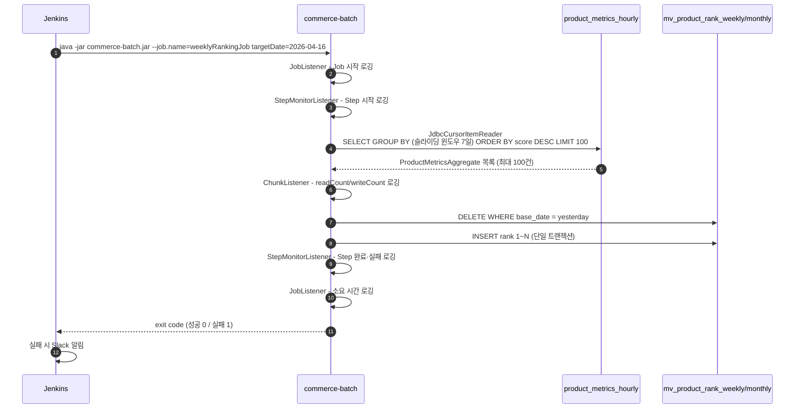
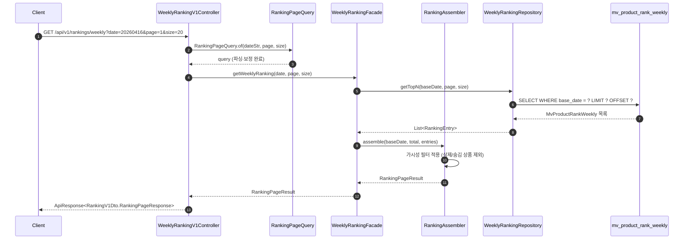

## Summary

- **배경**: 일간 랭킹은 Redis ZSET으로 실시간 처리 중이었는데, 주간·월간 랭킹은 미구현 상태였습니다. 요청마다 수백만 건을 전체 스캔 + GROUP BY로 집계하면 사용자가 늘수록 DB 부하도 그대로 비례해서 커집니다.
- **목표**: Spring Batch를 써서 주간·월간 랭킹을 새벽에 한 번 미리 계산해두고, 그 결과를 별도 MV 테이블에 저장합니다. 조회할 때는 날짜 기준으로 미리 저장된 결과를 바로 꺼내기만 하면 돼서 집계 쿼리가 전혀 실행되지 않습니다.
- **결과**: `commerce-batch`에 주간·월간 랭킹 배치 Job을 구현하고, `commerce-api`에 `/api/v1/rankings/weekly`, `/api/v1/rankings/monthly` 엔드포인트를 추가했습니다. 59건 신규 테스트 ALL PASS.

## Context & Decision

### 문제 정의

- **현재 상태**: 일간 랭킹은 Redis ZSET 기반으로 실시간 제공 중. 주간·월간은 미구현.
- **문제**: 요청마다 `product_metrics_hourly` 테이블을 전체 스캔해서 GROUP BY로 집계하면, 월간 기준으로 상품 1개당 시간 단위 row가 720개씩 쌓여 있어 상품 수 × 720 row를 매 요청마다 계산해야 합니다. 트래픽이 늘수록 DB 부하가 그대로 비례해서 증가합니다.
- **성공 기준**: 배치가 랭킹을 미리 계산해서 저장해두고, 조회 시에는 날짜 기준 단순 SELECT만 실행되면 됩니다.

---

### 선택지와 결정

#### 선택 1. 배치 처리 구조

Spring Batch에서 데이터를 처리하는 방법은 크게 두 가지입니다.

- A: **Tasklet** — 처리 로직을 자유롭게 짤 수 있지만, 재시작·실패 복구·처리 건수 추적을 전부 직접 구현해야 합니다.
- B: **Chunk** — Reader / Processor / Writer로 역할을 나누고 N건씩 묶어서 처리합니다. 재시작·건수 추적은 프레임워크가 자동으로 해줍니다.

**결정: B — Chunk**

Chunk는 "1건씩 읽고 1건씩 가공한다"는 구조인데, 여기서 읽어야 할 데이터는 여러 시간 단위 row를 GROUP BY로 합친 집계값입니다. 구조가 어색해 보였지만, SQL에서 GROUP BY를 미리 처리하면 Reader 입장에서는 product_id 1개 = 집계 결과 1행으로 받아볼 수 있어서 Chunk 구조와 자연스럽게 맞아떨어졌습니다.

#### 선택 2. 데이터를 읽는 방식 (ItemReader)

- A: **JdbcPagingItemReader** — 페이지 단위로 쿼리를 새로 날립니다. 실패해도 마지막 페이지부터 재시작할 수 있지만, GROUP BY 쿼리에 페이지 정렬 기준 컬럼을 따로 지정해야 해서 쿼리가 복잡해집니다.
- B: **JdbcCursorItemReader** — DB 커넥션 하나를 열어두고 결과를 한 줄씩 순서대로 읽어옵니다. Step이 끝날 때까지 커넥션을 계속 잡고 있다는 단점이 있지만, 쿼리가 단순합니다.

**결정: B — JdbcCursorItemReader**

읽어야 할 데이터가 TOP 100건뿐이고, 하루 1회 새벽에 실행하는 배치라 실행 시간이 짧습니다. 커넥션을 오래 잡고 있을 위험이 낮고, PagingItemReader의 복잡한 정렬 키 설정을 감수할 이유가 없다고 봤습니다.

#### 선택 3. 기간 집계 기준

"이번 주 랭킹"을 어떻게 정의할지가 핵심이었습니다.

- A: **고정 기간 (ISO 주차/역월)** — "2026년 16주차" 같이 고정된 기간으로 집계합니다. 과거 특정 주 랭킹을 다시 볼 수 있지만, 주나 월이 바뀌는 시점에만 데이터가 갱신됩니다.
- B: **슬라이딩 윈도우** — 기준일 기준으로 직전 7일(또는 30일)을 매일 다시 집계합니다. 윈도우가 매일 하루씩 앞으로 밀리기 때문에, 어떤 요일에 들어와도 항상 최근 데이터 기반의 랭킹을 볼 수 있습니다.

**결정: B — 슬라이딩 윈도우 (어제 기준 직전 7일/30일)**

배치는 새벽에 실행되는데, 오늘 날짜 기준으로 집계하면 당일 0시부터 배치 실행 시각까지만 쌓인 불완전한 데이터가 포함됩니다. 기준일을 하루 전(targetDate - 1)으로 잡으면 전날까지 완전히 쌓인 데이터만 쓰니까 항상 안정적인 랭킹이 나옵니다.

#### 선택 4. 집계 결과를 저장하는 방식

배치가 새 랭킹을 계산했을 때 기존 데이터를 어떻게 교체할지 결정해야 했습니다.

- A: **UPSERT (INSERT ON DUPLICATE KEY UPDATE)** — 같은 PK가 있으면 덮어쓰고, 없으면 새로 추가합니다. SQL 한 번으로 처리되지만, 재실행 시 이전 데이터가 남을 수 있습니다.
- B: **DELETE + INSERT** — 해당 날짜 데이터를 먼저 지우고 새로 넣습니다. 구현이 단순하고, 재실행해도 항상 깨끗한 상태에서 시작합니다.

**결정: B — DELETE + INSERT**

UPSERT의 문제는 재실행 시 이전 레코드가 남는다는 점입니다. 예를 들어 1차 실행 중 실패해서 상품 A가 절반만 저장된 상태에서 2차 실행을 하면, 상품 A가 이번 TOP 100 밖으로 밀렸을 때 1차 레코드가 그대로 남습니다. 재실행을 안전하게 하려면 어차피 DELETE를 앞에 붙여야 하는데, 그러면 DELETE + INSERT와 구조가 같아져서 UPSERT를 쓸 이유가 없어집니다.

#### 선택 5. API 엔드포인트 구조

- A: 기존 엔드포인트에 `?period=weekly` 파라미터 추가 — 변경 범위가 작지만, 하나의 메서드 안에서 daily/weekly/monthly를 분기 처리해야 합니다.
- B: 별도 엔드포인트 (`/rankings/weekly`, `/rankings/monthly`) — 각 엔드포인트가 하나의 역할만 가집니다.

**결정: B — 별도 엔드포인트**

daily는 Redis, weekly/monthly는 집계 결과 테이블로 데이터 소스가 완전히 다릅니다. A 방식이면 period 값에 따라 내부 분기가 생기고, 나중에 기간별로 다른 요구사항이 붙을 때마다 복잡도가 계속 쌓입니다. 데이터 성격이 다르면 URL로 구분하는 게 맞다고 봤습니다.

#### 선택 6. 스케줄링 방식

**결정: 외부 스케줄링 (Jenkins / K8s CronJob)**

`@Scheduled`를 쓰면 서버가 여러 대 떠 있을 때 같은 Job이 동시에 실행될 수 있습니다. 배치 앱은 독립 실행 단위로 두고 스케줄 제어는 외부에 맡겼습니다. `--job.name` 파라미터로 실행할 Job을 지정하고, `@ConditionalOnProperty`로 해당 Job에 필요한 Bean만 로드되도록 해서 Job 간 간섭을 차단했습니다.

## Design Overview

### 변경 범위

- **영향 받는 모듈**: `commerce-batch` (신규 Job), `commerce-api` (Ranking API 확장)
- **신규 추가**:
    - `commerce-batch`: `WeeklyRankingJobConfig`, `MonthlyRankingJobConfig`, `WeeklyRankingItemWriter`, `MonthlyRankingItemWriter`, `JobListener`, `StepMonitorListener`, `ChunkListener`, `domain.ranking` 패키지 (`MvProductRankRepository`, `MvProductRankRow`, `ProductMetricsAggregate`), `JdbcMvProductRankRepository`
    - `commerce-api`: `WeeklyRankingFacade`, `MonthlyRankingFacade`, `RankingAssembler`, `RankingPageResult`, `RankingPageQuery`, `WeeklyRankingV1Controller`, `MonthlyRankingV1Controller`, `WeeklyRankingRepository`, `MonthlyRankingRepository`, `MvProductRankWeekly`, `MvProductRankMonthly` 및 JPA 구현체
- **수정**: 기존 `RankingFacade`와 `RankingV1Controller`도 `RankingAssembler`·`RankingPageQuery`를 쓰도록 변경. `RankingFacadeTest`는 Mock 대상이 바뀐 부분 반영.

### 주요 컴포넌트 역할

#### commerce-batch

- [`WeeklyRankingJobConfig`](https://github.com/jsj1215/loop-pack-be-l2-vol3-java/blob/jsj1215/volume-10/apps/commerce-batch/src/main/java/com/loopers/batch/job/weekly/WeeklyRankingJobConfig.java) / [`MonthlyRankingJobConfig`](https://github.com/jsj1215/loop-pack-be-l2-vol3-java/blob/jsj1215/volume-10/apps/commerce-batch/src/main/java/com/loopers/batch/job/monthly/MonthlyRankingJobConfig.java): Job·Step·Reader를 정의합니다. SQL 집계, 슬라이딩 윈도우 날짜 계산, `TOP_N` 상수로 SQL `LIMIT`과 chunk size를 같은 값으로 묶어 관리합니다.
- [`WeeklyRankingItemWriter`](https://github.com/jsj1215/loop-pack-be-l2-vol3-java/blob/jsj1215/volume-10/apps/commerce-batch/src/main/java/com/loopers/batch/job/weekly/step/WeeklyRankingItemWriter.java) / [`MonthlyRankingItemWriter`](https://github.com/jsj1215/loop-pack-be-l2-vol3-java/blob/jsj1215/volume-10/apps/commerce-batch/src/main/java/com/loopers/batch/job/monthly/step/MonthlyRankingItemWriter.java): Chunk로 받은 데이터에 순서대로 1위부터 rank를 붙이고, DELETE + INSERT로 집계 결과 테이블을 교체합니다.
- [`JobListener`](https://github.com/jsj1215/loop-pack-be-l2-vol3-java/blob/jsj1215/volume-10/apps/commerce-batch/src/main/java/com/loopers/batch/listener/JobListener.java) / [`StepMonitorListener`](https://github.com/jsj1215/loop-pack-be-l2-vol3-java/blob/jsj1215/volume-10/apps/commerce-batch/src/main/java/com/loopers/batch/listener/StepMonitorListener.java) / [`ChunkListener`](https://github.com/jsj1215/loop-pack-be-l2-vol3-java/blob/jsj1215/volume-10/apps/commerce-batch/src/main/java/com/loopers/batch/listener/ChunkListener.java): 실행 시작·종료 시각, 처리 건수, 실패 원인을 로그로 남깁니다. Step이 실패하면 Slack 같은 외부 채널로 알림을 보낼 수 있는 자리입니다.
- [`JdbcMvProductRankRepository`](https://github.com/jsj1215/loop-pack-be-l2-vol3-java/blob/jsj1215/volume-10/apps/commerce-batch/src/main/java/com/loopers/infrastructure/ranking/JdbcMvProductRankRepository.java): DELETE + INSERT를 `@Transactional`로 원자적으로 처리합니다. Batch 트랜잭션 안에서는 합류(`REQUIRED`), 외부 호출 시 자체 트랜잭션 생성.

#### commerce-api

- [`WeeklyRankingFacade`](https://github.com/jsj1215/loop-pack-be-l2-vol3-java/blob/jsj1215/volume-10/apps/commerce-api/src/main/java/com/loopers/application/ranking/WeeklyRankingFacade.java) / [`MonthlyRankingFacade`](https://github.com/jsj1215/loop-pack-be-l2-vol3-java/blob/jsj1215/volume-10/apps/commerce-api/src/main/java/com/loopers/application/ranking/MonthlyRankingFacade.java): MV 테이블 조회 후 상품 가시성 필터링과 결과 조립을 `RankingAssembler`에 위임합니다. `date=null`이면 KST 기준 어제 날짜를 기본값으로 사용합니다.
- [`RankingAssembler`](https://github.com/jsj1215/loop-pack-be-l2-vol3-java/blob/jsj1215/volume-10/apps/commerce-api/src/main/java/com/loopers/application/ranking/RankingAssembler.java): DB에서 꺼낸 랭킹 목록에서 삭제·숨김 상품을 걸러내고, 페이지 결과 객체로 만들어 반환합니다. 일간·주간·월간 Facade가 모두 공통으로 씁니다.
- [`RankingPageResult`](https://github.com/jsj1215/loop-pack-be-l2-vol3-java/blob/jsj1215/volume-10/apps/commerce-api/src/main/java/com/loopers/application/ranking/RankingPageResult.java): `effectiveDate + total + items`를 Facade가 하나로 묶어 반환하는 VO. Controller가 Facade 내부 메서드를 직접 호출하는 구조를 제거합니다.
- [`RankingPageQuery`](https://github.com/jsj1215/loop-pack-be-l2-vol3-java/blob/jsj1215/volume-10/apps/commerce-api/src/main/java/com/loopers/interfaces/api/ranking/RankingPageQuery.java): 날짜 문자열 파싱, 페이지·사이즈 범위 보정 같은 공통 파라미터 처리를 한 곳에 모아뒀습니다. 세 Controller가 공유합니다.
- [`WeeklyRankingV1Controller`](https://github.com/jsj1215/loop-pack-be-l2-vol3-java/blob/jsj1215/volume-10/apps/commerce-api/src/main/java/com/loopers/interfaces/api/ranking/WeeklyRankingV1Controller.java) / [`MonthlyRankingV1Controller`](https://github.com/jsj1215/loop-pack-be-l2-vol3-java/blob/jsj1215/volume-10/apps/commerce-api/src/main/java/com/loopers/interfaces/api/ranking/MonthlyRankingV1Controller.java): 각각 `/api/v1/rankings/weekly`, `/api/v1/rankings/monthly` 엔드포인트를 담당합니다.

## 구현 기능

#### 1. WeeklyRankingJobConfig / MonthlyRankingJobConfig — Chunk 기반 집계 Job

> [`WeeklyRankingJobConfig.java`](https://github.com/jsj1215/loop-pack-be-l2-vol3-java/blob/jsj1215/volume-10/apps/commerce-batch/src/main/java/com/loopers/batch/job/weekly/WeeklyRankingJobConfig.java) | [`MonthlyRankingJobConfig.java`](https://github.com/jsj1215/loop-pack-be-l2-vol3-java/blob/jsj1215/volume-10/apps/commerce-batch/src/main/java/com/loopers/batch/job/monthly/MonthlyRankingJobConfig.java)

`JdbcCursorItemReader`로 `product_metrics_hourly`에서 슬라이딩 윈도우 기간의 데이터를 SQL GROUP BY로 집계해 읽습니다. `LN(1 + SUM(view_count)) * ? + LN(1 + SUM(like_count)) * ? + LN(1 + SUM(order_amount)) * ?` 공식으로 score를 계산해 일간 랭킹과 동일한 가중치 체계를 유지합니다. `TOP_N = 100` 상수로 SQL `LIMIT`과 chunk size를 묶어 단일 Chunk 전제를 코드로 명시합니다.

---

#### 2. WeeklyRankingItemWriter / MonthlyRankingItemWriter — rank 부여 + MV 교체

> [`WeeklyRankingItemWriter.java`](https://github.com/jsj1215/loop-pack-be-l2-vol3-java/blob/jsj1215/volume-10/apps/commerce-batch/src/main/java/com/loopers/batch/job/weekly/step/WeeklyRankingItemWriter.java) | [`MonthlyRankingItemWriter.java`](https://github.com/jsj1215/loop-pack-be-l2-vol3-java/blob/jsj1215/volume-10/apps/commerce-batch/src/main/java/com/loopers/batch/job/monthly/step/MonthlyRankingItemWriter.java)

score 내림차순으로 정렬된 집계 결과를 받아 1위부터 순서대로 rank를 붙입니다. `JdbcMvProductRankRepository.replace*()`를 호출해 해당 `base_date`의 MV 데이터를 DELETE + INSERT로 원자적으로 교체합니다.

---

#### 3. JobListener / StepMonitorListener / ChunkListener — 배치 모니터링

> [`JobListener.java`](https://github.com/jsj1215/loop-pack-be-l2-vol3-java/blob/jsj1215/volume-10/apps/commerce-batch/src/main/java/com/loopers/batch/listener/JobListener.java) | [`StepMonitorListener.java`](https://github.com/jsj1215/loop-pack-be-l2-vol3-java/blob/jsj1215/volume-10/apps/commerce-batch/src/main/java/com/loopers/batch/listener/StepMonitorListener.java) | [`ChunkListener.java`](https://github.com/jsj1215/loop-pack-be-l2-vol3-java/blob/jsj1215/volume-10/apps/commerce-batch/src/main/java/com/loopers/batch/listener/ChunkListener.java)

`JobListener`는 시작 시각을 `ExecutionContext`에 저장하고 종료 시 시간/분/초 단위 소요 시간을 로깅합니다. `StepMonitorListener`는 Step 실패 시 예외 메시지를 로깅하고 `ExitStatus.FAILED`를 반환합니다 (Slack 알림 연동 포인트 주석 처리). `ChunkListener`는 Chunk 완료마다 readCount/writeCount를 로깅합니다.

---

#### 4. RankingAssembler — 공통 조립 파이프라인

> [`RankingAssembler.java`](https://github.com/jsj1215/loop-pack-be-l2-vol3-java/blob/jsj1215/volume-10/apps/commerce-api/src/main/java/com/loopers/application/ranking/RankingAssembler.java)

`entries → productIds 추출 → findVisibleByIds → RankingItemInfo.of → RankingPageResult` 파이프라인을 단일 위치로 통합합니다. 가시성 필터 정책이 바뀌면 세 Facade를 모두 수정하는 Shotgun Surgery를 방지합니다. `KST` 상수도 이곳에서 관리하여 Facade 간 일관성을 보장합니다.

---

#### 5. WeeklyRankingV1Controller / MonthlyRankingV1Controller — 주간/월간 랭킹 API

> [`WeeklyRankingV1Controller.java`](https://github.com/jsj1215/loop-pack-be-l2-vol3-java/blob/jsj1215/volume-10/apps/commerce-api/src/main/java/com/loopers/interfaces/api/ranking/WeeklyRankingV1Controller.java) | [`MonthlyRankingV1Controller.java`](https://github.com/jsj1215/loop-pack-be-l2-vol3-java/blob/jsj1215/volume-10/apps/commerce-api/src/main/java/com/loopers/interfaces/api/ranking/MonthlyRankingV1Controller.java)

| 메서드 | 엔드포인트 | 설명 |
|--------|-----------|------|
| GET | `/api/v1/rankings/weekly?date=yyyyMMdd&page=1&size=20` | 주간 랭킹 조회 (MV 테이블) |
| GET | `/api/v1/rankings/monthly?date=yyyyMMdd&page=1&size=20` | 월간 랭킹 조회 (MV 테이블) |

`date` 생략 시 KST 어제 날짜 기본값. `page=0`이면 1로 보정, `size` 범위 초과 시 MAX_SIZE(100)로 클램핑. 잘못된 날짜 포맷은 400 반환.

---

#### 6. scripts/run-weekly-ranking.sh / run-monthly-ranking.sh — 외부 트리거 스크립트

> [`run-weekly-ranking.sh`](https://github.com/jsj1215/loop-pack-be-l2-vol3-java/blob/jsj1215/volume-10/scripts/run-weekly-ranking.sh) | [`run-monthly-ranking.sh`](https://github.com/jsj1215/loop-pack-be-l2-vol3-java/blob/jsj1215/volume-10/scripts/run-monthly-ranking.sh)

Jenkins/K8s CronJob에서 호출하는 실행 스크립트입니다. `targetDate` 인자 생략 시 오늘 날짜 자동 설정. `JAR_PATH`, `SPRING_PROFILE` 환경변수로 경로·프로필 재정의 가능. `set -euo pipefail`로 오류 발생 시 즉시 종료 및 exit code 전달.

---

## Flow Diagram

### Batch Flow (새벽 배치 실행)

### API Flow (랭킹 조회)

## 테스트

### 신규 테스트 요약 (59건 ALL PASS)

| # | 테스트 클래스 | 유형 | 모듈 | 건수 | 검증 범위 |
|---|-------------|------|------|------|----------|
| 1 | [`RankingAssemblerTest`](https://github.com/jsj1215/loop-pack-be-l2-vol3-java/blob/jsj1215/volume-10/apps/commerce-api/src/test/java/com/loopers/application/ranking/RankingAssemblerTest.java) | Unit (Assembler) | api | 3 | happyPath, 가시성 필터, 빈 엔트리 |
| 2 | [`WeeklyRankingFacadeTest`](https://github.com/jsj1215/loop-pack-be-l2-vol3-java/blob/jsj1215/volume-10/apps/commerce-api/src/test/java/com/loopers/application/ranking/WeeklyRankingFacadeTest.java) | Unit (Facade) | api | 4 | MV 엔트리 조합, 가시성 필터, date=null 시 KST 어제 날짜 사용 |
| 3 | [`MonthlyRankingFacadeTest`](https://github.com/jsj1215/loop-pack-be-l2-vol3-java/blob/jsj1215/volume-10/apps/commerce-api/src/test/java/com/loopers/application/ranking/MonthlyRankingFacadeTest.java) | Unit (Facade) | api | 4 | WeeklyRankingFacadeTest와 동일 구조, 월간 Repository 대상 |
| 4 | [`WeeklyRankingV1ControllerTest`](https://github.com/jsj1215/loop-pack-be-l2-vol3-java/blob/jsj1215/volume-10/apps/commerce-api/src/test/java/com/loopers/interfaces/api/ranking/WeeklyRankingV1ControllerTest.java) | Unit (Controller) | api | 6 | 파라미터 보정(page=0→1, size=0→20, size=200→100), 잘못된 날짜 포맷 400 반환 |
| 5 | [`MonthlyRankingV1ControllerTest`](https://github.com/jsj1215/loop-pack-be-l2-vol3-java/blob/jsj1215/volume-10/apps/commerce-api/src/test/java/com/loopers/interfaces/api/ranking/MonthlyRankingV1ControllerTest.java) | Unit (Controller) | api | 6 | WeeklyRankingV1ControllerTest와 동일 구조, 월간 엔드포인트 대상 |
| 6 | [`WeeklyRankingJobE2ETest`](https://github.com/jsj1215/loop-pack-be-l2-vol3-java/blob/jsj1215/volume-10/apps/commerce-batch/src/test/java/com/loopers/job/weekly/WeeklyRankingJobE2ETest.java) | Batch E2E | batch | 7 | Job 실행, score 내림차순 rank 적재, 슬라이딩 윈도우 경계, 재실행 시 MV 교체, TOP 100 제한 |
| 7 | [`MonthlyRankingJobE2ETest`](https://github.com/jsj1215/loop-pack-be-l2-vol3-java/blob/jsj1215/volume-10/apps/commerce-batch/src/test/java/com/loopers/job/monthly/MonthlyRankingJobE2ETest.java) | Batch E2E | batch | 7 | WeeklyRankingJobE2ETest와 동일 구조, 30일 윈도우 대상 |
| 8 | [`WeeklyRankingV1ApiE2ETest`](https://github.com/jsj1215/loop-pack-be-l2-vol3-java/blob/jsj1215/volume-10/apps/commerce-api/src/test/java/com/loopers/interfaces/api/WeeklyRankingV1ApiE2ETest.java) | API E2E | api | 7 | HTTP 전체 흐름, 페이지네이션, 가시성 필터, date 생략 시 어제 날짜 기본값 |
| 9 | [`MonthlyRankingV1ApiE2ETest`](https://github.com/jsj1215/loop-pack-be-l2-vol3-java/blob/jsj1215/volume-10/apps/commerce-api/src/test/java/com/loopers/interfaces/api/MonthlyRankingV1ApiE2ETest.java) | API E2E | api | 7 | WeeklyRankingV1ApiE2ETest와 동일 구조, 월간 엔드포인트 대상 |

### 기존 테스트 변경

| 파일 | 변경 내용 | 이유 |
|------|-----------|------|
| [`RankingFacadeTest`](https://github.com/jsj1215/loop-pack-be-l2-vol3-java/blob/jsj1215/volume-10/apps/commerce-api/src/test/java/com/loopers/application/ranking/RankingFacadeTest.java) | Mock 대상이 `RankingAssembler`로 변경, `RankingPageResult` 반환 타입 반영 | `RankingFacade`가 직접 조합하던 로직을 `RankingAssembler`에 위임하면서 테스트 구조도 같이 변경 |

### 테스트 전략 포인트

**Batch E2E와 API E2E를 분리한 이유**

API E2E 테스트는 MV 테이블에 직접 데이터를 넣어서 배치 실행 없이 동작합니다. 배치가 실패하거나 스펙이 바뀌어도 API 테스트는 독립적으로 돌릴 수 있고, 실패 원인도 "배치 문제"인지 "API 문제"인지 바로 알 수 있습니다.

**`excludesDataOutsideWindow` 테스트가 있는 이유**

슬라이딩 윈도우 경계 조건(`targetDate - 7일` / `targetDate - 30일`)은 오프셋 값 하나만 잘못 써도 조용히 틀립니다. 윈도우 밖 데이터가 score가 아무리 높아도 MV에 적재되지 않는다는 걸 직접 검증해서 이 종류의 버그를 잡아냅니다.

**`failsWithoutTargetDate`가 FAILED로 끝나는 건 의도된 동작**

`targetDate` 없이 실행하면 `ItemReader`에서 NPE가 발생하고, Spring Batch가 이를 잡아 `ExitStatus=FAILED`로 전환합니다. 파라미터 없이 배치를 돌렸을 때 조용히 COMPLETED 되는 버그를 방지하는 역할입니다. 향후 `JobParametersValidator`를 따로 구현하면 더 명확한 오류 메시지를 남길 수 있습니다.

## Checklist

| 구분 | 요건 | 충족 |
|------|------|------|
| **Spring Batch** | Spring Batch Job을 작성하고, 파라미터 기반으로 동작시킬 수 있다 | O |
| **Spring Batch** | Chunk Oriented Processing (JdbcCursorItemReader + ItemWriter) 기반의 배치 처리를 구현했다 | O |
| **Spring Batch** | 집계 결과를 저장할 Materialized View 구조를 설계하고 올바르게 적재했다 | O |
| **Ranking API** | API가 일간, 주간, 월간 랭킹을 제공하며 조회해야 하는 형태에 따라 적절한 데이터를 기반으로 랭킹을 제공한다 | O |

## 리뷰포인트

### 1. rank 부여 방식과 MV 교체 시 공백 가능성

`WeeklyRankingItemWriter`에서 rank를 1부터 순서대로 붙이는 방식은 `write()`가 한 번만 호출될 때만 정확합니다. 현재는 `TOP_N = 100` 상수로 SQL `LIMIT`과 chunk size를 묶어 단일 Chunk를 보장하고 있지만, TOP_N이 커지거나 Chunk가 두 번으로 나뉘면 두 번째 write에서 rank가 1부터 재시작하는 버그가 조용히 생깁니다. Processor 단계에서 미리 rank를 붙이는 방식이 더 안전했을까요?

DELETE + INSERT 전략도 같은 트랜잭션 안에서 처리되고 MVCC 덕분에 커밋 전까지 이전 데이터가 보이긴 하지만, 트랜잭션 커밋 직후 아주 짧은 순간 빈 결과가 나올 수 있습니다. 데이터가 늘어나 트랜잭션이 커질 경우 락 충돌 가능성도 있는데, 이런 상황에서 임시 테이블 rename이나 Blue-Green 방식 같은 대안이 실무에서 현실적으로 쓰이는지 궁금합니다.

---
