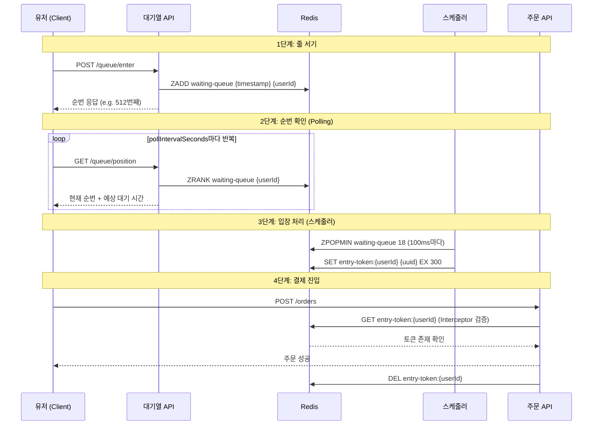

# 한 명도 놓치지 않는 대기열 — Redis Sorted Set으로 트래픽 폭주에서 살아남기

## TL;DR

트래픽 폭증 시 Rate Limiting은 유저를 거부하지만, 대기열은 순서대로 보관해서 한 명도 놓치지 않는다.
Redis Sorted Set 기반의 놀이공원식(스케줄러 + TTL) 대기열을 설계하고, 100ms마다 18명씩 입장 토큰을 발급하는 구조로 175 TPS 안전 마진을 확보했다.
fixedRate 대신 fixedDelay를 선택해서 Redis 지연 시 자연스러운 Back-pressure를 만들고, 동적 Polling 주기(1/3/5초)로 순번 조회 부하를 5배 줄였다.
k6 부하 테스트에서 50명 중 38명만 대기열에 진입했지만(나머지 12명은 BCrypt 인증 병목으로 타임아웃), 진입한 38명은 토큰 수령률 100%, 주문 성공률 100%를 달성했다. 대기열 안에서는 한 명도 놓치지 않았고, 실제 병목은 대기열이 아닌 인증에 있음을 확인했다.
설계부터 구현, 코드 리뷰, 부하 테스트까지 — **"왜 그렇게 판단했는가"**를 중심으로 정리한 기록이다.

---

## 들어가며

블랙 프라이데이 행사를 앞두고 있다고 가정해보자. 평소 초당 100건이던 주문 요청이 행사 시작과 동시에 **초당 10,000건**으로 폭증한다.

```
[10,000명 동시 접속]
     └── POST /orders
           ├── 재고 확인 & 차감
           ├── 결제 처리
           └── 주문 저장
           → DB 커넥션 풀 고갈
           → 응답 지연 → 타임아웃
           → 전체 시스템 장애
```

DB 커넥션 풀이 고갈되고, 스레드가 전부 대기 상태에 빠진다. 응답은 끝없이 느려지고, 유저는 "왜 안 되지?" 하며 새로고침을 누른다. 그 새로고침이 또 다른 요청이 돼서 상황은 더 악화된다. 결국 주문뿐 아니라 상품 조회, 장바구니까지 전체 서비스가 멈춘다.

서버를 10배로 늘리면 될까? 서버는 늘릴 수 있지만, **DB와 PG는 스케일이 제한적**이다. 트래픽 피크가 극단적으로 짧고 높은 경우(행사 시작 직후 10초), 오토스케일링이 반응하기 전에 이미 터져버린다.

그렇다면 이 폭증하는 트래픽으로부터 서비스를 어떻게 지켜야 할까?

---

## 1. 문제 정의 — 트래픽 폭증으로부터 서비스를 지키는 방법들

트래픽이 몰릴 때 시스템을 보호하는 방법들은 이미 여러 가지가 있다.

**Rate Limiting** — IP나 유저 단위로 초당 요청 수를 제한한다. 한도 초과하면 429(Too Many Requests)를 던진다. 거의 모든 서비스에 기본으로 깔려 있는 방어 장치다.

**비정상 요청 차단** — 봇이나 매크로를 탐지해서 차단하고, 상품 페이지를 거치지 않은 직접 API 호출 같은 비정상 플로우를 필터링한다.

**캐싱** — 상품 정보, 재고 여부 같은 읽기 요청을 Redis나 로컬 캐시로 흡수한다. DB까지 안 가도 되니 부하가 크게 줄어든다.

**Circuit Breaker** — PG나 외부 API에 장애가 나면 빠르게 실패를 반환해서 연쇄 장애를 막는다. 느린 응답 기다리느라 스레드가 묶이는 걸 방지한다.

이 방법들은 다 효과적이다. 근데 공통적인 한계가 있다.

**유저가 서비스를 이용하지 못하게 된다.**

Rate Limiting은 "나중에 다시 시도하세요"를 반환하고, 비정상 요청 차단은 아예 진입을 막는다. 캐싱과 서킷브레이커는 읽기나 외부 연동에는 효과적이지만, 주문 요청 자체의 폭증은 해결하지 못한다. 결국 유저 입장에서는 "이 서비스 지금 안 되네" 하고 주문을 포기한다.

근데 생각해보면, 블랙 프라이데이에 몰려든 유저들은 **기다릴 의사가 있는 사람들**이다. 이 상품을 사고 싶어서 일부러 시간 맞춰 들어온 사람들이다. 줄 서서라도 사겠다는 고객한테 "다시 오세요"를 던지는 건 서비스와 유저 모두에게 손해다.

만약 "지금 512번째입니다. 약 3분만 기다려주세요"라고 알려줄 수 있다면?
유저는 이탈하지 않고, 시스템은 감당할 수 있는 속도로 주문을 처리할 수 있다.

**이것이 바.로. 대기열이다.**

시스템이 처리할 수 있는 속도만큼만 요청을 흘려보내면서, 유저에게는 공정한 순서와 실시간 피드백을 제공하는 구조. 거부가 아니라 보관. 차단이 아니라 대기를 시키는 것이다.

### Rate Limiting과 대기열은 양자택일이 아니다

대기열이 있으면 Rate Limiting이 필요 없는 건 아니다. 봇이나 매크로가 대기열에 수만 건의 요청을 넣으면 정상 유저의 순번이 끝없이 밀려난다. Rate Limiting으로 비정상 요청을 먼저 걸러내고, 정상 유저만 대기열에 진입시키는 게 맞다.

```
[유저 요청] → Rate Limiting (봇/매크로 차단)
           → 대기열 진입 (정상 유저만)
           → 스케줄러가 순서대로 토큰 발급
           → 주문 API 처리
```

Rate Limiting은 **문 앞의 경비원**이고, 대기열은 **문 안의 줄서기**다. 둘은 서로 다른 층위에서 시스템을 보호한다.

---

## 2. 대기열의 원리 — Back-pressure

### Back-pressure란

Back-pressure는 직역하면 "역압"이다. 원래 배관 용어로, 파이프에 물이 너무 빠르게 들어오면 출구 쪽에서 처리가 안 되니까 압력이 역류해서 입구 쪽으로 "그만 보내"라는 신호가 전달되는 현상이다. 소프트웨어에서도 같은 개념으로, 하류 시스템이 감당할 수 있는 속도를 초과하면 상류에게 "속도 좀 줄여"라고 압력을 거슬러 올려보내는 걸 말한다.

대기열은 이 Back-pressure를 구현하는 대표적인 방법이다. 하류(DB, PG)가 감당할 수 있는 속도만큼만 상류(유저 요청)를 흘려보낸다.

### 은행 창구식 vs 놀이공원식

멘토님이 대기열을 구현하는 두 가지 방식을 비유로 설명해주셨다.

**1. 은행 창구식 — 빈자리가 나면 밀어 넣기**

창구가 5개면 동시에 5명만 업무를 본다. 한 명이 끝나고 자리를 비우면, 대기 번호 순서대로 다음 사람이 앉는다.

```
[창구 5개]
  창구1: 고객A (업무 중)
  창구2: 고객B (업무 중)
  창구3: (비어있음) ← 대기 1번 고객C 입장!
  창구4: 고객D (업무 중)
  창구5: 고객E (업무 중)

[대기열]
  1번: 고객C → 창구3으로 이동
  2번: 고객F
  3번: 고객G
```

"앞사람이 나가야 다음 사람이 들어간다." 직관적이지만, 현재 누가 활성화돼 있는지, 언제 끝나는지를 전부 추적해야 한다. 유저마다 결제 시간이 다르고 리소스 사용도 제각각이라 "정확히 몇 명까지 동시 수용 가능한가"를 계산하기가 까다롭다.

**2. 놀이공원식 — 주기적으로 일정 인원만 입장시키기**

놀이공원 안내원은 내부에 사람이 정확히 몇 명 있는지 모른다. 대신 경험적으로 "5분마다 20명씩 들여보내면 안이 터지지 않는다"는 걸 안다.

```
[놀이공원 게이트]
  매 5분마다 → 대기열에서 20명 입장 허가

  T=0분   [대기열 1~20번] → 입장! (토큰 발급)
  T=5분   [대기열 21~40번] → 입장!
  T=10분  [대기열 41~60번] → 입장!

  * 안에 몇 명 있는지는 신경 쓰지 않는다
  * 대신 토큰에 유효시간(TTL)을 둔다
```

"앞사람의 종료를 추적하지 않는다." 대기열에서 누가 기다리고 있는지, 순서가 어떻게 되는지만 알면 된다. 다만 들어간 사람이 아무것도 안 하고 무한정 머무르면 시스템이 넘칠 수 있어서, 토큰에 **TTL(만료 시간)**을 걸어야 한다.

| 구분 | 은행 창구식 | 놀이공원식 |
|------|------------|-----------|
| 입장 기준 | 앞사람이 나가면 다음 사람 입장 | 주기적으로 N명씩 입장 |
| 상태 추적 | 활성 유저 수, 종료 시점 모두 추적 | 대기열 순서만 추적 |
| 구현 복잡도 | 높음 (활성/종료 상태 관리) | 낮음 (스케줄러 + TTL) |
| 리스크 | 활성 인원 산정이 어려움 | TTL 없으면 시스템 과부하 가능 |

이번 프로젝트에서는 **놀이공원식**을 택했다. 주문 과정에서 유저마다 결제 시간이 다르고 PG 응답 시간도 들쭉날쭉하다. 앞사람의 종료를 일일이 추적하는 것보다, 스케줄러가 주기적으로 일정 인원을 입장시키고 TTL로 체류 시간을 제한하는 게 우리 상황에 더 맞았다.

---

## 3. 대기열 시스템 설계 — 전체 흐름 잡기

### 진입부터 주문까지



| 구성 요소 | 역할 | 놀이공원 비유 |
|-----------|------|-------------|
| **대기열 (Queue)** | 유저 요청을 순서대로 보관 | 줄 자체 |
| **스케줄러 (Scheduler)** | 주기적으로 N명씩 꺼내 입장 토큰 발급 | "다음 18명 입장하세요"를 외치는 직원 |
| **입장 토큰 (Entry Token)** | 주문 API 진입 권한. TTL이 있어 일정 시간 내 사용해야 함 | 손목에 찍어주는 입장 도장 |
| **순번 조회 (Position)** | 현재 몇 번째인지 실시간 확인 | "현재 대기 약 15분" 안내판 |

### 왜 Redis Sorted Set인가

대기열 저장소를 고를 때 MySQL, Kafka, Java 인메모리 큐(ConcurrentLinkedQueue), Redis Sorted Set을 비교했다.

대기열에서 가장 자주 일어나는 연산은 **순번 조회**다. 1만 명이 대기 중이면 전부 "나 몇 번째야?"를 반복해서 물어본다. 이게 MySQL에서는 `COUNT` 쿼리로 인덱스 스캔이 필요하고, Kafka는 애초에 순번 조회 자체가 안 된다. 대기열로 시스템을 보호하려는 건데, 대기열 자체가 DB를 때리면 본말전도다.

Java 인메모리 큐는 빠르지만, 서버가 여러 대면 대기열이 인스턴스마다 따로 생긴다. 서버가 죽으면 대기열도 날아간다.

Redis Sorted Set은 대기열에 필요한 네 가지 연산이 전부 원자적이고, O(log N) 이내로 돈다.

```
ZADD  waiting-queue  {timestamp}  {userId}    // 대기열 진입
ZRANK waiting-queue  {userId}                  // 내 순번 조회 (0-based)
ZCARD waiting-queue                            // 전체 대기 인원
ZPOPMIN waiting-queue {N}                      // 앞에서 N명 꺼내기 (스케줄러)
```

- **score = 진입 시각(ms)** → 먼저 들어온 사람이 앞 순번
- **member = userId** → Set 특성으로 중복 진입 자동 방지 (ZADD NX)
- **입장 토큰**: `SET entry-token:{userId} {uuid} EX 300` → 5분 TTL로 자동 만료

### R7 Kafka 버퍼링과 뭐가 다른가

지난 구현에서 선착순 쿠폰을 Kafka로 처리했다. 둘 다 "요청을 버퍼링해서 순차 처리"인 건 같지만, 유저 경험이 완전히 다르다.

| 구분 | Kafka 버퍼링 (R7 쿠폰) | 대기열 시스템 (R8 주문) |
|------|----------------------|---------------------|
| 유저 경험 | 요청 후 나중에 결과 확인 (fire & forget) | 화면에서 순번을 보며 대기 |
| 결과 전달 | 비동기 (polling으로 결과 조회) | 입장 토큰 발급 → 즉시 주문 가능 |
| 실시간 피드백 | 없음 | 순번 + 예상 대기 시간 실시간 제공 |
| 핵심 관심사 | 메시지 유실 방지, 멱등 처리 | 공정한 순서, 실시간 피드백, 토큰 만료 |

쿠폰은 "신청 완료, 결과는 나중에"로 충분하다. 주문은 "지금 몇 번째인지, 언제쯤 될 건지"를 유저가 알아야 한다. 이 차이 때문에 대기열 시스템이 필요했다.

---

## 4. 설계하면서 내린 결정들

구조를 잡고 나서 세부 설계에서 선택지를 하나씩 좁혀 나갔다.

### 결정 1. 독립 도메인으로 분리

대기열을 주문 도메인 하위(`domain/order/queue/`)에 넣을지, 독립 도메인으로 뺄지 고민했다.

- 대기열은 주문 전용이 아니다. 한정판 세일, 티켓팅 등 다른 도메인에도 쓸 수 있다.
- 주문 도메인에 넣으면 주문이 대기열을 알아야 하는 역방향 의존이 생긴다.
- feature flag, 스케줄러, 토큰 관리 등 자체 책임이 충분히 크다.

독립 도메인(`domain/queue/`)으로 분리했다. API 경로도 `/api/v1/queue/*`로 독립시키고, 주문과의 연결은 Interceptor가 담당한다. 주문 도메인은 대기열의 존재를 모른다.

### 결정 2. userId 기반 토큰 검증 — 클라이언트 변경 없이

| 방식 | 장점 | 단점 |
|------|------|------|
| 헤더 기반 (`X-Entry-Token`) | 보안 명시적 | 클라이언트가 토큰 저장/전달해야 함 |
| **userId 기반 (서버 조회)** | 클라이언트 변경 없음 | 로그인 세션 의존 |

**userId 기반**을 택했다. 서버가 로그인된 userId로 Redis에서 토큰 존재 여부만 확인한다. 클라이언트는 토큰 값 자체를 몰라도 되니까 기존 주문 플로우를 전혀 수정할 필요가 없었다.

### 결정 3. Interceptor로 검증 — 주문 코드 0줄 수정

```
요청 → MemberAuthInterceptor → QueueTokenInterceptor → OrderV1Controller
                                   |
                           flag OFF → 통과
                           flag ON  → 토큰 검증
```

`WebMvcConfig`에 등록해서 `POST /api/v1/orders` 경로에만 적용했다. 대기열을 켜든 끄든 주문 컨트롤러와 서비스 코드는 한 줄도 안 바뀐다.

### 결정 4. Feature Flag를 DB에 둔 이유

| 방식 | 장점 | 단점 |
|------|------|------|
| application.yml | 단순 | 변경 시 재배포 필요 |
| Redis | 런타임 즉시 변경 | Redis 장애 시 플래그 자체를 못 읽음 |
| **DB** | 런타임 변경, 이력 추적, Admin API 연동 | DB 장애 시 못 읽음 |

DB가 죽으면 어차피 주문도 못 하니까 추가 SPOF가 아니다. Admin API로 운영 중 즉시 ON/OFF 가능하고 변경 이력도 남길 수 있다.

다만 구현하고 보니 DB 조회 빈도가 문제였다. 스케줄러(100ms)와 Interceptor(매 요청)에서 호출되면 초당 수십 회 SELECT가 발생한다. 이건 뒤에서 따로 다룬다.

### 결정 5. 순번 응답에서 전체 대기 인원을 뺀 이유

```json
{ "position": 128, "estimatedWaitSeconds": 1, "token": null, "pollIntervalSeconds": 1 }
```

`totalWaiting`(전체 대기 인원)을 응답에 넣으면 "3,420명 대기 중"을 보고 이탈할 수 있다. `ZCARD` 비용은 O(1)로 거의 없지만, 이건 기술 문제가 아니라 UX 판단이다. "128번째입니다, 약 1초 대기"가 이탈 방지에 훨씬 낫다.

### 결정 6. 175 TPS 도출 과정

```
DB 커넥션 풀: 50 (HikariCP)
주문 1건 평균 처리 시간: 200ms (가정)
→ 이론적 최대 TPS: 50 / 0.2 = 250 TPS
→ 안전 마진 70%: 250 × 0.7 = 175 TPS
→ 100ms당 배치 크기: 175 / 10 = ~18명
```

커넥션 풀 100% 점유는 다른 API(조회, 장바구니 등)를 죽이니까, 주문 외 API가 30%를 점유한다고 가정해서 70%인 175 TPS를 안전 마진으로 잡았다.

이 200ms는 DB 쿼리 + 트랜잭션 처리 시간만 고려한 가정값이다. 실제 k6 테스트에서 주문 API의 p50은 520ms, p95는 1,048ms가 나왔다. BCrypt 인증 오버헤드가 포함돼서 차이가 컸다. PG 호출까지 포함되면 처리 시간이 1~3초까지 늘어나서 이론 TPS도 17~50으로 크게 떨어질 수 있다. 운영 환경에서는 실측 기준으로 TPS를 재산정해야 한다.

### 결정 7. 예상 대기 시간 계산 방식

| 방식 | 장점 | 단점 |
|------|------|------|
| 고정 TPS 기반 | 단순 | 스케줄러 설정과 괴리 가능 |
| **스케줄러 기반** | 설정에 정확히 연동 | 여전히 이론값 |
| 실측 기반 | 가장 정확 | 구현 복잡 |

스케줄러 기반으로 했다. `(position / batchSize) * (intervalMs / 1000)` 공식으로, 스케줄러 설정을 바꾸면 예상 시간도 자동으로 바뀐다. 176번째 유저는 `(176/18) * 0.1 ≈ 1초` 대기로 계산된다.

---

## 5. 구현 Deep Dive — fixedRate vs fixedDelay

### fixedRate가 맞아 보였는데

"일정한 처리량 유지"가 목표라면 fixedRate가 맞아 보인다. 이전 실행 시작 시점 기준으로 다음 실행을 예약하니까 처리 시간과 무관하게 일정한 주기가 보장된다.

근데 Redis 지연이 발생하면?

```mermaid
gantt
    title fixedRate = 100ms (처리가 150ms 걸릴 때)
    dateFormat X
    axisFormat %Lms
    section 실행
    실행1 (150ms)       :active, 0, 150
    실행2 (밀림→즉시시작) :active, 150, 300
    실행3 (밀림→즉시시작) :active, 300, 450
    section 예약 시점
    예약1 (T=0)   :milestone, 0, 0
    예약2 (T=100) :crit, milestone, 100, 100
    예약3 (T=200) :crit, milestone, 200, 200
```



Spring의 기본 스케줄러는 단일 스레드라 실제로 동시 실행은 안 되지만, 밀린 작업이 쌓인다. Redis 장애가 복구된 직후 밀린 실행이 한꺼번에 수행되면, Thundering Herd가 발생한다. Thundering Herd는 대기하고 있던 요청들이 동시에 몰려들면서 시스템에 순간 과부하를 일으키는 현상인데, **대기열이 막으려 했던 바로 그 문제를 스케줄러 자체가 유발**하게 되는 셈이다.

### fixedDelay로 바꾼 이유

fixedDelay는 이전 실행이 끝난 후 100ms를 기다린 뒤 다음 실행을 시작한다.

```mermaid
gantt
    title fixedDelay = 100ms (처리가 150ms 걸릴 때)
    dateFormat X
    axisFormat %Lms
    section 실행
    실행1 (150ms)     :active, 0, 150
    대기 (100ms)      :done, 150, 250
    실행2 (150ms)     :active, 250, 400
    대기 (100ms)      :done, 400, 500
    실행3 (150ms)     :active, 500, 650
```



- 실행 겹침이 방지된다
- Redis 지연 시 자연스럽게 처리량이 줄어든다 — **Back-pressure 효과**
- 장애 복구 후 밀린 작업이 한꺼번에 실행되지 않는다

Trade-off는 있다. 처리 시간이 길어지면 실제 TPS가 설계값(175)보다 낮아질 수 있다. 근데 대기열의 본래 목적이 "백엔드를 보호하면서 안정적으로 처리"하는 거니까, 처리량이 일시적으로 줄어드는 게 시스템 과부하보다 낫다.

```java
@Scheduled(fixedDelayString = "${queue.scheduler.fixed-delay}")
public void processQueue() {
    if (!queueService.isQueueEnabled()) {
        return;
    }
    if (!schedulerLockRepository.tryAcquire(LOCK_KEY, instanceId, LOCK_EXPIRE_SECONDS)) {
        return;
    }
    try {
        processBatch();
    } finally {
        schedulerLockRepository.release(LOCK_KEY);
    }
}
```

`fixedDelay = 100`이라는 매직 넘버를 `application.yml`로 외부화해서, 운영 환경에서 재배포 없이 주기를 조절할 수 있게 했다.

---

## 6. 실시간 순번 조회 — Polling vs SSE vs WebSocket

### 세 가지 방식 비교

| 방식 | 장점 | 단점 |
|------|------|------|
| **Polling** | 구현 단순, 인프라 변경 없음 | 대기 인원 많으면 요청 자체가 부하 |
| SSE | 변경 시에만 전송, 효율적 | 유저당 1커넥션 유지 필요 |
| WebSocket | 양방향 실시간 | 순번 조회는 단방향이면 충분, 과도 |

대기열 순번 조회는 "서버 → 클라이언트" 단방향이면 충분하다. WebSocket의 양방향은 과하고, SSE는 대기 인원 수만큼 커넥션을 유지해야 해서 로드밸런서 설정이 필요하다.

Polling을 택하되, 부하 문제는 **Polling 주기를 동적으로 조절**해서 해결했다.

### 동적 Polling 주기 — 1초/3초/5초

```java
private static int calculatePollInterval(long position) {
    if (position <= 100) {
        return 1;   // 곧 입장 → 빠르게 확인
    } else if (position <= 1000) {
        return 3;   // 중간 대기 → 적당히
    } else {
        return 5;   // 뒤쪽 대기 → 느리게
    }
}
```

앞쪽 유저는 곧 입장하니까 1초마다 확인하고, 뒤쪽 유저는 5초 주기로 느리게 polling한다. 응답에 `pollIntervalSeconds`를 포함해서 클라이언트가 이 값에 따라 주기를 조절하도록 했다.

10,000명 기준으로 계산하면:

```
순번 1~100:        100명 × 1 req/s   =   100 req/s
순번 101~1,000:    900명 × 0.33 req/s =   300 req/s
순번 1,001~10,000: 9,000명 × 0.2 req/s = 1,800 req/s
합계: ~2,200 req/s
```

전원 1초 폴링이면 10,000 req/s인데, 동적 주기로 약 2,200 req/s. **약 78% 감소**다. Redis `ZRANK`는 O(log N)이고 단순 조회라 초당 10만+ 처리가 가능하니 2,200 req/s는 전혀 부담이 아니다.

다만 한 가지 더 고려할 점이 있다. 같은 구간의 유저들이 정확히 같은 간격(1초, 3초)으로 요청을 보내면, 요청이 특정 시점에 몰리는 스파이크가 다시 생길 수 있다. 실제 운영에서는 클라이언트 측에서 polling 간격에 **Jitter(약간의 랜덤 시간)**를 섞어서 요청을 분산시키는 게 좋다. 예를 들어 3초 간격이면 2.5~3.5초 사이에서 랜덤으로 요청하는 식이다.

---

## 7. 코드 리뷰에서 잡아낸 것들

구현을 마치고 코드 리뷰를 하면서 "동작은 하지만 위험한" 부분들을 개선했다.

### peek + remove → ZPOPMIN 원자적 처리

초기에는 `ZRANGE`로 앞쪽 N명을 조회(peek)한 뒤, 토큰 발급 성공 시 `ZREM`으로 제거하는 방식이었다.

```
[초기 — 2단계 방식]
1. ZRANGE waiting-queue 0 17  → 18명 조회 (제거 안 함)
2. SET entry-token:{userId}   → 토큰 발급
3. ZREM waiting-queue {userId} → 대기열에서 제거
```

peek과 remove가 별개의 Redis 호출이라서 문제가 될 수 있다. 분산 락으로 단일 인스턴스만 실행되도록 보장하고 있지만, 락 만료(30초) 시 두 인스턴스가 동일 유저를 peek하는 극단적 시나리오가 존재했다.

`ZPOPMIN`으로 바꿔서 조회와 제거를 하나의 Redis 명령으로 처리했다.

```
[변경 후 — 원자적]
1. ZPOPMIN waiting-queue 18   → 18명 조회 + 제거 (원자적)
2. SET entry-token:{userId}   → 토큰 발급
3. (실패 시) ZADD waiting-queue {score} {userId}  → 원래 score로 재삽입
```

ZPOPMIN으로 이미 꺼냈으니까, 토큰 발급이 실패하면 유저가 유실된다. `QueueEntry(userId, score)` record를 만들어서 실패 시 원래 score(진입 시각)로 재삽입하도록 했다.

```java
for (QueueEntry entry : entries) {
    try {
        if (queueTokenService.hasToken(entry.userId())) {
            continue;
        }
        queueTokenService.issueToken(entry.userId());
    } catch (Exception e) {
        queueRepository.enter(entry.userId(), entry.score());
        log.warn("토큰 발급 실패, 대기열 재삽입 userId={}", entry.userId(), e);
    }
}
```

한 가지 주의할 점이 있다. 특정 유저의 토큰 발급이 계속 실패하면, 원래 score(맨 앞)로 재삽입되니까 다음 배치에서 또 맨 앞에서 꺼내진다. **한 명의 실패가 뒤의 모든 유저를 막는 Head-of-Line Blocking**이 생기는 거다. 현재 구현에서는 Redis 자체가 정상이면 토큰 발급(`SET` 명령)이 실패할 확률이 극히 낮고, Redis가 비정상이면 대기열 전체가 동작하지 않으니 실질적 리스크는 낮다. 근데 프로덕션에서는 최대 재시도 횟수를 두는 게 더 안전할 거다.

### Feature Flag에 인메모리 캐시 적용

`isQueueEnabled()`가 스케줄러(100ms)와 Interceptor(매 POST 요청)에서 호출되면 초당 수십 회의 DB SELECT가 발생한다. `volatile` 필드 + 5초 TTL 방식의 단순 인메모리 캐시를 적용해서, DB 조회 빈도를 초당 10회+ → 5초당 1회로 줄였다.

대기열 ON/OFF는 운영자가 수동으로 전환하는 거니까 5초 지연은 충분히 허용 가능하다.

### 토큰 삭제 안전성

`QueueTokenInterceptor.afterCompletion`에서 `ex == null && status 2xx`를 함께 체크해서, `@RestControllerAdvice`가 예외를 삼키더라도 비정상 응답 시 토큰이 삭제되지 않도록 했다.

```
주문 성공: ex=null, status=200 → 토큰 삭제
주문 실패(서비스 예외): Advice가 처리 → ex=null, status=400 → 토큰 유지
주문 실패(미처리 예외): ex!=null → 토큰 유지
토큰 삭제 시 Redis 호출 실패 → 토큰 잔존 → TTL 5분 후 자동 만료
```

주문은 성공했는데 Redis `DEL` 호출이 실패하면 토큰이 남아서 TTL 만료 전에 재주문이 가능해진다. 완전히 막으려면 주문 도메인에 멱등성 키(idempotency key)를 둬야 한다.

### 상수 중앙화

Redis 키(`"waiting-queue"`, `"entry-token:"`)가 Repository와 테스트에 분산 하드코딩돼 있었다. `QueueConstants`에 모아서 키 변경 시 한 곳만 수정하면 되게 했다.

---

## 8. k6 부하 테스트 — 숫자로 증명하기

설계와 구현이 끝나면 "정말 의도대로 동작하나?"를 숫자로 확인해야 한다. k6로 5가지 시나리오를 테스트했다.


- 별도의 스파이크 시나리오(VUs 500/60) 실행 중 Grafana 대시보드를 캡처한 것이다. 대기열 진입(`/queue/enter`)과 순번 조회(`/queue/position`) API의 처리량 추이를 볼 수 있다. 아래 본문의 E2E 테스트(50명)와는 다른 시나리오다.

### 테스트 환경

| 항목 | 값 |
|------|-----|
| 서버 | Spring Boot 3.4.4 (로컬, 단일 인스턴스) |
| Redis | 7.0 (Docker, Master-Replica) |
| 스케줄러 | BATCH_SIZE=18, fixedDelay=100ms |

### 스케줄러 배치 크기 검증

200명이 동시에 대기열에 진입한 후, 스케줄러가 전부 소화하는 시간을 측정했다.

| 메트릭 | 값 |
|--------|-----|
| 대기열 크기 | 200명 |
| **토큰 수령 p50** | **966ms** |
| **토큰 수령 p95** | **1,623ms** |
| 전체 완료 시간 | 3.9초 |

이론상 200명 / (18명 × 10회/초) = 1.1초다. 다만 이 계산은 fixedRate 기준이고, fixedDelay에서는 처리 시간이 추가되니까 실제 주기는 `100ms + 처리시간`이다. ZPOPMIN + SET 18회의 처리 시간이 수 ms 수준으로 매우 짧아서 fixedRate와 거의 차이가 없었고, 실측 p50이 966ms로 이론값에 근사했다.

### E2E 전체 흐름 — 진입 → 대기 → 토큰 수령 → 주문

50명이 동시에 진입해서 주문까지 완료하는 전체 플로우를 돌렸다.

| 단계 | p50 | p95 |
|------|-----|-----|
| 진입 (enter) | 407ms | 480ms |
| 대기 (진입→토큰) | 362ms | 432ms |
| 주문 (order) | 520ms | 1,048ms |
| **전체 흐름** | **1,258ms** | **1,725ms** |

| 메트릭 | 값 |
|--------|-----|
| 진입 성공 | 38/50 (76%) |
| 토큰 수령 | **38/38 (100%)** |
| 주문 성공 | **38/38 (100%)** |
| TTL 내 완료 | 100% |
| 평균 polling 횟수 | **1회** |

50명 중 12명은 **대기열 진입 자체에 실패**했다. 대기열이나 스케줄러 문제가 아니라, 50명이 동시에 BCrypt 인증을 수행하면서 CPU 경합으로 인증 타임아웃이 발생한 거다. 진입 성공한 38명은 100% 토큰 수령 → 주문 완료까지 전부 완주했다. **대기열에 한 번 들어오면 한 명도 놓치지 않는다.** 놓쳐진 12명은 대기열 앞단의 인증 병목이지 대기열 시스템의 문제가 아니다.

평균 polling 1회라는 건, 50명 규모에서 38명이 약 200ms(2배치)면 전부 처리되니까, 유저가 진입 후 첫 polling(1초 후)을 하는 시점에는 이미 토큰이 발급돼 있기 때문이다. 10,000명 규모에서는 뒤쪽 유저의 polling 횟수가 훨씬 많아질 거다.

### 토큰 동시성 & 엣지케이스

| 시나리오 | 결과 |
|---------|------|
| 토큰 1개로 연속 주문 2건 | 첫 번째 성공, 두 번째 **100% 차단** |
| 토큰 없이 주문 | **100% 차단** (400 Bad Request) |
| Feature flag OFF → 토큰 없이 주문 | **100% 성공** |

토큰 1회 사용 보장, race condition 없음, Interceptor 정상 동작, feature flag 우회 정상 — 모두 통과.

### 시스템 병목 식별

| 구간 | 병목 여부 | 근거 |
|------|----------|------|
| Redis ZADD (진입) | 정상 | O(log N), 마이크로초 단위 |
| Redis ZRANK (조회) | 정상 | O(log N), 대기열 크기 무관 |
| 스케줄러 (토큰 발급) | 정상 | 이론값 근사 처리 |
| **BCrypt 인증** | **병목** | 동시 요청 시 CPU 경합으로 응답 지연 |

대기열/스케줄러/토큰 시스템 자체의 병목은 없었다. 응답 시간의 대부분은 BCrypt 인증이 지배했다. BCrypt를 제외한 순수 Redis 연산만 보면 수십 ms 이내에서 처리된다. 세션/JWT 기반 인증으로 전환하면 전체 RPS가 크게 개선될 거다.

특히 순번 조회 API(`GET /queue/position`)는 대기 중인 유저가 1~5초 간격으로 반복 호출한다. 이 API까지 매번 BCrypt 인증을 거치면 polling 자체가 서버 부하가 된다. 실제 릴리즈에서는 이 API만큼은 **가벼운 토큰(JWT 등)으로 인증 부하를 줄이는 게 필수**다.

---

## 9. 놓치기 쉬운 함정들

### Thundering Herd — 토큰 발급 직후 N명 동시 주문

스케줄러가 1초마다 175명에게 토큰을 발급하면, 175명이 동시에 주문 API를 호출한다. 원래 문제의 축소판이다.

1초에 175명을 한 번에 발급하는 대신, 100ms마다 18명씩 나눠서 발급해서 부하를 10배 평탄화했다.

### 토큰 미사용 / 어뷰징

- 토큰 받고 주문 안 하면 자리만 차지한다. **TTL 5분**으로 자동 만료 처리.
- 한 유저가 여러 디바이스로 중복 진입을 시도해도, **Sorted Set에 userId를 member로 사용**하니까 자연스럽게 중복이 방지된다.

### 스케줄러 장애

스케줄러가 멈추면 대기열에서 아무도 못 빠진다. DB 기반 `scheduler_lock`으로 분산 환경에서 중복 실행을 방지하면서, 인스턴스 장애 시 락 만료(30초)로 자동 해제되도록 했다.

### Redis 장애 — Graceful Degradation

Redis가 죽으면 대기열 자체가 안 돈다. 선택지는 세 가지다.

| 전략 | 설명 |
|------|------|
| **전면 차단 (Safe Mode)** | 대기열 진입 자체를 막고 안내. 안전하지만 서비스 중단 |
| 대기열 우회 | 토큰 없이 주문 API 직접 접근 허용. 서비스 유지하지만 과부하 위험 |
| Fallback 큐 | 로컬 메모리 큐나 Kafka로 임시 전환 |

이번 프로젝트에서는 Feature Flag OFF로 대기열을 우회시키는 방식을 택했고, 테스트에서 flag OFF 시 주문 100% 성공하는 걸 확인했다.

다만 짚고 넘어갈 게 있다. Redis가 죽은 게 **폭풍 트래픽 중**이라면, 대기열을 우회하는 순간 트래픽이 DB에 직접 쏟아진다. 대기열을 도입한 이유가 DB 보호인데, 우회하면 원래 문제로 돌아가는 거다. 이 경우에는 차라리 **전면 차단 후 트래픽이 줄어든 시점에 순차 오픈**하는 게 시스템 전체 셧다운을 막는 더 안전한 선택일 수 있다.

대기열 우회가 적합한 건 평시에 Redis가 잠깐 죽었을 때처럼, 트래픽 자체가 감당 가능한 수준인 경우에 한정된다.

---

## 마치며

처음에는 "대기열 붙이면 트래픽 문제 해결되겠지"라고 단순하게 생각했다. 근데 직접 구현해보니 대기열은 **한꺼번에 몰리는 걸 나눠서 흘려보내는 거지, 부하 자체를 없애주는 게 아니었다.**

10,000명이 몰려와도 결국 10,000명을 다 처리해야 한다. 한꺼번에 처리하는 대신 100ms마다 18명씩, DB와 PG가 감당할 수 있는 속도로 흘려보내는 거다.

구현하면서 크게 느낀 건 세 가지다.

**fixedRate vs fixedDelay 같은 사소해 보이는 선택이 시스템 안정성을 좌우한다.** fixedRate가 이론적으로 맞아 보여도, Redis 지연 시 밀린 작업이 한꺼번에 터지면 대기열이 막으려 했던 Thundering Herd를 스케줄러 자체가 유발한다.

**"동작한다"와 "안전하다"는 다르다.** peek + remove가 동작은 하지만 원자적이지 않아서 극단적 시나리오에서 문제가 된다. ZPOPMIN으로 바꾸고, 실패 시 재삽입 로직까지 넣고 나서야 "안전하다"고 말할 수 있었다.

**"장애 시 어떻게 동작할 것인가"를 미리 정하는 것 자체에 가치가 있다.** Redis가 죽으면? 스케줄러가 멈추면? 토큰이 만료되면? 이 질문들에 미리 답을 정해두니까, 실제로 장애가 발생해도 당황하지 않을 수 있다.

결국 DB가 버틸 수 있는 만큼만 흘려보내면서, 그 안에서 한 명이라도 더 살리는 게 대기열의 전부다. 한 명이라도 더 우리 서비스를 이용하게 하는 것. 이걸 고민하면서 코드를 짜는 개발자가 되고 싶다.
