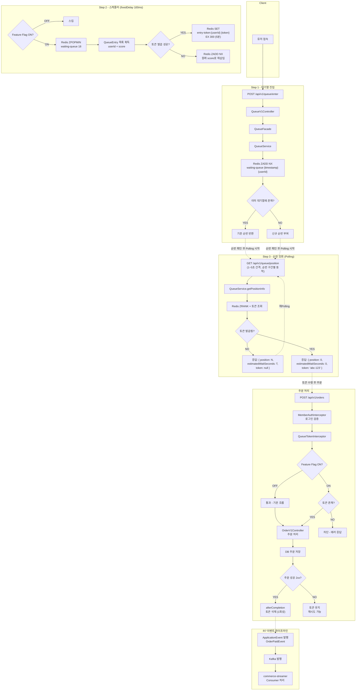
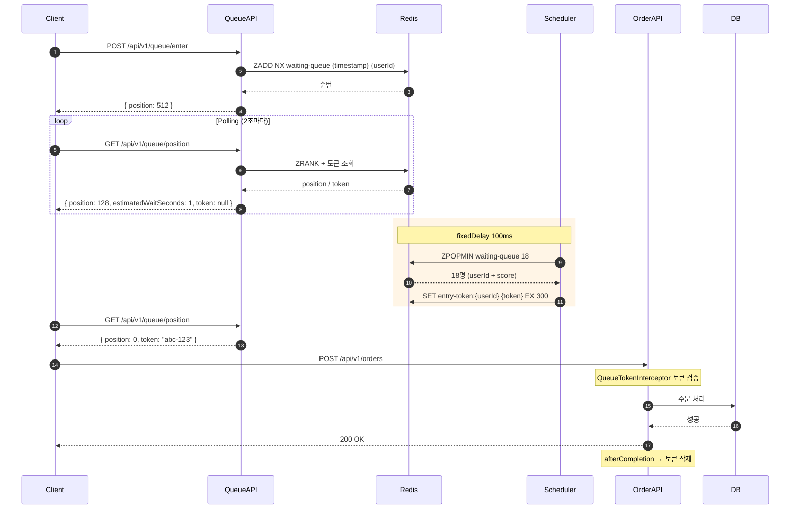
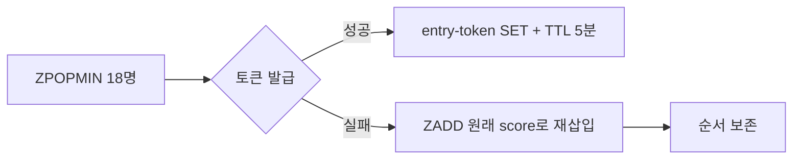
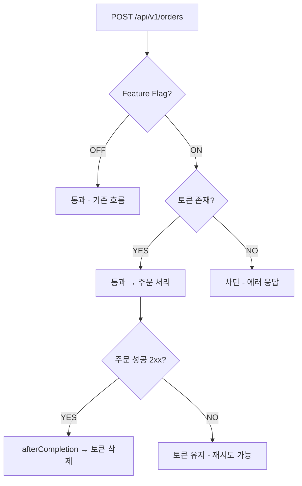

## Summary

- **배경**: 주문 API에 트래픽이 직접 유입되는 구조로, 블랙 프라이데이 같은 폭증(초당 10,000건) 시 DB 커넥션 풀(50개) 고갈 → 응답 지연 → 전체 시스템 장애로 이어졌다. 유저는 주문 결과를 모른 채 대기하다 이탈하고, 먼저 요청한 사람이 아닌 운 좋은 사람만 성공하는 공정성 부재 문제가 있었다.
- **목표**: (1) Redis Sorted Set 기반 대기열로 처리량 제어(Back-pressure) (2) 스케줄러 + 입장 토큰으로 DB가 감당할 수 있는 속도만큼만 순차 입장 처리 (3) Polling 기반 실시간 순번 조회로 유저 이탈 방지 (4) Feature Flag로 대기열 ON/OFF 운영 제어
- **결과**: 132건 신규 테스트 ALL PASS, k6 부하 테스트 5종 시나리오로 병목 추적 및 최적화 실증, ZPOPMIN 원자적 처리로 중복 발급 원천 차단, Interceptor 기반 토큰 검증으로 주문 도메인 변경 없이 대기열 적용


## Context & Decision

### 문제 정의
- **현재 동작/제약**: 주문 API에 직접 트래픽이 유입되는 구조. 초당 10,000건 폭증 시 DB 커넥션 풀(50개) 즉시 고갈. 스케일 아웃으로도 DB/PG는 스케일 제한적이며, 오토스케일링 반응 전에 장애 발생
- **문제(또는 리스크)**: (1) 시스템 과부하 — DB 커넥션, 스레드 풀 한계 초과 시 전체 서비스 중단 (2) 유저 경험 붕괴 — 응답 없이 로딩만 돌다 타임아웃, 재시도 폭풍으로 악화 (3) 공정성 부재 — 선착순이 아닌 운 좋은 사람만 성공
- **성공 기준(완료 정의)**: Redis 대기열로 처리량이 제어될 것, 유저가 순번과 예상 대기 시간을 확인할 수 있을 것, 토큰 없이 주문 API에 접근 불가할 것, Feature Flag OFF 시 기존 흐름 유지

### 선택지와 결정

#### 1. 트래픽 제어 전략 — Rate Limiting(거부) vs Queuing(대기)

- 고려한 대안:
    - **A: Rate Limiting (429 거부)** — 초과 요청을 즉시 거부하여 시스템 보호. 구현 단순
    - **B: Queuing (대기열)** — 초과 요청을 대기열에 적재하고 순차 처리. 유저에게 순번 피드백 제공
- **최종 결정**: 옵션 B — Redis Sorted Set 기반 대기열
- **선택 근거**: 블랙프라이데이는 "기다릴 의사가 있는" 유저들이 대부분이다. 429 거부 시 유저는 새로고침을 반복하고, 이 재시도 폭풍이 트래픽을 더 증폭시킨다. 대기열은 "512번째입니다, 약 3분 대기"라는 피드백으로 새로고침 충동을 억제하여 재시도 폭풍을 원천 차단한다.

  | 방식 | 시스템 보호 | 유저 경험 | 공정성 | 재시도 폭풍 |
  |------|-----------|----------|--------|-----------|
  | Rate Limiting | O | X (거부당한 유저 이탈) | X (운 좋은 사람만 성공) | 악화 (새로고침 유발) |
  | **Queuing** | O | O (순번 + 예상 대기 시간) | O (FIFO 선착순) | 억제 (순번 피드백) |

- **트레이드오프**: 대기열 자체가 Redis라는 인프라 의존을 추가한다. Redis 장애 시 대기열 전체가 무력화될 수 있으므로, Feature Flag OFF로 기존 흐름(대기열 없이 직접 주문)으로 즉시 전환할 수 있는 우회 경로를 확보했다.

#### 2. 입장 전략 — 놀이공원식 vs 은행 창구식

- 고려한 대안:
    - **A: 놀이공원식** — 스케줄러가 재고 확인 없이 N명에게 토큰을 무조건 발급. 주문 시점에 재고 검증
    - **B: 은행 창구식** — 토큰 발급 전 재고를 확인하여 구매 가능한 유저에게만 토큰 발급
- **최종 결정**: 옵션 A — 놀이공원식
- **선택 근거**: 은행 창구식은 "상품 3개를 사고 싶으면 대기열 3번 서야 하나?"라는 UX 문제가 발생한다. 놀이공원식은 토큰을 받으면 자유롭게 여러 상품을 쇼핑할 수 있어 실제 커머스 시나리오에 적합하다.
- **트레이드오프**: "기다렸는데 재고 소진으로 못 살 수 있다"는 문제가 있다. 이를 2-레이어 방어로 보완한다.
    - Layer 1: 글로벌 입장 대기열 — 스케줄러가 DB 처리량(175 TPS) 이하로 입장 속도를 제한
    - Layer 2: 주문 시점 재고 검증 — CAS(Compare-And-Swap)로 재고 차감의 원자성 보장

#### 3. 실시간 피드백 방식 — Polling vs SSE vs WebSocket

- 고려한 대안:
    - **A: SSE (Server-Sent Events)** — 서버가 순번 변경 시 push. 실시간성 높음
    - **B: WebSocket** — 양방향 통신. 실시간성 최고
    - **C: Polling** — 클라이언트가 주기적으로 순번 조회. Stateless
- **최종 결정**: 옵션 C — Polling + 동적 주기 조절
- **선택 근거**:

  | 항목 | SSE / WebSocket | Polling |
  |------|----------------|---------|
  | 동시 10,000명 대기 | 10,000 TCP 커넥션 상시 점유 | 요청-응답 후 즉시 반환 |
  | 서버 재시작 시 | 전체 재연결 폭풍 | 영향 없음 (Stateless) |
  | 인프라 요구사항 | L7 로드밸런서, Sticky Session | 일반 HTTP만 필요 |
  | 동시 커넥션 점유 | 수만 개 상시 | 수십ms 순간 점유 |

- **Polling 약점 보완**: 순번 구간별 동적 Poll 간격으로 불필요한 요청을 줄였다.
    - 1~100번: 1초 간격 (곧 입장이므로 빠른 피드백)
    - 100~1,000번: 3초 간격
    - 1,000번 이후: 5초 간격 (순번 변화가 느리므로 부하 절감)

#### 4. 패키지 구조 — 주문 하위 vs 독립 도메인

- 고려한 대안:
    - **A: `domain/order/queue/` 주문 도메인 하위** — 대기열이 주문 전용이므로 응집도 높음
    - **B: `domain/queue/` 독립 도메인** — 향후 한정판 세일, 티켓팅 등 다른 도메인에도 적용 가능
- **최종 결정**: 옵션 B — 독립 도메인
- **트레이드오프**: 주문과의 연결이 느슨해지지만, 주문 도메인에 넣으면 역방향 의존이 생기고 대기열 자체의 책임(feature flag, 스케줄러, 토큰 관리)이 충분히 크다
- **추후 개선 여지**: 다른 도메인(한정판 세일 등)에 대기열 적용 시 재사용 가능

#### 5. 토큰 검증 방식 — 헤더 기반 vs userId 기반

- 고려한 대안:
    - **A: 헤더 기반 (`X-Entry-Token`)** — 보안 명시적, 토큰 탈취 시 userId+토큰 둘 다 필요
    - **B: userId 기반 (서버 조회)** — 클라이언트 변경 없음, 구현 단순
- **최종 결정**: 옵션 B — userId 기반
- **선택 근거**: 서버가 로그인된 userId로 Redis에서 토큰 존재 여부만 확인. 클라이언트는 토큰 값을 몰라도 되므로 프론트엔드 변경 불필요

#### 6. 검증 레이어 — Controller 직접 vs Interceptor

- 고려한 대안:
    - **A: OrderV1Controller에서 직접 토큰 검증** — 명시적이지만 주문 도메인이 대기열을 알아야 함
    - **B: Interceptor로 주문 API 앞단에서 검증** — 주문 도메인 코드 변경 없음, Feature Flag OFF면 통과
- **최종 결정**: 옵션 B — QueueTokenInterceptor
- **트레이드오프**: Interceptor는 afterCompletion에서의 예외 처리가 미묘하지만(`@RestControllerAdvice`가 ex를 삼킬 수 있음), response.getStatus() 범위 체크를 병행하여 안전성 확보
- **검증 흐름**: `요청 -> MemberAuthInterceptor -> QueueTokenInterceptor -> OrderV1Controller`

#### 7. 스케줄러 배치 전략 — 1초/175명 vs 100ms/18명

- 고려한 대안:
    - **A: 1초마다 175명 한꺼번에 발급** — 단순하지만 175명 동시 주문으로 Thundering Herd 발생
    - **B: 100ms마다 ~18명씩 분산 발급** — 부하 10배 평탄화, 스케줄러 호출 빈도 높음
- **최종 결정**: 옵션 B — 100ms / ~18명
- **처리량 산정 근거**: DB 커넥션 풀 50 / 평균 처리 200ms = 최대 250 TPS -> 안전 마진 70% = 175 TPS -> 100ms당 ~18명
- **fixedDelay 선택 이유**: fixedRate는 처리 지연 시 밀린 작업이 한꺼번에 실행되어 Thundering Herd를 스케줄러 자체가 유발할 수 있음. fixedDelay는 이전 실행 완료 후 100ms 대기하므로 자연스러운 back-pressure 효과

#### 8. 대기열 원자적 처리 — peekFront+remove vs ZPOPMIN

- 고려한 대안:
    - **A: ZRANGE(peek) + ZREM(remove)** — 실패 시 대기열에 그대로 남아있지만, 두 연산 사이 gap으로 중복 처리 가능
    - **B: ZPOPMIN + 실패 시 재삽입** — 단일 명령으로 원자적, 중복 처리 원천 차단
- **최종 결정**: 옵션 B — ZPOPMIN
- **트레이드오프**: 토큰 발급 실패 시 수동 재삽입 필요 → `QueueEntry(userId, score)` record로 원래 score 보존하여 순서 유지. 재삽입 실패도 별도 try-catch로 격리하여 나머지 배치 유저에게 영향 없이 error 로깅으로 운영 복구 경로 확보
- **선택 근거**: 분산 락 만료 시 두 인스턴스가 동일 유저를 peek하는 극단적 시나리오를 원천 차단

#### 9. Feature Flag 저장소 — yml vs Redis vs DB

- 고려한 대안:
    - **A: application.yml** — 단순하지만 변경 시 재배포 필요
    - **B: Redis** — 런타임 즉시 변경 가능하지만 Redis 장애 시 플래그 자체를 못 읽음
    - **C: DB** — 런타임 변경 가능, 이력 추적, Admin API 연동
- **최종 결정**: 옵션 C — DB 기반 + volatile 인메모리 캐시(5초 TTL)
- **선택 근거**: DB가 죽으면 어차피 주문도 못하므로 추가 SPOF가 아님. 스케줄러(100ms) + Interceptor(매 요청)의 고빈도 조회를 캐시로 초당 10회+ → 5초당 1회로 감소

#### 10. Redis 트랜잭션 보장 방식 — Lua Script vs 단일 원자적 명령어

- 고려한 대안:
    - **A: Lua Script** — 여러 Redis 명령어를 하나의 트랜잭션으로 묶어 원자적 실행 보장. 복잡한 다중 명령 시나리오에 적합
    - **B: 단일 원자적 명령어 + 보상 로직** — 각 연산을 Redis가 자체 보장하는 단일 명령어로 처리하고, 다중 명령 구간은 보상 로직으로 일관성 확보
- **최종 결정**: 옵션 B — 단일 원자적 명령어 + 보상 로직
- **선택 근거**: 대기열의 모든 핵심 연산이 단일 Redis 명령어로 처리 가능하여 Lua Script가 불필요하다.

  | 연산 | Redis 명령어 | 원자성 보장 |
  |------|-------------|-----------|
  | 대기열 진입 | `ZADD NX` | 단일 명령어 — 중복 진입 방지 |
  | 순번 조회 | `ZRANK` | 단일 명령어 — 즉시 반환 |
  | 배치 꺼내기 | `ZPOPMIN` | 단일 명령어 — 조회+제거 원자적 |
  | 토큰 발급 | `SET NX EX` | 단일 명령어 — 중복 발급 방지 + TTL |

- **비원자적 구간의 보상 처리**: 유일하게 원자적이지 않은 구간은 스케줄러의 `ZPOPMIN → SET NX EX` (두 개의 별도 명령어)이다. 이 사이에 토큰 발급이 실패하면 유저가 대기열에서 유실될 수 있으므로, `QueueEntry(userId, score)` record로 원래 score를 보존한 뒤 `ZADD`로 재삽입하여 순서를 보존한다. 통합 테스트(`QueueSchedulerIntegrationTest`)에서 실제 Redis 환경에서의 재삽입 순서 보존과 다음 사이클 정상 처리를 검증했다.
- **트레이드오프**: Lua Script는 다중 명령을 하나의 트랜잭션으로 묶을 수 있지만, 디버깅 난이도 증가, Redis Cluster 환경에서의 키 슬롯 제약, 코드 가독성 저하 등의 비용이 있다. 현재 설계에서는 모든 연산이 단일 명령어로 충분하고, 보상 로직으로 일관성을 확보할 수 있으므로 Lua Script의 복잡성을 도입할 이유가 없다.


## Design Overview

### 변경 범위
- **영향 받는 모듈/도메인**: `commerce-api` — Queue(신규) 도메인, WebMvcConfig, application.yml
- **신규 추가**:
    - 대기열 도메인 (`QueueService`, `QueueTokenService`, `QueueRepository`, `QueueTokenRepository`, `QueueEntry`, `QueuePositionInfo`, `QueueConstants`, `FeatureFlag`, `SchedulerLock`)
    - 대기열 인프라 (`QueueRedisRepository`, `QueueTokenRedisRepository`, `FeatureFlagRepositoryImpl`, `SchedulerLockRepositoryImpl`)
    - 대기열 API (`QueueV1Controller`, `QueueV1Dto`, `QueueTokenInterceptor`)
    - 스케줄러 (`QueueScheduler`, `QueueFacade`)
- **제거/대체**: 없음 (기존 주문/결제 API 동작 유지, Feature Flag OFF 시 기존 흐름 그대로)

### 주요 컴포넌트 책임

#### Step 1 — Redis 기반 대기열

- [`QueueService`](https://github.com/jsj1215/loop-pack-be-l2-vol3-java/blob/jsj1215/volume-8/apps/commerce-api/src/main/java/com/loopers/domain/queue/QueueService.java) — 대기열 진입, 순번 조회, Feature Flag 조회. volatile 인메모리 캐시로 DB 조회 빈도 최소화
- [`QueueRepository`](https://github.com/jsj1215/loop-pack-be-l2-vol3-java/blob/jsj1215/volume-8/apps/commerce-api/src/main/java/com/loopers/domain/queue/QueueRepository.java) — 대기열 Repository 인터페이스. enter, getRank, getTotalCount, popFront 4개 메서드
- [`QueueRedisRepository`](https://github.com/jsj1215/loop-pack-be-l2-vol3-java/blob/jsj1215/volume-8/apps/commerce-api/src/main/java/com/loopers/infrastructure/queue/QueueRedisRepository.java) — Redis Sorted Set 기반 구현. ZADD NX(중복 방지), ZRANK(순번), ZCARD(전체 인원), ZPOPMIN(원자적 꺼내기)
- [`QueueEntry`](https://github.com/jsj1215/loop-pack-be-l2-vol3-java/blob/jsj1215/volume-8/apps/commerce-api/src/main/java/com/loopers/domain/queue/QueueEntry.java) — ZPOPMIN 결과를 담는 record. userId + score(진입 시각)를 보존하여 실패 시 원래 순서로 재삽입
- [`QueueConstants`](https://github.com/jsj1215/loop-pack-be-l2-vol3-java/blob/jsj1215/volume-8/apps/commerce-api/src/main/java/com/loopers/domain/queue/QueueConstants.java) — Redis 키, 배치 크기, TTL 등 상수 중앙화. Repository와 테스트 코드에서 모두 참조

---

#### Step 2 — 입장 토큰 & 스케줄러

- [`QueueTokenService`](https://github.com/jsj1215/loop-pack-be-l2-vol3-java/blob/jsj1215/volume-8/apps/commerce-api/src/main/java/com/loopers/domain/queue/QueueTokenService.java) — 토큰 발급(SET + TTL 5분), 검증, 삭제. 이미 토큰이 있는 유저에게는 재발급하지 않음
- [`QueueTokenRedisRepository`](https://github.com/jsj1215/loop-pack-be-l2-vol3-java/blob/jsj1215/volume-8/apps/commerce-api/src/main/java/com/loopers/infrastructure/queue/QueueTokenRedisRepository.java) — Redis String 기반 토큰 저장. `SET entry-token:{userId} {token} EX 300`
- [`QueueScheduler`](https://github.com/jsj1215/loop-pack-be-l2-vol3-java/blob/jsj1215/volume-8/apps/commerce-api/src/main/java/com/loopers/application/queue/QueueScheduler.java) — fixedDelay 100ms로 ZPOPMIN ~18명씩 꺼내 토큰 발급. Feature Flag OFF 시 스킵. 발급 실패(예외) 시 원래 score로 재삽입. issueToken NX 실패(Optional.empty()) 시 이미 토큰 보유 상태이므로 로그 남기고 스킵
- [`QueueFacade`](https://github.com/jsj1215/loop-pack-be-l2-vol3-java/blob/jsj1215/volume-8/apps/commerce-api/src/main/java/com/loopers/application/queue/QueueFacade.java) — 대기열 진입/순번 조회 Use Case 조율
- [`SchedulerLock`](https://github.com/jsj1215/loop-pack-be-l2-vol3-java/blob/jsj1215/volume-8/apps/commerce-api/src/main/java/com/loopers/domain/queue/SchedulerLock.java) — 분산 환경에서 스케줄러 단일 인스턴스 실행 보장. 소유자 기반 락 해제(`release(lockKey, instanceId)`)로 락 만료 후 교차 실행 시 이전 소유자가 새 소유자의 락을 해제하는 문제를 방지

---

#### Step 3 — 실시간 순번 조회 & Interceptor

- [`QueuePositionInfo`](https://github.com/jsj1215/loop-pack-be-l2-vol3-java/blob/jsj1215/volume-8/apps/commerce-api/src/main/java/com/loopers/domain/queue/QueuePositionInfo.java) — 순번 응답 VO. position, estimatedWaitSeconds, token. 순번 구간별 동적 Polling 주기 제공 (1~100: 1초, 100~1000: 3초, 1000+: 5초)
- [`QueueV1Controller`](https://github.com/jsj1215/loop-pack-be-l2-vol3-java/blob/jsj1215/volume-8/apps/commerce-api/src/main/java/com/loopers/interfaces/api/queue/QueueV1Controller.java) — `POST /api/v1/queue/enter` (대기열 진입), `GET /api/v1/queue/position` (순번 조회)
- [`QueueTokenInterceptor`](https://github.com/jsj1215/loop-pack-be-l2-vol3-java/blob/jsj1215/volume-8/apps/commerce-api/src/main/java/com/loopers/interfaces/api/queue/QueueTokenInterceptor.java) — `POST /api/v1/orders` 경로에만 적용. Feature Flag ON 시 토큰 검증, 주문 성공(2xx) 시 afterCompletion에서 토큰 삭제
- [`FeatureFlag`](https://github.com/jsj1215/loop-pack-be-l2-vol3-java/blob/jsj1215/volume-8/apps/commerce-api/src/main/java/com/loopers/domain/queue/FeatureFlag.java) — DB 기반 Feature Flag 엔티티. Admin API로 런타임 ON/OFF 가능

---

### 구현 기능

#### 1. 대기열 진입 API — Redis Sorted Set 기반

> [`QueueV1Controller.java`](https://github.com/jsj1215/loop-pack-be-l2-vol3-java/blob/jsj1215/volume-8/apps/commerce-api/src/main/java/com/loopers/interfaces/api/queue/QueueV1Controller.java)

| 메서드 | 엔드포인트 | 설명 |
|--------|-----------|------|
| POST | `/api/v1/queue/enter` | 대기열 진입 (ZADD NX로 중복 방지, 순번 반환) |
| GET | `/api/v1/queue/position` | 순번 + 예상 대기 시간 + 토큰(발급 시) 조회 |

**동작 흐름**:
1. `ZADD NX waiting-queue {timestamp} {userId}` — NX 옵션으로 이미 대기열에 있는 유저는 기존 score를 유지하고 중복 진입을 차단
2. `ZRANK waiting-queue {userId}` — 0-based 순번 조회 (Sorted Set 내 위치)
3. 신규 진입이든 중복 요청이든 현재 순번을 동일하게 반환

**응답 예시**:
```json
// 신규 진입 (512번째)
{ "position": 512, "estimatedWaitSeconds": 29, "token": null }

// 이미 대기열에 있는 유저 (기존 순번 유지)
{ "position": 512, "estimatedWaitSeconds": 29, "token": null }
```

---

#### 2. 스케줄러 기반 순차 입장 처리

> [`QueueScheduler.java`](https://github.com/jsj1215/loop-pack-be-l2-vol3-java/blob/jsj1215/volume-8/apps/commerce-api/src/main/java/com/loopers/application/queue/QueueScheduler.java)

**처리량 산정 근거**: `DB 커넥션 풀 50 / 평균 처리 200ms = 최대 250 TPS → 안전 마진 70% = 175 TPS → 100ms당 ~18명`

**실행 흐름** (fixedDelay 100ms):
1. Feature Flag 확인 — OFF면 스킵
2. `SchedulerLock` 획득 (Redis SETNX + 소유자 ID) — 다중 인스턴스에서 단일 실행 보장
3. `ZPOPMIN waiting-queue 18` — 18명을 원자적으로 꺼냄 (조회+제거 동시)
4. 각 유저에게 토큰 개별 발급 (`SET NX EX`)
5. 발급 실패 시 `QueueEntry(userId, score)`에 보존된 원래 score로 `ZADD` 재삽입 — 순서 보존
6. 소유자 기반 락 해제 — 락 만료 후 다른 인스턴스가 획득한 락을 잘못 해제하는 문제 방지

---

#### 3. 입장 토큰 발급 & 검증

> [`QueueTokenService.java`](https://github.com/jsj1215/loop-pack-be-l2-vol3-java/blob/jsj1215/volume-8/apps/commerce-api/src/main/java/com/loopers/domain/queue/QueueTokenService.java) | [`QueueTokenInterceptor.java`](https://github.com/jsj1215/loop-pack-be-l2-vol3-java/blob/jsj1215/volume-8/apps/commerce-api/src/main/java/com/loopers/interfaces/api/queue/QueueTokenInterceptor.java)

**토큰 라이프사이클**:
```
스케줄러 발급 (SET NX EX 300) → Polling에서 토큰 수령 → 주문 API 호출 → 검증 → 주문 처리 → 삭제
                                                                              ↓ (실패 시)
                                                                         토큰 유지 → 재시도 가능
```

**Interceptor 동작** (`POST /api/v1/orders` 경로에만 적용):
- **preHandle**: userId로 Redis에서 토큰 존재 여부 확인. 없으면 요청 차단 (에러 응답)
- **Controller**: 토큰 검증을 통과한 요청만 주문 처리 진행
- **afterCompletion**: `response.getStatus()` 2xx → 토큰 삭제 (1회성 보장). 주문 실패(4xx/5xx) → 토큰 유지하여 재시도 기회 제공

---

#### 4. 실시간 순번 조회 (Polling)

> [`QueuePositionInfo.java`](https://github.com/jsj1215/loop-pack-be-l2-vol3-java/blob/jsj1215/volume-8/apps/commerce-api/src/main/java/com/loopers/domain/queue/QueuePositionInfo.java)

**예상 대기 시간 계산**: `(position / batchSize) * (intervalMs / 1000)`

**동적 Polling 주기** — 순번에 따라 서버가 클라이언트에 권장 주기를 제안하여 불필요한 요청을 줄임:

| 순번 구간 | 권장 주기 | 이유 |
|----------|----------|------|
| 1~100 | 1초 | 곧 입장이므로 빠른 피드백 필요 |
| 100~1,000 | 3초 | 순번 변화가 체감되는 구간 |
| 1,000+ | 5초 | 순번 변화가 느려 잦은 요청 불필요 |

**응답 예시**:
```json
// 대기 중 (아직 토큰 미발급)
{ "position": 128, "estimatedWaitSeconds": 7, "token": null, "pollIntervalSeconds": 3 }

// 입장 가능 (토큰 발급됨)
{ "position": 0, "estimatedWaitSeconds": 0, "token": "abc-123-def", "pollIntervalSeconds": 0 }
```

---

#### 5. Feature Flag — DB 기반 + 인메모리 캐시

> [`FeatureFlag.java`](https://github.com/jsj1215/loop-pack-be-l2-vol3-java/blob/jsj1215/volume-8/apps/commerce-api/src/main/java/com/loopers/domain/queue/FeatureFlag.java)

`volatile` 필드 + 5초 TTL 인메모리 캐시로 DB 조회 빈도 최소화. 스케줄러(100ms) + Interceptor(매 요청)의 고빈도 호출을 초당 10회+ → 5초당 1회로 감소.

**ON/OFF 영향 범위**:

| 컴포넌트 | Flag ON | Flag OFF |
|---------|---------|----------|
| QueueScheduler | ZPOPMIN → 토큰 발급 정상 실행 | 스케줄러 스킵 (대기열 처리 중단) |
| QueueTokenInterceptor | 토큰 없는 주문 요청 차단 | 토큰 검증 없이 통과 (기존 주문 흐름) |
| QueueV1Controller | 대기열 진입/순번 조회 정상 동작 | 대기열 진입 가능하나 토큰이 발급되지 않음 |

**운영 시나리오**: Redis 장애 등 긴급 상황 시 Flag OFF로 전환하면 대기열 없이 기존 주문 흐름으로 즉시 복구 가능.


## Flow Diagram

### 전체 프로세스 흐름도


### Main Flow — 대기열 → 토큰 발급 → 주문


### 스케줄러 실패 시 재삽입 흐름


### Interceptor 검증 흐름



## 장애 대응 시나리오

대기열 시스템에서 발생할 수 있는 위협과 각각에 대한 방어 메커니즘을 정리했다.

| 위협 | 발생 시나리오 | 방어 메커니즘 | 관련 결정 |
|------|-------------|-------------|----------|
| Redis 장애 | Redis 다운 시 대기열/토큰 전체 무력화 | Feature Flag OFF → 기존 주문 흐름으로 즉시 전환 | #1 트래픽 제어, #9 Feature Flag |
| 스케줄러 중복 실행 | 다중 인스턴스에서 같은 배치를 동시 처리 | Redis SETNX 기반 SchedulerLock + 소유자 기반 해제로 단일 실행 보장 | #7 배치 전략 |
| 토큰 발급 실패 | ZPOPMIN 후 SET NX EX 실패 시 유저 유실 | QueueEntry(userId, score) 보존 → 원래 score로 ZADD 재삽입 | #8 ZPOPMIN, #10 보상 로직 |
| 토큰 미사용 (TTL 만료) | 유저가 토큰을 받고 5분 내 주문하지 않음 | TTL 5분 자동 만료 → 대기열 재진입 허용 | #5 토큰 검증 |
| 토큰 재사용 (중복 주문) | 동일 토큰으로 2건 이상 주문 시도 | preHandle에서 토큰 검증 → afterCompletion에서 2xx 시에만 삭제 (1회성 보장) | #6 Interceptor |
| 중복 진입 | 동일 유저가 대기열에 여러 번 진입 시도 | ZADD NX → 이미 존재하면 기존 score 유지, 중복 진입 차단 | #8 원자적 처리 |
| Polling 인증 DB 부하 | 10,000명 매 2초 Polling × BCrypt 인증 = DB 고갈 | BCrypt 결과를 포함한 인증 정보를 캐싱하여 인증 DB 조회 최소화 | #3 Polling |
| Thundering Herd | 1초에 175명 동시 토큰 발급 → 동시 주문 폭발 | 100ms / ~18명 분산 발급으로 부하 10배 평탄화 | #7 배치 전략 |


## 테스트

### 신규 테스트 요약 (132건 ALL PASS)

| # | 테스트 클래스 | 유형 | 건수 | 검증 범위 |
|---|-------------|------|------|----------|
| 1 | [`QueuePositionInfoTest`](https://github.com/jsj1215/loop-pack-be-l2-vol3-java/blob/jsj1215/volume-8/apps/commerce-api/src/test/java/com/loopers/domain/queue/QueuePositionInfoTest.java) | Unit (VO) | 13 | 입장 가능/대기 중 상태 생성, Polling 주기 계산 |
| 2 | [`QueueServiceTest`](https://github.com/jsj1215/loop-pack-be-l2-vol3-java/blob/jsj1215/volume-8/apps/commerce-api/src/test/java/com/loopers/domain/queue/QueueServiceTest.java) | Unit (Service) | 23 | 대기열 진입, 순번 조회, 전체 대기 인원, Feature Flag |
| 3 | [`QueueTokenServiceTest`](https://github.com/jsj1215/loop-pack-be-l2-vol3-java/blob/jsj1215/volume-8/apps/commerce-api/src/test/java/com/loopers/domain/queue/QueueTokenServiceTest.java) | Unit (Service) | 11 | 토큰 발급/조회/존재확인/삭제 |
| 4 | [`QueueSchedulerTest`](https://github.com/jsj1215/loop-pack-be-l2-vol3-java/blob/jsj1215/volume-8/apps/commerce-api/src/test/java/com/loopers/application/queue/QueueSchedulerTest.java) | Unit (Application) | 12 | processQueue 실행, Feature Flag OFF, 빈 대기열, issueToken NX 실패 스킵 |
| 5 | [`QueueV1ControllerTest`](https://github.com/jsj1215/loop-pack-be-l2-vol3-java/blob/jsj1215/volume-8/apps/commerce-api/src/test/java/com/loopers/interfaces/api/queue/QueueV1ControllerTest.java) | Unit (Controller) | 8 | HTTP 상태 코드, DTO 구조 |
| 6 | [`QueueTokenInterceptorTest`](https://github.com/jsj1215/loop-pack-be-l2-vol3-java/blob/jsj1215/volume-8/apps/commerce-api/src/test/java/com/loopers/interfaces/api/queue/QueueTokenInterceptorTest.java) | Unit (Interceptor) | 16 | preHandle 토큰 검증(9건), afterCompletion 토큰 삭제(7건) |
| 7 | [`QueueRedisRepositoryIntegrationTest`](https://github.com/jsj1215/loop-pack-be-l2-vol3-java/blob/jsj1215/volume-8/apps/commerce-api/src/test/java/com/loopers/infrastructure/queue/QueueRedisRepositoryIntegrationTest.java) | Integration | 14 | ZADD/ZRANK/ZCARD/ZPOPMIN 실제 동작, 동시성 10명/100명 |
| 8 | [`QueueTokenRedisRepositoryIntegrationTest`](https://github.com/jsj1215/loop-pack-be-l2-vol3-java/blob/jsj1215/volume-8/apps/commerce-api/src/test/java/com/loopers/infrastructure/queue/QueueTokenRedisRepositoryIntegrationTest.java) | Integration | 17 | 토큰 발급/TTL/만료/삭제, 전체 흐름, 동시성 |
| 9 | [`QueueSchedulerIntegrationTest`](https://github.com/jsj1215/loop-pack-be-l2-vol3-java/blob/jsj1215/volume-8/apps/commerce-api/src/test/java/com/loopers/application/queue/QueueSchedulerIntegrationTest.java) | Integration | 4 | 스케줄러 처리량 초과 통합 테스트 |
| 10 | [`ProductLikeSummaryIntegrationTest`](https://github.com/jsj1215/loop-pack-be-l2-vol3-java/blob/jsj1215/volume-8/apps/commerce-api/src/test/java/com/loopers/domain/like/ProductLikeSummaryIntegrationTest.java) | Integration | 4 | MV 갱신, 비정규화 vs MV 결과 비교 |
| 11 | [`QueueV1ApiE2ETest`](https://github.com/jsj1215/loop-pack-be-l2-vol3-java/blob/jsj1215/volume-8/apps/commerce-api/src/test/java/com/loopers/interfaces/api/queue/QueueV1ApiE2ETest.java) | E2E | 10 | 진입/순번/중복, 전체 흐름(진입->토큰->주문), 동시 진입, 토큰 1회성, Flag OFF |

### k6 부하 테스트 — 병목 발견과 최적화 과정

k6 부하 테스트는 단순히 "통과/실패"를 확인하는 것이 아니라, **병목을 발견하고 해결하는 과정**으로 진행했다. 각 단계에서 무엇이 문제였고, 어떻게 개선했는지를 정리한다.

#### 최적화 진화 — 병목 추적 과정

**1차: 기본 구현 상태**
- 상태: 대기열 + 스케줄러 + 토큰 검증 기본 동작 완성
- 병목: 순번 조회(Polling) 시 **매 요청마다 BCrypt 인증 → DB SELECT** 발생
- 결과: 500 VU 기준 Polling p95 = 4,420ms, 진입 RPS ~81/s에서 병목

**2차: 인증 병목 해소 — BCrypt 결과 캐싱**
- 원인 분석: k6 결과에서 응답시간의 대부분이 BCrypt 해싱(~600ms)과 DB 조회에 집중됨을 확인
- 조치: 인증 결과를 캐싱하여 캐시 HIT 시 DB 조회 0회 + BCrypt 연산 스킵
- 결과: Polling 응답시간이 크게 개선. 인증이 지배하던 응답시간에서 Redis 연산 시간이 주요 지표로 전환

**3차: Polling 부하 최적화 — 동적 Poll 간격**
- 원인 분석: 10,000명 대기 시 매 2초마다 전원이 Polling → 5,000 req/s가 Redis에 집중
- 조치: 순번 구간별 동적 Poll 간격 적용 (1~100번: 1초, 100~1,000번: 3초, 1,000+: 5초)
- 효과: 뒤쪽 유저의 Polling 빈도 감소로 전체 Polling 부하 약 67% 감소 추정

이 최적화 과정을 거쳐 최종적으로 5종 시나리오의 k6 부하 테스트를 실행했다.

---

#### k6 테스트 시나리오 (5종)


Grafana 대시보드에서 k6 부하 테스트 실행 중 실시간 모니터링한 결과입니다. Active VUs 500/60 기준으로 Request Rate(RPS) by URL 그래프에서 대기열 진입(`/queue/enter`)과 순번 조회(`/queue/position`) API의 처리량 추이를 확인할 수 있습니다.

| 파일 | 테스트 목적 | 핵심 메트릭 |
|------|-----------|-----------|
| 01-queue-enter-throughput.js | 대기열 진입 처리량 | enter RPS, p95 응답시간, NX 중복방어 |
| 02-position-polling.js | 순번 조회 Polling 부하 | polling 응답시간, 토큰 수령 시간, 폴링 티어 분포 |
| 03-batch-size-benchmark.js | 스케줄러 배치 크기 비교 | 소화 시간, 실측 TPS vs 이론 TPS |
| 04-e2e-user-flow.js | 전체 흐름 E2E (진입->폴링->주문) | 단계별 소요시간, TTL 내 완료율 |
| 05-token-concurrency.js | 토큰 동시성 & 엣지케이스 | 동시 주문 1건만 성공, 토큰 없이 차단 |

#### 01. 대기열 진입 처리량

| 시나리오 | VU | 성공률 | p50 | p95 | RPS |
|---------|-----|--------|-----|-----|-----|
| rampup (10->200) | 10->200 | 90.60% | 669ms | 1,769ms | ~81/s |
| spike (0->500) | 0->500 | 94.82% | 3,694ms | 5,126ms | ~81/s |
| duplicate (동일유저) | 100 | 94.91% | - | - | - |

- ZADD NX 중복 방지 정상 동작 (동일 순번 반환율 94.91%)
- 응답시간의 대부분은 BCrypt 인증 처리 시간이 지배

#### 02. 순번 조회 Polling 부하

| 시나리오 | VU | 진입 성공 | polling p95 | 토큰수령 p95 |
|---------|-----|----------|------------|------------|
| small (100명) | 100 | 88% | 689ms | 689ms |
| large (500명) | 500 | 95% | 4,420ms | 4,351ms |

- 100명 대기열: 대부분 첫 polling에서 바로 토큰 수령
- ZRANK O(log N)이므로 대기열 크기별 Redis 응답 차이 미미

#### 03. 스케줄러 배치 크기 벤치마크 (BATCH_SIZE=18)

| 메트릭 | 값 |
|--------|-----|
| 대기열 크기 | 200명 |
| 진입 성공 | 156명 (78%) |
| 토큰 수령 p50 | **966ms** |
| 토큰 수령 p95 | **1,623ms** |
| 실측 TPS (avg) | 38 users/sec |
| 전체 완료 시간 | 3.9초 |

- 이론값(1.1초)과 실측 p50(966ms)이 근사하여 스케줄러가 이론적 처리량에 가깝게 동작

#### 04. 전체 흐름 E2E (50명)

| 단계 | p50 | p95 |
|------|-----|-----|
| 진입 | 407ms | 480ms |
| 대기 (진입->토큰) | 362ms | 432ms |
| 주문 | 520ms | 1,048ms |
| **전체 흐름** | **1,258ms** | **1,725ms** |

- 진입 성공 유저 38/38 전원 주문 성공 (100%)
- 평균 polling 1회, 토큰 만료 0건
- 전체 흐름 p95=1.7초로 TTL 300초 대비 0.6%만 소요

#### 05. 토큰 동시성 & 엣지케이스

| 시나리오 | 검증 항목 | 결과 |
|---------|---------|------|
| 동시 주문 | 첫 번째 주문 성공 | 64% (32/50, BCrypt 병목) |
| 동시 주문 | 두 번째 주문 차단 | **100%** (0/50 성공) |
| 동시 주문 | 둘 다 성공 (버그) | **0건** |
| 토큰 없이 주문 | 400 차단 | **100%** (50/50) |
| Flag OFF 주문 | 토큰 없이 성공 | **100%** (20/20) |

- 토큰 1회 사용 보장, Race condition 없음 (double_order_both_success=0)


## Checklist

| 구분 | 요건 | 충족 |
|------|------|------|
| **Step 1** | Redis Sorted Set 기반 대기열 진입 API 구현 (`POST /queue/enter`) | O |
| **Step 1** | 순번 조회 API 구현 (`GET /queue/position`) | O |
| **Step 1** | userId 기반 중복 진입 방지 (ZADD NX) | O |
| **Step 1** | 전체 대기 인원 조회 (ZCARD) | O |
| **Step 2** | 스케줄러가 주기적으로 대기열에서 N명을 꺼내 입장 토큰 발급 | O |
| **Step 2** | 토큰 TTL 설정 (5분) | O |
| **Step 2** | 주문 API 진입 시 토큰 검증 (Interceptor) | O |
| **Step 2** | 주문 완료 후 토큰 삭제 (afterCompletion) | O |
| **Step 2** | 처리량 기준으로 스케줄러 배치 크기 산정 근거 문서화 | O |
| **Step 3** | 예상 대기 시간 계산 로직 구현 | O |
| **Step 3** | Polling 기반 순번 + 예상 대기 시간 응답 | O |
| **Step 3** | 토큰 발급 시 순번 조회 응답에 토큰 포함 | O |
| **검증** | 동시 진입 테스트 — 대기열 순서 정확히 보장 | O |
| **검증** | 토큰 만료 테스트 — TTL 초과 시 토큰 무효화 | O |
| **검증** | 처리량 초과 테스트 — 스케줄러 배치 크기 이상 요청에도 시스템 안정 | O |


## 리뷰포인트

### 1. Interceptor afterCompletion에서 토큰 삭제 — 주문 도메인과의 결합도 제거

토큰 삭제 위치를 결정할 때 주문 도메인이 대기열을 알지 못하도록 하는 것을 최우선으로 고려했습니다.

| 선택지 | 장점 | 탈락 이유 |
|--------|------|----------|
| OrderFacade에서 직접 삭제 | 직관적 | 주문 도메인이 `QueueTokenService`를 의존 — Feature Flag OFF 환경에서도 불필요한 결합 |
| ApplicationEvent + @Async | 도메인 간 결합 제거 | 비동기 지연으로 토큰 삭제 전에 동일 유저의 재주문 시도 가능 |
| **Interceptor afterCompletion** | 검증(preHandle)과 삭제(afterCompletion)가 같은 레이어, 주문 도메인 코드 무변경 | - |

다만 한 가지 우려가 있습니다. afterCompletion은 `@RestControllerAdvice`가 예외를 처리한 뒤 호출되기 때문에 `ex` 파라미터가 null이 됩니다. `ex == null`만으로는 성공 여부를 판단할 수 없어서 `response.getStatus() >= 200 && < 300` 조건을 병행했습니다.

> 현업에서도 이런 횡단 관심사를 Interceptor 레이어에서 처리하는 것이 일반적인 패턴인지, 혹시 더 적합한 대안이 있다면 조언 부탁드립니다.

### 2. TTL 기반 토큰의 check-then-act race condition 방어

순번 조회 API(`GET /queue/position`)에서 토큰 존재 여부를 확인하는 과정에서 race condition을 발견하여 수정했습니다.

기존에는 `hasToken(userId)` → true 확인 후 → `getToken(userId)`로 값을 조회하는 구조였는데, 두 호출 사이에 토큰 TTL(5분)이 만료되면 `getToken()`이 null을 반환하는 문제가 있었습니다. 특히 토큰 발급 후 약 4분 50초가 지난 시점에서 순번 조회를 하면 실제로 발생할 수 있는 시나리오입니다.

```java
// Before: 두 호출 사이에 TTL 만료 가능
if (queueTokenService.hasToken(userId)) {           // true 반환
    String token = queueTokenService.getToken(userId); // TTL 만료로 null!
}

// After: Redis GET 한 번으로 존재 확인 + 값 조회를 통합하여 race condition 제거
Optional<String> token = queueTokenService.findToken(userId);
if (token.isPresent()) {
    return QueuePositionInfo.ready(token.get());
}
// empty면 대기열 순번 조회로 fallback
```

> TTL 기반 분산 시스템에서 check-then-act를 단일 호출로 통합하는 접근이 일반적으로 사용되는 패턴인지 확인받고 싶습니다. 혹시 놓치고 있는 엣지케이스가 있다면 피드백 부탁드립니다.

### 3. 스케줄러 배치 발급의 부분 실패 대응 — 개별 재삽입 vs 전체 롤백

ZPOPMIN으로 18명을 원자적으로 꺼낸 뒤 토큰을 개별 발급하는 과정에서, 일부만 실패하는 경우의 대응 전략을 고민했습니다.

| 전략 | 동작 | 트레이드오프 |
|------|------|-------------|
| 전체 롤백 | 1명이라도 실패하면 18명 전원 재삽입 | 이미 성공한 유저의 토큰까지 취소되어 더 큰 부작용 |
| **개별 재삽입** | 성공한 유저는 유지, 실패한 유저만 `QueueEntry(userId, score)`에 보존된 원래 score로 ZADD 재삽입 | 실패 유저의 대기 시간이 한 사이클(~100ms)만큼 증가 |

전체 롤백은 이미 토큰을 받은 유저에게 "발급 취소"라는 더 나쁜 경험을 주기 때문에, 개별 처리 + 실패 시 재삽입 방식을 선택했습니다. 또한 fixedRate 대신 fixedDelay를 사용하여, 이전 실행이 지연되면 다음 실행도 자연스럽게 늦어지는 back-pressure 효과를 확보했습니다.

> 배치 스케줄러 기반의 토큰 발급에서 이런 부분 실패 대응이 적절한지, 실무에서 유사한 패턴을 사용하실 때 추가로 고려하시는 포인트가 있다면 조언 부탁드립니다.
