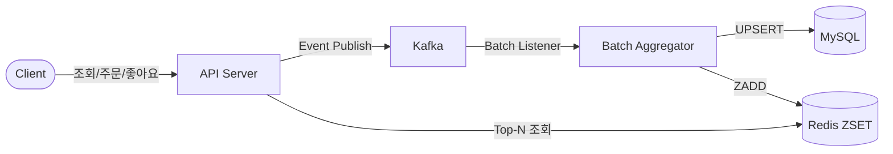
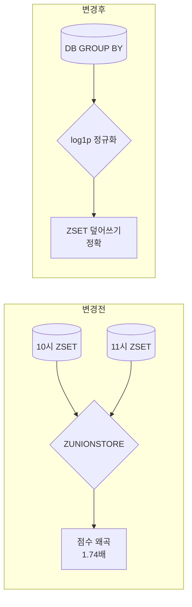
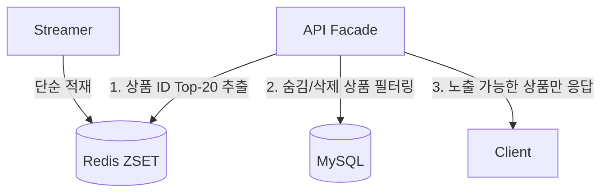
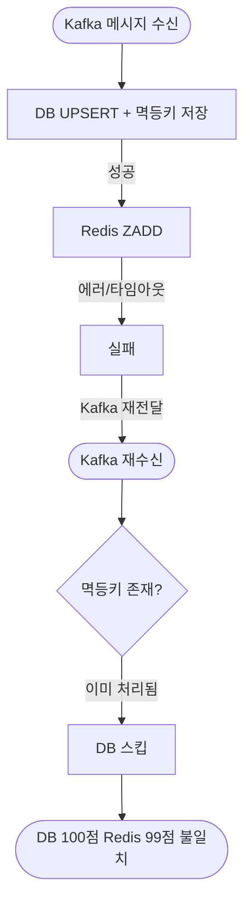
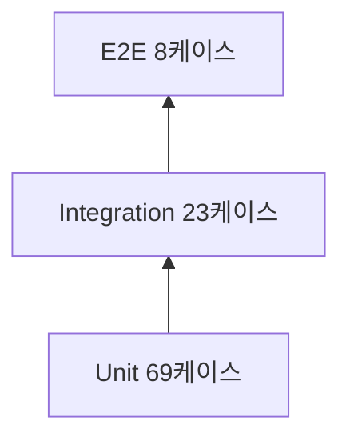

## TL;DR

- `ZINCRBY` 한 줄이면 랭킹 끝이라고 생각했는데... Kafka 재전달이 발생할 때마다 점수가 계속 누적되는 걸 보고 결국 설계를 두 번 갈아엎었다.
- 멱등성 문제는 Redis에 직접 누적하지 않고, DB 값을 기준으로 덮어쓰는 방향으로 해결했다. ZADD로 DB 값을 그대로 반영하는 구조가 생각보다 안정적이었다.
- Kafka Batch Listener를 적용하면서 DB 호출 횟수를 크게 줄일 수 있다는 걸 처음 알았다.
- k6로 부하 테스트를 직접 돌려보니 읽기(p95 4.8ms)와 쓰기(p95 3.8s)는 수백 배 이상 차이가 났다. 숫자로 보니까 왜 읽기 캐시가 중요한지 더 체감됐다.
- 테스트 100개를 작성했는데 실제로 놓치고 있던 버그 2건을 잡았다. 테스트의 필요성을 많이 느꼈다.

---

## 들어가며

대기열 시스템을 만들 때 Redis Sorted Set을 처음 써봤었다. 점수를 매기면 정렬이 자동으로 유지되는 구조라 순위를 뽑는 데 꽤 잘 맞는다고 생각했다.

첫 설계는 정말 단순했다.

> *"이벤트 들어올 때마다 ZINCRBY로 점수 누적하고, ZREVRANGE로 상위 N개 뽑으면 끝 아닌가?"*

물론, 실제로 테스트를 돌려보니 달랐다.

Kafka 재전달 한 번 터지니까 점수가 3배로 불었다. 조회/좋아요는 괜찮은데 결제 이벤트는 파티션 키가 다르다 보니 동시에 같은 DB 행을 건드리는 경합 상황이 발생했다. 성능 최적화라고 만든 Redis 병합 로직도 계산 결과가 기대와 다르게 나왔다.

한두 개가 아니라 여러 개가 터졌다. 결국 설계를 두 번 갈아엎게 됐다.

최종적으로는 **Kafka Batch Listener**로 메모리에서 먼저 합산하고, 부분 실패가 발생해도 DB 값을 기준으로 Redis를 다시 동기화하는 구조로 바꿨다. "ZINCRBY 한 줄이면 되겠다"고 생각했던 내가 순진했다.

---

### 전체 아키텍처
전체 프로젝트의 아키텍처는 아래와 같다.



---

## 랭킹 시스템, 어떻게 접근해야 할까?

### 실전에선 어떻게 쓰일까? — 이커머스 3사 랭킹 다시 보기

구현에 들어가기 전에 실제 랭킹 서비스를 제공하고 있는 서비스들을 다시 한 번 살펴봤다.  
이번에는 내부 구조를 추측하기보다는, 화면에서 확인할 수 있는 기준 위주로 정리해봤다.

- **무신사**
  - 무신사는 랭킹을 굉장히 세분화해서 보여주고 있었다. 기간도 실시간 / 일간 / 주간 / 월간 등으로 나뉘어 있고, 성별 / 연령대 / 카테고리 조합으로 필터링도 가능했다.
  - 실제 URL에도 `성별`, `카테고리`, `연령대` 같은 파라미터가 들어가 있는 걸 보면, 다양한 조건 조합으로 랭킹을 나눠서 보여주는 구조인 건 확실해 보였다.
  - 단순히 “전체 인기 상품”을 보여주기보다는, **유저 세그먼트별로 다른 랭킹을 보여주는 쪽에 더 가까운 느낌**이었다.

- **29CM**
  - 링크 기준으로 보면 `HOURLY`, `POPULARITY`, `gender`, `age` 같은 파라미터가 들어가 있어서, 기간 / 기준 / 성별 / 연령 조합으로 랭킹을 보는 구조였다.
  - 특히 `HOURLY` 같은 짧은 기간 랭킹이 있는 걸 보면, “지금 뜨는 상품”을 보여주는 데 초점을 둔 것 같았다.
  - 다만 내부적으로 어떻게 점수를 계산하는지는 알 수 없어서, 캐시나 배치 구조까지 단정하는 건 무리라고 생각했다.

- **네이버 쇼핑**
  - 네이버는 구조가 조금 달랐다. 하나의 랭킹이 아니라 **종류 자체를 나눠서 보여주는 방식**이었다.
  - "많이 본 상품", "많이 구매한 상품", "키워드 랭킹"처럼 기준이 아예 다르게 나뉘어 있었고, 각각 따로 랭킹을 만든다는 느낌이었다.
  - 또 연령대, 카테고리, 기간 같은 필터도 같이 제공하고 있어서, 단순 점수 하나로 정렬하는 구조라기보다는 **목적별 랭킹을 따로 운영하는 구조**에 가까워 보였다.

이렇게 다시 보니까, "인기 랭킹"이라고 해도 서비스마다 접근 방식이 꽤 달랐다.

어떤 곳은 **세그먼트(성별/연령/카테고리)를 나누는 데 집중**하고,  
어떤 곳은 **랭킹 종류 자체를 나누는 방식**을 선택하고 있었다.

이번 구현에서는 이걸 전부 다 따라가기보다는,  
**일간 시간 윈도우 + 다중 지표(조회/좋아요/주문) 합산**이라는 가장 기본적인 형태부터 만들어보는 데 집중했다.

### 랭킹 시스템이 실제로 해결해야 하는 것

랭킹은 점수 순서대로 나열하는 것처럼 보이지만, 구현에 들어가면 생각보다 많은 결정이 앞에 기다리고 있다.

**무엇으로 점수를 만들 것인가**
조회수, 좋아요, 구매 건수, 구매 금액 — 어떤 지표를 쓰느냐에 따라 랭킹의 성격이 완전히 달라진다. 조회 위주면 화제성 상품이 올라오고, 구매 위주면 실제 매출 기여 상품이 올라온다. 가중치도 마찬가지다. 주문 한 건이 조회 100번보다 중요한가, 아닌가.

**얼마나 자주 갱신할 것인가**
실시간으로 반영하면 데이터가 살아있지만 서버 부하가 크다. 배치로 집계하면 안정적이지만 최신성이 떨어진다. "1시간 전 기준"이 현재 유저에게 의미 있는 랭킹인지는 비즈니스 판단이다.

**어떤 기간 단위로 묶을 것인가**
일간? 주간? 실시간? 기간이 짧을수록 최신 트렌드를 반영하지만 노이즈도 많다. 기간이 길면 안정적이지만 "지금 핫한 상품"보다 "오래 잘 팔린 상품"에 가까워진다.

**자정이 넘으면 어떻게 할 것인가**
어제 잘 팔린 상품이 오늘 0시에 순위 0위가 되어야 할까? 이전 점수를 완전히 리셋할지, 일부 이월할지도 결정해야 한다. 리셋하면 새벽 랭킹이 텅 비고, 이월하면 어제 인기가 오늘에도 영향을 준다.

이 네 가지를 먼저 정해야 기술 스택 선택도 따라온다. 이번 구현에서는 **다중 지표(조회/좋아요/주문금액) + 일간 단위 + 1시간 버킷 집계 + 전날 점수 1% 이월**로 방향을 잡았다.

### 왜 RDB만으로는 안 되는가?

랭킹을 구현한다고 했을 때 가장 먼저 떠올릴 수 있는 방법은 `GROUP BY + ORDER BY`로 DB에서 직접 순위를 뽑는 것이다.

그런데 랭킹은 대부분 홈 화면에 노출되는 영역이라, 자연스럽게 **읽기 트래픽이 매우 많은 구조**가 된다. 데이터가 쌓일수록 집계 쿼리는 점점 무거워지고, 이는 사용자 경험에도 영향을 줄 수 있다.

Redis Sorted Set은 정렬을 자료구조 레벨에서 지원한다.

```
삽입/수정: O(log N)
순위 조회: 필요한 범위만 조회하기 때문에 Top-20 기준에서는 거의 일정 시간에 가깝게 빠르게 동작한다.
```

캐시 레이어에서 빠르게 조회할 수 있고, 정렬까지 함께 해결되기 때문에 랭킹에 적합한 구조라고 판단했다.

---
## 고민했던 부분들
### 1. ZINCRBY의 실시간성 vs ZADD의 복원력

Kafka Consumer가 받은 이벤트를 Redis에 어떻게 반영할 것인가. 첫 번째 고민이었다.

**처음부터 ZINCRBY로 시작했다.** 구현이 정말 단순했다.

```python
# 이벤트 수신하면 바로 점수 누적
ZINCRBY(key, increment, member)
```

코드는 깔끔했다. 하지만 테스트해보니 바로 문제가 터졌다. Kafka 재전달이 발생할 때마다 점수가 계속 불었다. 한 번 들어온 이벤트가 재전달되면 두 번 누적되고, 또 재전달되면 세 번 누적된다. **멱등성이 보장되지 않는다는 걸 깨달았다.**

그럼 ZADD로 바꾸면 어떨까? DB를 source of truth로 두고, Redis는 그냥 DB 값을 복사본처럼 덮어쓰는 방식이다.

| 접근 방식 | 장점 | 단점 |
|---|---|---|
| **[Option A] ZINCRBY**<br>(점수 누적) | 구현 단순, 실시간 반영 | Kafka 재전달 시 점수 중복 누적<br>- **멱등성 보장 어려움** |
| **[Option B] ZADD**<br>(DB 원장 덮어치기) | DB 값을 기준으로 동기화<br>- **멱등성 문제를 크게 줄일 수 있음** | 매번 DB를 거쳐야 해서<br>부하 증가 가능성 |

데이터가 틀어지는 걸 감수할 수는 없었다. **Option B**를 선택했다.

대신 부담이 되었던 DB 부하는 **Kafka `@KafkaListener(batch = true)`** 로 완화했다. Consumer가 폴링한 이벤트들을 메모리에서 먼저 합산한 뒤, 배치 단위로 DB에 반영하는 방식이다.

> **배치 압축이 뭐 하는 건가?**
> - **이전 (단건 처리):** 이벤트 1건마다 DB 처리 → 호출 횟수 증가
> - **이후 (배치 처리):** 이벤트 N건을 모아서 처리 → DB 호출 횟수 감소

실제로 k6 부하 테스트로 검증했다. view/like/unlike 이벤트 49,974건을 최대 1,000 VU로 쏘아보냈을 때 **HTTP 에러율 0%** 를 유지했고, 초당 385 req/s를 처리할 수 있었다.

근데 응답 속도는 다른 문제였다. p95 응답시간이 3,839ms로 임계값(80ms)을 한참 초과했다.

> **"에러가 없다고 해서 문제가 없는 건 아니었다."**

데이터 손실은 없지만 지연이 심했다. 이건 별도 개선 과제로 남겨뒀다.

---

### 2. 결제 이벤트의 배신 — 파티션 키가 다르다

ZADD 방식으로 방향을 정했다. 그런데 구현하는 과정에서 또 다른 문제가 드러났다.

개발할 때 가정했던 게 있다.

> "어차피 Kafka 파티션 키가 `productId`로 잡혀있으니까, 같은 상품은 항상 같은 파티션에서 순서대로 처리되겠지."

`조회/좋아요` 이벤트는 `productId` 기반 파티셔닝이었다. 괜찮았다.

**근데 결제 이벤트는 달랐다.**

장바구니 결제 특성상 **`orderId` 기반**으로 여러 파티션에 분산되어 들어간다. 그래서 같은 상품을 두 명이 동시에 결제하면?

```mermaid
sequenceDiagram
  participant P1 as 파티션 2 (스레드 α)
  participant P2 as 파티션 5 (스레드 β)
  participant DB as MySQL DB

  Note over P1, P2: 동일 상품(#1) 결제 동시 발생
  P1->>DB: DB 조회 및 업데이트 시도
  P2->>DB: DB 조회 및 업데이트 시도
  Note over DB: 동시 접근으로 인한 (product_id, bucket_hour) 행 업데이트 경합!
 ```

서로 다른 스레드가 같은 (product_id, bucket_hour) 행에 접근하게 된다. 애플리케이션 레벨에서 read → 가공 → write로 처리하면, 두 스레드가 같은 값을 읽은 뒤 각각 +1하여 덮어쓰는 **lost update**가 발생한다.

> **Lost Update?**
> Thread A: read(100) → +1 → write(101)
> Thread B: read(100) → +1 → write(101)  
> 결과: 101 (기대값: 102)

그럼 DB 네이티브 쿼리를 써야 한다. UPDATE ... SET count = count + 1 방식이면, read와 write가 하나의 쿼리 안에서 처리된다.

```sql
INSERT INTO product_metrics_hourly (product_id, bucket_hour, view_count, like_count, order_count, order_amount)
VALUES (:pid, :bh, GREATEST(:vd, 0), GREATEST(:ld, 0), GREATEST(:od, 0), GREATEST(:oa, 0))
ON DUPLICATE KEY UPDATE
  view_count    = GREATEST(view_count + :vd, 0),
  like_count    = GREATEST(like_count + :ld, 0),
  order_count   = GREATEST(order_count + :od, 0),
  order_amount  = GREATEST(order_amount + :oa, 0)
```

데이터베이스 엔진이 내부적으로 동시성 제어를 해주니까, 다중 쓰기 상황에서도 값이 누락되지 않는다. JPA 엔티티 중심에서 벗어나 Native Query를 쓰게 된 점은 좀 아쉬웠지만, 경합을 처리하는 데엔 가장 확실한 방법이었다.

MySQL Testcontainer 위에서 ProductMetricsHourlyRepositoryImplIntegrationTest 7케이스로 검증했다. 다중 쓰기 상황에서도 데이터가 정상적으로 누적됐다.

**그런데 k6 테스트에서 한계가 드러났다.**

상품 1개에 70% 트래픽을 집중시키자(Hot Product 시나리오) p95가 585ms로 상승했다. 정확도는 유지됐지만(view 드리프트 +1.05%), 극단적인 경합 상황에서는 DB 행 락 대기가 발생한다는 걸 확인할 수 있었다.

---

### 3. ZUNIONSTORE의 수학적 불일치

Lost Update 문제를 해결했으니, 이제 성능을 더 끌어올릴 차례였다. 일간 랭킹 조회를 더 빠르게 하려면 어떻게 할까?

일간 랭킹 성능을 높이려고 이런 구조를 설계했다.

> "1시간 단위로 ZSET을 캐시해두고, 조회할 때 `ZUNIONSTORE`로 합치면 DB를 안 거치면 되지 않을까?"

좋은 아이디어라고 생각했는데, 직접 계산해보니 결과가 달랐다.

우리는 점수 차이가 과도하게 벌어지는 걸 막기 위해 `log1p()`로 점수를 보정하고 있었다. 값이 커질수록 증가 폭을 완만하게 만드는 함수다.

**문제는 여기서 터졌다.** 시간대별로 나눠서 계산한 뒤 합치면 결과가 달라진다.

> 똑같이 200건 팔린 상품 A, B를 봐보자.
>
> - **상품 A** (오전 100건 + 오후 100건): 시간대별로 계산 후 합산  
>   `log1p(100) + log1p(100)` ≈ **9.21점**
> - **상품 B** (하루 200건 한 번에):  
>   `log1p(200)` ≈ **5.30점**
>
> 동일한 판매량인데 A가 B보다 1.74배 더 높은 점수를 받는다.

비선형 함수(log1p)는 이렇게 작동한다. 나눠서 계산한 값을 단순 합산하면 순위가 왜곡된다.

그래서 ZUNIONSTORE로 시간대별 캐시를 합치는 방식은 **현재 점수 계산 방식과 맞지 않았다.**



실제로 `RankingScoreCalculatorTest` 10개 케이스를 작성해서 검증했다. 특히 과제 조건인 "주문 1건(10,000원) > 좋아요 3건"이 의도대로 반영되는지 단위 테스트와 통합 테스트로 확인했다.

점수 계산의 정확성은 확보했다. 하지만 또 다른 질문이 생겼다. 이미 반영된 과거의 액션(좋아요)을 취소하면 어디까지 보정해야 할까?

---

## 4. '좋아요 취소'의 완벽한 추적 vs 살아있는 트렌드

과거에 누른 좋아요를 오늘 취소하면 어디까지 반영해야 할까?

**완전히 추적**하려면 과거 시간대로 돌아가서 마이너스 처리하고, 이후의 점수를 전부 다시 계산해야 한다. 이 방식은 구현 복잡도와 리소스 비용이 크게 증가한다.

**현재 시점에 반영**하면 어떨까? 이전에 좋아요가 없던 상품의 경우 카운터가 음수가 되는 문제가 생길 수 있다.

이 부분은 꽤 오래 고민했던 지점이었다. 현업에서도 결국 비즈니스 목적에 따라 정책이 달라질 수 있는 영역이라고 생각한다.

> "과거를 정확하게 고칠 것인가, 지금 흐름을 빠르게 반영할 것인가?"

랭킹은 금융 시스템처럼 1점도 틀리면 안 되는 영역은 아니다. 완벽한 정합성을 유지하기보다는, 현재 유저 반응을 빠르게 반영하는 쪽이 더 중요하다고 판단했다.

결론적으로 현재 시간 버킷에 음수 취소를 반영하되, Native UPSERT에 방어 로직을 추가했다.

```sql
ON DUPLICATE KEY UPDATE
  like_count  = GREATEST(like_count + :ld, 0)
-- 0 미만은 0으로 clamp (view_count, order_count, order_amount 에도 동일 가드 적용)
```

이 구조로 구현하면서 자연스럽게 얻은 장점도 있었다. Kafka Batch 처리 과정에서 짧은 시간 내에 발생한 +1과 -1이 메모리에서 먼저 상쇄된다. 즉, 일부 취소 이벤트는 DB까지 내려가기 전에 배치 내부에서 정리된다.

통합 테스트에서 insertNegativeLikeClamped 케이스를 실제 MySQL 환경에서 실행해보니, 음수 값이 0으로 정상적으로 보정되는 것을 확인했다.

점수 계산과 누적 문제는 풀었다. 이제 운영 측면의 고민이 생겼다.

---

### 5. 도메인 강결합 피하기 — 필터링의 책임을 어디에 둘 것인가

관리자가 상품을 숨김 처리했는데, 이미 랭킹 ZSET에 올라가 있는 상품은 어떻게 하지?

처음 생각은 Kafka 집계 과정에서 상품 DB를 JOIN해서 "살아있는 상품만" 점수를 반영하는 방식이었다.

**근데 이건 문제가 있었다.** Streamer(Kafka 처리 모듈)가 Main DB 스키마에 직접 의존하게 된다. 상품 테이블이 변경되면 Streamer도 함께 수정해야 하고, 배포 순서까지 고려해야 한다.

그래서 필터링 책임을 마지막 읽기 경로에 두기로 했다. **API가 응답할 때 숨김 상품을 걸러내는 방식이다.**



이 방식은 장점이 있다. Streamer는 메인 DB 스키마 변경에 영향 받지 않는다. 두 서비스 간 책임도 명확하게 분리된다.

대신 결과가 20개가 아니라 19개가 될 수도 있다. 그건 비즈니스 요구사항에 따라 받아들일 수 있는 수준이었다.

실제로 E2E 테스트에서 숨김 상품이 포함된 ZSET을 조회했을 때, 해당 상품만 제외된 상태로 정상 응답이 내려오는 걸 확인했다.

이제 남은 문제는 이 모든 구조가 실제로 장애 상황에서도 견딜 수 있는가였다.

---

## 6. 부분 실패(Partial Failure) 시 Redis 자가 복구

테스트를 진행하면서 가장 까다로웠던 케이스 중 하나였다.



Kafka 재전달이 발생했을 때, 일부 경우에는 오히려 Redis 값이 복구되지 않는 상황이 발생했다.

이 문제를 해결하기 위해 DB 쓰기와 Redis 쓰기의 멱등 적용 범위를 분리하기로 했다.

```java
// 배치의 모든 product ID — Redis 동기화는 전원 대상
Set<Long> productIdsToSync = batchAggregator.extractProductIds(records);

// DB INSERT는 멱등 필터 적용 (중복 방지)
List<ConsumerRecord<...>> fresh = filterAlreadyHandled(records);
if (!fresh.isEmpty()) {
persistDeltas(batchAggregator.aggregateCatalog(fresh));
        }

// Redis ZADD는 멱등 필터와 무관하게 수행 — DB 스냅샷 기준으로 덮어쓰기
publishScores(recalculateFromSnapshot(productIdsToSync));
//                                      ↑ 재전달 상황에서도 DB 기준으로 다시 동기화                                
```

이 구조에서는 Kafka 재전달이 발생하더라도 Redis는 DB 스냅샷을 기준으로 다시 동기화된다. 따라서 일시적인 인프라 장애 이후에도 별도의 복구 작업 없이 캐시 상태를 맞출 수 있었다.

`RankingAggregationServiceTest.allAlreadyHandled` 단위 테스트에서 "전부 이미 처리된 배치라도 DB UPSERT는 건너뛰지만 ZADD는 반드시 호출된다"는 동작을 Mockito verify로 검증했다.

---

## 테스트가 실제로 잡아낸 것들

위에서 내린 결정들은 테스트로 확인하기 전까지는 가설에 가까웠다.

총 16개 파일, **100개 케이스(Unit 69 / Integration 23 / E2E 8)** 를 작성했다. `--rerun-tasks`로 강제 재실행해도 failures=0, errors=0으로 모두 통과했다.



### 레이어별 실행 비용

| 유형 | 케이스 | Suite time | 평균 |
|---|---|---|---|
| Unit | 69 | 0.402s | 6ms |
| Integration | 23 | 1.399s | 61ms |
| E2E | 8 | 1.338s | 167ms |

`BatchAggregatorTest` 15케이스는 0.054s 안에 실행된다. 로직을 수정하고 바로 결과를 확인할 수 있어서 TDD 피드백 루프를 돌리기에 충분히 빠른 수준이었다.

반면 전체 실행 시간(벽시계 기준)은 3m 1s였다. 대부분의 시간은 JVM 부팅, Spring Context 로드, Testcontainers 기동에서 소모된 것으로 보인다.


### 테스트가 먼저 잡아낸 버그 2건

**버그 1. 보이지 않았던 `@Transactional` 누락**

`ProductMetricsHourlyRepositoryImpl` 내부의 UPSERT 쿼리에 `@Transactional`이 누락되어 있었다. 이미 상위 레이어인 `RankingAggregationService`에서 트랜잭션이 감싸지고 있어서 겉으로는 정상 동작하는 것처럼 보였다.

하지만 이 상태로 배포된 뒤 다른 서비스에서 해당 Repository를 직접 호출했다면, 런타임에서 `TransactionRequiredException`이 발생할 가능성이 있었다. 코드만으로는 쉽게 드러나지 않는 문제였는데, 통합 테스트를 통해 확인할 수 있었다.

---

**버그 2. 인증 경로 누락**

`RankingV1ApiE2ETest` 6케이스가 처음 실행되었을 때 전부 **401 UNAUTHORIZED**로 실패했다. `WebMvcConfig.excludePathPatterns`에 `/api/v1/rankings`가 빠져 있어 `MemberAuthInterceptor`가 인증 헤더를 요구하고 있었던 것이다.

이 문제는 단위 테스트에서는 드러나지 않고, 실제 HTTP 요청 흐름을 타는 E2E 테스트에서만 확인할 수 있었다. 인증, 라우팅 같은 계약 수준의 문제는 E2E 레이어에서 검증이 필요하다는 걸 이번 테스트를 통해 느꼈다.

---

## k6 테스트 — 읽기와 쓰기는 수백 배 차이

테스트가 "설계대로 동작하는가"를 검증했다면, k6는 "실제 트래픽에서 얼마나 버틸 수 있는가"를 확인하는 과정이었다.

4개 시나리오, 총 333,525 req를 쏘아봤다.

| 시나리오 | p50 | p95 | 에러율 | 임계값 |
|---|---|---|---|---|
| A-1. 랭킹 Top-N 읽기 | 2.2ms | **4.8ms** | 0.00% | 전체 PASS |
| A-2. 상품 상세 + dailyRank | 10.3ms | **21.3ms** | 0.00% | 전체 PASS |
| A-3. 쓰기 파이프라인 (1,000 VU) | 2,008ms | **3,839ms** | 0.00% | p95 FAIL |
| A-4. Hot Product 경합 (70% 집중) | 32.3ms | **585.5ms** | 0.01% | p95 FAIL |

---

### 읽기는 충분히 빠르다

랭킹 조회(A-1) p95 **4.8ms** — 임계값 150ms 대비 여유가 있는 수준이다. Redis ZREVRANGE가 대부분의 조회를 처리하고 있기 때문에 빠르게 응답하는 것으로 보인다.

상품 상세에 추가한 `ZREVRANK` 오버헤드(A-2)는 p95 기준 약 5~10ms 수준으로, 전체 응답 시간에 큰 영향을 주지는 않았다.

---

### 쓰기는 병목이 있다

1,000 VU 쓰기 파이프라인(A-3)에서 p95가 3,839ms로 측정되었다. 임계값(80ms)을 크게 초과한 수치다.

에러율은 0%였지만, 120,025건(74%)의 이터레이션이 드롭된 것을 보면 시스템이 요청을 처리하는 속도를 따라가지 못하고 있는 상태로 보인다.

> **"에러가 없다고 해서 문제가 없는 것은 아니다"**

응답은 성공했지만 지연이 크게 발생하고 있었고, 평균 2,116ms 수준의 latency가 측정되었다. MySQL 커넥션 풀 대기나 Kafka `send()` 지연 등이 원인일 가능성이 있다고 보고 있다.

---

### Hot Product 집중 경합

상품 1개에 70% 트래픽을 집중시키자(A-4) p95 585ms로 증가했다. Native UPSERT 방식 특성상, 특정 row에 트래픽이 몰리면 DB 레벨에서 락 대기가 발생하는 것을 확인할 수 있었다.

집계 정확도는 유지됐다 — view 드리프트 +1.05%는 측정 오차 범위 내라고 판단했다.

---

### 읽기와 쓰기 차이를 확인하고 나니

읽기(p95 4.8ms)와 쓰기(p95 3,839ms)는 수백 배 이상 차이가 났다.

초기에 Redis ZSET을 선택한 이유가 "읽기 트래픽이 압도적으로 많을 것"이라는 가정이었는데, k6 결과를 통해 이 가정이 크게 틀리지 않았다는 걸 확인할 수 있었다.

읽기는 Redis가 빠르게 처리하고, 쓰기는 Kafka 배치 처리로 DB 부하를 줄이는 구조 자체는 유효한 방향이라고 판단했다.

남아있는 쓰기 지연 문제는 커넥션 풀 튜닝이나 Hot Key 대응 전략으로 추가 개선이 필요하다.

---

## 마치며

"점수에 1 더하면 끝 아닌 건가?"라는 생각으로 시작했지만, 실제로는 고민해야 할 문제가 훨씬 많았다. 처음에는 랭킹이 이렇게 민감한 기능인지 몰랐다.

단순히 숫자 증감이라고 생각했는데, 쇼핑몰 홈 화면에서 가장 먼저 보이는 영역이 랭킹이다. 유저 입장에서는 "지금 제일 잘 팔리는 게 뭔지"를 판단하는 기준이고, 판매자 입장에서는 노출 여부가 매출에 직접적인 영향을 준다.

그래서 점수 계산이 틀리거나 캐시가 꼬이면 단순히 화면이 이상해지는 문제가 아니라, 실제 비즈니스에도 영향을 줄 수 있다는 걸 뒤늦게 깨달았다.

이걸 인식하고 나니 설계 선택지들이 다르게 보이기 시작했다. `ZINCRBY`가 구현은 간단하지만 멱등성이 보장되지 않는다면 사용할 수 없다는 판단도 자연스럽게 이어졌고, 테스트 역시 번거롭더라도 반드시 필요한 과정이라는 걸 느꼈다.

실제 서비스에서는 회사의 비즈니스 목표나 팀의 정책랭에 따라 다른 선택을 할 수도 있을 것 같다. 이번 구현은 그중 하나의 방향을 직접 경험해본 과정이었다.

"어디까지 정확해야 할까?"라는 질문도 계속 고민하게 됐다.

좋아요 취소로 인해 발생하는 작은 오차는 감수할 수 있지만, 집계 자체가 누락되는 상황은 막아야 했다. 숨김 상품 때문에 결과가 19개가 되는 건 괜찮지만, 순위 자체가 틀리는 건 허용할 수 없었다.

이처럼 기능마다 허용할 수 있는 오차의 종류와 범위가 다르고, 그 기준을 정하는 과정이 생각보다 어렵다는 걸 느꼈다. 직접 구현해보지 않았다면 잘 몰랐을 부분이었다.

요구사항에 따라 설계가 달라지고, 그 설계는 결국 비즈니스에 영향을 준다. 이번 경험을 통해 내가 만드는 기능 하나하나가 생각보다 더 중요한 의미를 가진다는 걸 느끼게 됐다.