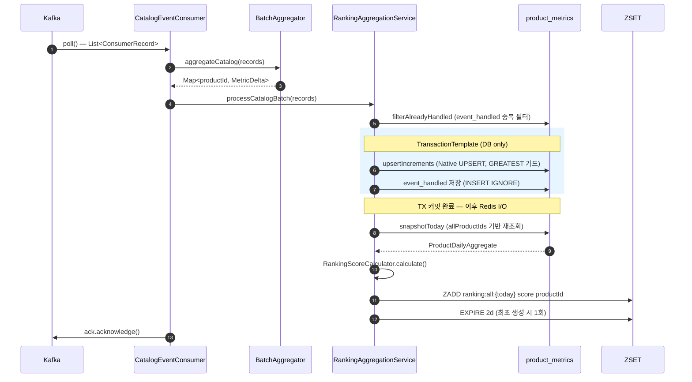
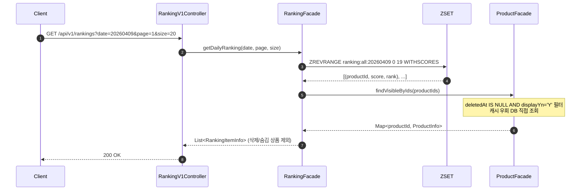
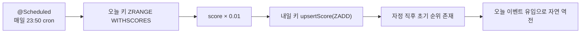
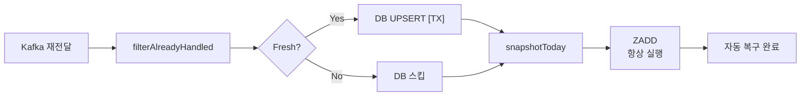

## 📌 Summary

- **배경**: 사용자의 행동에 대해 Kafka → commerce-streamer 으로 `product_metrics`에 이벤트를 집계하고 있었으나, 랭킹 정보를 API로 제공하는 수단이 없었습니다. RDB `GROUP BY + ORDER BY` 방식은 트래픽이 많아질수록 병목이 되며, 랭킹 특성상 높은 조회 빈도가 DB 과부하로 이어질 수 있습니다.
- **목표**: Redis ZSET을 기반으로 실시간 랭킹 집계 파이프라인을 구축하고, 일간 인기 상품 Top-N API와 상품 상세의 순위 정보를 제공합니다.
- **결과**: Kafka 배치 리스너가 `product_metrics` 집계 → 점수 재계산 → ZADD 덮어쓰기를 메시지를 받을 때마다 수행하며, commerce-api는 단순 `ZREVRANGE` / `ZREVRANK`만으로 랭킹을 응답합니다. 신규 100개 테스트 ALL PASS, k6 쓰기 처리량 시나리오(A-3) 실측 완료.


## 🧭 Context & Decision

### 문제 정의
- **현재 동작/제약**: `product_metrics`가 누적값만 저장하는 구조(`productId` 단일 키)라 "오늘 하루 얼마나 발생했는지"를 뽑아낼 수 없었습니다. API 요청마다 DB `GROUP BY`로 집계하면 트래픽이 늘수록 응답이 느려집니다.
- **문제(또는 리스크)**: ZSET에 점수를 어떻게 반영할지(ZINCRBY vs 재계산 ZADD), 점수 계산을 어디서 할지(API 요청 시점 vs Consumer), 자정 직후 랭킹이 비어있는 구간을 어떻게 채울지, Redis 쓰기가 실패했을 때 복구가 안 되는 문제를 어떻게 막을지.
- **성공 기준(완료 정의)**: 이벤트 발생 → ZSET 반영 → API 조회까지 E2E 정상 동작, 가중치 적용이 의도대로 반영(주문 1건 > 좋아요 3건), 일자 변경 후 이전 날짜 조회 정상 동작

### 선택지와 결정

#### 1. ZSET 점수 반영 방식: ZINCRBY vs 재계산 ZADD

- 고려한 대안:
    - **A: ZINCRBY** — 이벤트마다 가중치를 곱한 점수를 Redis에 바로 증분. 구현 단순, DB 부하 없음.
    - **B: product_metrics 재조회 → 점수 계산 → ZADD 덮어쓰기** — DB를 데이터 원장으로 유지하고, 집계값을 기반으로 매번 점수를 다시 계산하여 ZSET에 덮어씁니다.
- **최종 결정**: B — 재계산 ZADD
- **트레이드오프**: DB 조회 비용이 추가되지만, Kafka 배치 리스너로 여러 건을 묶어 1회 처리하여 실제 부하를 줄입니다. ZINCRBY는 메시지가 중복으로 전달될 수 있는 환경에서 점수가 부풀려지고, Redis 장애 후 복구 시 별도 작업이 필요합니다.
- **판단 근거**: `event_handled` 중복 처리 방지와 방향이 맞으며, 가중치 공식이 바뀌어도 DB 기반으로 ZSET을 언제든 다시 만들 수 있습니다. 멘토링에서도 "ZINCRBY는 데이터 유실 시 복구가 어려우므로 집계값 재조회 후 ZADD 덮어쓰기를 권장"한다고 확인했습니다.

#### 2. 아키텍처 전환 — Consumer 직접 ZADD vs API 요청 시점 집계

초기에는 `hour bucket ZSET → ZUNIONSTORE SUM으로 일간 파생` 방식을 검토하다 수학적 문제를 발견했습니다.

```
hour1: view 10 → bucket_score = 0.1 * log1p(10) ≈ 0.240
hour2: view 10 → bucket_score = 0.1 * log1p(10) ≈ 0.240
ZUNIONSTORE SUM                                  ≈ 0.480
하지만 올바른 일간 점수:
0.1 * log1p(20)                                  ≈ 0.304
```

`log1p(A) + log1p(B) ≠ log1p(A + B)` — hour bucket마다 log를 적용한 뒤 합산하면 "꾸준한 활동 상품"이 과대평가되는 편향이 생깁니다. 이 함정을 피하려고 **"Consumer는 DB UPSERT만, API 요청 시점에 DB GROUP BY → Java 점수 계산 → ZSET 캐시"**로 한 번 전환했다가, 멘토링 원칙 재확인 후 **"일간 단일 키에 raw count를 DB에서 합산하고 log는 1회만 적용, Consumer가 ZADD 엎어치기"**로 최종 복귀했습니다.

- **최종 결정**: Kafka 배치 리스너(commerce-streamer)가 ZSET을 상시 갱신, commerce-api는 단순 읽기
- **트레이드오프**: "API 요청 시점 집계" 방식에 비해 쓰기 쪽 구현이 복잡해지지만, 읽기 경로가 단순 `ZREVRANGE` 한 번으로 줄어들고, 동시 요청이 몰릴 때 DB에 집계 부하가 쏟아지는 문제가 원천적으로 사라집니다.

#### 3. product_metrics 스키마 — 복합키(productId, bucket_hour) 도입

- 고려한 대안:
    - **A: 이벤트 로그** — 이벤트 1건 = 1 row. 완전한 원본 보존이지만 스토리지 폭증, GROUP BY 부하.
    - **B: 일별 집계** — `(productId, date)` 복합키. 단순하지만 시간 단위 랭킹 불가.
    - **C: 시간 단위 집계** — `(productId, bucket_hour)` 복합키. 일간은 24개 bucket 합산으로 파생, Nice-To-Have "1시간 랭킹"도 동일 구조로 커버.
- **최종 결정**: C — 시간 단위 집계 (`bucket_hour = LocalDateTime.now().truncatedTo(HOURS)`)
- **트레이드오프**: 일간 조회 시 시간 단위 행들을 합산해야 하지만, `WHERE bucket_hour BETWEEN :start AND :end` 범위 조건 하나로 처리되며, 상품 10만 × 2일 ≈ 480만 row 수준으로 MySQL 인덱스 범위 조회가 충분히 감당 가능합니다.
- **추후 개선 여지**: R10 주간/월간 집계 시 동일한 `bucket_hour` 범위만 확장하면 재활용 가능합니다.

#### 4. Redis 쓰기 실패 시 자동 복구 — DB 중복 필터와 Redis 갱신 책임 분리

Redis ZADD 중 예외가 발생해 잡힌 경우, DB는 커밋되었지만 Kafka ack가 전송되지 않아 메시지가 재전달됩니다. 기존 로직에서는 재전달된 메시지가 `filterAlreadyHandled`를 거치면서 전부 "이미 처리된 것"으로 판정되어 Redis ZADD까지 건너뛰어 **자동 복구가 불가능**했습니다.

- **최종 결정**: DB 중복 처리 방지 필터와 Redis 갱신 책임을 분리. ZADD는 같은 값을 여러 번 써도 결과가 동일하므로, 신규 이벤트 여부와 무관하게 항상 최신 DB 값으로 ZSET을 덮어씁니다.
- **추후 개선 여지**: Redis가 장시간 다운될 경우 메시지 처리가 밀릴 수 있음 → 복구 후 `event_handled` 기반 중복 방어 하에서 자동 재처리됩니다.

#### 5. Native UPSERT 도입 — order-events 파티션 키 분산 문제

`catalog-events`는 `productId`가 파티션 키라 같은 상품의 이벤트가 항상 같은 Consumer에서 순서대로 처리됩니다. 반면 `order-events`는 `orderId`가 파티션 키라 같은 상품이 서로 다른 주문에 포함되면 여러 파티션/Consumer로 분산됩니다. 기존 `findById → 증감 → save` 패턴은 여러 Consumer가 동시에 같은 행에 쓰려 할 때 DuplicateKeyException 또는 한쪽 변경이 사라지는 문제를 유발할 수 있습니다.

- **최종 결정**: `INSERT ... ON DUPLICATE KEY UPDATE`로 DB 수준 원자 연산 처리. `GREATEST(like_count + :delta, 0)` 처리로 좋아요 취소 시 음수 저장 방지.
- **추후 개선 여지**: `order-events` 파티션 키를 `productId`로 변경하는 근본 해결은 이벤트를 여러 상품으로 나눠 발행하는 구조 재설계가 필요하여 다음 과제로 문서에만 보존했습니다.


## 🏗️ Design Overview

### 변경 범위
- **영향 받는 모듈/도메인**: `commerce-streamer` — Metrics 도메인(스키마 전환), Ranking 도메인(신규) / `commerce-api` — Ranking 도메인(신규), Product 도메인(상품 순위 조회 추가)
- **신규 추가**:
    - `RankingScoreCalculator`, `RankingWeights(@ConfigurationProperties)`, `RankingKey`
    - `RankingWriter` / `RedisRankingWriter` (ZADD + 보관 기간 TTL)
    - `RankingCarryOverScheduler` (매일 23:50 점수 이월)
    - `BatchAggregator` (한 번에 받아온 메시지를 상품별로 합산)
    - `RankingAggregationService.processCatalogBatch()` (Redis 자동 복구 설계 포함)
    - `RankingRepository` / `RedisRankingRepository` (ZREVRANGE, ZREVRANK)
    - `RankingFacade`, `RankingV1Controller`, `GET /api/v1/rankings`
    - `ProductFacade.findVisibleByIds()` (논리 삭제 + 숨김 상품 필터, 캐시 없이 DB 직접 조회)
    - `ProductV1Controller` — 상품 상세 응답에 `dailyRank` 추가
- **제거/대체**:
    - `MetricsEventService` — 이벤트 단건 처리에서 배치 리스너 기반 `processBatch()`로 전환
    - `ProductMetrics` 스키마 — 단일 키(productId)에서 복합 키(productId, bucket_hour)로 재설계 (테이블 삭제 후 재생성)

### 주요 컴포넌트 책임

| 컴포넌트 | 모듈 | 역할 요약 |
|---|---|---|
| [`BatchAggregator`](https://github.com/jsj1215/loop-pack-be-l2-vol3-java/blob/jsj1215/volume-9/apps/commerce-streamer/src/main/java/com/loopers/application/ranking/BatchAggregator.java) | streamer | N건 이벤트 → 상품별 합산, 1회 DB/Redis 접근으로 처리량 향상 |
| [`RankingAggregationService`](https://github.com/jsj1215/loop-pack-be-l2-vol3-java/blob/jsj1215/volume-9/apps/commerce-streamer/src/main/java/com/loopers/application/ranking/RankingAggregationService.java) | streamer | 중복 필터 → DB UPSERT [TX] → snapshotToday → ZADD [TX 밖], 자동 복구 포함 |
| [`RankingScoreCalculator`](https://github.com/jsj1215/loop-pack-be-l2-vol3-java/blob/jsj1215/volume-9/apps/commerce-streamer/src/main/java/com/loopers/domain/ranking/RankingScoreCalculator.java) | streamer | `0.1·log1p(view) + 0.2·log1p(like) + 0.7·log1p(orderAmount)`, null·음수 방어 |
| [`RedisRankingWriter`](https://github.com/jsj1215/loop-pack-be-l2-vol3-java/blob/jsj1215/volume-9/apps/commerce-streamer/src/main/java/com/loopers/infrastructure/ranking/RedisRankingWriter.java) | streamer | ZADD + 최초 생성 시 EXPIRE 2d |
| [`RankingCarryOverScheduler`](https://github.com/jsj1215/loop-pack-be-l2-vol3-java/blob/jsj1215/volume-9/apps/commerce-streamer/src/main/java/com/loopers/application/ranking/RankingCarryOverScheduler.java) | streamer | 매일 23:50 score × 0.01 이월, 자정 직후 콜드 스타트 완화 |
| [`ProductMetricsHourlyRepositoryImpl`](https://github.com/jsj1215/loop-pack-be-l2-vol3-java/blob/jsj1215/volume-9/apps/commerce-streamer/src/main/java/com/loopers/infrastructure/metrics/ProductMetricsJpaRepository.java) | streamer | `ON DUPLICATE KEY UPDATE`, 동시 쓰기 안전, GREATEST 음수 방지 |
| [`RedisRankingRepository`](https://github.com/jsj1215/loop-pack-be-l2-vol3-java/blob/jsj1215/volume-9/apps/commerce-api/src/main/java/com/loopers/infrastructure/ranking/RedisRankingRepository.java) | api | ZREVRANGE/ZREVRANK, 1-based 순위 변환, 순위권 밖 null |
| [`RankingFacade`](https://github.com/jsj1215/loop-pack-be-l2-vol3-java/blob/jsj1215/volume-9/apps/commerce-api/src/main/java/com/loopers/application/ranking/RankingFacade.java) | api | ZREVRANGE + findVisibleByIds 조합, 삭제/숨김 상품 제외 |
| [`ProductFacade.findVisibleByIds`](https://github.com/jsj1215/loop-pack-be-l2-vol3-java/blob/jsj1215/volume-9/apps/commerce-api/src/main/java/com/loopers/application/product/ProductFacade.java) | api | `deletedAt IS NULL AND displayYn='Y'` DB 직접 조회, 캐시 미사용 |
| [`RankingV1Controller`](https://github.com/jsj1215/loop-pack-be-l2-vol3-java/blob/jsj1215/volume-9/apps/commerce-api/src/main/java/com/loopers/interfaces/api/ranking/RankingV1Controller.java) | api | `GET /api/v1/rankings?date=yyyyMMdd&page=1&size=20` |
| [`ProductV1Controller`](https://github.com/jsj1215/loop-pack-be-l2-vol3-java/blob/jsj1215/volume-9/apps/commerce-api/src/main/java/com/loopers/interfaces/api/product/ProductV1Controller.java) | api | 상품 상세 응답에 `dailyRank` 추가, 순위권 밖이면 null |

### 구현 기능

#### 1. 랭킹 파이프라인 (commerce-streamer)

> `CatalogEventConsumer` / `OrderEventConsumer` → `BatchAggregator` → `RankingAggregationService.processCatalogBatch()`

Kafka 배치 리스너로 한 번에 받아온 메시지를 상품별로 합산한 뒤, 하나의 트랜잭션 안에서 중복 방지 → 집계 저장을 수행하고, TX 커밋 후 TX 밖에서 점수 재계산 → ZADD를 실행합니다. Redis 쓰기가 실패해도 배치 내 전체 상품을 ZADD 대상으로 유지하여 Kafka 재전달 시 자동 복구됩니다.

---

#### 2. 가중치 기반 점수 공식 (commerce-streamer)

> `RankingScoreCalculator`

```
score = 0.1 · log1p(totalView) + 0.2 · log1p(totalLike) + 0.7 · log1p(totalOrderAmount)
```

모든 지표에 `log1p`를 적용해 단위를 맞췄습니다. 가중치는 `@ConfigurationProperties`로 외부화(`ranking.weights.*`)하여 YAML에서 조정 가능합니다. null 방어 및 음수 방지 처리를 포함했습니다.

단, `view`와 `like`는 횟수이지만 `totalOrderAmount`는 금액입니다. 고가 상품 1건 주문이 저가 상품 수백 건 주문보다 점수가 높아질 수 있으며, 이는 "거래액이 높은 상품이 유리하다"는 의도된 설계입니다. 주문 건수로 평가하려면 `totalOrderCount`를 별도 집계해야 합니다.

---

#### 3. 콜드 스타트 완화 — 23:50 Score Carry-Over (commerce-streamer)

> `RankingCarryOverScheduler`

매일 23:50에 오늘 ZSET의 점수 × 0.01을 내일 키에 미리 채워둡니다. 자정 직후 랭킹이 비어 노출되는 구간을 없애면서, 초기값이 낮아 오늘 이벤트가 조금만 쌓여도 순위가 바뀔 수 있어 왜곡이 적습니다. 실패 시 try-catch로 감싸 예외를 전파하지 않으며, 이 경우 다음 날 자정 직후 콜드 스타트를 감수합니다.

분산 환경에서 여러 인스턴스가 동시에 실행되더라도 `ZADD`는 같은 member에 대해 마지막 score로 덮어쓰는 멱등 연산이므로 값 오류가 발생하지 않습니다. 1% 시드값의 미세 노이즈 수준이라 분산 락 없이 허용하며, 엄밀한 단일 실행이 필요하다면 `scheduler_lock`으로 보호할 수 있습니다.

---

#### 4. 랭킹 API (commerce-api)

| 메서드 | 엔드포인트 | 설명 |
|--------|-----------|------|
| GET | `/api/v1/rankings?date=yyyyMMdd&page=1&size=20` | 일간 Top-N 랭킹 조회 (page는 1-based) |
| GET | `/api/v1/products/{id}` (기존) | 상품 상세 응답에 `dailyRank` 필드 추가 |

commerce-api는 점수 계산 방식을 전혀 알 필요 없이, ZSET에서 `ZREVRANGE` / `ZREVRANK`만 읽습니다. 쓰기(streamer)와 읽기(api)가 앱 수준에서 자연스럽게 분리됩니다.

---

#### 5. Native UPSERT 기반 동시성 안전 집계 (commerce-streamer)

> `ProductMetricsHourlyRepositoryImpl.upsertIncrements()`

```sql
INSERT INTO product_metrics (product_id, bucket_hour, view_count, like_count, ...)
VALUES (:pid, :bucket, :vd, GREATEST(:ld, 0), ...)
ON DUPLICATE KEY UPDATE
    view_count  = view_count  + :vd,
    like_count  = GREATEST(like_count + :ld, 0),
    ...
```

`order-events`가 `orderId` 파티션 키로 여러 Consumer에 분산되더라도 DB 수준 원자 연산으로 동시 쓰기 시 한쪽 변경이 사라지는 문제를 방지합니다. INSERT 시에도 음수 방지 처리를 적용하여 좋아요 취소 이벤트가 먼저 도착해도 음수로 저장되지 않도록 차단합니다.

단, 파티션 키 분산으로 unlike(-1)가 like(+1)보다 먼저 처리되면 `like_count`가 일시적으로 부정확해질 수 있습니다. 다만 재계산 ZADD 방식이므로 다음 이벤트 처리 시 DB 최신값 기준으로 점수가 보정됩니다.


## 🔁 Flow Diagram

### Main Flow — 쓰기 파이프라인 (commerce-streamer)



### Main Flow — 읽기 경로 (commerce-api)



### 콜드 스타트 완화 — Carry-Over Scheduler



### Partial Failure 시 자동 복구




## 🧪 테스트

### 신규 테스트 요약 (100건 ALL PASS)

| # | 테스트 클래스 | 유형 | 모듈 | 건수 | 검증 범위 |
|---|---|---|---|---|---|
| 1 | `RankingKeyTest` | Unit | streamer | 4 | 키 포맷 계약, zero-padding, streamer/api 양쪽 동일 리터럴 회귀 방지 |
| 2 | `RankingKeyTest` | Unit | api | 4 | streamer와 api 간 키 포맷 동기화 계약 회귀 방지 |
| 3 | `RankingScoreCalculatorTest` | Unit | streamer | 10 | 공식 정확성, null-safety, 음수 clamp, **주문 1건 > 좋아요 3건** 체크리스트 |
| 4 | `BatchAggregatorTest` | Unit | streamer | 15 | catalog/order 이벤트 압축, 파싱 오류 skip, eventId 추출, 잘못된 productId 타입(문자열/boolean) skip |
| 5 | `RankingAggregationServiceTest` | Unit | streamer | 6 | 중복 처리 방지 필터, DB 스킵 시에도 ZADD 실행(자동 복구), N+1 bulk 단일 호출 보호 |
| 6 | `RankingCachePropertiesTest` | Unit | streamer | 4 | null/zero/음수 Duration 컨텍스트 실패, 정상 바인딩 |
| 7 | `RankingWeightsTest` | Unit | streamer | 5 | NaN/Infinity/음수/합계0 컨텍스트 실패, 정상 바인딩 |
| 8 | `RedisRankingReaderTest` | Unit | streamer | 5 | PAGE_SIZE 단위 청크 순회, 빈 키, null 키, 잘못된 멤버 skip |
| 9 | `ProductMetricsHourlyRepositoryImplIntegrationTest` | Integration | streamer | 7 | 동시 쓰기 안전성, 음수 방지 처리, 중복 키 처리 |
| 10 | `RankingAggregationServiceIntegrationTest` | Integration | streamer | 5 | 전체 파이프라인(DB+Redis), 중복 메시지 재처리, 상위 TX 롤백 시 UPSERT 원복 |
| 11 | `RankingCarryOverSchedulerIntegrationTest` | Integration | streamer | 3 | 점수 이월 정상 동작, score × 0.01 적용, 오늘 키 없을 때 아무것도 하지 않음 |
| 12 | `RedisRankingRepositoryIntegrationTest` | Integration | api | 8 | ZREVRANGE 정렬 순서, 1부터 시작하는 순위 변환, 페이지네이션, 순위권 밖 null |
| 13 | `RankingFacadeTest` | Unit | api | 11 | ZREVRANGE + findVisibleByIds 조합, 논리 삭제 상품 제외, KST 자정 경계 4케이스 |
| 14 | `ProductV1ControllerTest` | Unit | api | 5 | dailyRank 직렬화, 순위권 밖 null, Redis 장애 격리 fallback(3 엔드포인트) |
| 15 | `RankingV1ApiE2ETest` | E2E | api | 6 | HTTP 전체 흐름, 날짜 파라미터, 인증, 페이지네이션 |
| 16 | `ProductDetailDailyRankE2ETest` | E2E | api | 2 | 상품 상세 dailyRank 포함, 순위권 밖 null, 인증 |

---

### k6 부하 테스트

> 환경: 로컬 Mac M-series / Docker Desktop (MySQL 8.0, Redis 7.0, Kafka KRaft) / 시드 데이터 상품 1,000개

---

#### 읽기 경로 (PASS)

| ID | 시나리오 | p50 | p90 | p95 | 실패율 | 임계값 |
|---|---|---|---|---|---|---|
| **A-1** | 랭킹 Top-N 읽기 | 2.2ms | 3.6ms | **4.8ms** | 0.00% | PASS ※ |
| **A-2** | 상품 상세 + dailyRank | 10.3ms | 19.3ms | **21.3ms** | 0.00% | PASS |

> ※ A-1: ZSET 미적재 상태에서 측정. `findVisibleByIds` DB 조회가 거의 발생하지 않아 실제 운영 환경 대비 수치가 낙관적입니다.

**A-1. 랭킹 Top-N 읽기** — `GET /api/v1/rankings` ramping 50 → 500 rps (총 6분)

| 지표 | 값 |
|---|---|
| 총 요청 수 | 129,749건 (360 req/s) |
| p50 / p90 / p95 / max | 2.2ms / 3.6ms / 4.8ms / 67.8ms |
| http_req_failed | 0.00% |

ZSET 미적재 상태라 Redis RTT 위주로 측정된 baseline 수치입니다. 랭킹 아이템이 채워진 상태에서 재측정이 필요합니다.

**A-2. 상품 상세 + dailyRank** — `GET /api/v1/products/{id}` constant 50 VU / 2분

| 지표 | 값 |
|---|---|
| 총 요청 수 | 53,806건 (448 req/s) |
| p50 / p90 / p95 / max | 10.3ms / 19.3ms / 21.3ms / 38.7ms |
| http_req_failed | 0.00% |

ZREVRANK 포함 상태에서 p95 21ms로 안정적이었습니다. `has dailyRank field` 체크 2,536건은 HTTP 오류가 아니라 404 응답에서도 체크가 실행된 결과입니다.

---

#### 쓰기 경로 — 성능 한계 및 개선 과제

> 로컬 단일 머신 환경(DB + Kafka + App 동시 구동)에서의 처리량 측정입니다. 운영 환경에서는 인프라 분리로 개선이 예상되며, 아래 수치는 현재 구현의 병목 지점과 개선 방향을 파악하기 위한 기준값입니다.

| ID | 시나리오 | p50 | p90 | p95 | 실패율 | 비고 |
|---|---|---|---|---|---|---|
| **A-3** | 쓰기 파이프라인 | 2,008ms | 3,607ms | **3,839ms** | 0.00% | 2,000 rps 한계 도달 |
| **A-4** | Hot Product 경합 | 32.3ms | 493.5ms | **585.5ms** | 0.01% | 행 락 경합 가시화 |

**A-3. 쓰기 파이프라인 스루풋** — view 70% / like 25% / unlike 5%, ramping 100 → 2,000 rps (총 2.2분 / 129.7초)

| 지표 | 값 |
|---|---|
| 총 요청 수 / 처리율 | 49,974건 / 385 req/s |
| Dropped iterations | 120,025건 (925/s) — 전체 시도 이터레이션의 70.6% 드롭 |
| p50 / p90 / p95 / max | 2,008ms / 3,607ms / 3,839ms / 5,500ms |
| 이벤트 구성 | view 34,916 / like 12,552 / unlike 2,506 |
| http_req_failed | 0.00% |

like/unlike(30%)는 DB 쓰기 트랜잭션 점유 후 Kafka produce가 `AFTER_COMMIT`에서 동기 실행되므로, HTTP 응답이 "DB 커넥션 → 커밋 → Kafka ack"까지 기다립니다. 2,000 rps에서 이 경로가 600 rps에 달해 **HikariCP 커넥션 풀 고갈과 Kafka producer buffer 포화가 병목 후보**입니다. 서버 메트릭(HikariCP active connections, Kafka producer buffer 사용률) 수집 후 HikariCP `maximum-pool-size` 증설 및 `max.poll.records` 조정이 필요합니다.

**A-4. Hot Product 경합** — product_id=1에 70% 트래픽 집중, constant 100 VU / 3분

| 지표 | 값 |
|---|---|
| 총 요청 수 / 처리율 | 99,996건 / 555 req/s |
| p50 / p90 / p95 / max | 32.3ms / 493.5ms / 585.5ms / 1,179.5ms |
| http_req_failed | 0.01% |
| view 드리프트 (k6 56,175 → DB 56,767) | +1.05% (cold 경로 초과 집계, 집계 손실 아님) |

집계 정확도는 유지되었으나 Native UPSERT 행 락 경합으로 p95 585ms가 측정됐습니다. 단일 상품 70% 집중은 극단적인 시나리오이며, 운영에서 이런 쏠림이 일상적이라면 Redis INCR → 배치 플러시 패턴으로 DB 락 경합을 근본적으로 제거하는 방안을 검토해야 합니다.


## ✅ Checklist

| 구분 | 요건 | 충족 |
|------|------|------|
| **Ranking Consumer** | 랭킹 ZSET의 TTL, 키 전략 적절히 구성 (`ranking:all:{yyyyMMdd}`, 보관 기간 2일) | O |
| **Ranking Consumer** | 날짜별 키 계산 기능 (`RankingKey.daily(date)`) | O |
| **Ranking Consumer** | 이벤트 발생 후 ZSET 점수 반영 (배치 리스너 단위) | O |
| **Ranking API** | 랭킹 조회 시 정상적으로 랭킹 정보 반환 | O |
| **Ranking API** | 단순 상품 ID가 아닌 상품 정보가 조합되어 제공 | O |
| **Ranking API** | 상품 상세 조회 시 해당 상품의 순위가 함께 반환 (순위 없다면 null) | O |
| **검증** | 이벤트 발행 → ZSET 점수 반영 → API 조회까지 E2E 정상 동작 | O |
| **검증** | 일자 변경 후 이전 날짜 랭킹 조회 정상 동작 | O |
| **검증** | 가중치 적용이 의도대로 랭킹 순서에 반영 (주문 1건 > 좋아요 3건) | O |
| **Nice-To-Have** | 카프카 배치 리스너로 이벤트 압축 (N건 → 1회 DB/Redis 접근) | O |
| **Nice-To-Have** | 23:50 Score Carry-Over 스케줄러 (콜드 스타트 완화) | O |


## 🔍 리뷰포인트

### 1. order-events 동시 쓰기를 Native UPSERT로만 방어한 것이 괜찮을까요?

`order-events`는 파티션 키가 `orderId`라 같은 상품이 여러 Consumer에 동시에 처리될 수 있어서, `INSERT ... ON DUPLICATE KEY UPDATE`로 DB 수준에서 동시 쓰기를 방어했습니다. 근본적으로는 파티션 키를 `productId`로 바꾸는 게 맞지만, 한 주문에 여러 상품이 포함되는 구조를 함께 재설계해야 해서 이번엔 문서에만 남겨두었어요. Native UPSERT를 먼저 적용하고 파티션 키 재설계를 다음 과제로 미룬 판단이 적절한지 여쭤보고 싶습니다.

### 2. snapshotToday가 상품 수만큼 개별 조회되는 구조, 개선이 필요할까요?

`RankingAggregationService.recalculateFromSnapshot()`에서 배치 내 상품마다 `snapshotToday`를 개별 호출하고 있습니다.

```java
for (Long productId : productIds) {
    ProductDailyAggregate snapshot =
        productMetricsHourlyRepository.snapshotByDate(productId, today);
    scores.put(productId, rankingScoreCalculator.calculate(snapshot));
}
```

상품 100개가 배치에 담기면 DB SELECT가 100번 발생하는 구조입니다. `WHERE product_id IN (...) GROUP BY product_id`로 한 번에 처리할 수 있는데, 멘토링에서 "N건 → 1회"를 강조해 주셨는데 쓰기(UPSERT)는 배치로 잘 처리하면서 읽기(snapshot)는 N회가 된 점이 마음에 걸립니다. 자동 복구을 위해 allProductIds 전체를 항상 조회해야 하는 구조상 이 부분을 배치 SELECT로 개선하는 게 맞는 방향인지 여쭤보고 싶습니다!
