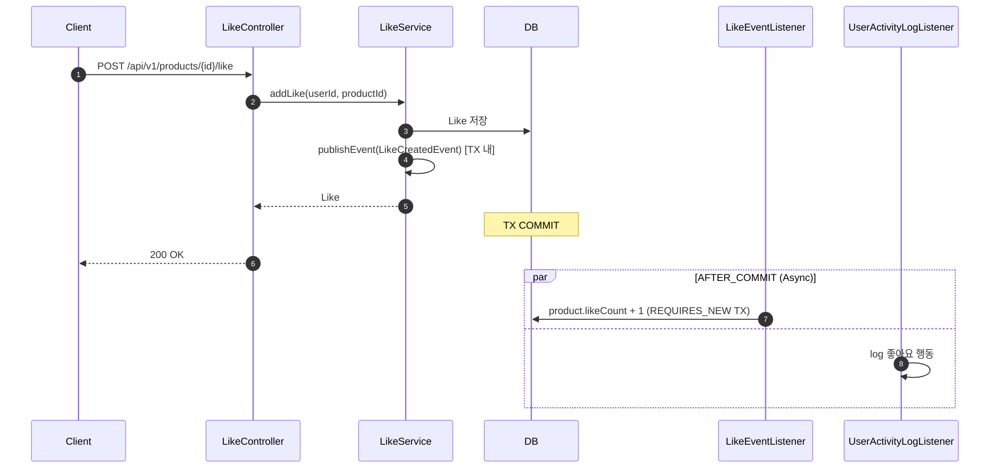
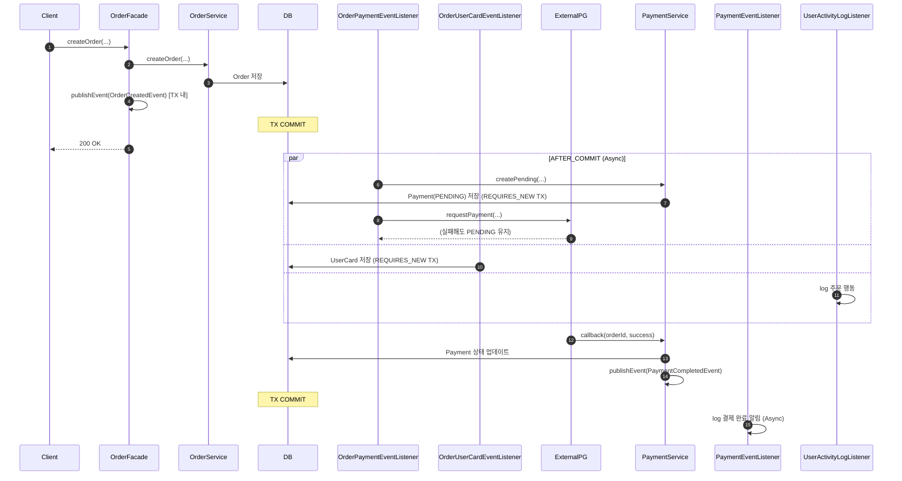
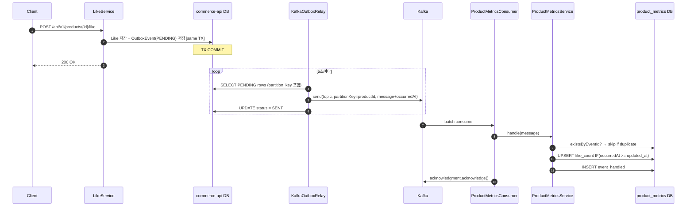
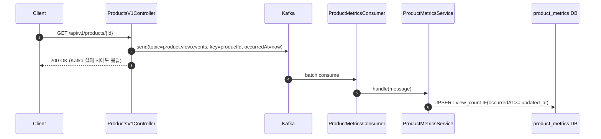
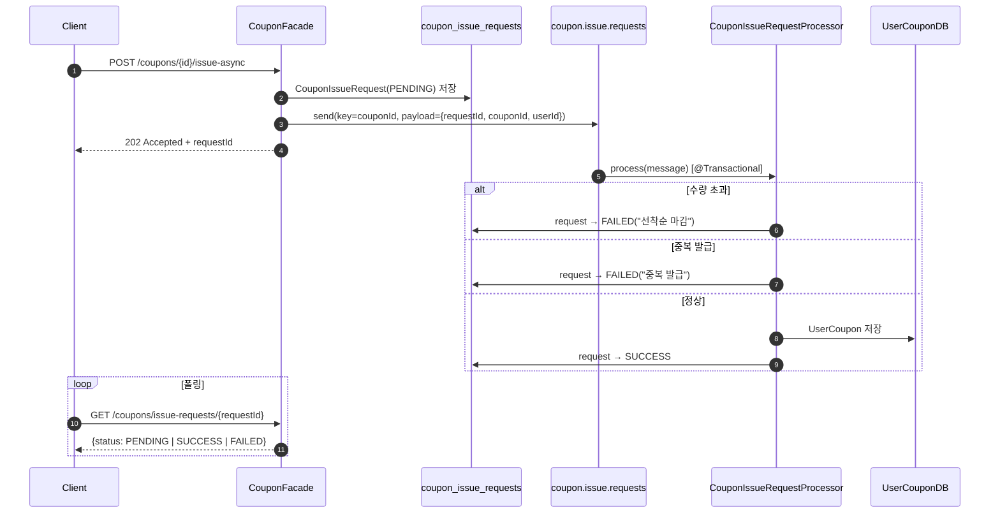

## 📌 리뷰 포인트

> 구현 과정에서 확신이 없었던 부분 4가지입니다. 각 항목마다 **설계 의도 → 불확실한 부분 → 질문** 순으로 정리했습니다.

---

### 1. 릴레이 재시도 — 계속 실패하는 메시지를 어떻게 격리해야 할까요?

**설계 의도**: PENDING 상태의 row를 5초마다 폴링해 Kafka로 발행하고, 성공하면 SENT로 마킹하도록 만들었습니다.

**불확실한 부분**: `send().get(5s)`가 타임아웃 나도 해당 row는 PENDING 그대로 남아서 다음 주기에 다시 시도됩니다. 특정 메시지가 계속 실패할 경우 재시도 횟수를 제한하거나 별도 상태(DEAD)로 분리하는 처리가 없는 상태입니다.

**질문**: 이 규모에서 DEAD 상태 분리가 필요한 시점인지, 아니면 운영 모니터링(로그 + 알림)으로 충분한 수준인지 조언을 듣고 싶습니다.

→ [`KafkaOutboxRelay.java:44`](https://github.com/katiekim17/loop-pack-be-l2-vol3-java/blob/volume-7/apps/commerce-batch/src/main/java/com/loopers/batch/relay/KafkaOutboxRelay.java#L44)

---

### 2. 배치 ACK 처리 — 스킵된 메시지 유실이 허용되는 구조인지 확인이 필요합니다

**설계 의도**: 배치 내 메시지를 하나씩 처리하면서 예외가 나면 해당 메시지를 스킵하고, 배치 전체를 ACK 하도록 만들었습니다. 메시지 하나의 실패가 배치 전체를 막지 않도록 하기 위해 이 방식을 선택했습니다.

**불확실한 부분**: 스킵된 메시지는 재처리 기회 없이 유실됩니다. 쿠폰 발급처럼 유실이 허용되지 않는 이벤트에는 Dead Letter Topic 분리가 필요하다고 생각했는데, 지금 구조에서 그 판단이 맞는지 확신이 없습니다.

**질문**: 지금 ACK 전략이 이 도메인에서 적절한지, Dead Letter Topic 분리가 필요한 시점이라면 어떤 기준으로 판단해야 할까요?

→ [`CouponIssueConsumer.java:40`](https://github.com/katiekim17/loop-pack-be-l2-vol3-java/blob/volume-7/apps/commerce-api/src/main/java/com/loopers/interfaces/consumer/CouponIssueConsumer.java#L40)

---

### 3. 파티션 직렬화 보장 범위 — `concurrency=3`이 직렬화를 깨뜨리는지 확인이 필요합니다

**설계 의도**: `couponId`를 파티션 키로 잡아서, 같은 쿠폰에 대한 요청은 항상 같은 파티션으로 가도록 했습니다. 같은 파티션을 컨슈머 스레드 1개가 순차적으로 처리하는 것이 DB 락 없이 동시성을 보장하는 핵심입니다.

**불확실한 부분**: `KafkaConfig`에 `concurrency=3`이 설정돼 있는데, 파티션과 스레드가 1:1로 매핑되는 건지 확신이 없습니다. 만약 같은 파티션이 다른 스레드에 배정될 수 있다면, 직렬화 보장 자체가 깨지는 구조가 됩니다.

**질문**: `concurrency` 설정이 파티션 직렬화 보장에 영향을 주는지, 현재 설정에서 제가 놓친 부분이 있을까요?

→ [`CouponFacade.java:106`](https://github.com/katiekim17/loop-pack-be-l2-vol3-java/blob/volume-7/apps/commerce-api/src/main/java/com/loopers/application/coupon/CouponFacade.java#L106) · [`KafkaConfig.java:71`](https://github.com/katiekim17/loop-pack-be-l2-vol3-java/blob/volume-7/modules/kafka/src/main/java/com/loopers/confg/kafka/KafkaConfig.java#L71)

---

### 4. 스레드풀 포화 — 큐가 꽉 찼을 때 이벤트가 어떻게 되는지 정의가 없습니다

**설계 의도**: `@Async` 이벤트 처리를 위해 `corePoolSize=4, maxPoolSize=10, queueCapacity=500`으로 스레드풀을 설정했습니다. 이벤트 리스너가 메인 트랜잭션에 영향을 주지 않도록 비동기로 분리하는 것이 목적이었습니다.

**불확실한 부분**: 큐가 500개를 초과했을 때 이후 이벤트가 어떻게 처리되는지 명시적으로 정의하지 않았습니다. Spring의 기본 정책(`AbortPolicy`)이면 조용히 예외가 나고 이벤트가 버려질 수 있다는 건 알고 있는데, 이 상황에 맞는 `RejectionHandler` 전략을 어떻게 잡아야 할지 판단이 서지 않습니다.

**질문**: 이 규모와 이벤트 유형에서 적합한 RejectionHandler 전략이 무엇인지 조언을 듣고 싶습니다.

→ [`AsyncConfig.java:17`](https://github.com/katiekim17/loop-pack-be-l2-vol3-java/blob/volume-7/apps/commerce-api/src/main/java/com/loopers/config/AsyncConfig.java#L17)


## 📌 Summary

- **배경**: 주문-결제 플로우, 좋아요 집계, 유저 행동 로깅이 단일 트랜잭션 안에 혼재되어 있어, 부가 로직의 실패가 핵심 흐름에 영향을 주는 구조였다.
- **목표**: Spring ApplicationEvent를 활용해 핵심 로직과 부가 로직을 이벤트 기반으로 분리하고, 각 리스너가 독립 트랜잭션에서 실행되도록 설계한다.
- **결과**: `AFTER_COMMIT + REQUIRES_NEW + @Async` 조합으로 이벤트 리스너를 분리해, 집계 실패·카드 저장 실패가 주문/좋아요 성공에 영향을 주지 않는 구조를 달성했다.


## 🧭 Context & Decision

### 문제 정의
- **현재 동작/제약**: 주문 생성, 결제 생성, 카드 저장, likeCount 집계가 동일 트랜잭션 또는 동기 호출로 묶여 있었다.
- **문제(리스크)**: 부가 로직(집계, 알림, 카드 저장) 실패 시 핵심 트랜잭션도 롤백되거나, 응답 지연이 발생할 수 있다.
- **성공 기준**: 좋아요 집계 실패 시 좋아요 row는 커밋 유지, 카드 저장 실패 시 주문 흐름 무영향, 유저 행동 로깅은 비동기 처리.

### 선택지와 결정
- **고려한 대안**:
  - A: 각 로직을 별도 서비스로 분리하되 동기 호출 유지
  - B: `TransactionalEventListener(AFTER_COMMIT)` + `@Async` + `REQUIRES_NEW` 조합으로 이벤트 기반 분리
- **최종 결정**: B 채택. 커밋 성공 후에만 이벤트를 실행해 데이터 일관성을 보장하고, 독립 트랜잭션으로 리스너 실패가 원본 TX에 영향을 주지 않도록 설계.
- **트레이드오프**: 이벤트 유실(서버 재시작 등)에 대한 보상 전략(재시도, 아웃박스 패턴)이 없음. 현재는 로그로 추적.
- **추후 개선 여지**: Outbox 패턴 도입, Dead Letter Queue 연동.

### 설계 리뷰 결과 — 이슈

#### ⚠️ 이슈 1: 컨트롤러에서 도메인 이벤트 발행

[`ProductsV1Controller.java:46`](https://github.com/katiekim17/loop-pack-be-l2-vol3-java/blob/volume-7/apps/commerce-api/src/main/java/com/loopers/interfaces/api/product/ProductsV1Controller.java#L46)

```java
eventPublisher.publishEvent(new ProductViewedEvent(userId, productId, userAgent));
```

Controller는 HTTP 요청 수신 및 Facade 위임 역할이다. 도메인 이벤트 발행은 그 아래 계층(Facade/Service)의 관심사이므로 계층 역할이 모호해진다.
→ `ProductFacade.getProductDetail()` 내부로 이동하는 것이 적합하다.

#### ⚠️ 이슈 2: DB 작업 없는 리스너에 불필요한 `@Transactional(REQUIRES_NEW)`

[`PaymentEventListener.java:21`](https://github.com/katiekim17/loop-pack-be-l2-vol3-java/blob/volume-7/apps/commerce-api/src/main/java/com/loopers/domain/payment/PaymentEventListener.java#L21)

```java
@Transactional(propagation = Propagation.REQUIRES_NEW)
public void handlePaymentCompleted(PaymentCompletedEvent event) {
    log.info("...");  // DB 작업 없음
}
```

`REQUIRES_NEW`는 새 커넥션을 점유하고 커밋까지 수행하므로, 실제 DB 작업이 없는 로그 처리에는 불필요한 오버헤드다.


## 🏗️ Design Overview

### 변경 범위
- **영향 받는 모듈/도메인**: `domain/like`, `domain/payment`, `domain/brand`, `domain/usercard`, `domain/activity`, `application/order`, `interfaces/api/product`
- **신규 추가**: 이벤트 클래스 6개, 리스너 5개, `UserCard` 도메인
- **제거/대체**: 기존 동기 부가 로직 → 이벤트 리스너로 대체

### 주요 컴포넌트 책임

| 컴포넌트 | 역할 | 링크 |
|---|---|---|
| [`LikeService`](https://github.com/katiekim17/loop-pack-be-l2-vol3-java/blob/volume-7/apps/commerce-api/src/main/java/com/loopers/domain/like/LikeService.java) | 좋아요 저장 후 `LikeCreatedEvent` / `LikeDeletedEvent` 발행 | |
| [`LikeEventListener`](https://github.com/katiekim17/loop-pack-be-l2-vol3-java/blob/volume-7/apps/commerce-api/src/main/java/com/loopers/domain/like/LikeEventListener.java) | AFTER_COMMIT 비동기로 `likeCount` 증감 | |
| [`OrderFacade`](https://github.com/katiekim17/loop-pack-be-l2-vol3-java/blob/volume-7/apps/commerce-api/src/main/java/com/loopers/application/order/OrderFacade.java) | 주문 생성 후 `OrderCreatedEvent` 발행 | |
| [`OrderPaymentEventListener`](https://github.com/katiekim17/loop-pack-be-l2-vol3-java/blob/volume-7/apps/commerce-api/src/main/java/com/loopers/domain/payment/OrderPaymentEventListener.java) | 주문 커밋 후 결제(PENDING) 생성 + PG 호출 | |
| [`OrderUserCardEventListener`](https://github.com/katiekim17/loop-pack-be-l2-vol3-java/blob/volume-7/apps/commerce-api/src/main/java/com/loopers/domain/usercard/OrderUserCardEventListener.java) | 주문 커밋 후 카드 정보 저장 (실패 시 로그만) | |
| [`PaymentService`](https://github.com/katiekim17/loop-pack-be-l2-vol3-java/blob/volume-7/apps/commerce-api/src/main/java/com/loopers/domain/payment/PaymentService.java) | PG 콜백 처리 후 `PaymentCompletedEvent` 발행 | |
| [`PaymentEventListener`](https://github.com/katiekim17/loop-pack-be-l2-vol3-java/blob/volume-7/apps/commerce-api/src/main/java/com/loopers/domain/payment/PaymentEventListener.java) | 결제 완료 후 알림 로그 처리 | |
| [`BrandEventListener`](https://github.com/katiekim17/loop-pack-be-l2-vol3-java/blob/volume-7/apps/commerce-api/src/main/java/com/loopers/domain/brand/BrandEventListener.java) | 브랜드 비활성화 후 연관 상품 연쇄 비활성화 | |
| [`UserActivityLogListener`](https://github.com/katiekim17/loop-pack-be-l2-vol3-java/blob/volume-7/apps/commerce-api/src/main/java/com/loopers/domain/activity/UserActivityLogListener.java) | 상품 조회·좋아요·주문 행동 로깅 | |
| [`ProductsV1Controller`](https://github.com/katiekim17/loop-pack-be-l2-vol3-java/blob/volume-7/apps/commerce-api/src/main/java/com/loopers/interfaces/api/product/ProductsV1Controller.java) | `ProductViewedEvent` 발행 (⚠️ 이슈: 컨트롤러 레이어에서 발행) | |


## 🔁 Flow Diagram

### 좋아요 플로우


### 주문-결제 플로우


---

## Step 2 — Kafka 이벤트 파이프라인

### 📌 Summary

- **배경**: Step 1에서 분리한 이벤트 리스너가 ApplicationEvent 기반으로 동일 프로세스 내에서만 동작해, 서버 재시작 시 이벤트가 유실되고 시스템 간 전파가 불가능한 구조였다.
- **목표**: `commerce-api → Kafka → commerce-streamer` 구조로 이벤트 파이프라인을 구성하고, 좋아요 수 / 판매량 / 조회 수를 `product_metrics` 테이블에 집계한다.
- **결과**: Transactional Outbox Pattern으로 At Least Once 발행을 보장하고, Idempotent Consumer로 중복 처리를 방지하며, occurredAt 버전 체크로 순서 역전 시에도 데이터 일관성을 유지한다.

### 🧭 Context & Decision

#### 선택지와 결정

| 결정 항목 | 선택 | 이유 |
|---|---|---|
| Consumer 앱 | `commerce-streamer` 재활용 | 신규 모듈 불필요, 스트리밍 앱 책임에 부합 |
| Outbox 릴레이 | `commerce-batch` 내 `@Scheduled` | API 서버와 배치 관심사 분리, 장애 격리 |
| Kafka 발행 이벤트 | `LIKE_CREATED`, `LIKE_DELETED`, `PRODUCT_SOLD`, `PRODUCT_VIEWED` | 집계 대상 3개 토픽 (like/payment/view) |
| Idempotent Consumer | 포함 (`event_handled` 테이블 + UNIQUE constraint) | At Least Once 하에서 중복 처리 방지 필수 |

#### 트레이드오프
- Outbox 릴레이 주기(5초)만큼 집계 지연이 발생한다. 실시간 카운트가 필요한 경우 직접 발행 방식(ProductsV1Controller의 view 이벤트 처럼)으로 병행 가능.
- `occurredAt >= updated_at` 버전 체크는 같은 밀리초 내 동시 이벤트 처리에서 마지막 write가 이기는(Last Write Wins) 특성이 있다.

#### 주요 설계 결정 Q&A

**Q1. Outbox 릴레이 — 계속 실패하는 메시지를 어떻게 격리할 것인가**

**문제**: PENDING 행을 5초마다 폴링해 Kafka로 발행하고, 실패 시 PENDING을 유지해 다음 주기에 재시도합니다. 역직렬화 불가·스키마 불일치 같은 영구 실패 메시지는 재시도 횟수 제한 없이 폴링을 점유하게 됩니다.

**고려한 대안**:
- A: DEAD 상태 분리 + `retry_count >= 5` 임계치 — 격리 명확, `OutboxEvent` 스키마 변경 + 모니터링 추가 필요
- B: 재시도 횟수 제한 + 알림 발송 (`retry_count >= 5 → Slack`) — 중간 복잡도, 단 격리는 수동
- C: 무한 재시도 (현재) — 구현 단순, 일시 장애(Kafka/네트워크) 복구 시 자동 재처리

**최종 결정**: C. 일시적 장애에 강하며 초기 구조에서 단순성 우선. Kafka/DB 장애 복구 후 자동 재처리가 더 중요한 시나리오로 판단.

**트레이드오프**: 영구 실패 메시지 발생 시 격리 수단이 없어 폴링 노이즈 증가. 메시지 유형이 늘어나거나 SLA가 생기면 A 방식으로 전환 필요.

```java
// KafkaOutboxRelay.java:44
for (OutboxEvent event : pendingEvents) {
    try {
        kafkaTemplate.send(...).get(5, TimeUnit.SECONDS);
        event.markSent();
    } catch (Exception e) {
        log.error("Kafka 발행 실패 - eventId: {}", event.getEventId(), e);
        // PENDING 유지 → 다음 주기에 재시도 (횟수 제한 없음)
    }
}
```

---

**Q2. Consumer 배치 ACK — 스킵된 메시지의 유실을 어디까지 허용하는가**

**문제**: 배치 내 메시지를 하나씩 처리하다 예외 발생 시 해당 메시지를 스킵하고 배치 전체를 ACK합니다. 스킵된 메시지는 재처리 기회 없이 유실됩니다.

**고려한 대안**:
- A: 메시지 단위 ACK (`AckMode.RECORD`) — 정밀 제어 가능, 처리량 감소
- B: 실패 메시지 Dead Letter Topic 분리 — 유실 방지, DLT 컨슈머 추가 및 운영 비용 증가
- C: 배치 단위 ACK + 실패 로깅 (현재) — 구현 단순, 스킵 메시지는 유실

**최종 결정**: C. 집계 카운트(좋아요·판매량·조회수)는 1~2건 누락되어도 UX 영향이 낮다고 판단. 쿠폰 발급처럼 유실이 불가한 도메인은 별도 전략이 필요.

**트레이드오프**: 동일 토픽에 유실 허용 여부가 다른 이벤트가 혼재하면(좋아요 vs 쿠폰) 토픽 분리 또는 DLT 도입이 불가피. 현재는 집계 전용 토픽으로 분리되어 있어 허용 범위 내로 판단.

```java
// CouponIssueConsumer.java:40
for (ConsumerRecord<String, String> record : records) {
    try {
        processor.process(parseMessage(record.value()));
    } catch (Exception e) {
        log.error("메시지 처리 실패 - 스킵", e);
        // DLT 미구현 → 유실 허용
    }
}
acknowledgment.acknowledge();  // 배치 전체 ACK
```

### 🏗️ Design Overview

#### 아키텍처

```
commerce-api
  ├── LikeService          → outbox_events (LIKE_CREATED / LIKE_DELETED)
  └── PaymentFacade        → outbox_events (PRODUCT_SOLD)

commerce-batch
  └── KafkaOutboxRelay     → PENDING 행 폴링 → Kafka 발행 → SENT 마킹

Kafka Topics
  ├── product.like.events
  ├── product.payment.events
  └── product.view.events

commerce-api (직접 발행)
  └── ProductsV1Controller → product.view.events (PRODUCT_VIEWED)

commerce-streamer
  └── ProductMetricsConsumer → ProductMetricsService → product_metrics upsert
```

#### 주요 컴포넌트 책임

| 컴포넌트 | 역할 | 링크 |
|---|---|---|
| [`OutboxEvent`](https://github.com/katiekim17/loop-pack-be-l2-vol3-java/blob/volume-7/apps/commerce-api/src/main/java/com/loopers/domain/outbox/OutboxEvent.java) | 발행 대기 이벤트 영속화 (eventId, topic, payload, partitionKey, status) | |
| [`LikeService`](https://github.com/katiekim17/loop-pack-be-l2-vol3-java/blob/volume-7/apps/commerce-api/src/main/java/com/loopers/domain/like/LikeService.java) | 좋아요 저장과 OutboxEvent 저장을 동일 TX로 묶음 | |
| [`PaymentFacade`](https://github.com/katiekim17/loop-pack-be-l2-vol3-java/blob/volume-7/apps/commerce-api/src/main/java/com/loopers/application/payment/PaymentFacade.java) | 결제 콜백 성공 시 PRODUCT_SOLD OutboxEvent 저장 | |
| [`KafkaOutboxRelay`](https://github.com/katiekim17/loop-pack-be-l2-vol3-java/blob/commerce-batch/src/main/java/com/loopers/batch/relay/KafkaOutboxRelay.java) | PENDING 이벤트 폴링 → Kafka 발행 → SENT 마킹 (5초 주기) | |
| [`ProductMetricsConsumer`](https://github.com/katiekim17/loop-pack-be-l2-vol3-java/blob/volume-7/apps/commerce-streamer/src/main/java/com/loopers/interfaces/consumer/ProductMetricsConsumer.java) | 배치 수신 + Manual ACK (BATCH_LISTENER) | |
| [`ProductMetricsService`](https://github.com/katiekim17/loop-pack-be-l2-vol3-java/blob/volume-7/apps/commerce-streamer/src/main/java/com/loopers/domain/metrics/ProductMetricsService.java) | 멱등성 체크 → eventType 분기 → 집계 + EventHandled 저장 | |
| [`ProductMetricsJpaRepository`](https://github.com/katiekim17/loop-pack-be-l2-vol3-java/blob/volume-7/apps/commerce-streamer/src/main/java/com/loopers/infrastructure/metrics/ProductMetricsJpaRepository.java) | `INSERT ... ON DUPLICATE KEY UPDATE` + `IF(occurredAt >= updated_at, ...)` | |

### 🔁 Flow Diagram

#### Outbox Relay 플로우 (좋아요 / 결제)



#### 직접 발행 플로우 (조회)



### ✅ 체크리스트 검증

| 항목 | 상태 | 구현 위치 |
|---|---|---|
| Producer: `acks=all` + `enable.idempotence=true` | ✅ | `modules/kafka/src/main/resources/kafka.yml` |
| Transactional Outbox: 도메인 저장 + OutboxEvent 저장 동일 TX | ✅ | `LikeService`, `PaymentFacade` — `@Transactional` |
| Outbox 릴레이: PENDING → Kafka → SENT (At Least Once) | ✅ | `KafkaOutboxRelay` (commerce-batch) |
| Partition Key: 동일 productId → 동일 파티션 (순서 보장) | ✅ | `partitionKey=productId.toString()` |
| Consumer: Manual ACK (처리 완료 후 offset commit) | ✅ | `ProductMetricsConsumer` + `AckMode.MANUAL` |
| Idempotent Consumer: event_id UNIQUE → 중복 스킵 | ✅ | `EventHandled` + `eventHandledRepository.existsByEventId()` |
| DataIntegrityViolation 중복 이벤트 처리 | ✅ | `ProductMetricsConsumer` catch 블록 |
| Metrics upsert: `INSERT ... ON DUPLICATE KEY UPDATE` | ✅ | `ProductMetricsJpaRepository` (native query) |
| 순서 역전 방어: `IF(occurredAt >= updated_at, ...)` 버전 체크 | ✅ | `ProductMetricsJpaRepository` 모든 메서드 |
| occurredAt 전파: Producer → Relay → Consumer → Repository | ✅ | `KafkaOutboxMessage.occurredAt`, `ProductMetricsService` 파싱 |

---

## Step 3 — 선착순 쿠폰 발급 (Kafka 비동기)

### 📌 Summary

- **배경**: 기존 동기 발급 API(`POST /coupons/{id}/issue`)는 DB에서 수량을 확인 후 발급하는 구조라, 대량 동시 요청 시 수량 초과 발급이 발생할 수 있었다.
- **목표**: Kafka를 이용해 발급 요청을 비동기로 처리하고, 파티션 키(couponId)를 이용한 직렬화로 DB 락 없이 선착순 수량 제한을 보장한다.
- **결과**: `202 Accepted + requestId` 즉시 반환 → Consumer가 순차 처리 → 유저는 Polling으로 결과 확인. 각 단계별 Redis/SSE 전환 기준을 TODO로 남겨두었다.

### 🧭 Context & Decision

| 결정 항목 | 선택 | 이유 | 다음 단계 기준 |
|---|---|---|---|
| 결과 확인 방식 | A. Polling | 구현 단순, requestId 기반 상태 조회 | 처리 P99 > 3s 또는 폴링 TPS > 500 시 SSE/WebSocket 전환 |
| 선착순 수량 제한 | A. Consumer에서 DB COUNT | Kafka 파티션 직렬화로 동시성 보장 | P99 > 100ms 또는 TPS > 1,000 시 Redis DECR 전환 |
| 요청 상태 저장 | A. DB 테이블 | 영속성 보장 | 10M+ 행 또는 조회 P99 > 50ms 시 Redis TTL 전환 |

#### 핵심 설계: Kafka 파티션 키 = couponId

```
동기 API의 문제:
  스레드 A: count() = 99 (maxIssuable=100) → 통과 → 저장 → 100번째
  스레드 B: count() = 99 (동시에 읽음)    → 통과 → 저장 → 101번째 ← 초과!

Kafka 파티션 직렬화 해결:
  couponId=42 → 항상 파티션 7 → Consumer 1개가 순차 처리
  메시지 A: count() = 99 → 통과 → 저장 (100개)
  메시지 B: count() = 100 → 거절 (FAILED: 선착순 마감)
```

#### 주요 설계 결정 Q&A

**Q3. 선착순 동시성 제어 — DB 락 없이 수량 초과를 막을 수 있는가**

**문제**: `count() + 저장` 사이에 다른 스레드가 끼어들면 수량 초과 발급이 발생합니다. DB 락을 쓰면 정확하지만 TPS가 떨어지고, 락 없이 처리하면 동시성 보장이 어렵습니다.

**고려한 대안**:
- A: DB 비관적 락 (`SELECT FOR UPDATE`) — 정확, 쿠폰 단위 락 경합으로 TPS 저하
- B: Kafka 파티션 직렬화 (`key=couponId → 같은 파티션 → 순차 처리`) — 락 없음, 처리량은 파티션 수에 비례 (현재)
- C: Redis `DECR` 원자 연산 — 처리량 최고, Redis 의존성 추가 + 장애 시 발급 불가

**최종 결정**: B. 파티션 직렬화. 초기 규모에서 DB 락 없이 동시성 보장 가능. P99 > 100ms 또는 TPS > 1,000 시 C로 전환 예정.

**트레이드오프**: 파티션 수가 컨슈머 병렬도 상한. 인기 쿠폰이 많을수록 같은 파티션에 메시지가 몰려 처리 대기 증가. `concurrency` 설정이 파티션-스레드 1:1 매핑을 보장하는지 검증 필요(리뷰 포인트 3번 참고).

```java
// CouponFacade.java:106 — partitionKey = couponId → 항상 같은 파티션
kafkaTemplate.send("coupon.issue.requests", couponId.toString(), message);

// CouponIssueRequestProcessor.java — COUNT 기반 체크 (파티션 직렬화 전제)
long issued = userCouponRepository.countByCouponId(couponId);
if (coupon.getMaxIssuable() != null && issued >= coupon.getMaxIssuable()) {
    request.fail("선착순 마감");
    return;
}
```

---

**Q4. @Async 스레드풀 — 큐 포화 시 이벤트를 어떻게 처리할 것인가**

**문제**: `queueCapacity=500` 초과 시 이후 이벤트의 처리 방식이 명시되어 있지 않습니다. Spring 기본값(`AbortPolicy`)은 `RejectedExecutionException`을 발생시키고 이벤트를 버립니다.

**고려한 대안**:
- A: `AbortPolicy` (기본값) — 포화 즉시 예외 발생, 이벤트 유실 + 빠른 이상 감지 (현재)
- B: `CallerRunsPolicy` — 발행 스레드(메인 TX 스레드)가 직접 실행, 응답 지연 발생 가능
- C: `DiscardOldestPolicy` — 오래된 이벤트 제거 후 신규 수용, 오래된 이벤트 유실

**최종 결정**: A (기본값 유지). 큐 포화 자체가 비정상 신호이며, 이 경우 명시적 예외 + 알림이 올바른 대응. 현재 `@Async` 이벤트는 집계·로깅 용도라 일부 유실 허용 범위 내.

**트레이드오프**: 포인트 적립·쿠폰 발급 같은 유실 불가 이벤트가 `@Async`로 처리될 경우 AbortPolicy는 위험. 현재는 집계/로깅 한정이지만, 이벤트 유형이 추가될 경우 RejectionHandler를 명시적으로 교체해야 함.

```java
// AsyncConfig.java:17
executor.setCorePoolSize(4);
executor.setMaxPoolSize(10);
executor.setQueueCapacity(500);
// RejectionHandler 미설정 → Spring 기본 AbortPolicy
// 개선 여지: 포화 시 Slack 알림 연동 또는 CallerRunsPolicy 전환 검토
executor.initialize();
```

### 🏗️ Design Overview

#### 아키텍처

```
POST /api/v1/coupons/{couponId}/issue-async
  CouponFacade
    → CouponIssueRequest(PENDING) DB 저장
    → Kafka send (key=couponId)
    → requestId 즉시 반환 (202)

Kafka topic: coupon.issue.requests
  CouponIssueConsumer (commerce-api)
    → CouponIssueRequestProcessor [@Transactional, 메시지마다 독립 TX]
      → 수량 체크 (countByCouponId < maxIssuable)
      → 중복 체크 (existsByUserIdAndCouponId)
      → UserCoupon 저장 + request → SUCCESS
         또는 request → FAILED (사유 기록)

GET /api/v1/coupons/issue-requests/{requestId}
  CouponFacade
    → CouponIssueRequest 상태 반환 (PENDING / SUCCESS / FAILED)
```

#### 주요 컴포넌트 책임

| 컴포넌트 | 역할 | 링크 |
|---|---|---|
| [`CouponFacade`](https://github.com/katiekim17/loop-pack-be-l2-vol3-java/blob/volume-7/apps/commerce-api/src/main/java/com/loopers/application/coupon/CouponFacade.java) | 발급 요청 저장 + Kafka 발행 + 상태 조회 (TODO 주석 포함) | |
| [`CouponIssueRequest`](https://github.com/katiekim17/loop-pack-be-l2-vol3-java/blob/volume-7/apps/commerce-api/src/main/java/com/loopers/domain/coupon/CouponIssueRequest.java) | 발급 요청 엔티티 (PENDING → SUCCESS/FAILED 상태 전이) | |
| [`CouponIssueConsumer`](https://github.com/katiekim17/loop-pack-be-l2-vol3-java/blob/volume-7/apps/commerce-api/src/main/java/com/loopers/interfaces/consumer/CouponIssueConsumer.java) | Kafka BATCH_LISTENER, 메시지 수신 후 Processor 위임 | |
| [`CouponIssueRequestProcessor`](https://github.com/katiekim17/loop-pack-be-l2-vol3-java/blob/volume-7/apps/commerce-api/src/main/java/com/loopers/interfaces/consumer/CouponIssueRequestProcessor.java) | `@Transactional` 처리 빈 — 수량/중복 체크 + 발급 | |
| [`Coupon`](https://github.com/katiekim17/loop-pack-be-l2-vol3-java/blob/volume-7/apps/commerce-api/src/main/java/com/loopers/domain/coupon/Coupon.java) | `maxIssuable` 필드 추가 (null = 무제한) | |

### 🔁 Flow Diagram



### ⚠️ 설계 이슈 및 개선 방향

#### 이슈 1: Kafka 발행 실패 시 PENDING 영구 유지
요청 저장 후 Kafka 발행이 실패하면 PENDING 상태가 영구히 남는다. 개선: `commerce-batch`에 N분 초과 PENDING 요청 재발행 릴레이 추가 필요.

#### 이슈 2: Consumer 재처리 시 중복 작업 가능
Manual ACK 전 서버 재시작 시 메시지가 재전달된다. `process()` 시작 시 이미 SUCCESS/FAILED인 요청이면 스킵하는 멱등성 처리 추가 필요.

### ✅ 체크리스트 검증

| 항목 | 상태 | 구현 위치 |
|---|---|---|
| 쿠폰 발급 요청 API → Kafka 비동기 발행 | ✅ | `CouponFacade.requestIssueAsync()` |
| Consumer 선착순 수량 제한 | ✅ | `CouponIssueRequestProcessor` — `countByCouponId < maxIssuable` |
| Consumer 중복 발급 방지 | ✅ | `existsByUserIdAndCouponId()` |
| Kafka 파티션 키 = couponId (동시성 직렬화) | ✅ | `kafkaTemplate.send(couponId.toString(), ...)` |
| 발급 결과 Polling 확인 구조 | ✅ | `GET /api/v1/coupons/issue-requests/{requestId}` |
| 메시지별 독립 트랜잭션 | ✅ | `CouponIssueRequestProcessor` — 별도 빈 `@Transactional` |
| `maxIssuable` 필드 (null = 무제한) | ✅ | `Coupon.maxIssuable` |
| 미래 전환 기준 TODO 주석 | ✅ | `CouponFacade` (Q1/Q2/Q3 각각 전환 기준 명시) |
| 동시성 테스트 | ⏳ | 미구현 — 별도 작성 필요 |