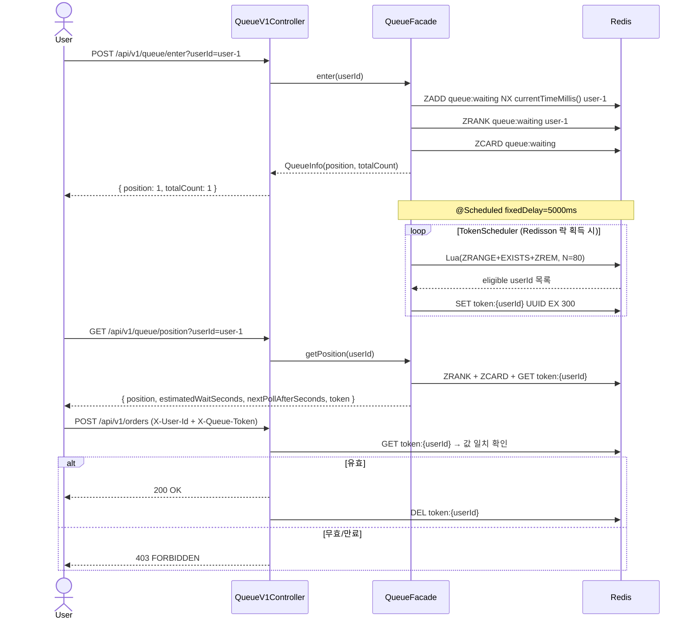
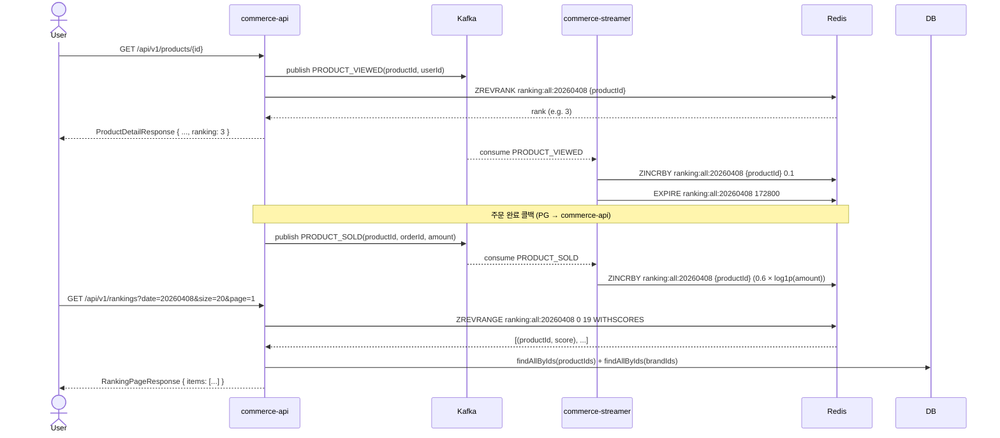

## 📌 Summary

- **배경**: Black Friday 주문 API에 트래픽이 집중되면 HikariCP 커넥션 풀이 고갈되어 DB가 다운된다. Rate Limiting(즉시 거절)은 사용자가 재시도를 반복해 오히려 Thundering Herd 문제를 유발한다.
- **목표**: Redis Sorted Set 기반 대기열로 번호표를 발급하고, 처리 가능한 수(N=80)만큼만 주문 API에 진입할 수 있도록 Back-pressure를 구현한다.
- **결과**: 대기열 진입 → 입장 토큰 발급(스케줄러) → 토큰 검증(인터셉터) → Adaptive Polling 순번 조회의 3단계 파이프라인 구현 완료. 동시 진입, 토큰 TTL 만료, 처리량 초과 검증 포함 19개 테스트 통과.

---

## 🧭 Context & Decision

### 1. 대기열 중복 진입을 어떻게 방지할 것인가?

| 항목 | ZSCORE 조회 후 분기 | ZADD NX (채택) |
|------|-------------------|---------------|
| 원자성 | ZSCORE → ZADD 사이 끼어들기 가능 (TOCTOU) | 단일 명령어로 원자적 처리 |
| 순번 조회 | O(N) 스캔 | O(log N) ZRANK |
| 코드 복잡도 | 2단계 | 1단계 |

- **결정**: `ZADD NX` (`addIfAbsent`)
- **근거**: Redis 싱글스레드 특성상 확인+추가가 원자적으로 처리된다. ZSCORE 후 분기는 두 명령 사이에 다른 요청이 끼어드는 TOCTOU 문제가 발생한다.
- **트레이드오프**: 동일 밀리초에 진입한 사용자 간 순서가 undefined이다. 같은 밀리초 내 순서는 비즈니스상 무의미하므로 허용한다.


### 2. 토큰을 어떻게 설계할 것인가?

| 항목 | 단순 값 ("1") | UUID + Redis String TTL (채택) |
|------|-------------|-------------------------------|
| 위조 방지 | userId만 알면 토큰 추측 가능 | userId 알아도 UUID 값 모르면 차단 |
| 만료 처리 | 직접 관리 | Redis TTL 자동 만료 |
| 검증 방식 | 존재 여부만 확인 | 존재 + 값 일치 이중 확인 |

- **결정**: UUID + Redis String (TTL 300초)
- **근거**: 주문 API는 userId 헤더만 있으면 누구나 호출할 수 있다. UUID로 토큰 값을 모르면 위조가 불가능하다. Redis TTL로 만료를 자동 처리해 DB 커넥션 소모 없이 빠른 조회가 가능하다.
- **트레이드오프**: 클라이언트가 토큰 값을 저장해야 하고, TTL(300초) 안에 주문을 완료해야 한다. 결제 중 만료되면 403이 반환된다.

### 3. 토큰 검증을 어디에서 수행할 것인가?

| 항목 | Filter (Servlet) | Interceptor (채택) | AOP |
|------|-----------------|-------------------|-----|
| Spring Bean 주입 | 불편 (수동 getBean) | 가능 | 가능 |
| URL 패턴 적용 | 가능 | 가능 | 불가 (메서드 레벨) |
| ControllerAdvice 연동 | 불가 | **가능** | 가능 |

- **결정**: `HandlerInterceptor`
- **근거**: Redis 조회에 `TokenService` Spring Bean이 필요하고, `/api/v1/orders/**` URL 패턴 적용과 `CoreException → ControllerAdvice` 처리 연동이 동시에 필요하다. Filter는 ControllerAdvice가 예외를 잡지 못한다.
- **트레이드오프**: Filter 대비 Spring MVC에 의존한다. 단, 대기열 토큰은 Spring 컨텍스트 내에서 처리가 필요하므로 허용 가능한 의존성이다.

### 4. 스케줄러 배치 팝의 원자성을 어떻게 보장할 것인가?

| 항목 | Java 3단계 분리 | Lua 스크립트 (채택) |
|------|---------------|-------------------|
| ZRANGE → EXISTS → ZREM 사이 | 중간 실패 시 유령 상태 발생 | 단일 스크립트로 원자적 실행 |
| 중간 단계 끼어들기 | 가능 | 불가 (Redis 싱글스레드) |
| 디버깅 | 쉬움 | 어려움 |

- **결정**: Lua 스크립트로 `ZRANGE + EXISTS + ZREM` 원자적 처리
- **근거**: 3단계를 분리하면 ZREM 성공 후 토큰 발급 실패 시 대기열에서는 제거됐지만 토큰이 없는 유령 상태가 된다. Lua는 Redis에서 단일 명령으로 실행되어 중간 실패가 구조적으로 불가능하다.
- **트레이드오프**: Lua 디버깅이 어렵고 Java 상수(`QueueConstants.TOKEN_KEY_PREFIX`)를 직접 참조할 수 없어 `'token:'`을 스크립트에 하드코딩했다. 주석으로 상수와 연결을 명시했다.

> **리뷰 포인트**: 토큰을 보유한 유저가 주문을 완료하지 않고 대기열에 재진입하면, Lua에서 `EXISTS == 1`이라 스킵되어 TTL(300초) 만료까지 대기열에 머문다. 진입 시점에 토큰 존재 여부를 체크해 차단하는 것이 맞을지, 아니면 스케줄러에서 즉시 ZREM하는 것이 나은지 판단이 서지 않는다. → [`TokenScheduler.executeIssue()`][scheduler-execute]

### 5. 멀티 인스턴스 환경에서 스케줄러 중복 실행을 어떻게 방지할 것인가?

| 항목 | @ConditionalOnSingleCandidate | Redisson 분산 락 (채택) |
|------|------------------------------|----------------------|
| 멀티 인스턴스 | 인스턴스마다 실행 | 락 획득한 1개만 실행 |
| 락 TTL | 없음 | 4초 (비정상 종료 시 자동 해제) |
| 구현 복잡도 | 낮음 | 중간 |

- **결정**: Redisson 분산 락 (`tryLock(0, 4, SECONDS)`)
- **근거**: 단일 인스턴스는 문제가 없지만, 멀티 인스턴스 환경에서 스케줄러가 동시에 실행되면 같은 userId에게 토큰이 중복 발급된다. Lua 스크립트의 EXISTS 체크가 1차 방어이지만, 스케줄러 자체를 직렬화하는 것이 더 근본적이다.
- **트레이드오프**: 락 TTL(4초)이 실제 처리 시간보다 짧으면 락이 만료되어 중복 실행 가능성이 생긴다. 대기열 인원 폭증 시 처리 시간이 4초를 초과할 수 있다.

> **리뷰 포인트**: 스케줄러 주기(5초)보다 짧은 락 TTL(4초)을 선택했다. 처리 시간이 4초를 초과하는 케이스에서 락이 먼저 만료되면 다른 인스턴스가 진입할 수 있다. 실무에서 락 TTL을 주기보다 짧게 설정하는 것이 일반적인지, 보완 전략이 있는지 조언을 구하고 싶다. → [`TokenScheduler.issueTokens()`][scheduler-issue]

### 6. 대기자에게 Polling 주기를 어떻게 안내할 것인가?

| 항목 | 고정 주기 | Adaptive Polling (채택) |
|------|---------|------------------------|
| 순번 멀 때 | 불필요한 요청 반복 | 긴 주기(30초)로 부하 절감 |
| 순번 가까울 때 | 늦게 반응 | 짧은 주기(5초)로 빠른 반응 |
| 클라이언트 구현 | 단순 | `nextPollAfterSeconds` 필드 필요 |

- **결정**: `nextPollAfterSeconds`를 응답에 포함하는 Adaptive Polling
- **근거**: 모든 대기자가 동일 주기로 Polling하면 순번이 먼 사용자도 불필요한 요청을 반복한다. 서버가 주기를 제어함으로써 Thundering Herd 없이 부하를 분산한다.
- **트레이드오프**: 클라이언트가 고정 주기 대신 응답의 `nextPollAfterSeconds`를 따라야 한다. 수치(≤10→5초, ≤50→15초, >50→30초)는 시뮬레이션 전 초기값이며 실측 후 조정이 필요하다.

---

## 🏗️ Design Overview

### 변경 범위

| 커밋 | 분류 | 변경 요약 |
|------|------|----------|
| [`8a8b4a7`][commit-step1] | feat | Step 1 — Redis Sorted Set 대기열 진입 + 순번 조회 |
| [`15cf54a`][commit-step2-token] | feat | Step 2 — 입장 토큰 & 스케줄러 (Lua + Redisson) |
| [`3ce5c1a`][commit-step2-interceptor] | feat | Step 2 — 토큰 검증 인터셉터 |
| [`26d73178`][commit-step3] | feat | Step 3 — Adaptive Polling 순번 조회 |
| [`7e6725e`][commit-test] | test | Step 2/3 — 통합·E2E·동시성·검증 테스트 |
| [`2013bf6`][commit-fix] | fix | KafkaConfig 제네릭 타입 수정 |

### Step 1 — 대기열 진입 + 순번 조회

```java
// QueueRepositoryImpl.java
public long enter(String userId, long score) {
    redisTemplate.opsForZSet().addIfAbsent(QUEUE_KEY, userId, score); // ZADD NX
    Long rank = redisTemplate.opsForZSet().rank(QUEUE_KEY, userId);   // ZRANK
    return rank + 1; // 1-indexed
}
```

| 컴포넌트 | 파일 | 메서드 | 역할 |
|----------|------|--------|------|
| `QueueService` | [`domain/queue/`][queue-service] | `enter()`, `getPosition()` | score에 currentTimeMillis 주입, NOT_FOUND 예외 |
| `QueueRepositoryImpl` | [`infrastructure/queue/`][queue-repo] | `enter()`, `findPosition()` | ZADD NX + ZRANK + ZCARD |
| `QueueFacade` | [`application/queue/`][queue-facade] | `enter()`, `getPosition()` | position + totalCount 조합 |
| `QueueV1Controller` | [`interfaces/api/queue/`][queue-controller] | `POST /enter`, `GET /position` | 진입/순번 조회 API |

### Step 2 — 입장 토큰 & 스케줄러

```java
// TokenScheduler.java — Lua로 원자적 팝
private static final String POP_ELIGIBLE_USERS_SCRIPT = """
    local members = redis.call('ZRANGE', KEYS[1], 0, ARGV[1])
    for i, member in ipairs(members) do
        if redis.call('EXISTS', 'token:' .. member) == 0 then
            redis.call('ZREM', KEYS[1], member)
            table.insert(eligible, member)
        end
    end
    return eligible
    """;

// TokenService.java — UUID 발급
String token = UUID.randomUUID().toString();
tokenRepository.save(userId, token, 300, TimeUnit.SECONDS); // EX 300
```

| 컴포넌트 | 파일 | 메서드 | 역할 |
|----------|------|--------|------|
| `TokenScheduler` | [`domain/queue/`][scheduler] | `issueTokens()` | @Scheduled(5초) + Redisson 락 + Lua 팝 |
| `TokenService` | [`domain/queue/`][token-service] | `issue()`, `isValid()`, `revoke()` | UUID 발급 · 검증 · 폐기 |
| `TokenRepositoryImpl` | [`infrastructure/queue/`][token-repo] | `save()`, `findToken()` | Redis String EX 300 |
| `QueueTokenInterceptor` | [`interfaces/api/queue/`][interceptor] | `preHandle()` | X-User-Id + X-Queue-Token 검증 → 403 |
| `QueueConstants` | [`domain/queue/`][constants] | — | QUEUE_KEY, TOKEN_KEY_PREFIX, BATCH_SIZE, SCHEDULER_INTERVAL_SECONDS |

### Step 3 — Adaptive Polling 순번 조회

```java
// QueueFacade.java
private long calculateEstimatedWait(long position) {
    return (long) Math.ceil((double) position / BATCH_SIZE * SCHEDULER_INTERVAL_SECONDS);
}
private long calculateNextPollAfter(long position) {
    if (position <= 10) return 5;   // 곧 차례
    if (position <= 50) return 15;  // 중간
    return 30;                      // 뒤쪽
}
```

응답 예시:
```json
{ "position": 45, "totalCount": 200,
  "estimatedWaitSeconds": 30, "nextPollAfterSeconds": 15, "token": null }
```

---

## 🧪 테스트

| # | 테스트 클래스 | 전략 | 검증 항목 |
|---|-------------|------|----------|
| 1 | [`QueueServiceIntegrationTest`][test-queue-service] | 통합 | 진입·순번·전체 인원·NOT_FOUND 예외 |
| 2 | [`TokenSchedulerIntegrationTest`][test-scheduler] | 통합 | 배치 발급, 중복 발급 방지, 배치 크기 초과 |
| 3 | [`QueueTokenInterceptorE2ETest`][test-interceptor] | E2E | 토큰 없음/만료/불일치 → 403, 유효 토큰 → 주문 API 통과 |
| 4 | [`QueuePositionIntegrationTest`][test-position] | 통합 | estimatedWait·nextPollAfter 계산, 토큰 발급 후 응답 포함 |
| 5 | [`QueueVerificationTest`][test-verification] | 동시성 | 같은 userId 10스레드 → 1건만 등록 |
| 6 | [`QueueVerificationTest`][test-verification] | 동시성 | 20명 동시 진입 → 각자 고유 순번 |
| 7 | [`QueueVerificationTest`][test-verification] | TTL | TTL 1초 강제 후 2초 대기 → 토큰 무효화 |
| 8 | [`QueueVerificationTest`][test-verification] | 처리량 | 100명 진입, N=80 → 1회 실행 후 20명 잔여 |
| 9 | [`QueueVerificationTest`][test-verification] | 처리량 | 2회 실행 → 전원 처리, 대기열 비어있음 |

---

## 🔁 Flow Diagram



---

## ✅ Checklist

### Step 1 — 대기열
- [x] `POST /queue/enter` — Redis Sorted Set 기반 대기열 진입 (ZADD NX) → [`QueueRepositoryImpl.enter()`][queue-repo-enter]
- [x] `GET /queue/position` — 순번 + 전체 대기 인원 조회 → [`QueueFacade.getPosition()`][facade-get-position]
- [x] userId 중복 진입 방지 (ZADD NX 원자적 처리)
- [x] 전체 대기 인원 조회 (ZCARD)
- [x] 이탈 감지 — `presence:{userId}` TTL(90초) 기반, 폴링 없으면 자동 만료 → 다음 배치에서 ZREM → [`QueueService`][queue-service], [`TokenScheduler`][scheduler]

### Step 2 — 입장 토큰 & 스케줄러
- [x] 5초마다 상위 80명에게 UUID 토큰 발급 (Lua 스크립트 + Redisson 락) → [`TokenScheduler`][scheduler]
- [x] 토큰 TTL 300초 (Redis String EX)
- [x] 주문 API 진입 시 토큰 검증 → [`QueueTokenInterceptor.preHandle()`][interceptor-prehandle]
- [x] 주문 완료 후 토큰 삭제 → [`TokenService.revoke()`][token-revoke]

### Step 3 — 실시간 순번 조회
- [x] 예상 대기 시간: `순번 / N × 주기` → [`QueueFacade.calculateEstimatedWait()`][facade-estimated]
- [x] Adaptive Polling: `nextPollAfterSeconds` 응답 포함 → [`QueueFacade.calculateNextPollAfter()`][facade-next-poll]
- [x] 토큰 발급 시 `GET /position` 응답에 token 포함

---

---

---

## 📌 Summary — 실시간 랭킹 집계 (Kafka Consumer → Redis ZSET → Ranking API)

- **배경**: `product_metrics` 테이블로 지표를 누적하고 있었지만, 이를 "오늘의 인기상품" API로 제공하려면 매 요청마다 전체 테이블 `ORDER BY + LIMIT` 이 필요하다. 상품이 수십만 건이 되면 인덱스를 써도 정렬 비용은 피할 수 없다.
- **목표**: Kafka 이벤트(조회·좋아요·주문)를 컨슘해 Redis ZSET에 일간 점수를 누적하고, `ZREVRANGE` O(log N + M)으로 랭킹을 상시 제공한다.
- **결과**: 이벤트 가중치 + log1p 정규화 점수 설계, 뷰 오염 문제 발견 및 dedup 설계, 캐시와 랭킹 분리 전략 적용. 랭킹 Consumer 7개, Ranking API E2E 8개 테스트 통과.

---

## 🧭 Context & Decision

### 1. 랭킹 집계를 DB가 아닌 Redis ZSET에 하는 이유

| 항목 | DB ORDER BY + LIMIT | Redis ZSET (채택) |
|------|--------------------|--------------------|
| 조회 복잡도 | O(N log N) — 매 요청마다 전체 정렬 | O(log N + M) — 항상 정렬된 상태 유지 |
| 랭킹 변경 비용 | 없음 (읽기 시 정렬) | O(log N) `ZINCRBY` |
| 동시 요청 부하 | 요청마다 DB 정렬 쿼리 발생 | Redis 메모리 읽기 |
| TTL 관리 | 별도 배치 삭제 필요 | 키 단위 TTL 자동 만료 |

- **결정**: `ZINCRBY ranking:all:{yyyyMMdd}` — 이벤트마다 점수 누적, TTL 2일
- **근거**: 랭킹은 "미리 계산된 정렬 상태를 빠르게 읽는" 용도다. 쓰기는 이벤트 발생 시 O(log N)으로 분산되고, 읽기는 항상 O(log N + M)이 보장된다.
- **트레이드오프**: Redis 장애 시 랭킹 데이터 소실 가능. 단, 랭킹은 `product_metrics` DB와 별개로 운용되며 재집계 가능한 파생 데이터이므로 허용한다.

### 2. 이벤트 가중치를 어떻게 설계할 것인가

단순 횟수 합산은 "조회 500번 = 주문 1건"을 동등하게 취급한다. 비즈니스 임팩트를 반영하기 위해 행동 가치에 비례한 가중치를 적용했다.

| 이벤트 | 가중치 공식 | 근거 |
|--------|-----------|------|
| `PRODUCT_VIEWED` | `+0.1` | 관심 신호, 가장 가벼움 |
| `LIKE_CREATED` | `+0.2` | 명시적 관심 표현 |
| `LIKE_DELETED` | `-0.2` | 관심 철회 |
| `PRODUCT_SOLD` | `+0.6 × log1p(amount)` | 실제 구매 전환, 금액 정규화 |

**주문 금액에 log1p를 적용한 이유**:

처음엔 `0.6 × amount`를 그대로 쓰려 했다. 직접 계산해보니:

```
명품 1건 × 500,000원  →  ZINCRBY +300,000  (조회·좋아요 전부 무의미)
티셔츠 100건 × 10,000원 →  ZINCRBY +600,000  (accumulated)
```

고가 단건 주문이 수백 번의 조회·좋아요를 한 번에 뒤집는다. 반대로 raw amount에서는 100건 주문이 1건보다 항상 유리해 단가 높은 상품이 소외된다.

`log1p`는 절대적 금액 차이를 상대적 차이로 압축한다:

```
log1p(500,000) ≈ 13.1  →  0.6 × 13.1 ≈  7.9  (1건)
log1p( 10,000) ≈  9.2  →  0.6 ×  9.2 ≈  5.5  (1건 기준)

100건 주문: 100 × 5.5 = 550  >>  1건 고가: 7.9
```

다수의 구매 활동이 의미 있게 반영되면서, 고가 단건도 완전히 묻히지 않는다.

- **트레이드오프**: log1p 스케일에서는 쿠폰 0원 주문(`log1p(0) = 0`)은 점수 기여가 없다. 설계 의도상 허용.

### 3. 뷰 이벤트의 idempotency 구멍을 발견하다

`PRODUCT_VIEWED` 이벤트는 Controller에서 매 요청마다 `UUID.randomUUID()`로 새 eventId를 생성한다. Commerce-Streamer의 `EventHandled`는 eventId로 중복을 판단하므로, **같은 사용자가 새로고침 1,000번 = ZSET +100점**이 쌓인다.

```
GET /products/1 (userId=42) → eventId=uuid-A → 처리 ✓ → ZINCRBY +0.1
GET /products/1 (userId=42) → eventId=uuid-B → 처리 ✓ → ZINCRBY +0.1  ← 오염
GET /products/1 (userId=42) → eventId=uuid-C → 처리 ✓ → ZINCRBY +0.1  ← 오염
```

이 구조는 이전 주차의 **대기열 유령유저 문제와 동일한 패턴**이다.

> 대기열: `presence:{userId}` TTL이 없으면 끊어진 유저가 대기열을 차지 → 실제 대기 인원 부풀림
> 랭킹: 동일 유저의 반복 조회가 매번 새 이벤트 → 조회 기반 랭킹 오염

대기열에서 `presence:{userId}` TTL 90초로 유령유저를 감지했듯이, 랭킹에서는 `view:dedup:{userId}:{productId}` TTL 1시간으로 단시간 중복 조회를 제거하는 방식을 설계했다:

```java
// RankingRepositoryImpl — PRODUCT_VIEWED 한정 적용 가능
String dedupKey = "view:dedup:" + userId + ":" + productId;
Boolean isNew = redisTemplate.opsForValue()
    .setIfAbsent(dedupKey, "1", Duration.ofHours(1)); // SET NX EX 3600 (원자적)
if (Boolean.TRUE.equals(isNew)) {
    redisTemplate.opsForZSet().incrementScore(rankingKey, productId.toString(), 0.1);
}
```

`setIfAbsent`는 Redis의 원자적 `SET NX` 연산이므로 멀티 인스턴스 환경에서도 안전하다.

> **리뷰 포인트**: 현재 구현에서는 dedup을 적용하지 않았다. `userId = "unknown"` (비로그인 사용자)이 대부분인 상황에서 dedup key가 `view:dedup:unknown:{productId}`로 합쳐지면 오히려 모든 비로그인 조회를 1시간에 1번으로 제한하게 된다. 로그인 유저만 dedup을 적용하고 비로그인은 허용하는 방식이 적절한지 의견을 구하고 싶다. → [`ProductMetricsService.handle()`][ranking-metrics-service]

### 4. 캐시와 랭킹을 분리해야 한다

`ProductFacade.getProductDetail()`은 5분 TTL의 Redis 캐시를 사용한다. 랭킹 정보를 이 캐시에 포함하면 **5분간 순위 변경이 반영되지 않는다.**

```java
// ❌ 잘못된 방법 — ranking이 5분 캐시에 고정됨
@Cacheable(cacheNames = "productDetail", key = "#productId")
public ProductDetailInfo getProductDetail(Long productId) { ... }

// ✅ 채택한 방법 — 상품정보는 캐시, ranking은 매번 live 조회
// ProductsV1Controller.java
Integer ranking = rankingRepository.getRank(productId, LocalDate.now()).orElse(null); // 캐시 없음
return ApiResponse.success(
    ProductV1Dto.ProductDetailResponse.from(productFacade.getProductDetail(productId), ranking)
);
```

캐시 대상(`ProductDetailInfo`)에는 ranking 필드를 포함하지 않고, Controller에서 항상 최신값을 조회해 DTO에서 합산했다.

- **트레이드오프**: 상품 상세 조회마다 Redis를 2번 호출한다(캐시 조회 + ranking 조회). `ZREVRANK`는 O(log N)이라 부담은 낮다.

### 5. 멀티 앱 환경에서 E2E 테스트를 어떻게 나눌 것인가

랭킹 집계(commerce-streamer)와 랭킹 API(commerce-api)는 물리적으로 분리된 앱이다. 단일 테스트로 Kafka 발행 → 컨슘 → ZSET → API 조회 전체를 검증하려면 두 앱을 동시에 띄워야 한다.

대신 체인을 두 구간으로 나눠 각 경계에서 검증했다:

```
[이벤트] → [ZSET 적재] : ProductMetricsServiceRankingTest (commerce-streamer)
[ZSET]   → [API 반환] : RankingV1ApiE2ETest (commerce-api, ZSET 직접 seed)
```

두 테스트가 이어지는 지점(ZSET의 key 형식, score 값)이 동일하므로 체인 전체가 검증된다.

---

## 🏗️ Design Overview

### 변경 범위

| 앱 | 파일 | 분류 | 변경 요약 |
|----|------|------|----------|
| commerce-api | [`ProductSoldPayload`][ranking-payload] | feat | `amount` 필드 추가 |
| commerce-api | [`PaymentFacade`][ranking-payment-facade] | feat | 콜백 시 `price × quantity` 전달 |
| commerce-api | [`RankingRepository`][ranking-repo-api] | feat | ZSET 조회 인터페이스 (getRank, getTopN) |
| commerce-api | [`RankingRepositoryImpl`][ranking-repo-api-impl] | feat | ZREVRANK / ZREVRANGE with scores |
| commerce-api | [`RankingFacade`][ranking-facade] | feat | ZSET 조회 → product 정보 aggregation |
| commerce-api | [`RankingV1Controller`][ranking-controller] | feat | `GET /api/v1/rankings` |
| commerce-api | [`ProductsV1Controller`][ranking-products-ctrl] | feat | 상품 상세에 ranking live 조회 추가 |
| commerce-api | [`ProductV1Dto`][ranking-product-dto] | feat | `ProductDetailResponse`에 `ranking` 필드 추가 |
| commerce-streamer | [`RankingRepository`][ranking-repo-streamer] | feat | ZSET 쓰기 인터페이스 (incrementScore) |
| commerce-streamer | [`RankingRepositoryImpl`][ranking-repo-streamer-impl] | feat | ZINCRBY + EXPIRE |
| commerce-streamer | [`ProductMetricsService`][ranking-metrics-service] | feat | 각 이벤트 분기에 ZSET 점수 누적 통합 |

### 점수 적재 흐름

```java
// ProductMetricsService.java
case "PRODUCT_SOLD" -> {
    ProductSoldPayload payload = parsePayload(message.payload(), ProductSoldPayload.class);
    productMetricsRepository.incrementSalesCount(payload.productId(), occurredAt);
    double score = WEIGHT_SOLD * Math.log1p(payload.amount()); // 0.6 × log1p(amount)
    rankingRepository.incrementScore(payload.productId(), score, rankingDate);
}
```

```java
// RankingRepositoryImpl.java (commerce-streamer)
public void incrementScore(Long productId, double score, LocalDate date) {
    String key = "ranking:all:" + date.format(DATE_FORMAT); // e.g. ranking:all:20260408
    redisTemplate.opsForZSet().incrementScore(key, productId.toString(), score);
    redisTemplate.expire(key, 2, TimeUnit.DAYS);             // TTL 2일 (매 이벤트마다 갱신)
}
```

### API 응답 예시

```
GET /api/v1/rankings?date=20260408&size=20&page=1
```
```json
{
  "items": [
    { "rank": 1, "productId": 42, "productName": "나이키 에어맥스", "brandName": "나이키", "price": 150000, "score": 61.3 },
    { "rank": 2, "productId": 17, "productName": "아디다스 삼바", "brandName": "아디다스", "price": 120000, "score": 48.7 }
  ]
}
```

```
GET /api/v1/products/42
```
```json
{
  "productId": 42,
  "name": "나이키 에어맥스",
  ...,
  "ranking": 1    // 오늘 날짜 기준, 랭킹 없으면 null
}
```

---

## 🧪 테스트

| # | 테스트 클래스 | 앱 | 전략 | 검증 항목 |
|---|-------------|-----|------|----------|
| 1 | [`ProductMetricsServiceRankingTest`][test-ranking-streamer] | streamer | 통합 | VIEW +0.1, LIKE_CREATED +0.2, LIKE_DELETED -0.2, SOLD +0.6×log1p |
| 2 | [`ProductMetricsServiceRankingTest`][test-ranking-streamer] | streamer | 통합 | 중복 이벤트 → ZSET 점수 불변 (idempotency) |
| 3 | [`ProductMetricsServiceRankingTest`][test-ranking-streamer] | streamer | 통합 | TTL 2일로 설정됨 |
| 4 | [`ProductMetricsServiceRankingTest`][test-ranking-streamer] | streamer | 통합 | 주문 1건 score > 좋아요 3건 score |
| 5 | [`RankingV1ApiE2ETest`][test-ranking-api] | api | E2E | 랭킹 목록 반환 + 상품정보 aggregation |
| 6 | [`RankingV1ApiE2ETest`][test-ranking-api] | api | E2E | 데이터 없을 때 빈 목록 반환 |
| 7 | [`RankingV1ApiE2ETest`][test-ranking-api] | api | E2E | 이전 날짜 파라미터 조회 정상 동작 |
| 8 | [`RankingV1ApiE2ETest`][test-ranking-api] | api | E2E | 주문 상품 > 좋아요 상품 순위 확인 |
| 9 | [`RankingV1ApiE2ETest`][test-ranking-api] | api | E2E | page·size 파라미터 반영 (3위~4위 반환) |
| 10 | [`ProductRankingE2ETest`][test-product-ranking] | api | E2E | 상품 상세 조회 시 ranking 필드 반환 |
| 11 | [`ProductRankingE2ETest`][test-product-ranking] | api | E2E | 랭킹 없는 상품은 ranking = null |
| 12 | [`PaymentFacadeOutboxIntegrationTest`][test-payment-outbox] | api | 통합 | PRODUCT_SOLD payload에 amount 포함 |

---

## 🔁 Flow Diagram



---

## ✅ Checklist — 실시간 랭킹 집계

### 📈 Ranking Consumer
- [x] 랭킹 ZSET의 TTL(2일)·키 전략(`ranking:all:{yyyyMMdd}`) 구성 → [`RankingRepositoryImpl (streamer)`][ranking-repo-streamer-impl]
- [x] 날짜별 키 계산 — `occurredAt.toLocalDate()` 기반 → [`ProductMetricsService`][ranking-metrics-service]
- [x] 이벤트 후 ZSET 점수 반영 — VIEW/LIKE/SOLD 각 가중치 적용 → [`ProductMetricsService`][ranking-metrics-service]

### ⚾ Ranking API
- [x] 랭킹 Page 조회 정상 반환 → [`RankingV1Controller`][ranking-controller]
- [x] 상품정보 Aggregation (productName, brandName, price 포함) → [`RankingFacade`][ranking-facade]
- [x] 상품 상세 조회 시 ranking 포함, 없으면 null → [`ProductsV1Controller`][ranking-products-ctrl]

### 🧪 검증
- [x] 이벤트 → ZSET 점수 반영: `ProductMetricsServiceRankingTest`
- [x] ZSET → API 조회: `RankingV1ApiE2ETest` (ZSET seed → API 검증)
- [x] 이전 날짜 랭킹 조회 정상 동작: `returnsPreviousDayRanking`
- [x] 가중치 순서 반영 (주문 1건 > 좋아요 3건): streamer 테스트 + API E2E 테스트

---

<!-- Reference Links -->
[ranking-payload]: https://github.com/katiekim17/loop-pack-be-l2-vol3-java/blob/volume-8/apps/commerce-api/src/main/java/com/loopers/domain/outbox/ProductSoldPayload.java
[ranking-payment-facade]: https://github.com/katiekim17/loop-pack-be-l2-vol3-java/blob/volume-8/apps/commerce-api/src/main/java/com/loopers/application/payment/PaymentFacade.java
[ranking-repo-api]: https://github.com/katiekim17/loop-pack-be-l2-vol3-java/blob/volume-8/apps/commerce-api/src/main/java/com/loopers/domain/ranking/RankingRepository.java
[ranking-repo-api-impl]: https://github.com/katiekim17/loop-pack-be-l2-vol3-java/blob/volume-8/apps/commerce-api/src/main/java/com/loopers/infrastructure/ranking/RankingRepositoryImpl.java
[ranking-facade]: https://github.com/katiekim17/loop-pack-be-l2-vol3-java/blob/volume-8/apps/commerce-api/src/main/java/com/loopers/application/ranking/RankingFacade.java
[ranking-controller]: https://github.com/katiekim17/loop-pack-be-l2-vol3-java/blob/volume-8/apps/commerce-api/src/main/java/com/loopers/interfaces/api/ranking/RankingV1Controller.java
[ranking-products-ctrl]: https://github.com/katiekim17/loop-pack-be-l2-vol3-java/blob/volume-8/apps/commerce-api/src/main/java/com/loopers/interfaces/api/product/ProductsV1Controller.java
[ranking-product-dto]: https://github.com/katiekim17/loop-pack-be-l2-vol3-java/blob/volume-8/apps/commerce-api/src/main/java/com/loopers/interfaces/api/product/ProductV1Dto.java
[ranking-repo-streamer]: https://github.com/katiekim17/loop-pack-be-l2-vol3-java/blob/volume-8/apps/commerce-streamer/src/main/java/com/loopers/domain/ranking/RankingRepository.java
[ranking-repo-streamer-impl]: https://github.com/katiekim17/loop-pack-be-l2-vol3-java/blob/volume-8/apps/commerce-streamer/src/main/java/com/loopers/infrastructure/ranking/RankingRepositoryImpl.java
[ranking-metrics-service]: https://github.com/katiekim17/loop-pack-be-l2-vol3-java/blob/volume-8/apps/commerce-streamer/src/main/java/com/loopers/domain/metrics/ProductMetricsService.java

[test-ranking-streamer]: https://github.com/katiekim17/loop-pack-be-l2-vol3-java/blob/volume-8/apps/commerce-streamer/src/test/java/com/loopers/domain/metrics/ProductMetricsServiceRankingTest.java
[test-ranking-api]: https://github.com/katiekim17/loop-pack-be-l2-vol3-java/blob/volume-8/apps/commerce-api/src/test/java/com/loopers/interfaces/api/RankingV1ApiE2ETest.java
[test-product-ranking]: https://github.com/katiekim17/loop-pack-be-l2-vol3-java/blob/volume-8/apps/commerce-api/src/test/java/com/loopers/interfaces/api/ProductRankingE2ETest.java
[test-payment-outbox]: https://github.com/katiekim17/loop-pack-be-l2-vol3-java/blob/volume-8/apps/commerce-api/src/test/java/com/loopers/application/payment/PaymentFacadeOutboxIntegrationTest.java

<!-- Reference Links -->


<!-- Commits -->
[commit-step1]: https://github.com/katiekim17/loop-pack-be-l2-vol3-java/commit/8a8b4a7
[commit-step2-token]: https://github.com/katiekim17/loop-pack-be-l2-vol3-java/commit/15cf54a
[commit-step2-interceptor]: https://github.com/katiekim17/loop-pack-be-l2-vol3-java/commit/3ce5c1a
[commit-step3]: https://github.com/katiekim17/loop-pack-be-l2-vol3-java/commit/26d73178
[commit-test]: https://github.com/katiekim17/loop-pack-be-l2-vol3-java/commit/7e6725e
[commit-fix]: https://github.com/katiekim17/loop-pack-be-l2-vol3-java/commit/2013bf6

<!-- Source -->
[queue-service]: https://github.com/katiekim17/loop-pack-be-l2-vol3-java/blob/volume-8/apps/commerce-api/src/main/java/com/loopers/domain/queue/QueueService.java
[queue-repo]: https://github.com/katiekim17/loop-pack-be-l2-vol3-java/blob/volume-8/apps/commerce-api/src/main/java/com/loopers/infrastructure/queue/QueueRepositoryImpl.java
[queue-repo-enter]: https://github.com/katiekim17/loop-pack-be-l2-vol3-java/blob/volume-8/apps/commerce-api/src/main/java/com/loopers/infrastructure/queue/QueueRepositoryImpl.java#L18-L22
[queue-facade]: https://github.com/katiekim17/loop-pack-be-l2-vol3-java/blob/volume-8/apps/commerce-api/src/main/java/com/loopers/application/queue/QueueFacade.java
[queue-controller]: https://github.com/katiekim17/loop-pack-be-l2-vol3-java/blob/volume-8/apps/commerce-api/src/main/java/com/loopers/interfaces/api/queue/QueueV1Controller.java
[scheduler]: https://github.com/katiekim17/loop-pack-be-l2-vol3-java/blob/volume-8/apps/commerce-api/src/main/java/com/loopers/domain/queue/TokenScheduler.java
[scheduler-issue]: https://github.com/katiekim17/loop-pack-be-l2-vol3-java/blob/volume-8/apps/commerce-api/src/main/java/com/loopers/domain/queue/TokenScheduler.java#L42-L60
[scheduler-execute]: https://github.com/katiekim17/loop-pack-be-l2-vol3-java/blob/volume-8/apps/commerce-api/src/main/java/com/loopers/domain/queue/TokenScheduler.java#L62-L77
[token-service]: https://github.com/katiekim17/loop-pack-be-l2-vol3-java/blob/volume-8/apps/commerce-api/src/main/java/com/loopers/domain/queue/TokenService.java
[token-revoke]: https://github.com/katiekim17/loop-pack-be-l2-vol3-java/blob/volume-8/apps/commerce-api/src/main/java/com/loopers/domain/queue/TokenService.java#L36-L38
[token-repo]: https://github.com/katiekim17/loop-pack-be-l2-vol3-java/blob/volume-8/apps/commerce-api/src/main/java/com/loopers/infrastructure/queue/TokenRepositoryImpl.java
[interceptor]: https://github.com/katiekim17/loop-pack-be-l2-vol3-java/blob/volume-8/apps/commerce-api/src/main/java/com/loopers/interfaces/api/queue/QueueTokenInterceptor.java
[interceptor-prehandle]: https://github.com/katiekim17/loop-pack-be-l2-vol3-java/blob/volume-8/apps/commerce-api/src/main/java/com/loopers/interfaces/api/queue/QueueTokenInterceptor.java#L22-L30
[constants]: https://github.com/katiekim17/loop-pack-be-l2-vol3-java/blob/volume-8/apps/commerce-api/src/main/java/com/loopers/domain/queue/QueueConstants.java
[facade-get-position]: https://github.com/katiekim17/loop-pack-be-l2-vol3-java/blob/volume-8/apps/commerce-api/src/main/java/com/loopers/application/queue/QueueFacade.java#L29-L36
[facade-estimated]: https://github.com/katiekim17/loop-pack-be-l2-vol3-java/blob/volume-8/apps/commerce-api/src/main/java/com/loopers/application/queue/QueueFacade.java#L38-L40
[facade-next-poll]: https://github.com/katiekim17/loop-pack-be-l2-vol3-java/blob/volume-8/apps/commerce-api/src/main/java/com/loopers/application/queue/QueueFacade.java#L42-L49

<!-- Tests -->
[test-queue-service]: https://github.com/katiekim17/loop-pack-be-l2-vol3-java/blob/volume-8/apps/commerce-api/src/test/java/com/loopers/domain/queue/QueueServiceIntegrationTest.java
[test-scheduler]: https://github.com/katiekim17/loop-pack-be-l2-vol3-java/blob/volume-8/apps/commerce-api/src/test/java/com/loopers/domain/queue/TokenSchedulerIntegrationTest.java
[test-interceptor]: https://github.com/katiekim17/loop-pack-be-l2-vol3-java/blob/volume-8/apps/commerce-api/src/test/java/com/loopers/interfaces/api/QueueTokenInterceptorE2ETest.java
[test-position]: https://github.com/katiekim17/loop-pack-be-l2-vol3-java/blob/volume-8/apps/commerce-api/src/test/java/com/loopers/domain/queue/QueuePositionIntegrationTest.java
[test-verification]: https://github.com/katiekim17/loop-pack-be-l2-vol3-java/blob/volume-8/apps/commerce-api/src/test/java/com/loopers/domain/queue/QueueVerificationTest.java
