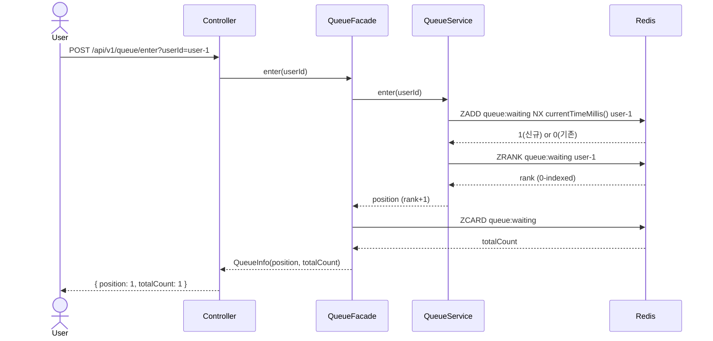
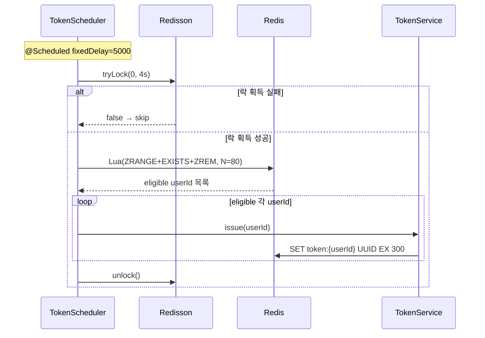
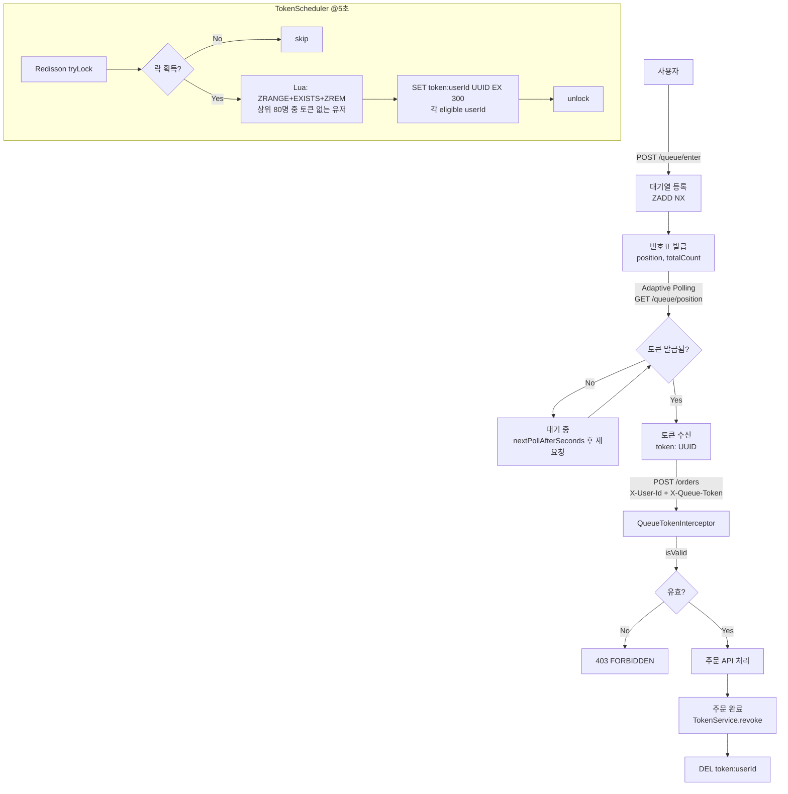

## 📌 리뷰 포인트

> 구현 과정에서 확신이 없었던 부분 3가지입니다. 각 항목마다 **설계 의도 → 불확실한 부분 → 질문** 순으로 정리했습니다.

---

### 1. 스케줄러 Lua 스크립트 — 토큰 보유 중 대기열 재진입 시 이상 상태가 남습니다

**설계 의도**: 스케줄러가 `ZRANGE → EXISTS → ZREM`을 Lua 스크립트로 원자적으로 실행합니다. 상위 N명 중 이미 토큰을 가진 유저는 스킵하고, 토큰 없는 유저만 대기열에서 꺼내 UUID 토큰을 발급합니다.

**불확실한 부분**: 토큰을 받은 유저가 주문을 완료하지 않고 대기열에 다시 진입하면(`ZADD NX`로 등록), 대기열에는 있지만 `EXISTS token:{userId} == 1`이라 스케줄러가 스킵합니다. 이 유저는 토큰이 만료(300초)될 때까지 대기열에 남아 순번을 차지하는 이상 상태가 됩니다.

**질문**: 진입 시점에 기존 토큰 존재 여부를 체크해서 차단하는 것이 맞을까요, 아니면 스케줄러에서 토큰 보유자를 대기열에서 즉시 제거하는 것이 더 자연스러운 흐름일까요?

→ [`TokenScheduler.java`](apps/commerce-api/src/main/java/com/loopers/domain/queue/TokenScheduler.java) · [`QueueRepositoryImpl.java`](apps/commerce-api/src/main/java/com/loopers/infrastructure/queue/QueueRepositoryImpl.java)

---

### 2. 분산 락 TTL — `tryLock(0, 4, SECONDS)` 4초 기준이 적절한지 모르겠습니다

**설계 의도**: 스케줄러 주기가 5초(`fixedDelay`)이므로, 락 TTL을 4초로 잡아 이전 실행이 비정상 종료돼도 다음 주기에 락이 자동 해제되도록 했습니다.

**불확실한 부분**: 실제 처리 시간이 4초를 넘는 경우(대기열 인원 폭증, Redis 지연) 락이 먼저 만료되고 다른 인스턴스가 동시에 실행될 수 있습니다. 반대로 4초가 너무 보수적이라면 정상 종료 후에도 락이 남아 다음 주기를 지연시킬 수 있습니다.

**질문**: 이런 경우 락 TTL을 주기보다 짧게 가져가는 게 일반적인 선택인가요? 처리 시간이 락 TTL을 초과할 경우를 대비한 보호 장치가 따로 필요한가요?

→ [`TokenScheduler.java:46`](apps/commerce-api/src/main/java/com/loopers/domain/queue/TokenScheduler.java)

---

### 3. 이탈 감지 미구현 — 설계에는 있지만 코드에 없습니다

**설계 의도**: CONTEXT.md에 "Polling 없으면 이탈로 간주 후 ZREM"으로 결정을 남겼습니다. 유령 유저가 대기열에 쌓이면 실제 대기자의 순번이 왜곡됩니다.

**불확실한 부분**: 구현 범위를 Step 1~3(대기열 진입, 토큰 발급, 순번 조회)으로 한정하면서 이탈 감지 로직을 넣지 않았습니다. 마지막 Polling 시각을 Redis에 별도 키로 관리하는 방식을 생각했는데, 키 하나 더 늘어나는 것 대비 실질적인 효과가 있는지 확신이 없습니다.

**질문**: 대기열 이탈 감지를 이 규모에서 구현하는 게 유의미한가요? 실무에서는 어떤 방식으로 처리하는지 방향을 듣고 싶습니다.

---

## 📌 Summary

- **배경**: Black Friday 주문 API에 트래픽이 몰리면 HikariCP 커넥션 풀이 고갈되고 DB가 다운된다. Rate Limiting(거절)은 사용자가 재시도를 반복하며 오히려 부하가 증가하는 Thundering Herd 문제를 일으킨다.
- **목표**: Redis Sorted Set 기반 대기열로 번호표를 발급해, 처리 가능한 수(N=80)만큼만 주문 API에 진입할 수 있도록 Back-pressure를 구현한다.
- **결과**: 3단계(대기열 진입 → 입장 토큰 발급 → Adaptive Polling 순번 조회)로 구현 완료. 동시 진입, 토큰 TTL 만료, 처리량 초과 검증 테스트 19개 통과.

---

## 🧭 Context & Decision

### 문제 정의

```
[Before]
사용자 → 주문 API → DB (HikariCP 커넥션 10개)
트래픽 200 VU → 커넥션 고갈 → Connection is not available → 서버 다운

[After]
사용자 → 대기열 진입 (번호표 발급) → 스케줄러가 N명 선발 → 토큰 발급
         ↓ Adaptive Polling (순번 조회)
토큰 보유자만 → 주문 API 진입 (N명씩 처리, 커넥션 안전)
```

### 핵심 결정 요약

| # | 결정 항목 | 최종 선택 | 핵심 근거 |
|---|-----------|-----------|-----------|
| 1 | 자료구조 | Redis Sorted Set | score 기반 순서 보장 + ZADD NX 중복 방지 |
| 2 | score 기준 | `currentTimeMillis()` | 밀리초 충돌은 극히 드물고 비즈니스상 무의미 |
| 3 | 중복 진입 방지 | ZADD NX | 단일 명령 원자적 처리, TOCTOU 방지 |
| 4 | 토큰 값 | UUID | userId만 알아도 위조 불가 |
| 5 | 토큰 검증 위치 | Interceptor | Spring Bean + URL 패턴 + ControllerAdvice |
| 6 | 스케줄러 원자성 | Lua 스크립트 | ZRANGE + EXISTS + ZREM 3단계를 원자적으로 |
| 7 | 중복 실행 방지 | Redisson 분산 락 | 멀티 인스턴스 환경 기준 |
| 8 | Polling 방식 | Adaptive Polling | `nextPollAfterSeconds`로 클라이언트 주기 제어 |

---

### 결정 1 · 2 · 3 — Redis Sorted Set + ZADD NX

**의도**: 진입 순서 보장과 중복 방지를 단일 자료구조로 해결한다.

**Before**: List(`LPUSH`)는 중복 방지 없음, 순번 조회 O(N) 스캔.

**After**: Sorted Set + ZADD NX

```java
// score = currentTimeMillis() → 먼저 들어올수록 낮은 rank
redisTemplate.opsForZSet().addIfAbsent(QUEUE_KEY, userId, System.currentTimeMillis());
Long rank = redisTemplate.opsForZSet().rank(QUEUE_KEY, userId); // O(log N)
return rank + 1; // 1-indexed
```

**대안 비교**

| 전략 | 장점 | 단점 | 선택 이유 |
|------|------|------|-----------|
| List (LPUSH) | 단순 | 중복 허용, O(N) 순번 조회 | 탈락 |
| Sorted Set + ZSCORE 조회 후 분기 | 직관적 | ZSCORE-ZADD 사이 TOCTOU 발생 | 탈락 |
| **Sorted Set + ZADD NX** | 원자적 중복 방지, O(log N) 순번 조회 | score 밀리초 충돌 가능(무시) | **채택** |



**관련 클래스**

| 컴포넌트 | 파일 | 메서드 | 역할 |
|----------|------|--------|------|
| QueueService | `domain/queue/QueueService.java` | `enter(userId)` | score에 currentTimeMillis 주입 |
| QueueRepositoryImpl | `infrastructure/queue/QueueRepositoryImpl.java` | `enter(userId, score)` | ZADD NX + ZRANK |
| QueueFacade | `application/queue/QueueFacade.java` | `enter(userId)` | position + totalCount 조합 |

---

### 결정 4 · 5 · 7 — UUID 토큰 + Interceptor 검증 + Redisson 분산 락

**의도**: 대기열을 우회한 직접 주문을 차단하고, 멀티 인스턴스 환경에서 토큰 중복 발급을 방지한다.

**토큰 흐름**

```java
// 발급: UUID 저장 (TTL 300초)
String token = UUID.randomUUID().toString();
redisTemplate.opsForValue().set("token:" + userId, token, 300, TimeUnit.SECONDS);

// 검증: 값 일치 여부 (존재만으로 충분하지 않음)
String saved = redisTemplate.opsForValue().get("token:" + userId);
return saved != null && saved.equals(requestToken);
```

**왜 Interceptor인가**

| 위치 | Spring Bean 주입 | URL 패턴 | ControllerAdvice 연동 | 선택 |
|------|-----------------|----------|----------------------|------|
| Filter | 불편 (수동 getBean) | 가능 | 불가 | 탈락 |
| **Interceptor** | 가능 | 가능 | 가능 | **채택** |
| AOP | 가능 | 불가 (메서드 레벨) | 가능 | 탈락 |

```java
// WebMvcConfig.java
registry.addInterceptor(queueTokenInterceptor)
        .addPathPatterns("/api/v1/orders/**");

// QueueTokenInterceptor.java
String userId = request.getHeader("X-User-Id");
String token  = request.getHeader("X-Queue-Token");
if (!tokenService.isValid(userId, token)) {
    throw new CoreException(ErrorType.QUEUE_TOKEN_INVALID);
}
```

**Redisson 분산 락 — 스케줄러 중복 실행 방지**

```java
RLock lock = redissonClient.getLock("lock:token-scheduler");
boolean acquired = lock.tryLock(0, 4, TimeUnit.SECONDS); // 대기 0초, TTL 4초
if (!acquired) return; // 다른 인스턴스 실행 중 → 스킵
```

---

### 결정 6 — Lua 스크립트로 원자적 배치 팝

**의도**: ZRANGE → EXISTS → ZREM이 분리되면 중간 단계에서 실패 시 대기열에서 제거됐지만 토큰 없는 유령 상태가 발생한다.

**Before (비원자적)**
```
1. ZRANGE → userId 목록
2. (중간 실패 가능)
3. ZREM
4. SET token:{userId} UUID  ← 여기서 실패하면 대기열에서만 제거된 상태
```

**After (Lua 원자적)**
```lua
local members = redis.call('ZRANGE', KEYS[1], 0, ARGV[1])
local eligible = {}
for i, member in ipairs(members) do
    if redis.call('EXISTS', 'token:' .. member) == 0 then
        redis.call('ZREM', KEYS[1], member)
        table.insert(eligible, member)
    end
end
return eligible
-- Redis 싱글스레드: 이 블록 전체가 원자적으로 실행됨
```



---

### 결정 8 — Adaptive Polling

**의도**: 모든 대기자가 고정 주기로 Polling하면 순번이 멀어도 불필요한 요청이 발생한다.

```java
// QueueFacade.java — nextPollAfterSeconds 계산
private long calculateNextPollAfter(long position) {
    if (position <= 10)  return 5;   // 곧 차례
    if (position <= 50)  return 15;  // 중간
    return 30;                       // 뒤쪽
}

// 예상 대기 시간: 내 순번 / N × 주기
private long calculateEstimatedWait(long position) {
    return (long) Math.ceil((double) position / BATCH_SIZE * SCHEDULER_INTERVAL_SECONDS);
}
```

**응답 예시**
```json
{
  "position": 45,
  "totalCount": 200,
  "estimatedWaitSeconds": 30,
  "nextPollAfterSeconds": 15,
  "token": null
}
```

클라이언트는 `token` 필드가 채워질 때까지 `nextPollAfterSeconds` 후에 재요청.

---

## 🏗️ Design Overview

**신규 추가**

| 패키지 | 파일 | 역할 |
|--------|------|------|
| `domain/queue` | `QueueService` | 대기열 진입/조회 |
| `domain/queue` | `TokenService` | 토큰 발급/검증/폐기 |
| `domain/queue` | `TokenScheduler` | @Scheduled + Lua + Redisson 락 |
| `domain/queue` | `QueueConstants` | QUEUE_KEY, TOKEN_KEY_PREFIX, BATCH_SIZE, SCHEDULER_INTERVAL_SECONDS |
| `domain/queue` | `QueueRepository` / `TokenRepository` | 인터페이스 |
| `infrastructure/queue` | `QueueRepositoryImpl` | Redis Sorted Set |
| `infrastructure/queue` | `TokenRepositoryImpl` | Redis String |
| `application/queue` | `QueueFacade` | 진입·순번 조회 use case 조합 |
| `application/queue` | `QueuePositionInfo` | position, totalCount, estimatedWait, nextPollAfter, token |
| `interfaces/api/queue` | `QueueV1Controller` | POST /enter, GET /position |
| `interfaces/api/queue` | `QueueTokenInterceptor` | X-User-Id + X-Queue-Token 검증 |

**기존 변경**

| 파일 | 변경 내용 |
|------|-----------|
| `config/WebMvcConfig.java` | `QueueTokenInterceptor` → `/api/v1/orders/**` 등록 |
| `support/error/ErrorType.java` | `QUEUE_TOKEN_INVALID(403)` 추가 |
| `build.gradle.kts` | `redisson-spring-boot-starter:3.27.2` 추가 |

---

## 🔁 Flow Diagram



---

## ✅ Checklist

### Step 1 — 대기열
- [x] `POST /queue/enter` — Redis Sorted Set 기반 대기열 진입 (ZADD NX)
- [x] `GET /queue/position` — 순번 + 전체 대기 인원 조회
- [x] userId 중복 진입 방지 (ZADD NX 원자적 처리)
- [x] 전체 대기 인원 조회 (ZCARD)

### Step 2 — 입장 토큰 & 스케줄러
- [x] 스케줄러: 5초마다 상위 80명에게 UUID 토큰 발급 (Lua 스크립트 + Redisson 락)
- [x] 토큰 TTL 300초 (Redis String EX)
- [x] 주문 API 진입 시 토큰 검증 (Interceptor)
- [x] 주문 완료 후 토큰 삭제 (`TokenService.revoke`)

### Step 3 — 실시간 순번 조회
- [x] 예상 대기 시간: `순번 / N × 주기`
- [x] Adaptive Polling: `nextPollAfterSeconds` 응답 포함
- [x] 토큰 발급 시 `GET /position` 응답에 토큰 포함

### 검증 테스트
- [x] 동시 진입 — 같은 userId 10개 스레드 동시 진입 → 1건만 등록
- [x] 동시 진입 — N명 동시 진입 → 각자 고유 순번
- [x] 토큰 만료 — TTL 1초 강제 후 2초 대기 → 토큰 무효화
- [x] 처리량 초과 — 100명 진입, N=80 → 스케줄러 1회 실행 후 20명 잔여
- [x] 처리량 초과 — 스케줄러 2회 실행 → 전원 처리, 대기열 비어있음